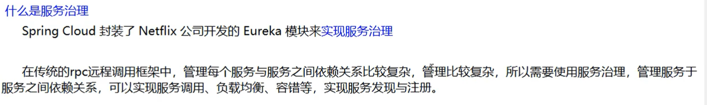
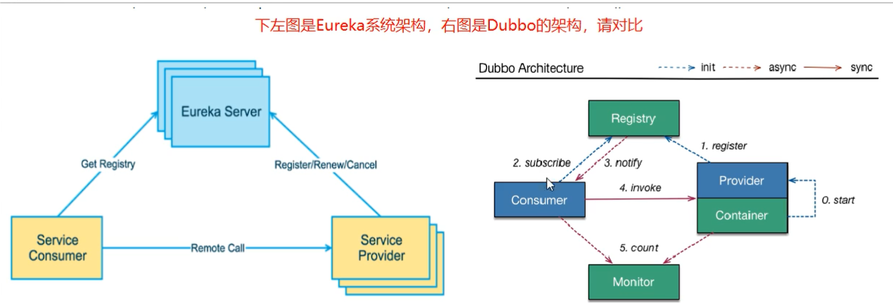
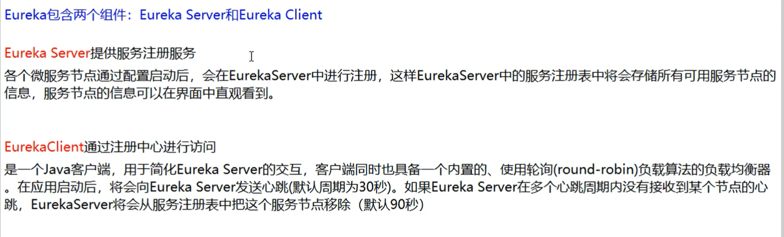
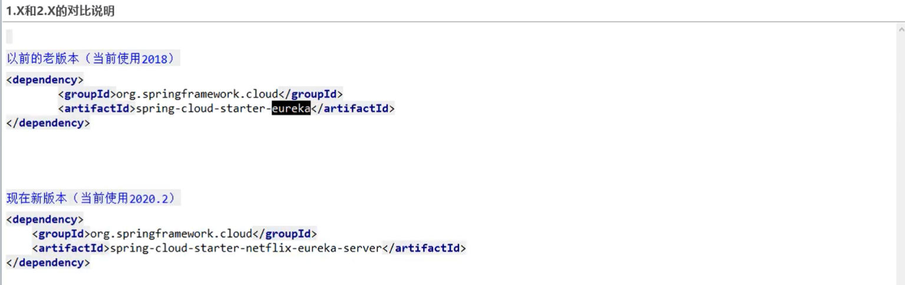

# 1、Eureka的基础知识





## 1.1 Eureka的两个组件



# 2、单机Eureka构建

## 2.1 pom 1.x 和 2.x



## 2.2 建Module

## 2.3 改pom

```xml
<?xml version="1.0" encoding="UTF-8"?>
<project xmlns="http://maven.apache.org/POM/4.0.0"
         xmlns:xsi="http://www.w3.org/2001/XMLSchema-instance"
         xsi:schemaLocation="http://maven.apache.org/POM/4.0.0 http://maven.apache.org/xsd/maven-4.0.0.xsd">
    <parent>
        <artifactId>cloud2020</artifactId>
        <groupId>com.qy</groupId>
        <version>1.0-SNAPSHOT</version>
    </parent>
    <modelVersion>4.0.0</modelVersion>

    <artifactId>cloud-eureka-server7001</artifactId>

    <dependencies>
        <!-- Eureka Server-->
        <dependency>
            <groupId>org.springframework.cloud</groupId>
            <artifactId>spring-cloud-starter-netflix-eureka-server</artifactId>
            <version>2.2.2.RELEASE</version>
        </dependency>

        <!--引入自己定义的 api 通用包-->
        <dependency>
            <groupId>com.qy</groupId>
            <artifactId>cloud-api-commons</artifactId>
            <version>1.0-SNAPSHOT</version>
        </dependency>
        <!--boot web acutator-->
        <dependency>
            <groupId>org.springframework.boot</groupId>
            <artifactId>spring-boot-starter-web</artifactId>
        </dependency>
        <dependency>
            <groupId>org.springframework.boot</groupId>
            <artifactId>spring-boot-starter-actuator</artifactId>
        </dependency>
        <!--一般通用配置-->
        <dependency>
            <groupId>org.springframework.boot</groupId>
            <artifactId>spring-boot-devtools</artifactId>
            <scope>runtime</scope>
            <optional>true</optional>
        </dependency>
        <dependency>
            <groupId>org.projectlombok</groupId>
            <artifactId>lombok</artifactId>
            <optional>true</optional>
        </dependency>
        <dependency>
            <groupId>org.springframework.boot</groupId>
            <artifactId>spring-boot-starter-test</artifactId>
            <scope>test</scope>
        </dependency>


    </dependencies>

</project>
```

## 2.4 写yml

```yml
server:
  port: 7001

#eureka
eureka:
  instance:
    hostname: localhost # eureka 服务端的实例名称
    client:
      #false 表示不向注册中心注册自己
      register-with-eureka: false
      #false 表示自己端就是注册中心，我的职责就是维护服务实例，并不需要去检索服务
      fetch-registry: false
      service-url:
        #设置于 Eureka Server 交互的地址查询服务和注册服务都需要以来这个地址。
        defaultZone: http://${eureka.instance.hostname}:${server.port}/eureka/
```

## 2.5 主启动

==**注意！ 这里要开启 Eureka（@EnableEurekaClient）**==

```java
package com.qy.springcloud;

import org.springframework.boot.SpringApplication;
import org.springframework.boot.autoconfigure.SpringBootApplication;
import org.springframework.cloud.netflix.eureka.EnableEurekaClient;
import org.springframework.cloud.netflix.eureka.server.EnableEurekaServer;

@SpringBootApplication
@EnableEurekaServer
public class EurekaMain7001 {
    public static void main(String[] args) {
        SpringApplication.run(EurekaMain7001.class,args);
    }
}

```


## 2.6 测试

访问http://localhost:7001

# 3、注册服务

## 2.1 将Payment模块和Order模块注册进入服务

## 2.2 改 pom

```xml
  <!--Eureka-->
        <dependency>
            <groupId>org.springframework.cloud</groupId>
            <artifactId>spring-cloud-starter-netflix-eureka-client</artifactId>
            <version>2.2.2.RELEASE</version>
        </dependency>
```

## 2.3 改 yml

```yml
#Eureka
eureka:
  client:
    # 表示是否将自己注册进 EurekaServer 默认为 true
    register-with-eureka: true
    # 是否从EurekaServer 抓取已有的注册信息，默认为true 。单节点无所谓，集群必须设置为true才能配合ribbon使用负载均衡
    fetchRegistry: true
    service-url:
      defaultZone: http://localhost:7001/eureka
```

## 2.4 主启动

==添加注解： @EnableEurekaClient==

```java
package com.qy.springcloud;

import org.springframework.boot.SpringApplication;
import org.springframework.boot.SpringApplicationRunListener;
import org.springframework.boot.autoconfigure.SpringBootApplication;
import org.springframework.cloud.netflix.eureka.EnableEurekaClient;

@SpringBootApplication
@EnableEurekaClient
public class Payment8001 {

    public static void main(String[] args) {
        SpringApplication.run(Payment8001.class,args);
    }

}
```

