# 1、Eureka集群配置原理

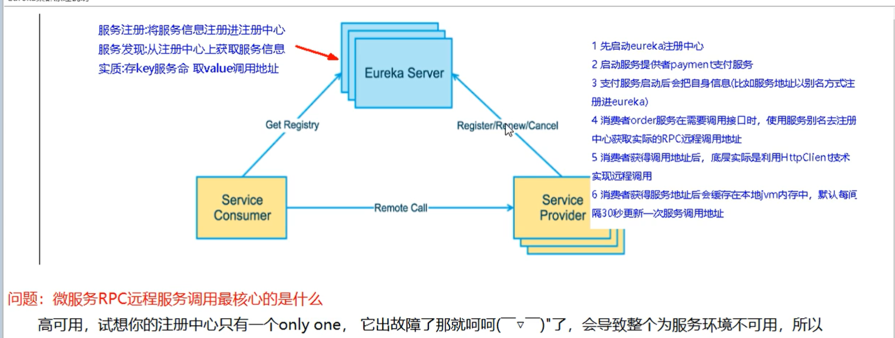

==互相注册！！ 互相守望 ！==


# 2、集群搭建

## 2.1 修改映射文件

到==C:\Windows\System32\drivers\etc==下的host文件中修改！

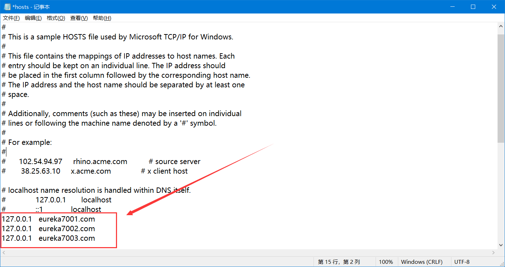

## 2.2 建module

## 2.3 改pom

## 2.4 改yml

***

==**cloud-eureka-server7001**==

pom.xml

```xml
<?xml version="1.0" encoding="UTF-8"?>
<project xmlns="http://maven.apache.org/POM/4.0.0"
         xmlns:xsi="http://www.w3.org/2001/XMLSchema-instance"
         xsi:schemaLocation="http://maven.apache.org/POM/4.0.0 http://maven.apache.org/xsd/maven-4.0.0.xsd">
    <parent>
        <artifactId>cloud2020</artifactId>
        <groupId>com.qy</groupId>
        <version>1.0-SNAPSHOT</version>
    </parent>
    <modelVersion>4.0.0</modelVersion>

    <artifactId>cloud-eureka-server7001</artifactId>

    <dependencies>
        <!-- Eureka Server-->
        <dependency>
            <groupId>org.springframework.cloud</groupId>
            <artifactId>spring-cloud-starter-netflix-eureka-server</artifactId>
        </dependency>
        <!--引入自己定义的 api 通用包-->
        <dependency>
            <groupId>com.qy</groupId>
            <artifactId>cloud-api-commons</artifactId>
            <version>1.0-SNAPSHOT</version>
        </dependency>
        <!--boot web acutator-->
        <dependency>
            <groupId>org.springframework.boot</groupId>
            <artifactId>spring-boot-starter-web</artifactId>
        </dependency>
        <dependency>
            <groupId>org.springframework.boot</groupId>
            <artifactId>spring-boot-starter-actuator</artifactId>
        </dependency>
        <!--一般通用配置-->
        <dependency>
            <groupId>org.springframework.boot</groupId>
            <artifactId>spring-boot-devtools</artifactId>
            <scope>runtime</scope>
            <optional>true</optional>
        </dependency>
        <dependency>
            <groupId>org.projectlombok</groupId>
            <artifactId>lombok</artifactId>
            <optional>true</optional>
        </dependency>
        <dependency>
            <groupId>org.springframework.boot</groupId>
            <artifactId>spring-boot-starter-test</artifactId>
            <scope>test</scope>
        </dependency>


    </dependencies>

</project>
```

application.yml

```yaml
server:
  port: 7001

#eureka
eureka:
  instance:
    hostname: eureka7001.com # eureka 服务端的实例名称
  client:
      #false 表示不向注册中心注册自己
      register-with-eureka: false
      #false 表示自己端就是注册中心，我的职责就是维护服务实例，并不需要去检索服务
      fetch-registry: false
      service-url:
        #设置于 Eureka Server 交互的地址查询服务和注册服务都需要以来这个地址。
        defaultZone: http://eureka7002.com:7002/eureka/,http://eureka7003.com:7003/eureka
```


==**cloud-eureka-server7002**== 同理！

==**cloud-eureka-server7003**== 同理！

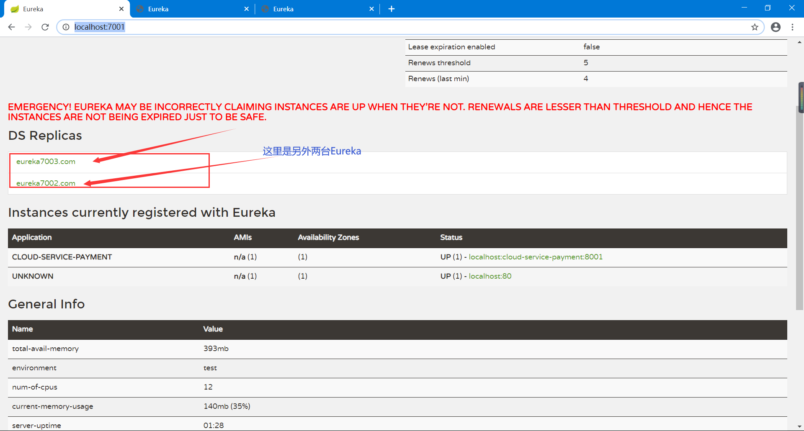


# 3、负载均衡

- 订单服务访问地址不能写死
- 使用==@LoadBalanced==注解赋予Template负载均衡的能力
- ApplicationContextBean

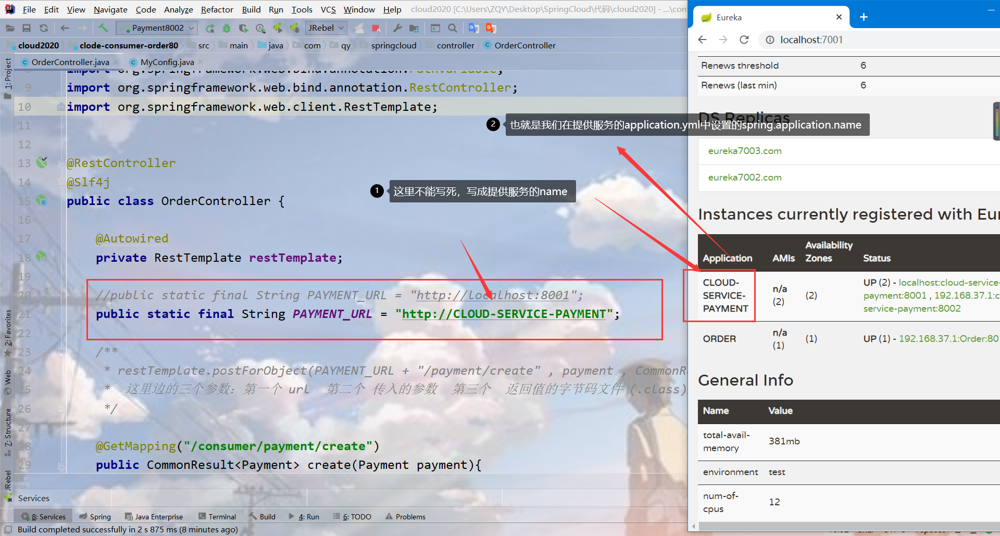

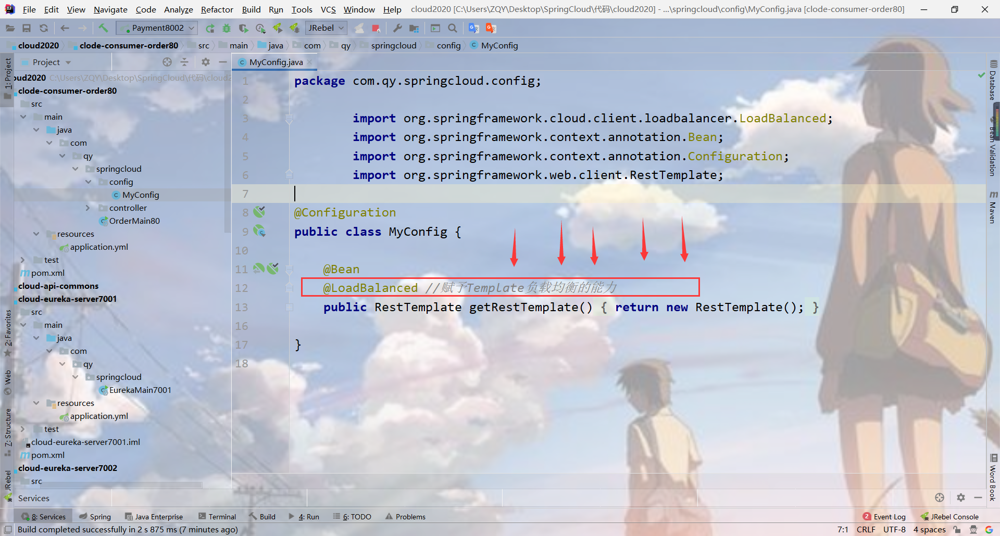

最后访问**<http://localhost/consumer/payment/get/4>** 就可以看到不断的在变换端口

在Controller层打印出来端口号

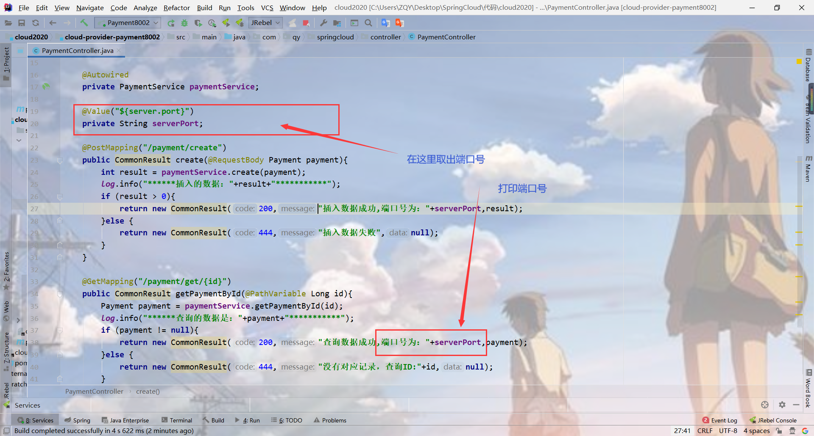

# 4、修改服务ID

修改主机名称：


这个主机名称在哪里显示呢？？

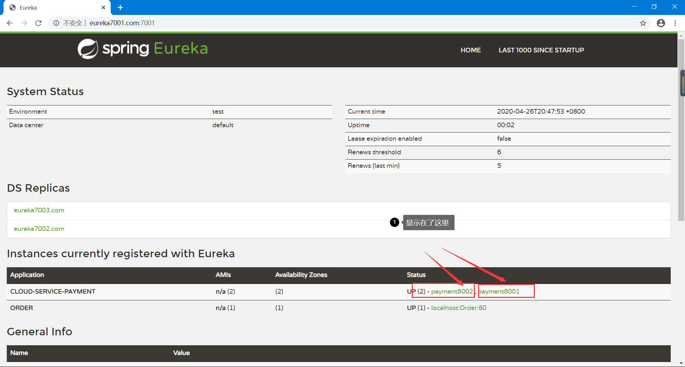

# 5、显示访问的IP地址

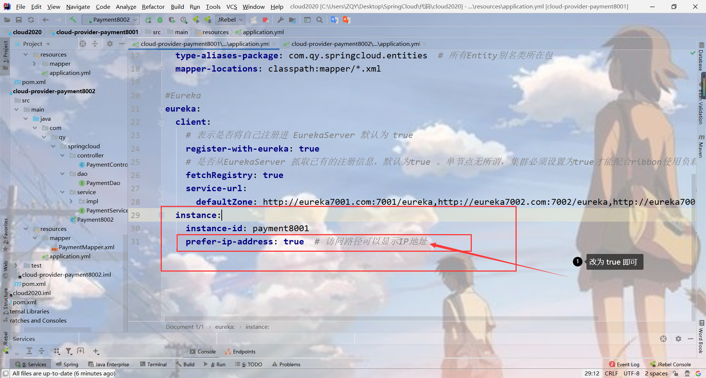


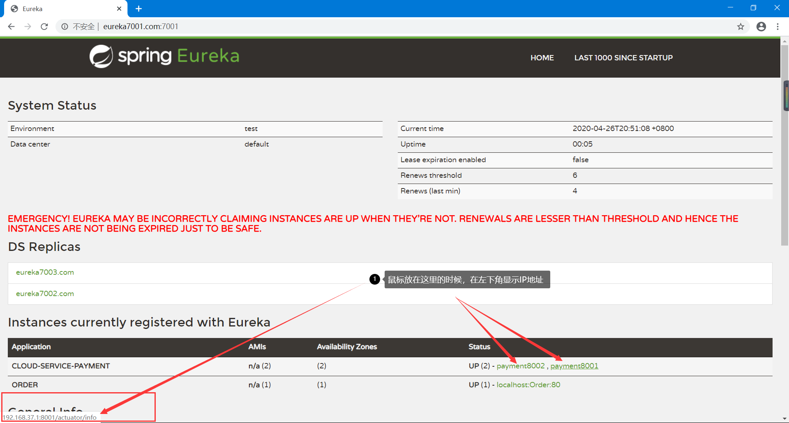

# 6、服务发现Discovery

- 对于注册进 eureka 里面的微服务，可以通过服务发现来获得该服务的信息
- 修改 cloud-provider-payment8001的 Controller
- 8001 主启动类

## 6.1 修改 Controller(提供服务端)

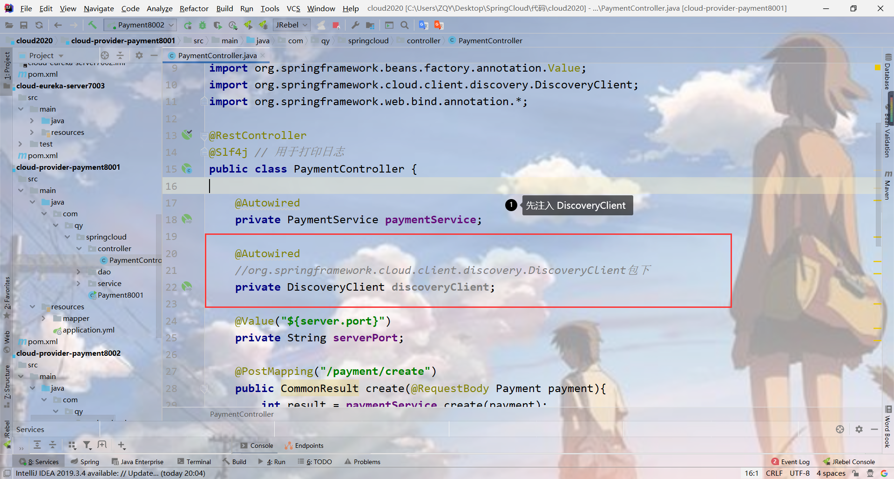

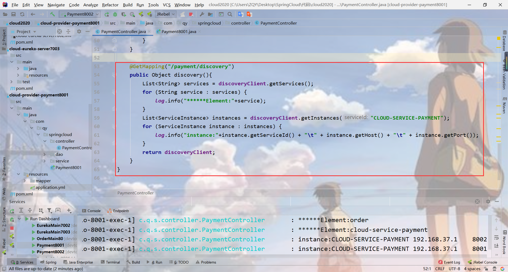

==打印的信息如下：==

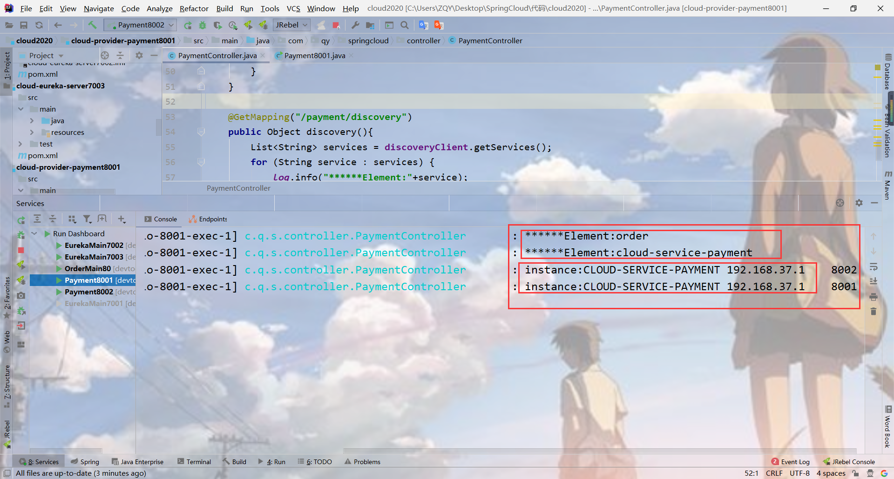

## 6.2 主启动类

开启服务发现

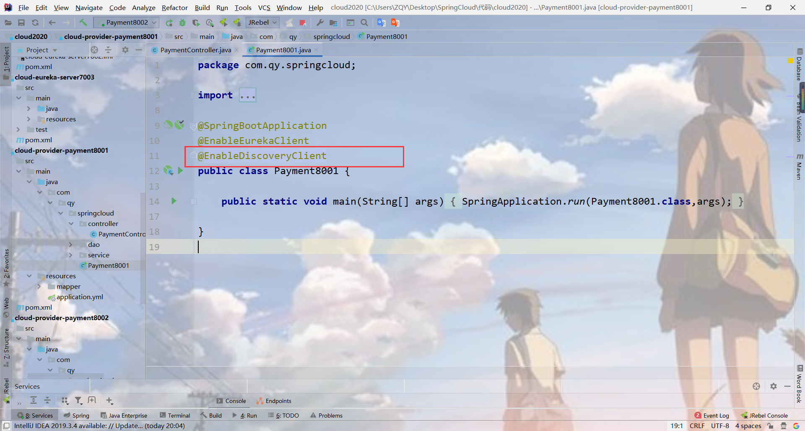


# 7、Eureka自我保护机制

## 7.1 故障现象

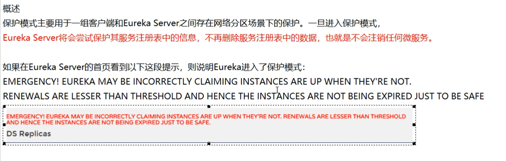

## 7.2 简单来说

简单来说，也就是某时刻，某一个微服务不可用了，Eureka不会立即清理，而是会保存这个微服务的信息。

