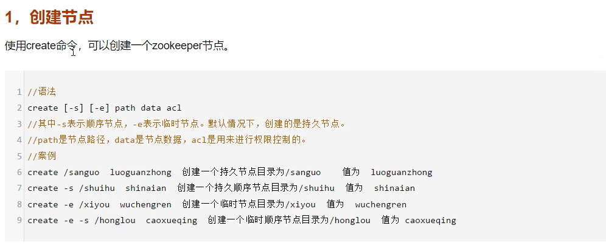
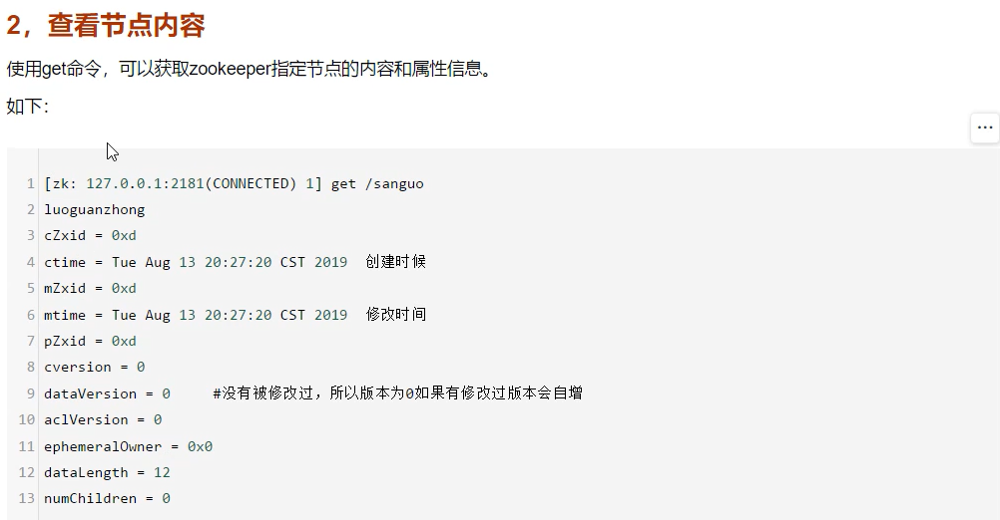
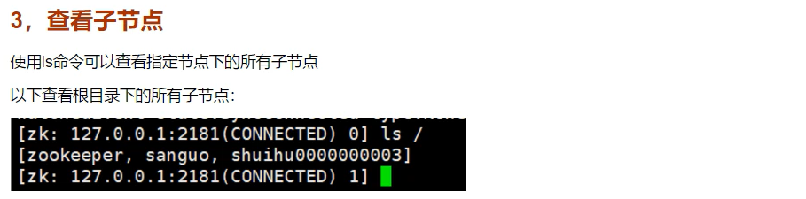
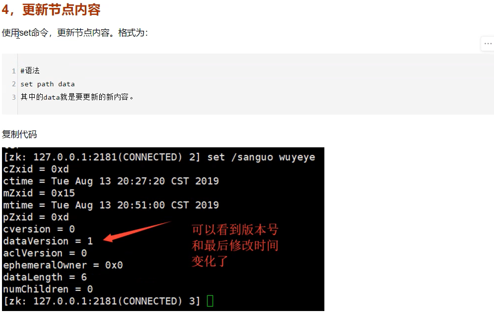
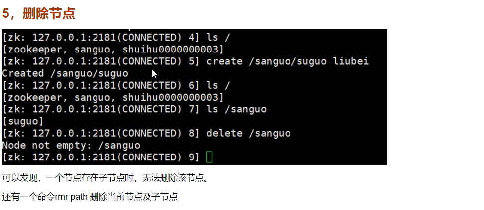
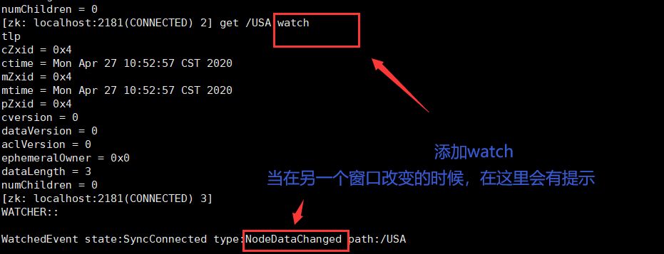
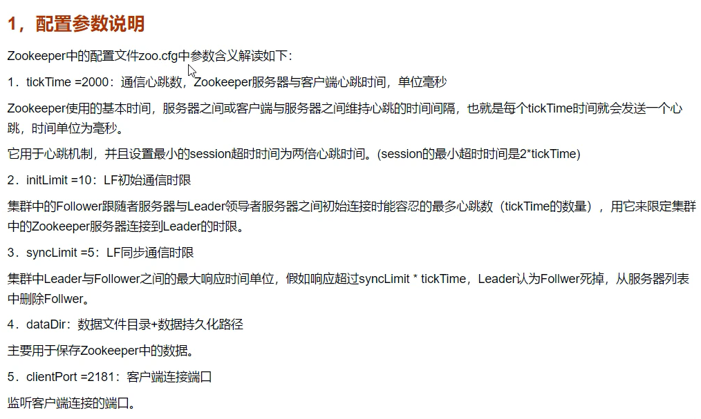
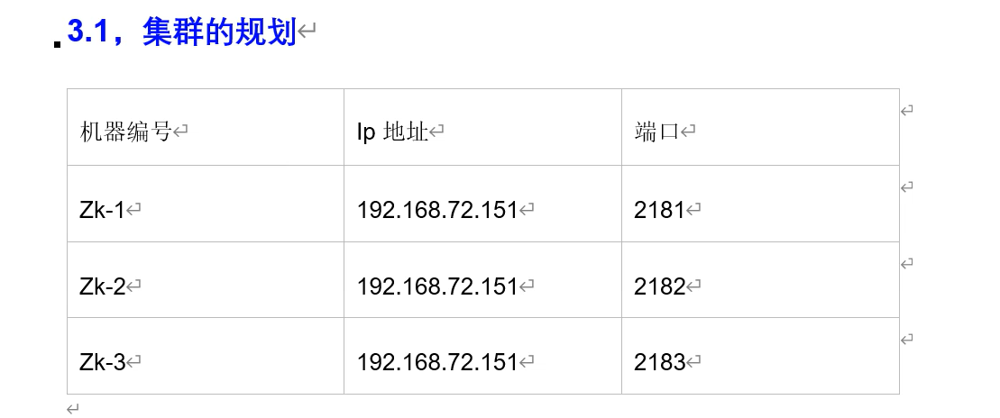
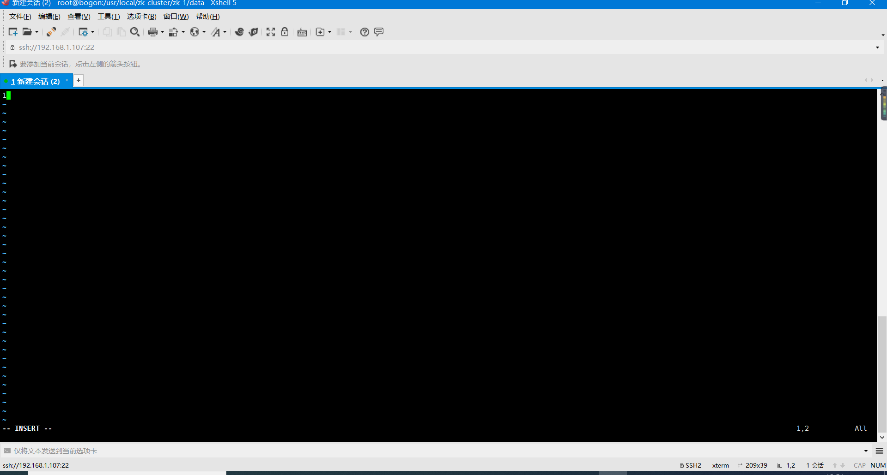
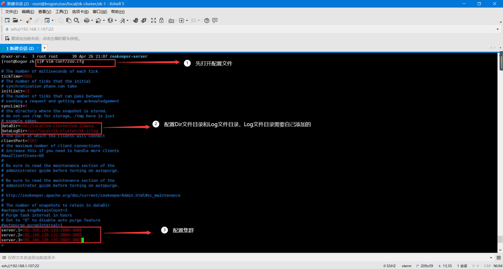

# 1、Zookeeper的安装及单机配置

## 1.1 Window 下的安装

### 1.1.1 下载

国内镜像下载 ：<https://mirrors.tuna.tsinghua.edu.cn/apache/tomcat/tomcat-8/>

下载3.4.14版本


### 1.1.2 添加cfg文件

将 ==conf/zoo_sample.cfg==复制并改名为 ==zoo.cfg==，否则启动会报错。

## 1.2 Linux 下的安装

### 1.2.1 传到linux

### 1.2.2 解压

```bash
tar -zxvf zookeeper -3.4.14.tar.gz #解压
mv zookeeper -3.4.14.tar.gz  zookeeper #改名
mv zookeeper usr/local/  # 移到local下
cd usr/local  # 到local下
cd conf/
cp zoo_sample.cfg zoo.cfg # 复制一个zoo.cfg文件
cd .. 
cd bin
./zkServer.sh start#启动
ps -ef|grep zookeeper
```


# 2、Zookeeper单机的使用

通过  ./zkCli.sh  进入客户端后，就可以使用命令来操作zookeeper了

quit 退出客户端

## 2.1 连接客户端

```bash
[root@iz8vb4nxo286g9mk6p8fnhz bin]# ./zkCli.sh
```

## 2.2 创建结点











## 2.3 监控结点

get /xxx watch




# 3、Zookeeper集群搭建

## 3.1 配置文件说明



## 3.2 集群的规划



## 3.3 创建/usr/local/zk-cluster

```bash
mkdir  /usr/local/zk-cluster
```

## 3.4 在usr/local/zk-cluster 里面复制三个 zk

```bash
cp  -r  /usr/local/zookeeper  /usr/local/zk-cluster/zk-1
cp  -r  /usr/local/zookeeper  /usr/local/zk-cluster/zk-2
cp  -r  /usr/local/zookeeper  /usr/local/zk-cluster/zk-3
```

## 3.5 创建 log/data 目录

==zk-1==

创建log ，data目录


```bash
mkdir /usr/local/zk-cluster/zk-1/data

mkdir /usr/local/zk-cluster/zk-2/data

mkdir /usr/local/zk-cluster/zk-3/data

mkdir /usr/local/zk-cluster/zk-1/log

mkdir /usr/local/zk-cluster/zk-2/log

mkdir /usr/local/zk-cluster/zk-3/log

```


## 3.6 创建 data/myid 文件

```bash
touch  /usr/local/zk-cluster/zk-1/data/myid

touch  /usr/local/zk-cluster/zk-2/data/myid

touch  /usr/local/zk-cluster/zk-3/data/myid
```

## 3.7 分别修改 data/myid 文件 

myid中插入一个 1 即可！

```bash
vim  /user/local/zk-cluster/zk-1/data/myid
1
vim  /user/local/zk-cluster/zk-2/data/myid
2
vim  /user/local/zk-cluster/zk-3/data/myid
3
```



## 3.8 分别修改 conf/zoo.cfg 文件

> # **zk - 1**

到 zk-1 中：

修改 zk-1 的配置文件

集群的IP地址写linux的IP地址。



集群后边的ip代表将绑定那个 ip 地址：

==2888:3888==： 第一个端口：代表在集群内部，数据复制的接口。第二个端口代表：选举端口


># zk-2

修改log和data文件路径，修改端口2812

```bash
vim  zk-2/conf/zoo.cfg
```

> # zk-3

修改log和data文件路径，修改端口2813

```bash
vim  zk-3/conf/zoo.cfg
```


## 3.9 测试

==启动==

 ./zk-1/bin/zkServer.sh start     ：  启动zk-1

 ./zk-2/bin/zkServer.sh start      ： 启动zk-2

 ./zk-3/bin/zkServer.sh start     ：  启动zk-3

./zk-1/bin/zkServer.sh status    ：  查看zk-1状态  

./zk-2/bin/zkServer.sh status    ：  查看zk-2状态  

./zk-3/bin/zkServer.sh status    ：  查看zk-3状态   

最后：zk-1和zk-3是follower ， zk-2是 leader

```bash
[root@bogon zk-cluster]# pwd
/usr/local/zk-cluster

[root@bogon zk-cluster]# ls
zk-1  zk-2  zk-3

[root@bogon zk-cluster]# ./zk-1/bin/zkServer.sh start
ZooKeeper JMX enabled by default
Using config: /usr/local/zk-cluster/zk-1/bin/../conf/zoo.cfg
Starting zookeeper ... STARTED

[root@bogon zk-cluster]# ./zk-1/bin/zkServer.sh status
ZooKeeper JMX enabled by default
Using config: /usr/local/zk-cluster/zk-1/bin/../conf/zoo.cfg
Error contacting service. It is probably not running.

[root@bogon zk-cluster]# ./zk-2/bin/zkServer.sh start
ZooKeeper JMX enabled by default
Using config: /usr/local/zk-cluster/zk-2/bin/../conf/zoo.cfg
Starting zookeeper ... STARTED

[root@bogon zk-cluster]# ./zk-2/bin/zkServer.sh status
ZooKeeper JMX enabled by default
Using config: /usr/local/zk-cluster/zk-2/bin/../conf/zoo.cfg
Mode: leader

[root@bogon zk-cluster]# ./zk-3/bin/zkServer.sh start
ZooKeeper JMX enabled by default
Using config: /usr/local/zk-cluster/zk-3/bin/../conf/zoo.cfg
Starting zookeeper ... STARTED

[root@bogon zk-cluster]# ./zk-3/bin/zkServer.sh status
ZooKeeper JMX enabled by default
Using config: /usr/local/zk-cluster/zk-3/bin/../conf/zoo.cfg
Mode: follower

[root@bogon zk-cluster]# 

```


==连接客户端==

zk-1 :   ==/usr/local/zk-cluster/zk-1/bin/zkCli.sh== 

zk-2 ： ==/usr/local/zk-cluster/zk-2/bin/zkCli.sh -server 127.0.0.1:2182== 

zk-3 ： ==/usr/local/zk-cluster/zk-3/bin/zkCli.sh -server 127.0.0.1:2183== 

# 4、Zookeeper选举流程

目前有5台服务器，每台服务器均没有数据，它们的编号分别是1,2,3,4,5,按编号依次启动，它们的选择举过程如下：

- 服务器1启动，给自己投票，然后发投票信息，由于其它机器还没有启动所以它收不到反馈信息，服务器1的状态一直属于Looking(选举状态)。

- 服务器2启动，给自己投票，同时与之前启动的服务器1交换结果，由于服务器2的编号大所以服务器2胜出，但此时投票数没有大于半数，所以两个服务器的状态依然是LOOKING。

- 服务器3启动，给自己投票，同时与之前启动的服务器1,2交换信息，由于服务器3的编号最大所以服务器3胜出，此时投票数正好大于半数，所以服务器3成为领导者，服务器1,2成为小弟。

- 服务器4启动，给自己投票，同时与之前启动的服务器1,2,3交换信息，尽管服务器4的编号大，但之前服务器3已经胜出，所以服务器4只能成为小弟。

- 服务器5启动，后面的逻辑同服务器4成为小弟。

  # 5、Java操作Zookeeper

  ​