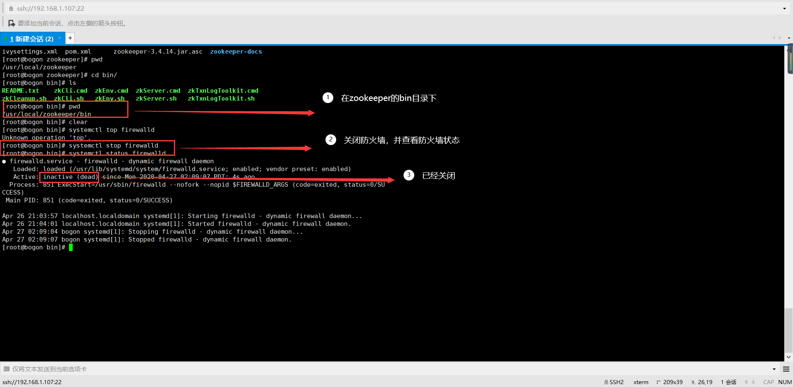
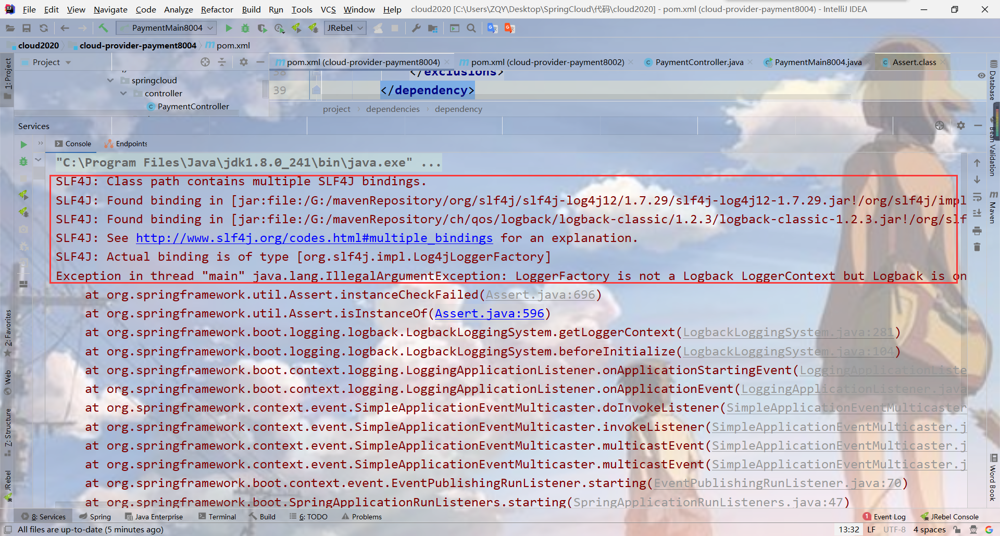

# 1、Zookeeper替换Eureka

## 1.1 关闭防火墙，进入bin目录



## 1.2 新建cloud-provider-payment8004

## 1.3 pom

Zookeeper依赖：==spring-cloud-starter-zookeeper-discovery==

```xml
<?xml version="1.0" encoding="UTF-8"?>
<project xmlns="http://maven.apache.org/POM/4.0.0"
         xmlns:xsi="http://www.w3.org/2001/XMLSchema-instance"
         xsi:schemaLocation="http://maven.apache.org/POM/4.0.0 http://maven.apache.org/xsd/maven-4.0.0.xsd">
    <parent>
        <artifactId>cloud2020</artifactId>
        <groupId>com.qy</groupId>
        <version>1.0-SNAPSHOT</version>
    </parent>
    <modelVersion>4.0.0</modelVersion>

    <artifactId>cloud-provider-payment8004</artifactId>

    <dependencies>
        <!--SpringBoot整合Zookeeper客户端-->
        <dependency>
            <groupId>org.springframework.cloud</groupId>
            <artifactId>spring-cloud-starter-zookeeper-discovery</artifactId>
        </dependency>
        <!--引入自己定义的 api 通用包-->
        <dependency>
            <groupId>com.qy</groupId>
            <artifactId>cloud-api-commons</artifactId>
            <version>1.0-SNAPSHOT</version>
        </dependency>
        <dependency>
            <groupId>org.springframework.boot</groupId>
            <artifactId>spring-boot-starter-web</artifactId>
        </dependency>
        <dependency>
            <groupId>org.springframework.boot</groupId>
            <artifactId>spring-boot-starter-actuator</artifactId>
        </dependency>
        <dependency>
            <groupId>org.projectlombok</groupId>
            <artifactId>lombok</artifactId>
            <optional>true</optional>
        </dependency>
        <dependency>
            <groupId>org.springframework.boot</groupId>
            <artifactId>spring-boot-starter-test</artifactId>
            <scope>test</scope>
        </dependency>
    </dependencies>
</project>
```


## 1.4 yml

```yaml
server:
  port: 8004

spring:
  application:
    name: cloud-provider-payment
  cloud:
    zookeeper:
      connect-string: 192.168.1.107:2181
```

## 1.5 主启动类

```java
package com.qy.springcloud;

import org.springframework.boot.SpringApplication;
import org.springframework.boot.autoconfigure.SpringBootApplication;
import org.springframework.cloud.client.discovery.EnableDiscoveryClient;

@SpringBootApplication
@EnableDiscoveryClient // 该注解用于向使用consul或zookeeper作为注册中心时，注册服务
public class PaymentMain8004 {
    public static void main(String[] args) {
        SpringApplication.run(PaymentMain8004.class,args);
    }
}
```

## 1.6 Controller


## 1.7 启动8004注册进 zookeeper

==启动会报错，Jar包冲突！！==


==那么怎么办呢？ 改POM==

既然jar包冲突，就排除掉我们自带的3.5.3的zookeeper，添加上3.4.9的zookeeper

```xml
<!--SpringBoot整合Zookeeper客户端-->
        <dependency>
            <groupId>org.springframework.cloud</groupId>
            <artifactId>spring-cloud-starter-zookeeper-discovery</artifactId>
            <!--先排除自带的zookeeper3.5.3-->
            <exclusions>
                <exclusion>
                    <groupId>org.apache.zookeeper</groupId>
                    <artifactId>zookeeper</artifactId>
                </exclusion>
            </exclusions>
        </dependency>
        <!--添加zookeeper3.4.9版本-->
        <dependency>
            <groupId>org.apache.zookeeper</groupId>
            <artifactId>zookeeper</artifactId>
            <version>3.4.9</version>
        </dependency>
```

==然后**Sl4j**  又报错==



`zookeeper` 包中默认引入了`slf4j-log4j12`包，除此之外，还有我们`springboot` 一定引入的`spring-boot-  starter-web` 包，它里边也有这个`slf4j-log4j12` 引入。 

  我们只要在`pom.xml` 里排除这个即可。 

## 1.8 验证测试

启动zookeeper(**在启动工程之前启动**)

`/usr/local/zookeeper/bin/zkServer.sh start `  开启服务

`/usr/local/zookeeper/bin/zkCli.sh`    开启客户端

`ls  /`  查看服务


已经注册到zookeeper

# 2、消费者端zookeeper

## 2.1 建module

## 2.2 pom

```xml
<?xml version="1.0" encoding="UTF-8"?>
<project xmlns="http://maven.apache.org/POM/4.0.0"
         xmlns:xsi="http://www.w3.org/2001/XMLSchema-instance"
         xsi:schemaLocation="http://maven.apache.org/POM/4.0.0 http://maven.apache.org/xsd/maven-4.0.0.xsd">
    <parent>
        <artifactId>cloud2020</artifactId>
        <groupId>com.qy</groupId>
        <version>1.0-SNAPSHOT</version>
    </parent>
    <modelVersion>4.0.0</modelVersion>

    <artifactId>cloud-consumer-orderzk80</artifactId>

    <dependencies>
        <!--SpringBoot整合Zookeeper客户端-->
        <dependency>
            <groupId>org.springframework.cloud</groupId>
            <artifactId>spring-cloud-starter-zookeeper-discovery</artifactId>
            <!--先排除自带的zookeeper3.5.3-->
            <exclusions>
                <exclusion>
                    <groupId>org.apache.zookeeper</groupId>
                    <artifactId>zookeeper</artifactId>
                </exclusion>
            </exclusions>
        </dependency>
        <!--添加zookeeper3.4.9版本-->
        <dependency>
            <groupId>org.apache.zookeeper</groupId>
            <artifactId>zookeeper</artifactId>
            <version>3.4.9</version>
            <!--排除这个slf4j-log4j12-->
            <exclusions>
                <exclusion>
                    <groupId>org.slf4j</groupId>
                    <artifactId>slf4j-log4j12</artifactId>
                </exclusion>
            </exclusions>
        </dependency>
        <!--引入自己定义的 api 通用包-->
        <dependency>
            <groupId>com.qy</groupId>
            <artifactId>cloud-api-commons</artifactId>
            <version>1.0-SNAPSHOT</version>
        </dependency>
        <dependency>
            <groupId>org.springframework.boot</groupId>
            <artifactId>spring-boot-starter-web</artifactId>
        </dependency>
        <dependency>
            <groupId>org.springframework.boot</groupId>
            <artifactId>spring-boot-starter-actuator</artifactId>
        </dependency>
        <dependency>
            <groupId>org.springframework.boot</groupId>
            <artifactId>spring-boot-devtools</artifactId>
            <scope>runtime</scope>
            <optional>true</optional>
        </dependency>
        <dependency>
            <groupId>org.projectlombok</groupId>
            <artifactId>lombok</artifactId>
            <optional>true</optional>
        </dependency>
        <dependency>
            <groupId>org.springframework.boot</groupId>
            <artifactId>spring-boot-starter-test</artifactId>
            <scope>test</scope>
        </dependency>
    </dependencies>

</project>
```

## 2.3 yml

```yaml
server:
  port: 80

spring:
  application:
    name: cloud-consumer-payment
  cloud:
    zookeeper:
      connect-string: 192.168.1.107:2181
```

## 2.4 controller

```java
package com.qy.springcloud.controller;

import lombok.extern.slf4j.Slf4j;
import org.springframework.beans.factory.annotation.Autowired;
import org.springframework.web.bind.annotation.GetMapping;
import org.springframework.web.bind.annotation.RestController;
import org.springframework.web.client.RestTemplate;

@RestController
@Slf4j
public class OrderController {

    // 提供服务的 ID 也就是application-name
    private static final String PRE_FIX = "http://cloud-provider-payment";

    @Autowired
    private RestTemplate restTemplate;

    @GetMapping("/consumer/zk")
    public String paymentInfo(){
        String result = restTemplate.getForObject(PRE_FIX + "/payment/zk", String.class);
        return result;
    }

}
```

## 2.5 主启动

```java
package com.qy.springcloud;

import org.springframework.boot.SpringApplication;
import org.springframework.boot.autoconfigure.SpringBootApplication;
import org.springframework.cloud.client.discovery.EnableDiscoveryClient;

@SpringBootApplication
@EnableDiscoveryClient
public class OrderMainzk80 {
    public static void main(String[] args) {
        SpringApplication.run(OrderMainzk80.class,args);
    }
}
```

## 2.6 配置类

```java
package com.qy.springcloud.config;

import org.springframework.cloud.client.loadbalancer.LoadBalanced;
import org.springframework.context.annotation.Bean;
import org.springframework.context.annotation.Configuration;
import org.springframework.web.client.RestTemplate;

@Configuration
public class MyConfig {
    
    @Bean
    @LoadBalanced
    public RestTemplate getRestTemplate(){
        return new RestTemplate();
    }
    
}
```

`至此，消费者服务就被注册进入zookeeper里了！`

`可以在linux中 ls /来查询！`