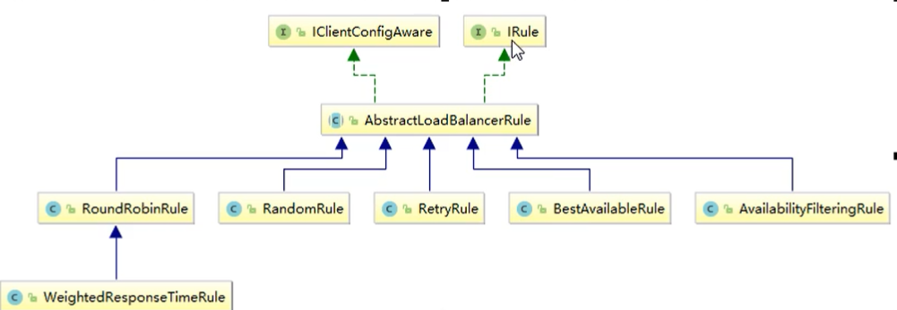
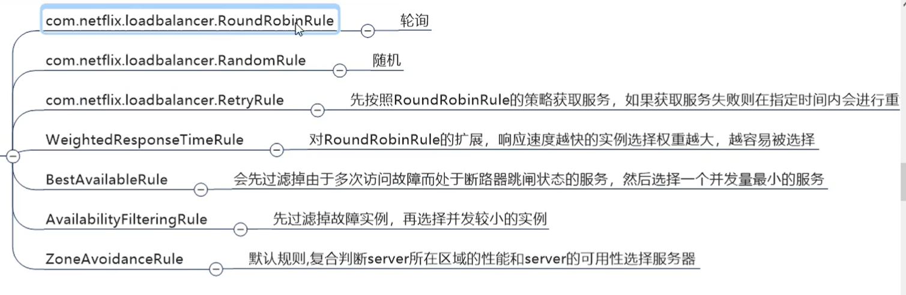

# 1、Ribbon

是什么、能干嘛、去哪下、怎么玩

## LB负载均衡（Load Balance）是什么

简单的说就是将用户的请求平摊的分配到多个服务器上，从而达到系统的HA(高可用)

常见的负载均衡有软件`Nginx`，`LVS`，硬件F5等

## Ribbon本地负载均衡客户端 VS Nginx服务端负载均衡区别

Nginx是`服务器负载均衡`，客户端所有请求都会交给Nginx，然后由Nginx实现转发请求，即负载均衡是由服务端实现的

Ribbon是`本地负载均衡`，在调用微服务接口的时候，会在注册中心上获取注册信息服务列表之后缓存到JVM本地，从而在本地实现RPC远程服务调用技术


> # LB（负载均衡）

- 集中式LB

即在服务的消费方和提供方之间使用独立的LB设施（可以是硬件，如F5也可以是软件，如Nginx），由该设施把访问请求通过某种策略转发至服务的提供方

- 进程内LB

将LB逻辑集成到消费方，消费方从服务注册中心获知哪些地址可用，然后自己再从这些地址中选择一个合适的服务器

`Ribbon就属于进程内LB`，它只是一个类库，继承于消费方进程，消费方通过它来获得消费提供方的地址


> 使用Ribbon的时候不用再导入ribbon的pom依赖了，为什么呢？

因为Eureka的pom依赖中已经自带了ribbon的jar包


```xml
  <!-- Eureka Server-->
<dependency>
  <groupId>org.springframework.cloud</groupId>
  <artifactId>spring-cloud-starter-netflix-eureka-server</artifactId>
</dependency>
```

# 2、Ribbon的负载均衡算法替换





==默认是轮询==

> # Ribbon核心组件IRule

官方文档明确给出警告：

这个自定义配置类不能放在@ComponentScan所扫描的当前包以及子包下

否则我们自定义的这个配置类就会被所有的Ribbon客户端所共享，达不到特殊化定制的目的了

`解释一下不能放在@ComponentScan所扫描的当前包以及子包下是什么意思`：

在主启动类上由一个注解`@SpringBootApplication`，点进去看一下就会看到

```java
@ComponentScan(excludeFilters = { @Filter(type = FilterType.CUSTOM, classes = TypeExcludeFilter.class),@Filter(type = FilterType.CUSTOM, classes = AutoConfigurationExcludeFilter.class) })
```

主启动类的地址 : `com/qy/springcloud/OrderMain80.java`

所以配置类不能放在`@ComponentScan所扫描的当前包以及子包下`

也就意味着需要创建一个包`com/qy/myrule/MySelfRule.java`在MySelfRule里写配置

## 2.1 配置类

```java
package com.qy.myrule;

import com.netflix.loadbalancer.IRule;
import com.netflix.loadbalancer.RandomRule;
import org.springframework.context.annotation.Bean;
import org.springframework.context.annotation.Configuration;

@Configuration
public class MySelfRule {

    @Bean
    public IRule myRule(){
        return new RandomRule();//定义为随机
    }

}
```

## 2.2 主启动类添加注解

==注意注意！！==

`这里要访问的服务的name一定要大写大写！！！！！`

```java
				    // 要访问服务的name                                 // 配置类的字节码
//@RibbonClient(name = "cloud-service-payment",configuration = MySelfRule.class)
@RibbonClient(name = "CLOUD-SERVICE-PAYMENT",configuration = MySelfRule.class)
```

# 3、Ribbon负载均衡算法

`负载均衡算法：`

​	rest接口第几次请求数  %  服务器集群总数量  =  实际调用服务器位置下标  ，  每次服务重启后rest接口计数从1开始

# 4、手写轮询算法

P42暂时先跳过 ， 需要CAP 学习JUC

