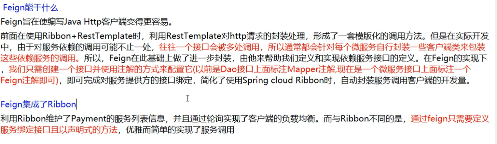
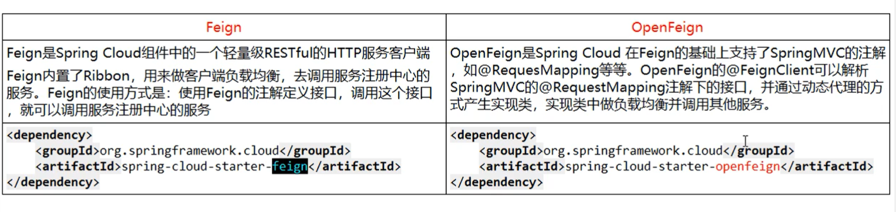
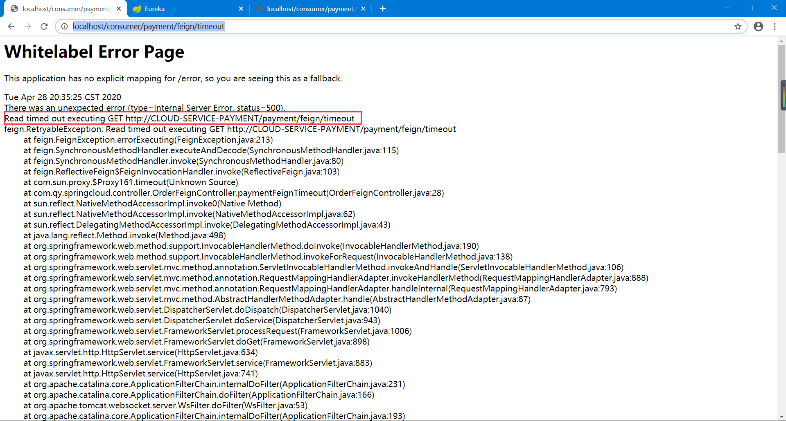
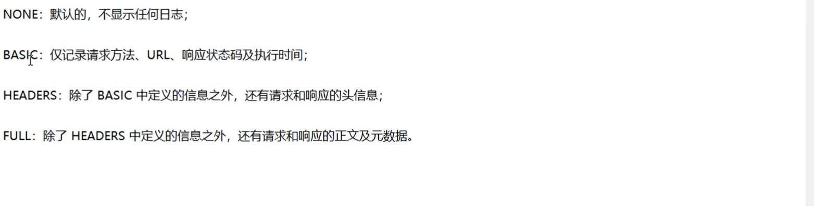

# 1、概述

Feign是一个声明式WebService客户端。使用Feign能让编写Web Service客户端更简单

它的使用方法是`定义一个服务接口然后在上面添加注解`。Feign也支持可拔插式的编码器和解码器。

Spring Cloud对Feign进行了封装，使其支持了Spring MVC标准注解和HttpMessageConverters。

Feign可以与Eureka和Ribbon组合使用以支持负载均衡。

`GitHub地址`：https://github.com/spring-cloud/spring-cloud-openfeign



> Feign 和 OpenFeign的区别



# 2、OpenFeign使用步骤

## 2.1 接口+注解

`微服务调用接口+@FeignClient`

## 2.2 新建cloud-consumer-feign-order80

## 2.3 POM

```xml
<?xml version="1.0" encoding="UTF-8"?>
<project xmlns="http://maven.apache.org/POM/4.0.0"
         xmlns:xsi="http://www.w3.org/2001/XMLSchema-instance"
         xsi:schemaLocation="http://maven.apache.org/POM/4.0.0 http://maven.apache.org/xsd/maven-4.0.0.xsd">
    <parent>
        <artifactId>cloud2020</artifactId>
        <groupId>com.qy</groupId>
        <version>1.0-SNAPSHOT</version>
    </parent>
    <modelVersion>4.0.0</modelVersion>

    <artifactId>cloud-consumer-feign-order80</artifactId>

    <dependencies>
        <!--OpenFeign-->
        <dependency>
            <groupId>org.springframework.cloud</groupId>
            <artifactId>spring-cloud-starter-openfeign</artifactId>
        </dependency>
        <!--Eureka-->
        <dependency>
            <groupId>org.springframework.cloud</groupId>
            <artifactId>spring-cloud-starter-netflix-eureka-client</artifactId>
            <version>2.2.2.RELEASE</version>
        </dependency>
        <!--引入自己定义的 api 通用包-->
        <dependency>
            <groupId>com.qy</groupId>
            <artifactId>cloud-api-commons</artifactId>
            <version>1.0-SNAPSHOT</version>
        </dependency>
        <dependency>
            <groupId>org.springframework.boot</groupId>
            <artifactId>spring-boot-starter-web</artifactId>
        </dependency>
        <dependency>
            <groupId>org.springframework.boot</groupId>
            <artifactId>spring-boot-starter-actuator</artifactId>
        </dependency>
        <dependency>
            <groupId>org.springframework.boot</groupId>
            <artifactId>spring-boot-devtools</artifactId>
            <scope>runtime</scope>
            <optional>true</optional>
        </dependency>
        <dependency>
            <groupId>org.projectlombok</groupId>
            <artifactId>lombok</artifactId>
            <optional>true</optional>
        </dependency>
        <dependency>
            <groupId>org.springframework.boot</groupId>
            <artifactId>spring-boot-starter-test</artifactId>
            <scope>test</scope>
        </dependency>
    </dependencies>

</project>
```

## 2.4 YML

```yaml
server:
  port: 80

spring:
  application:
    name: Order

#Eureka
eureka:
  client:
    # 表示是否将自己注册进 EurekaServer 默认为 true
    register-with-eureka: false
    service-url:
      defaultZone: http://eureka7001.com:7001/eureka,http://eureka7002.com:7002/eureka,http://eureka7003.com:7003/eureka
```

## 2.5 主启动

```java
package com.qy.springcloud;

import org.springframework.boot.SpringApplication;
import org.springframework.boot.autoconfigure.SpringBootApplication;
import org.springframework.cloud.openfeign.EnableFeignClients;

@SpringBootApplication
@EnableFeignClients
public class OrderFeignMain80 {
    public static void main(String[] args) {
        SpringApplication.run(OrderFeignMain80.class,args);
    }
}

```

## 2.6 业务类

```java
package com.qy.springcloud.service;

import com.qy.springcloud.entities.CommonResult;
import com.qy.springcloud.entities.Payment;
import org.springframework.cloud.openfeign.FeignClient;
import org.springframework.stereotype.Component;
import org.springframework.web.bind.annotation.GetMapping;
import org.springframework.web.bind.annotation.PathVariable;


@Component
@FeignClient(value = "CLOUD-SERVICE-PAYMENT")
public interface OrderService {

    /**
     * 这里GetMapping里的映射地址写 提供服务模块 里边的controler层中的调用地址
     */
    @GetMapping("/payment/get/{id}")
   //@PathVariable("id")   这里写的时候一定要带上 ("id") 否则获取不到id这个参数
    public CommonResult<Payment> getPaymentById(@PathVariable("id") Long id);

}
```

## 2.7 Controller

```java
package com.qy.springcloud.controller;


import com.qy.springcloud.entities.CommonResult;
import com.qy.springcloud.entities.Payment;
import com.qy.springcloud.service.OrderService;
import lombok.extern.slf4j.Slf4j;
import org.springframework.beans.factory.annotation.Autowired;
import org.springframework.web.bind.annotation.GetMapping;
import org.springframework.web.bind.annotation.PathVariable;
import org.springframework.web.bind.annotation.RestController;

@RestController
@Slf4j
public class OrderFeignController {

    @Autowired
    private OrderService orderService;

    @GetMapping("/consumer/payment/get/{id}")
    public CommonResult<Payment> getPaymentById(@PathVariable("id") Long id){
        return orderService.getPaymentById(id);
    }
}
```

## 2.8 测试

访问：<http://localhost/consumer/payment/get/3>


## 2.9 总结

总的来说，要使用OpenFeign的话，

`一`： 在启动类上添加注解**@EnableFeignClients**

`二`： 在业务层上添加注解**@FeignClient(value = "CLOUD-SERVICE-PAYMENT")**，并指明提供服务的name

在业务层注意，`   @GetMapping("/payment/get/{id}")`要与提供服务的映射地址一致！

相当于，在业务层调用服务名为`CLOUD-SERVICE-PAYMENT`的地址映射为`@GetMapping("/payment/get/{id}")`的服务

`三`：测试即可。（OpenFeign自带负载均衡）

Feign 替代了 Ribbon + RestTemplate

# 3、OpenFeign超时控制

## 3.1 服务提供方8001故意写暂停程序

```java
@GetMapping("/payment/feign/timeout")
public String paymentFeignTimeout(){
    try {
        /*暂停3秒*/
        TimeUnit.SECONDS.sleep(3);
    }catch (Exception e){
        e.printStackTrace();
    }
    return serverPort;
}
```

## 3.2 服务消费方80添加超时方法

Service层：

```java
@GetMapping("/payment/feign/timeout")
public String timeout();
```

Controller层：

```java
 @GetMapping("/consumer/payment/feign/timeout")
    public String paymentFeignTimeout(){
        //open-feign-ribbon 客户端一般默认等待1秒钟
        return orderService.timeout();
    }
```


## 3.3 测试 <http://localhost/consumer/payment/feign/timeout>




# 4、那么不想超时怎么办


`在Order80的yml文件中添加配置`

```yaml

#设置feign客户端超时时间（OpenFeign默认支持ribbon）
ribbon:
  #指的是建立连接所用的时间，适用于网络状况正常的情况下，两端连接所用的时间
  ReadTimeout: 5000
  #指的是建立连接后从服务器读取到可用资源所用的时间
  ConnectTimeout: 5000
```

# 5、OpenFeign日志打印功能


## 5.1 日志级别



## 5.2 配置类

```java

@Configuration
public class MyConfig {

    @Bean
    Logger.Level feignLoggerLevel(){
        /*打印Full级别，FULL级别最全*/
        return Logger.Level.FULL;
    }

}
```

## 5.3 YML中开启

```yaml
logging:
  level:
    #feign日志以什么级别监控哪个接口
    com.qy.springcloud.service.OrderService: debug
```


