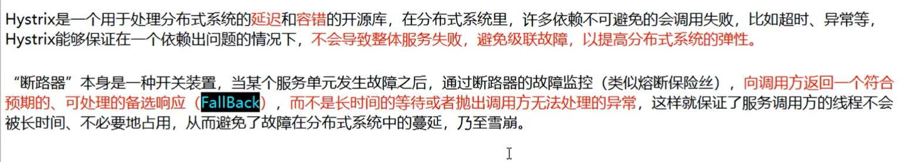
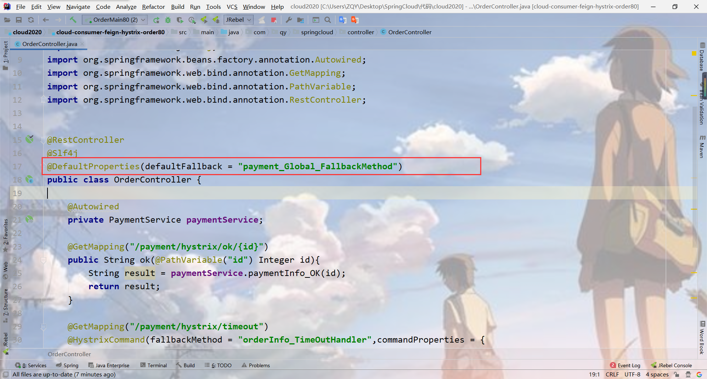
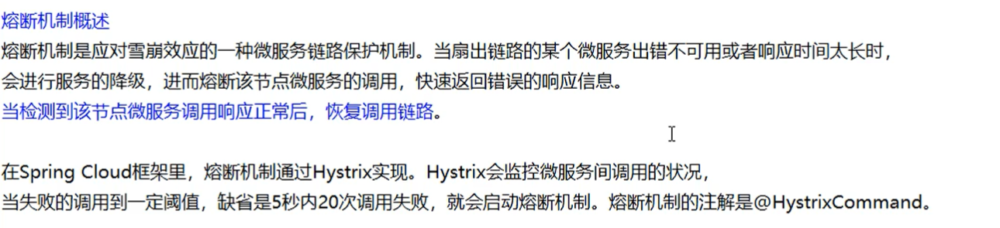
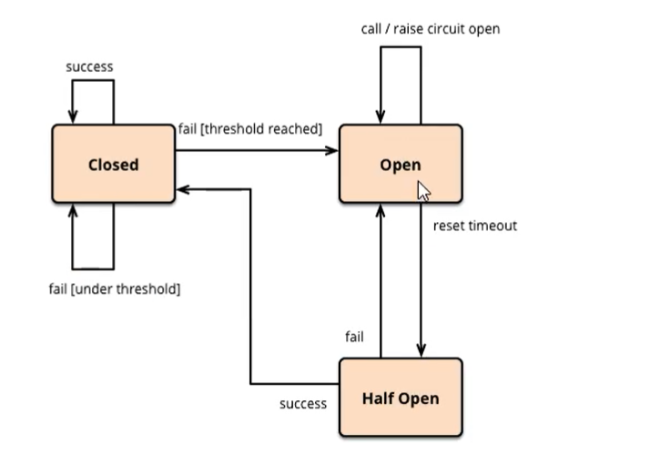
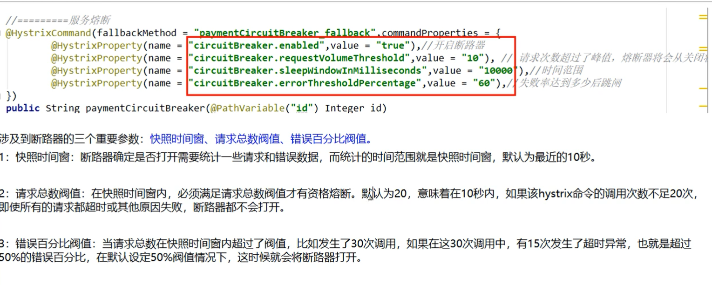
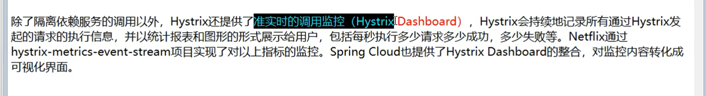
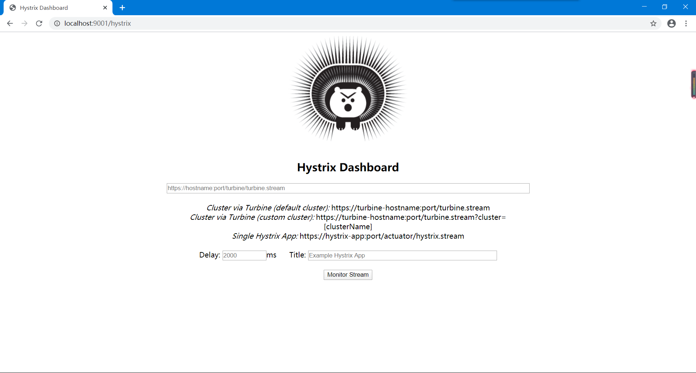
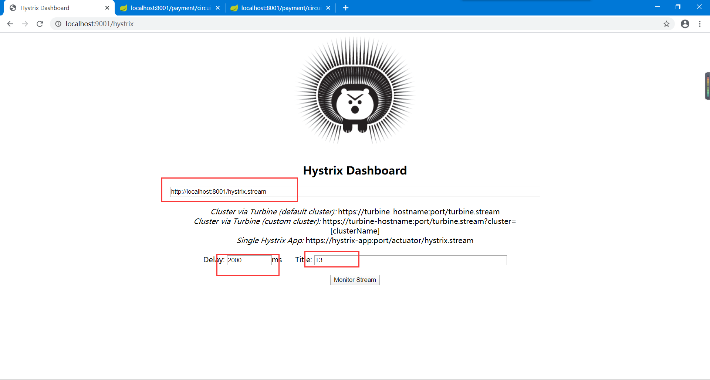
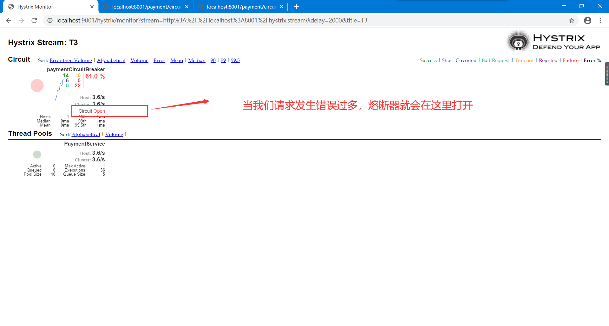

typora-copy-images-to: images

# 1、Hystrix是什么？



Hystrix可以做什么？

- 服务降级
- 服务熔断
- 接近实时的监控
- 。。。

# 2、Hystrix重要概念

==面试==

- 服务降级：服务器忙，请稍后再试，不让客户端等待并立刻返回一个友好提示，fallback

  `哪些情况会触发降级：`

  程序运行异常 、 超时 、 服务熔断触发服务降级 、 线程池/信号量打满也会导致服务降级


- 服务熔断

  类比保险丝达到最大服务访问后，直接拒绝访问，拉电闸，然后调用服务降级的方法返回友好提示


- 服务限流

  秒杀高并发等操作，严禁一窝蜂的过来拥挤，大家排队，一秒钟N个，有序进行

  ​

# 3、Hystrix案例

## 3.1 新建 cloud-provider-hystrix-payment8001

## 3.2 POM

```xml
<?xml version="1.0" encoding="UTF-8"?>
<project xmlns="http://maven.apache.org/POM/4.0.0"
         xmlns:xsi="http://www.w3.org/2001/XMLSchema-instance"
         xsi:schemaLocation="http://maven.apache.org/POM/4.0.0 http://maven.apache.org/xsd/maven-4.0.0.xsd">
    <parent>
        <artifactId>cloud2020</artifactId>
        <groupId>com.qy</groupId>
        <version>1.0-SNAPSHOT</version>
    </parent>
    <modelVersion>4.0.0</modelVersion>

    <artifactId>cloud-provider-hystrix-payment8001</artifactId>


    <dependencies>
        <!--Hystrix-->
        <dependency>
            <groupId>org.springframework.cloud</groupId>
            <artifactId>spring-cloud-starter-netflix-hystrix</artifactId>
        </dependency>
        <!--Eureka-->
        <dependency>
            <groupId>org.springframework.cloud</groupId>
            <artifactId>spring-cloud-starter-netflix-eureka-client</artifactId>
        </dependency>

        <!--引入自己定义的 api 通用包-->
        <dependency>
            <groupId>com.qy</groupId>
            <artifactId>cloud-api-commons</artifactId>
            <version>1.0-SNAPSHOT</version>
        </dependency>
        <dependency>
            <groupId>org.springframework.boot</groupId>
            <artifactId>spring-boot-starter-web</artifactId>
        </dependency>
        <dependency>
            <groupId>org.springframework.boot</groupId>
            <artifactId>spring-boot-starter-actuator</artifactId>
        </dependency>
        <dependency>
            <groupId>org.springframework.boot</groupId>
            <artifactId>spring-boot-devtools</artifactId>
            <scope>runtime</scope>
            <optional>true</optional>
        </dependency>
        <dependency>
            <groupId>org.projectlombok</groupId>
            <artifactId>lombok</artifactId>
            <optional>true</optional>
        </dependency>
        <dependency>
            <groupId>org.springframework.boot</groupId>
            <artifactId>spring-boot-starter-test</artifactId>
            <scope>test</scope>
        </dependency>


    </dependencies>

</project>
```

## 3.3 YML

```yaml
server:
  port: 8001

spring:
  application:
    name: cloud-provider-hystrix-payment

eureka:
  client:
    register-with-eureka: true
    fetch-registry: true
    service-url:
      defaultZone: http://eureka7001.com:7001/eureka
```

## 3.4 主启动

```java
package com.qy.springcloud;

import org.springframework.boot.SpringApplication;
import org.springframework.boot.autoconfigure.SpringBootApplication;
import org.springframework.cloud.netflix.eureka.EnableEurekaClient;

@SpringBootApplication
@EnableEurekaClient
public class PaymentHystrix8001 {
    public static void main(String[] args) {
        SpringApplication.run(PaymentHystrix8001.class,args);
    }
}

```

## 3.5 service

```java
package com.qy.springcloud.service;

import org.springframework.stereotype.Service;

import java.util.concurrent.TimeUnit;

@Service
public class PaymentService {

    /**
     * 正常访问
     * @param id
     * @return
     */
    public String paymentInfo_OK(Integer id){
        return "线程池： "+Thread.currentThread().getName()+" paymentInfo_OK,id:"+id+"\t"+"O(∩_∩)O";
    }

    /**
     * 等待3秒，超时
     * @return
     */
    public String paymentInfo_TimeOut(){
        int time = 3;
        try {
            TimeUnit.SECONDS.sleep(time);
        }catch (Exception e){
            e.printStackTrace();
        }
        return "线程池： "+Thread.currentThread().getName()+" paymentInfo_TimeOut";
    }

}

```

## 3.6 controller

```java
package com.qy.springcloud.controller;

import com.qy.springcloud.service.PaymentService;
import lombok.extern.slf4j.Slf4j;
import org.springframework.beans.factory.annotation.Autowired;
import org.springframework.beans.factory.annotation.Value;
import org.springframework.web.bind.annotation.GetMapping;
import org.springframework.web.bind.annotation.PathVariable;
import org.springframework.web.bind.annotation.RestController;

@RestController
@Slf4j
public class PaymentController {

    @Value("${server.port}")
    private String ServerPort;

    @Autowired
    private PaymentService paymentService;

    @GetMapping("/payment/hystrix/ok/{id}")
    public String paymentInfo_OK(@PathVariable("id") Integer id){
        String result = paymentService.paymentInfo_OK(id);
        log.info("********"+result);
        return result;
    }

    @GetMapping("/payment/hystrix/timeout")
    public String paymentInfo_TimeOut() {
        String result = paymentService.paymentInfo_TimeOut();
        log.info("*********"+result);
        return result;
    }

}
```

## 3.7 测试

访问 <http://localhost:8001/payment/hystrix/timeout> 正常

访问 <http://localhost:8001/payment/hystrix/ok/2> 正常

# 4、高并发测试

`在上边已经构建好了代码，在非高并发的情形下还能满足，但是。。。`

> # Jmeter压测测试

开启Jmeter ， 来2000个并发压死8001，20000个请求都去访问paymentInfo_TimeOut服务

> # 演示结果

访问ok是可以直接得到访问结果的，访问timeout我们让线程睡了3秒，但是当我们高并发去打在timeout上的话，会发现，访问ok的时候，无法直接得到访问结果，访问速度变慢！

两个都在转圈圈，ok的被timeout的拖累了，`为什么会被卡死？`

tomcat的默认的工作线程数被打满了，没有多余的线程来分解压力和处理

==所以需要Hystrix==

# 5、再加入80

## 5.1 新建cloud-consumer-feign-hystrix-order80

## 5.2 POM

```xml
<?xml version="1.0" encoding="UTF-8"?>
<project xmlns="http://maven.apache.org/POM/4.0.0"
         xmlns:xsi="http://www.w3.org/2001/XMLSchema-instance"
         xsi:schemaLocation="http://maven.apache.org/POM/4.0.0 http://maven.apache.org/xsd/maven-4.0.0.xsd">
    <parent>
        <artifactId>cloud2020</artifactId>
        <groupId>com.qy</groupId>
        <version>1.0-SNAPSHOT</version>
    </parent>
    <modelVersion>4.0.0</modelVersion>

    <artifactId>cloud-consumer-feign-hystrix-order80</artifactId>

    <dependencies>
        <!--Hystrix-->
        <dependency>
            <groupId>org.springframework.cloud</groupId>
            <artifactId>spring-cloud-starter-netflix-hystrix</artifactId>
        </dependency>
        <!--OpenFeign-->
        <dependency>
            <groupId>org.springframework.cloud</groupId>
            <artifactId>spring-cloud-starter-openfeign</artifactId>
        </dependency>
        <!--Eureka-->
        <dependency>
            <groupId>org.springframework.cloud</groupId>
            <artifactId>spring-cloud-starter-netflix-eureka-client</artifactId>
            <version>2.2.2.RELEASE</version>
        </dependency>
        <!--引入自己定义的 api 通用包-->
        <dependency>
            <groupId>com.qy</groupId>
            <artifactId>cloud-api-commons</artifactId>
            <version>1.0-SNAPSHOT</version>
        </dependency>
        <dependency>
            <groupId>org.springframework.boot</groupId>
            <artifactId>spring-boot-starter-web</artifactId>
        </dependency>
        <dependency>
            <groupId>org.springframework.boot</groupId>
            <artifactId>spring-boot-starter-actuator</artifactId>
        </dependency>
        <dependency>
            <groupId>org.springframework.boot</groupId>
            <artifactId>spring-boot-devtools</artifactId>
            <scope>runtime</scope>
            <optional>true</optional>
        </dependency>
        <dependency>
            <groupId>org.projectlombok</groupId>
            <artifactId>lombok</artifactId>
            <optional>true</optional>
        </dependency>
        <dependency>
            <groupId>org.springframework.boot</groupId>
            <artifactId>spring-boot-starter-test</artifactId>
            <scope>test</scope>
        </dependency>
    </dependencies>

</project>
```

## 5.3 YML

```yaml
server:
  port: 80

eureka:
  client:
    register-with-eureka: false
    service-url:
      defaultZone: http://eureka7001.com:7001/eureka
```

## 5.4 service

```java
package com.qy.springcloud.service;

import org.springframework.cloud.openfeign.FeignClient;
import org.springframework.stereotype.Component;
import org.springframework.web.bind.annotation.GetMapping;
import org.springframework.web.bind.annotation.PathVariable;

@Component
@FeignClient(value = "CLOUD-PROVIDER-HYSTRIX-PAYMENT")
public interface PaymentService {

    @GetMapping("/payment/hystrix/ok/{id}")
    public String paymentInfo_OK(@PathVariable("id") Integer id);

    @GetMapping("/payment/hystrix/timeout")
    public String paymentInfo_TimeOut();

}

```


## 5.5 controller

```java
package com.qy.springcloud.controller;

import com.qy.springcloud.service.PaymentService;
import lombok.extern.slf4j.Slf4j;
import org.springframework.beans.factory.annotation.Autowired;
import org.springframework.web.bind.annotation.GetMapping;
import org.springframework.web.bind.annotation.PathVariable;
import org.springframework.web.bind.annotation.RestController;

@RestController
@Slf4j
public class OrderController {

    @Autowired
    private PaymentService paymentService;

    @GetMapping("/payment/hystrix/ok/{id}")
    public String ok(@PathVariable("id") Integer id){
        String result = paymentService.paymentInfo_OK(id);
        return result;
    }

    @GetMapping("/payment/hystrix/timeout")
    public String paymentInfo_TimeOut() {
        String result = paymentService.paymentInfo_TimeOut();
        return result;
    }
}

```

## 5.6 主启动

```java
package com.qy.springcloud;

import org.springframework.boot.SpringApplication;
import org.springframework.boot.autoconfigure.SpringBootApplication;
import org.springframework.cloud.netflix.eureka.EnableEurekaClient;

@SpringBootApplication
@EnableEurekaClient
public class OrderMain80 {
    public static void main(String[] args) {
        SpringApplication.run(OrderMain80.class,args);
    }
}

```

## 5.7测试

用20000高并发压8001，发现消费者调用也变慢了

`导致原因：`

8001同一层次的其他接口服务被困死，因为tomcat线程池里面的工作线程已经被挤占完毕

80此时调用8001，客户端访问响应缓慢，转圈圈。

> # 上述总结

**正因为有了上述故障或不佳表现，才有我们的降级/容错/限流等技术产生**


==解决的要求：==

- 超时导致服务器变慢    `超时不再等待`

- 出错（宕机或程序运行出错）  `出错要有兜底`

- 解决

  ​	对方服务（8001）超时了，调用者（80）不能一直卡死等待，必须有服务降级

  ​	对方服务（8001）down机了，调用者（80）不能一直打死等待，必须有服务降级4

  ​	对方服务（8001）ok，调用者（80）自己出故障或者有自我要求

# 6、服务降级

## 6.1 降级配置

`@HystrixCommand`

## 6.2 8001先从自身找问题

设置自身调用超时时间的峰值，峰值内可以正常运行，超过了需要有兜底的方法处理，作服务降级fallback

## 6.3 8001 fallback

`一旦调用服务方法失败并抛出了错误信息之后，会自动调用@HystrixCommand标注好的fallbackMethod调用类中指定的方法`

Service层：

```java
// fallbackMethod指定，如果超时则调用方法paymentInfo_TimeOutHandler
@HystrixCommand(fallbackMethod = "paymentInfo_TimeOutHandler",commandProperties = {
            // 设置等待时间的峰值
            @HystrixProperty(name = "execution.isolation.thread.timeoutInMilliseconds",value = "3000")
    })
    public String paymentInfo_TimeOut(){
       //这里等待5秒钟，让超时
        int time = 5;
        try {
            TimeUnit.SECONDS.sleep(time);
        }catch (Exception e){
            e.printStackTrace();
        }
        return "线程池： "+Thread.currentThread().getName()+" paymentInfo_TimeOut";
    }
   // 超时的方法
    public String paymentInfo_TimeOutHandler(Integer id){
        return "温馨提示 : 线程池： "+Thread.currentThread().getName()+" paymentInfo_TimeOut /(ㄒoㄒ)/~~";
    }
```


主启动类激活： `@EnableCircuitBreaker`

## 6.4 80 fallback

YML：

```yaml
feign:
  hystrix:
    enabled: true
```

主启动：

`@EnableHystrix`


## 6.5 目前的问题

`每个业务方法对应一个兜底的方法（代码膨胀）`

`业务方法和兜底方法融在了一起`

## 6.6 解决问题

- 每个方法配置一个兜底方法？？？膨胀

  `feign接口系列`

  一 ： `@DefaultProperties(defaultFallback = "payment_Global_FallbackMethod")`：

  统一的配置一个兜底方法，如果没有使用`@HystrixCommand(fallbackMethod = ""`)在方法上特别指明兜底的方法，就会使用这个默认的方法。

  

  二： 在需要设置兜底的方法的业务方法上添加注解`@HystrixCommand`

- 和业务逻辑混在一起？？？混乱（`解耦`）

  在80端：

  80端用的是openfeign，在service层，使用注解，fallback 指定的（`PaymentFallbackService`）是兜底的类，写`PaymentFallbackService`这个类，继承子service层的接口重写里边的方法，若8001端口服务断开，就会调用这里的兜底方法。

  ```java
  @Component
  @FeignClient(value = "CLOUD-PROVIDER-HYSTRIX-PAYMENT",fallback = PaymentFallbackService.class)
  public interface PaymentService {

      @GetMapping("/payment/hystrix/ok/{id}")
      public String paymentInfo_OK(@PathVariable("id") Integer id);

      @GetMapping("/payment/hystrix/timeout")
      public String paymentInfo_TimeOut();

  }
  ```
  # 7、服务熔断

  就是保险丝 ：  服务降级  ==>  进而熔断  ==>恢复调用链路

  

  配置（service中）

  在官网可以查到这些配置 

  ```java
     //========服务熔断
      @HystrixCommand(fallbackMethod = "paymentCircuitBreaker_fallback",commandProperties = {
              @HystrixProperty(name = "circuitBreaker.enabled" , value = "true"),//是否开启断路器
              @HystrixProperty(name = "circuitBreaker.requestVolumeThreshold" , value = "10"), // 请求次数
              @HystrixProperty(name = "circuitBreaker.sleepWindowInMilliseconds" , value = "10000"), // 时间窗口期
              @HystrixProperty(name = "circuitBreaker.errorThresholdPercentage" , value = "60") // 失败率达到多少后跳闸
      })
      public String paymentCircuitBreaker(@PathVariable("id") Long id){
          if(id < 0){
              throw new RuntimeException("******id 不能负数");
          }
          String serialNumber = IdUtil.simpleUUID();  // 使用的hutool工具包

          return Thread.currentThread().getName()+"\t"+"调用成功，流水号"+serialNumber;
      }
      public String paymentCircuitBreaker_fallback(@PathVariable("id")Long id){
          return "id 不能负数，请稍后再试，/(ㄒoㄒ)/~~  id："+id;
      }
  ```

  controller：

  ```java
  @GetMapping("/payment/circuit/{id}")
      public String paymentCircuitBreaker(@PathVariable("id")Long id){
          String result = paymentService.paymentCircuitBreaker(id);
          log.info("*****result:"+result);
          return result;
      }
  ```

  `补充：hutool工具包的依赖：`

  ```xml
  <!--hutool-all-->
  <dependency>
    <groupId>cn.hutool</groupId>
    <artifactId>hutool-all</artifactId>
    <version>5.1.0</version>
  </dependency>
  ```

  ##  7.1 小总结

  

  熔断类型：

  - 熔断打开

    请求不再调用当前服务，内部设置时钟一般为MTTR（平均故障处理时间），当打开时长达到所设时钟则进入半熔断状态

  - 熔断关闭

    熔断关闭不会对服务进行熔断

  - 熔断半开

    部分请求根据规则调用当前服务，如果请求成功且符合规则认为当前服务恢复正常，关闭熔断




# 8、服务监控hystrixDashboard

## 8.1 概述



## 8.2 新建 cloud-consumer-hystrix-dashboard9001

## 8.3 POM

```xml
<?xml version="1.0" encoding="UTF-8"?>
<project xmlns="http://maven.apache.org/POM/4.0.0"
         xmlns:xsi="http://www.w3.org/2001/XMLSchema-instance"
         xsi:schemaLocation="http://maven.apache.org/POM/4.0.0 http://maven.apache.org/xsd/maven-4.0.0.xsd">
    <parent>
        <artifactId>cloud2020</artifactId>
        <groupId>com.qy</groupId>
        <version>1.0-SNAPSHOT</version>
    </parent>
    <modelVersion>4.0.0</modelVersion>

    <artifactId>cloud-consumer-hystrix-dashboard9001</artifactId>

    <dependencies>
        <!--hystrix-dashboard-->
        <dependency>
            <groupId>org.springframework.cloud</groupId>
            <artifactId>spring-cloud-starter-netflix-hystrix-dashboard</artifactId>
        </dependency>
        <dependency>
            <groupId>org.springframework.boot</groupId>
            <artifactId>spring-boot-starter-actuator</artifactId>
        </dependency>
        <dependency>
            <groupId>org.springframework.boot</groupId>
            <artifactId>spring-boot-devtools</artifactId>
            <scope>runtime</scope>
            <optional>true</optional>
        </dependency>
        <dependency>
            <groupId>org.projectlombok</groupId>
            <artifactId>lombok</artifactId>
            <optional>true</optional>
        </dependency>
        <dependency>
            <groupId>org.springframework.boot</groupId>
            <artifactId>spring-boot-starter-test</artifactId>
            <scope>test</scope>
        </dependency>
    </dependencies>

</project>
```

## 8.4 YML

```yaml
server:
  port: 9001
```

## 8.5 主启动

```java
@SpringBootApplication
@EnableHystrixDashboard
public class DashboardMain9001 {
    public static void main(String[] args) {
        SpringApplication.run(DashboardMain9001.class,args);
    }
}
```

## 8.6 微服务提供类

`所有Provider微服务提供类（8001/8002/8003）都需要监控依赖配置`：**actuator** 

```xml
<!-- actuator 监控信息完善-->
<dependency>
    <groupId>org.springframework.boot</groupId>
    <artifactId>spring-boot-starter-actuator</artifactId>
</dependency>
```

## 8.7 访问

访问 : <http://localhost:9001/hystrix>



## 8.8 监控服务提供 8001

要监控服务提供微服务两步：

- 添加**actuator** 依赖
- 添加下面配置

注意，要监控8001，在8001的主启动类上加入下边的配置！

```java
@SpringBootApplication
@EnableEurekaClient
@EnableCircuitBreaker
public class PaymentHystrix8001 {
    public static void main(String[] args) {
        SpringApplication.run(PaymentHystrix8001.class,args);
    }

    /**
     * 此配置是为了服务监控而配置，与服务容错本身无关，springcloud升级后的坑
     * ServletRegistrationBean因为springboot的默认路径不是"/hystrix.stream"
     * 只要再自己的项目里配置上下面的servlet就可以了
     */
    @Bean
    public ServletRegistrationBean getServlet(){
        HystrixMetricsStreamServlet streamServlet = new HystrixMetricsStreamServlet();
        ServletRegistrationBean registrationBean = new ServletRegistrationBean(streamServlet);
        registrationBean.setLoadOnStartup(1);
        registrationBean.addUrlMappings("/hystrix.stream");
        registrationBean.setName("HystrixMetriceStreamServlet");
        return registrationBean;
    }
}

```

## 8.9 测试

`环境`：

一台7001Eureka    一台 8001服务提供（hystrix/payment）  一台 9001 服务监控（hystrix/dashboard）


### 8.9.1 首先打开hystrixdashboard监控页面：（输入url）



### 8.9.2 访问   <http://localhost:8001/payment/circuit/3>

### 8.9.3 访问<http://localhost:8001/payment/circuit/-3>

### 8.9.4 结果




