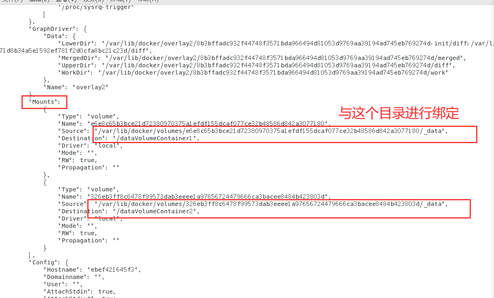

centos7镜像下载地址：http://mirrors.aliyun.com/centos/7/isos/x86_64/

https://docs.docker.com/engine/install/centos/

根据官网安装即可！

linum帮助命令：

man  ls  有问题问男人

常用命令：

docker --help 

docker version

docker images 列出本地主机上的镜像

-a : 列出本地所有镜像（含中间映像层）

-q : 只显示镜像id

docker search    搜索


# 容器命令

docker pull centos   拉取一个centos

- 新建并启动容器

```BASH
docker  run  [OPTIONS]  IMAGE  [COMMAND]  [ARG]
docker  run  -it  centos # 就会进入centos的命令行
```

OPTIONS说明：

--name = "容器新名字"：为容器指定一个名称

-d：后台运行容器，并返回容器ID，也启动守护式容器

**-i：以交互模式运行容器，通常与-t同时使用**

**-t：为容器重新分配一个伪输入终端，通常与-i同时使用**

-P：随机端口映射

-p：指定端口映射

- 列出当前正在运行的容器

```bash
docker ps
docker  ps  -l  # 显示最近运行的容器
```

- 退出容器

两种退出方法：

一 ： exit （容器停止推出）

二 ： ctrl + P + Q(容器不停止退出)

- 启动容器

```bash
docker  start  容器名或ID
```

- 停止容器

```bash
docker  stop
```

- 强制停止容器

```bash
docker  kill 
```

- 删除容器  -f：强制

```bash
docker  rm
docker  rm  -f  $(docker  ps  -q)   # 删除多个
docker  ps  -q  只差ID
```

- 一次性删除多个容器

```bash
docker  rm  -f  $(docker  ps  -a  -q)
docker  ps  -a  -q | xargs  docker  rm
```

***

**`重要： `**

- 启动守护式容器

```bash
docker  run  -d  容器名   
```


- 查看容器日志

```bash
docker  logs  -f  -t  --tail  容器ID
```

-t ： 是加入时间戳

-f ： 跟随最新的日志打印

--tail ： 数字 显示最后多少条

- 查看容器内进程

```bash
docker  top  容器ID
```

- 查看容器内部细节

```bash
docker  inspect  容器ID
```

- **重新进入 已经退出的  容器** 

```bash
docker  run  -it  centos   # 进入docker里的centos的终端
ctrl  + P  +Q  只退出不停止
docker  attach  容器ID   # 重新进入docker里的centos的终端
docker  exec  -t  容器ID  [COMMAND] # 在宿主机中可以对指定的容器操作，好处就是不需要再进入容器
docker  exec  -it  容器ID  /bin/bash  #写上tomcat的ID 就可以进入tomcat的终端
```

- 从容器内拷贝文件到主机上

```bash
docker  cp  容器ID：容器内路径    目的主机路径
```

# 镜像


为什么tomcat这么大呢？


因为Tomcat运行需要很多环境，所以导致了tomcat变大！

为什么Docker镜像要采用分层结构呢？


Docker镜像都是只读的，当容器启动时，一个新的可写层被加载到镜像的顶部

这一层通常被称作“容器层","容器层"之下的都叫“镜像层”

# 镜像commit

我们如何将我们已经修改好的镜像，提交呢，便于我们下次直接拿来使用！

以启动tomcat为例：

docker  run  -d  -p 6666:8080 tomcat  # 后台运行tomcat

```bash
docker  pull  tomcat
docker  run  -it  -P  tomcat
docker  exec  -it  [tomcat的容器ID]  /bin/bash  # 进入tomcat的目录
这时候应该在/usr/local/tomcat的目录下
我们要将 webapps.dist 改名为 webapps
mv  webapps  webapps2
mv  webapps.dist webapps
docker ps #查看端口号，在浏览器中访问即可
```

**提交命令！**

```bash
#                         -a作者信息   -m标注信息                                                       命名
docker  commit  -a="zzyy"  -m="modified   tomcat"  [需要提交的容器ID]  atguigu/mytomcat:2.10
```


# Docker容器数据卷

**对容器运行产生的数据进行持久化**


能干嘛?

容器的持久化

容器间继承+共享数据


> 使用命令操作

- 命令

docker  run  -it  -v  /宿主机绝对路径目录:/容器内目录  镜像名


```bash
#  主机的hostVolume文件和容器的containerVolume文件建立了联系
docker  run  -it  -v  /hostVolume:/containerVolume   镜像名
#  在容器内只读不能修改    ro：readonly
docker  run  -it  -v  /宿主机绝对路径目录:/容器内目录:ro   镜像名
```

建立联系之后，查看是否挂在成功

命令：


```bash
docker  run  -it  -v  /hostVolume:/containerVolume  镜像名  # 先建立两个文件的联系

# 查看是否挂载成功
docker  inspect  [容器ID]  # 截图如下
```


两个文件下的内容就可以同步了！

即使容器退出  在主机中添加内容，容器再次启动后也可以同步到内容

> 使用DockerFile添加

Java  Hello.java  ===> Hello.class

Docker  images   ===> DockerFile

- 在根目录下创建文件加 mydocker

```
cd /
mkdir mydocker
```

- 编辑Dockerfile文件

  ```bash
  vim Dockerfile
  ```

  在文件中加入下面的内容

```
# volume test
FROM centos
VOLUME ["/dataVolumeContainer1","/dataVolumeContainer2"]
CMD echo "finished , --------success1"
CMD /bin/bash
```

- build 生成镜像

```bash
docker  build  -f  /mydocker/Dockerfile  -t  zzyy/centos  .
```

- 查看我们生成的镜像并运行 

```bash
docker  run  -it  zzyy/centos
```


可以看到，运行的时候已经自动生成了两个容器数据卷，那么这两个容器数据卷和本机的哪个目录绑定呢？？

使用 inspect 查看

```bash
docker  inspect  [容器ID]
```





> # 数据卷容器

命名的容器挂载数据卷，其他容器通过挂载这个（父容器）实现数据共享，挂载数据卷的容器，称之为 数据卷容器

命令：

```bash
#  先运行一个父容器
docker  run  -it  --name  dc01  zzyy/centos

# 再运行一个
docker  run  -it  --name  dc02 --volumes-from  dc01  zzyy/centos
继承了之后 容器卷既相互继承又相互共享  ， 子的容器卷的数据也会被父的容器卷共享
```


> # DockerFile解析

是什么 ?

 Dockerfile是用来构建Docker镜像的构建文件，是由一系列命令和参数构成的脚本。

构建三步骤：

- 编写Dockerfile文件
- docker  build
- docker  run

`DockerFile构建过程解析：`

- Dockerfile内容基础知识：

  1.每条保留字指令都必须为大写字母且后边要跟随至少一个参数

  2.执行按照从上到下，顺序执行

  3.#表示注释

  4.每条指令都会创建一个新的镜像层，并对镜像进行提交（就像千层饼一样）

  

  

- Docker执行Dockerfile的大致流程：

  

  `DockerFile体系结构：`（保留字指令）

- FROM

  基础镜像，当前新镜像是基于哪个镜像的

- MAINTAINER

  作者+作者邮箱

- RUN

  容器构建时需要运行的命令

- EXPOSE

  暴露出对外端口号

- WORKDIR

  在创建容器（run）的时候，进入容器终端时的初始路径

- ENV

  用来在构建镜像过程中设置环境变量

  ```bash
  ENV  MY_PATH  /usr/mytest
  这个环境变量可以在后续的任何RUN指令中使用，这就如同在命令前边制定了环境变量的前缀一样。
  也可以在其他指令中直接使用这些环境变量

  如： WORDIR  $MY_PATH
  ```

  ​

- ADD

  将宿主机目录下的文件拷贝进镜像且ADD命令会自动处理URL和解压tar压缩包

- COPY

  类似ADD，但是不会解压tar压缩包

  ```bash
  COPY  src  dest
  ```

  ​

- VOLUME

  容器数据卷，保存数据和持久化

- CMD

  指定一个容器启动时要运行的命令

  Dockerfile中可以有多个CMD指令，但是只有最后一个生效，CMD 会被 docker run之后的参数替换

- ENTRYPOINT

  和CMD的目的一样

- ONBUILD

  当构建一个被继承的Dockerfile时运行命令

  父镜像在被子继承之后父镜像的onbuild被触发（子镜像 build 时 触发）


***

用Docker 从阿里云镜像拉取的centos默认：

1：初始centos运行该镜像时默认路径时   /

2：默认不支持 vim

3：默认不支持 ifconfig

自定义  mycentos  目的但是我们自己的镜像具备如下：

1：登陆后的默认路径

2：vim编辑器

3：查看网络配置  ifconfig  支持


**`自定义镜像 mycentos：`**

- 编写

  cd  /mydocker   # 进入根目录下的mydocker  没有的话创建一个

  vim  Dockerfile2  # 添加下边配置

  ```bash
  FROM  centos
  MAINTAINER  zzyy<zzyy167@126.com>  # 作者

  ENV  MYPATH  /usr/local  # 环境变量
  WORKDIR  $MYPAT   # 进入时的落脚点，引用环境变量

  RUN  yum  -y  install  vim   # 安装vim
  RUN  yum  -y  install  net-tools

  EXPOSE  80  # 暴露端口号

  CMD  echo  $MYPATH
  CMD  echo  "success --------------------- ok"
  CMD /bin/bash
  ```

  ​

- 构建

  docker   build   -t   镜像名:TAG   .

  docker   build   -f   /mydocker/Dockerfile2   -t   mycentos:1.3   .   # 注意后边还有一个点！

  

- 运行

- 列出镜像的变更历史

  docker  history  镜像名


***

**curl命令解释：**


> # 制作CMD版可以查询IP信息的容器

- cd /mydocker
- vim Dockerfile3

```
# http://ip.cn 这个网址可以查当前 ip 所在地区
FROM centos
RUN yum install -y curl
CMD ["curl","-s","http://ip.cn"]
```

- docker build -f /mydoker/Dockerfile3 -t  myip .

  `在构建的时候，如果时当前目录，且Dockerfile文件就是叫Dockerfile 的话，就不用写-f 和目录也就是 : docker build -t myip .`

- docker run myip 

**总结：**

CMD版的容器呢，如果我们在后边想要加上一点信息，例如我们要加上 -i 来获取报文头，那么我们肯定要运行

`docker run myip -i `，但是这样的话却会报错，因为我们加在 run  后边的这个参数 -i  会替换掉 `Dockerfile3`中的CMD里边的内容，这时候CMD 里的内容就相当于 : `CMD ["-i"]`，为什么呢？因为 CMD 只有最后一个生效也就是 后一个 的命令会覆盖前一个命令。

> # 制作ENTRYPOINT版可以查询IP信息的容器

- cd /mydocker
- vim Dockerfile3

```
# http://ip.cn 这个网址可以查当前 ip 所在地区
FROM centos
RUN yum install -y curl
ENTRYPOINT  ["curl","-s","http://ip.cn"]
```

- docker build -f /mydoker/Dockerfile4 -t  myip2 .
- docker run myip2

**总结：**

ENTRYPOINT 的作用在前边说了，和CMD的作用时一样的，但是 ENTRYPOINT 后边的参数不会被覆盖，那我们如果想要查看报文头的话（在使用的时候，不可避免的要添加其他的命令，所以用 ENTRYPOINT 比较好），可以直接在 run 命令后边加上 -i ， 因为在 ENTRYPOINT 中，-i并不会覆盖里边的参数。

`docker run myip2 -i`  (可以在后边加上任意我们想要加上的参数)


> # 自定义的Tomcat9

步骤：


Dockerfile：


构建：


运行（run）：

第2、3行： 两个容器数据卷

为什么要建容器卷呢？

我们直接在本机上发布服务，就可以在tomcat中同步，可以直接发布到tomcat中。


在自定义的tomcat9 上发布演示：


命令：

在本机的tomcat9/test 关联的是 容器的 webapps/test 

所以，在本机的 test 目录下创建 a.jsp 和 WEB-INF（含web.xml），那么会自动被容器的 webapps/test 共享，也就发布到了容器 tomcat9 中，访问的时候访问： localhost:9080/test/a.jsp  就可以访问到我们的  a.jsp 了


web.xml：


a.jsp：


测试：


> # Dockerfile小总结


看懂！


# Docker常用安装

**`整体步骤：`**

- 搜索镜像
- 拉取镜像
- 查看镜像
- 启动镜像
- 停止容器
- 移除容器

**`安装 tomcat :`**

- docker  hub 上面查找tomcat镜像   `docker search tomcat`
- 从 docker  hub 上拉取 tomcat镜像到本地   `docker pull tomcat`
- docker  images  查看是否有拉取到的tomcat  `docker images`
- 使用 tomcat 镜像创建容器   `docker  run -it -p 8888:8080 tomcat`

**`安装 mysql ：`**

- docker  search  mysql

- docker  pull  mysql:8.0

- `docker run -p 12345:3306 --name mysql -v /zzyyuse/mysql/conf:/etc/mysql/conf.d -v /zzyyuse/mysql/logs:/logs -v /zzyyuse/mysql/data:/var/lib/mysql -e MYSQL_ROOT_PASSWORD=123456 -d  mysql:5.7`

  ```
  docker run -p 12345:3306 --name mysql 
  -v /zzyyuse/mysql/conf:/etc/mysql/conf.d  
  -v /zzyyuse/mysql/logs:/logs 
  -v /zzyyuse/mysql/data:/var/lib/mysql
  -e MYSQL_ROOT_PASSWORD=123456 
  -d  mysql:8.0  # -d 后台运行 
  ```

  ​

  进入交互运行 ` docker exec  -it  运行的容器ID  /bin/bash`

让外部 windows10 来连接docker上的mysql

如果navicat 连接出错，提示需要升级navicat的话：

docker exec -it mysql bash 进入登录mysql

mysql -uroot -p 输密码 进入mysql命令行 输入以下命令

ALTER USER 'root'@'localhost' IDENTIFIED BY 'password' PASSWORD EXPIRE NEVER;

ALTER USER 'root'@'localhost' IDENTIFIED WITH mysql_native_password BY 'password';

FLUSH PRIVILEGES; #刷新权限，使自己的修改生效。

alter user 'root'@'%' identified by 'password' password expire never;

 alter user 'root'@'%' identified with mysql_native_password by 'why';//why是自己新修改的密码。
这样即可！

**`安装 redis ：`**

拉取 ： docker  pull  redis:3.2

运行 ：

```bash
docker pulll redis
docker run  -d --name myredis -p 6380:6379 redis --requirepass "123456"
```


```bash
 docker  run  -p  6379:6379  -v  /zzyyuse/myredis/data:/data  -v /zzyyuse/myredis/conf/redis.conf:/usr/local/etc/redis/redis.conf  -d  redis:3.2  redis-server  /usr/local/etc/redis/redis.conf  --appendonly  yes
 #   --appendonly  yes 开启aof 持久化
```

配置文件：  vim /zzyyuse/myredis/conf/redis.conf/redis.conf

进入redis.conf 文件夹 :   cd /zzyyuse/myredis/conf/redis.conf/

运行客户端 : docker exec -it  [redis的容器ID] redis-cli

测试一下持久化文件的生成 ：   cat /zzyyuse/myredis/data/appendonly.aof

```BASH
[root@bogon redis.conf]# docker exec -it 2db6f7c5baa1 redis-cli
127.0.0.1:6379> ls
(error) ERR unknown command 'ls'
127.0.0.1:6379> set k1 v1
OK
127.0.0.1:6379> set k2 v2
OK
127.0.0.1:6379> set k3 v3
OK
127.0.0.1:6379> SHUTDOWN
[root@bogon data]# cat /zzyyuse/myredis/data/appendonly.aof
*2
$6
SELECT
$1
0
*3
$3
set
$2
k1
$2
v1
*3
$3
set
$2
k2
$2
v2
*3
$3
set
$2
k3
$2
v3
[root@bogon data]# 
```


redis.conf 配置文件

```
# or when the master and replicas are many hops away, turning this to "yes" may
# be a good idea.
repl-disable-tcp-nodelay no

# Set the replication backlog size. The backlog is a buffer that accumulates
# replica data when replicas are disconnected for some time, so that when a replica
# wants to reconnect again, often a full resync is not needed, but a partial
# resync is enough, just passing the portion of data the replica missed while
# disconnected.
#
# The bigger the replication backlog, the longer the time the replica can be
# disconnected and later be able to perform a partial resynchronization.
#
# The backlog is only allocated once there is at least a replica connected.
#
# repl-backlog-size 1mb

# After a master has no longer connected replicas for some time, the backlog
# will be freed. The following option configures the amount of seconds that
# need to elapse, starting from the time the last replica disconnected, for
# the backlog buffer to be freed.
#
# Note that replicas never free the backlog for timeout, since they may be
# promoted to masters later, and should be able to correctly "partially
# resynchronize" with the replicas: hence they should always accumulate backlog.
#
# A value of 0 means to never release the backlog.
#
# repl-backlog-ttl 3600

# The replica priority is an integer number published by Redis in the INFO output.
# It is used by Redis Sentinel in order to select a replica to promote into a
# master if the master is no longer working correctly.
#
# A replica with a low priority number is considered better for promotion, so
# for instance if there are three replicas with priority 10, 100, 25 Sentinel will
# pick the one with priority 10, that is the lowest.
#
# However a special priority of 0 marks the replica as not able to perform the
# role of master, so a replica with priority of 0 will never be selected by
# Redis Sentinel for promotion.
#
# By default the priority is 100.
replica-priority 100

# It is possible for a master to stop accepting writes if there are less than
# N replicas connected, having a lag less or equal than M seconds.
#
# The N replicas need to be in "online" state.
#
# The lag in seconds, that must be <= the specified value, is calculated from
# the last ping received from the replica, that is usually sent every second.
#
# This option does not GUARANTEE that N replicas will accept the write, but
# will limit the window of exposure for lost writes in case not enough replicas
# are available, to the specified number of seconds.
#
# For example to require at least 3 replicas with a lag <= 10 seconds use:
#
# min-replicas-to-write 3
# min-replicas-max-lag 10
#
# Setting one or the other to 0 disables the feature.
#
# By default min-replicas-to-write is set to 0 (feature disabled) and
# min-replicas-max-lag is set to 10.

# A Redis master is able to list the address and port of the attached
# replicas in different ways. For example the "INFO replication" section
# offers this information, which is used, among other tools, by
# Redis Sentinel in order to discover replica instances.
# Another place where this info is available is in the output of the
# "ROLE" command of a master.
#
# The listed IP and address normally reported by a replica is obtained
# in the following way:
#
#   IP: The address is auto detected by checking the peer address
#   of the socket used by the replica to connect with the master.
#
#   Port: The port is communicated by the replica during the replication
#   handshake, and is normally the port that the replica is using to
#   listen for connections.
#
# However when port forwarding or Network Address Translation (NAT) is
# used, the replica may be actually reachable via different IP and port
# pairs. The following two options can be used by a replica in order to
# report to its master a specific set of IP and port, so that both INFO
# and ROLE will report those values.
#
# There is no need to use both the options if you need to override just
# the port or the IP address.
#
# replica-announce-ip 5.5.5.5
# replica-announce-port 1234

################################## SECURITY ###################################

# Require clients to issue AUTH <PASSWORD> before processing any other
# commands.  This might be useful in environments in which you do not trust
# others with access to the host running redis-server.
#
# This should stay commented out for backward compatibility and because most
# people do not need auth (e.g. they run their own servers).
#
# Warning: since Redis is pretty fast an outside user can try up to
# 150k passwords per second against a good box. This means that you should
# use a very strong password otherwise it will be very easy to break.
#
# requirepass foobared

# Command renaming.
#
# It is possible to change the name of dangerous commands in a shared
# environment. For instance the CONFIG command may be renamed into something
# hard to guess so that it will still be available for internal-use tools
# but not available for general clients.
#
# Example:
#
# rename-command CONFIG b840fc02d524045429941cc15f59e41cb7be6c52
#
# It is also possible to completely kill a command by renaming it into
# an empty string:
#
# rename-command CONFIG ""
#
# Please note that changing the name of commands that are logged into the
# AOF file or transmitted to replicas may cause problems.

################################### CLIENTS ####################################

# Set the max number of connected clients at the same time. By default
# this limit is set to 10000 clients, however if the Redis server is not
# able to configure the process file limit to allow for the specified limit
# the max number of allowed clients is set to the current file limit
# minus 32 (as Redis reserves a few file descriptors for internal uses).
#
# Once the limit is reached Redis will close all the new connections sending
# an error 'max number of clients reached'.
#
# maxclients 10000

############################## MEMORY MANAGEMENT ################################

# Set a memory usage limit to the specified amount of bytes.
# When the memory limit is reached Redis will try to remove keys
# according to the eviction policy selected (see maxmemory-policy).
#
# If Redis can't remove keys according to the policy, or if the policy is
# set to 'noeviction', Redis will start to reply with errors to commands
# that would use more memory, like SET, LPUSH, and so on, and will continue
# to reply to read-only commands like GET.
#
# This option is usually useful when using Redis as an LRU or LFU cache, or to
# set a hard memory limit for an instance (using the 'noeviction' policy).
#
# WARNING: If you have replicas attached to an instance with maxmemory on,
# the size of the output buffers needed to feed the replicas are subtracted
# from the used memory count, so that network problems / resyncs will
# not trigger a loop where keys are evicted, and in turn the output
# buffer of replicas is full with DELs of keys evicted triggering the deletion
# of more keys, and so forth until the database is completely emptied.
#
# In short... if you have replicas attached it is suggested that you set a lower
# limit for maxmemory so that there is some free RAM on the system for replica
# output buffers (but this is not needed if the policy is 'noeviction').
#
# maxmemory <bytes>

# MAXMEMORY POLICY: how Redis will select what to remove when maxmemory
# is reached. You can select among five behaviors:
#
# volatile-lru -> Evict using approximated LRU among the keys with an expire set.
# allkeys-lru -> Evict any key using approximated LRU.
# volatile-lfu -> Evict using approximated LFU among the keys with an expire set.
# allkeys-lfu -> Evict any key using approximated LFU.
# volatile-random -> Remove a random key among the ones with an expire set.
# allkeys-random -> Remove a random key, any key.
# volatile-ttl -> Remove the key with the nearest expire time (minor TTL)
# noeviction -> Don't evict anything, just return an error on write operations.
#
# LRU means Least Recently Used
# LFU means Least Frequently Used
#
# Both LRU, LFU and volatile-ttl are implemented using approximated
# randomized algorithms.
#
# Note: with any of the above policies, Redis will return an error on write
#       operations, when there are no suitable keys for eviction.
#
#       At the date of writing these commands are: set setnx setex append
#       incr decr rpush lpush rpushx lpushx linsert lset rpoplpush sadd
#       sinter sinterstore sunion sunionstore sdiff sdiffstore zadd zincrby
#       zunionstore zinterstore hset hsetnx hmset hincrby incrby decrby
#       getset mset msetnx exec sort
#
# The default is:
#
# maxmemory-policy noeviction

# LRU, LFU and minimal TTL algorithms are not precise algorithms but approximated
# algorithms (in order to save memory), so you can tune it for speed or
# accuracy. For default Redis will check five keys and pick the one that was
# used less recently, you can change the sample size using the following
# configuration directive.
#
# The default of 5 produces good enough results. 10 Approximates very closely
# true LRU but costs more CPU. 3 is faster but not very accurate.
#
# maxmemory-samples 5

# Starting from Redis 5, by default a replica will ignore its maxmemory setting
# (unless it is promoted to master after a failover or manually). It means
# that the eviction of keys will be just handled by the master, sending the
# DEL commands to the replica as keys evict in the master side.
#
# This behavior ensures that masters and replicas stay consistent, and is usually
# what you want, however if your replica is writable, or you want the replica to have
# a different memory setting, and you are sure all the writes performed to the
# replica are idempotent, then you may change this default (but be sure to understand
# what you are doing).
#
# Note that since the replica by default does not evict, it may end using more
# memory than the one set via maxmemory (there are certain buffers that may
# be larger on the replica, or data structures may sometimes take more memory and so
# forth). So make sure you monitor your replicas and make sure they have enough
# memory to never hit a real out-of-memory condition before the master hits
# the configured maxmemory setting.
#
# replica-ignore-maxmemory yes

############################# LAZY FREEING ####################################

# Redis has two primitives to delete keys. One is called DEL and is a blocking
# deletion of the object. It means that the server stops processing new commands
# in order to reclaim all the memory associated with an object in a synchronous
# way. If the key deleted is associated with a small object, the time needed
# in order to execute the DEL command is very small and comparable to most other
# O(1) or O(log_N) commands in Redis. However if the key is associated with an
# aggregated value containing millions of elements, the server can block for
# a long time (even seconds) in order to complete the operation.
#
# For the above reasons Redis also offers non blocking deletion primitives
# such as UNLINK (non blocking DEL) and the ASYNC option of FLUSHALL and
# FLUSHDB commands, in order to reclaim memory in background. Those commands
# are executed in constant time. Another thread will incrementally free the
# object in the background as fast as possible.
#
# DEL, UNLINK and ASYNC option of FLUSHALL and FLUSHDB are user-controlled.
# It's up to the design of the application to understand when it is a good
# idea to use one or the other. However the Redis server sometimes has to
# delete keys or flush the whole database as a side effect of other operations.
# Specifically Redis deletes objects independently of a user call in the
# following scenarios:
#
# 1) On eviction, because of the maxmemory and maxmemory policy configurations,
#    in order to make room for new data, without going over the specified
#    memory limit.
# 2) Because of expire: when a key with an associated time to live (see the
#    EXPIRE command) must be deleted from memory.
# 3) Because of a side effect of a command that stores data on a key that may
#    already exist. For example the RENAME command may delete the old key
#    content when it is replaced with another one. Similarly SUNIONSTORE
#    or SORT with STORE option may delete existing keys. The SET command
#    itself removes any old content of the specified key in order to replace
#    it with the specified string.
# 4) During replication, when a replica performs a full resynchronization with
#    its master, the content of the whole database is removed in order to
#    load the RDB file just transferred.
#
# In all the above cases the default is to delete objects in a blocking way,
# like if DEL was called. However you can configure each case specifically
# in order to instead release memory in a non-blocking way like if UNLINK
# was called, using the following configuration directives:

lazyfree-lazy-eviction no
lazyfree-lazy-expire no
lazyfree-lazy-server-del no
replica-lazy-flush no

############################## APPEND ONLY MODE ###############################

# By default Redis asynchronously dumps the dataset on disk. This mode is
# good enough in many applications, but an issue with the Redis process or
# a power outage may result into a few minutes of writes lost (depending on
# the configured save points).
#
# The Append Only File is an alternative persistence mode that provides
# much better durability. For instance using the default data fsync policy
# (see later in the config file) Redis can lose just one second of writes in a
# dramatic event like a server power outage, or a single write if something
# wrong with the Redis process itself happens, but the operating system is
# still running correctly.
#
# AOF and RDB persistence can be enabled at the same time without problems.
# If the AOF is enabled on startup Redis will load the AOF, that is the file
# with the better durability guarantees.
#
# Please check http://redis.io/topics/persistence for more information.

appendonly no

# The name of the append only file (default: "appendonly.aof")

appendfilename "appendonly.aof"

# The fsync() call tells the Operating System to actually write data on disk
# instead of waiting for more data in the output buffer. Some OS will really flush
# data on disk, some other OS will just try to do it ASAP.
#
# Redis supports three different modes:
#
# no: don't fsync, just let the OS flush the data when it wants. Faster.
# always: fsync after every write to the append only log. Slow, Safest.
# everysec: fsync only one time every second. Compromise.
#
# The default is "everysec", as that's usually the right compromise between
# speed and data safety. It's up to you to understand if you can relax this to
# "no" that will let the operating system flush the output buffer when
# it wants, for better performances (but if you can live with the idea of
# some data loss consider the default persistence mode that's snapshotting),
# or on the contrary, use "always" that's very slow but a bit safer than
# everysec.
#
# More details please check the following article:
# http://antirez.com/post/redis-persistence-demystified.html
#
# If unsure, use "everysec".

# appendfsync always
appendfsync everysec
# appendfsync no

# When the AOF fsync policy is set to always or everysec, and a background
# saving process (a background save or AOF log background rewriting) is
# performing a lot of I/O against the disk, in some Linux configurations
# Redis may block too long on the fsync() call. Note that there is no fix for
# this currently, as even performing fsync in a different thread will block
# our synchronous write(2) call.
#
# In order to mitigate this problem it's possible to use the following option
# that will prevent fsync() from being called in the main process while a
# BGSAVE or BGREWRITEAOF is in progress.
#
# This means that while another child is saving, the durability of Redis is
# the same as "appendfsync none". In practical terms, this means that it is
# possible to lose up to 30 seconds of log in the worst scenario (with the
# default Linux settings).
#
# If you have latency problems turn this to "yes". Otherwise leave it as
# "no" that is the safest pick from the point of view of durability.

no-appendfsync-on-rewrite no

# Automatic rewrite of the append only file.
# Redis is able to automatically rewrite the log file implicitly calling
# BGREWRITEAOF when the AOF log size grows by the specified percentage.
#
# This is how it works: Redis remembers the size of the AOF file after the
# latest rewrite (if no rewrite has happened since the restart, the size of
# the AOF at startup is used).
#
# This base size is compared to the current size. If the current size is
# bigger than the specified percentage, the rewrite is triggered. Also
# you need to specify a minimal size for the AOF file to be rewritten, this
# is useful to avoid rewriting the AOF file even if the percentage increase
# is reached but it is still pretty small.
#
# Specify a percentage of zero in order to disable the automatic AOF
# rewrite feature.

auto-aof-rewrite-percentage 100
auto-aof-rewrite-min-size 64mb

# An AOF file may be found to be truncated at the end during the Redis
# startup process, when the AOF data gets loaded back into memory.
# This may happen when the system where Redis is running
# crashes, especially when an ext4 filesystem is mounted without the
# data=ordered option (however this can't happen when Redis itself
# crashes or aborts but the operating system still works correctly).
#
# Redis can either exit with an error when this happens, or load as much
# data as possible (the default now) and start if the AOF file is found
# to be truncated at the end. The following option controls this behavior.
#
# If aof-load-truncated is set to yes, a truncated AOF file is loaded and
# the Redis server starts emitting a log to inform the user of the event.
# Otherwise if the option is set to no, the server aborts with an error
# and refuses to start. When the option is set to no, the user requires
# to fix the AOF file using the "redis-check-aof" utility before to restart
# the server.
#
# Note that if the AOF file will be found to be corrupted in the middle
# the server will still exit with an error. This option only applies when
# Redis will try to read more data from the AOF file but not enough bytes
# will be found.
aof-load-truncated yes

# When rewriting the AOF file, Redis is able to use an RDB preamble in the
# AOF file for faster rewrites and recoveries. When this option is turned
# on the rewritten AOF file is composed of two different stanzas:
#
#   [RDB file][AOF tail]
#
# When loading Redis recognizes that the AOF file starts with the "REDIS"
# string and loads the prefixed RDB file, and continues loading the AOF
# tail.
aof-use-rdb-preamble yes

################################ LUA SCRIPTING  ###############################

# Max execution time of a Lua script in milliseconds.
#
# If the maximum execution time is reached Redis will log that a script is
# still in execution after the maximum allowed time and will start to
# reply to queries with an error.
#
# When a long running script exceeds the maximum execution time only the
# SCRIPT KILL and SHUTDOWN NOSAVE commands are available. The first can be
# used to stop a script that did not yet called write commands. The second
# is the only way to shut down the server in the case a write command was
# already issued by the script but the user doesn't want to wait for the natural
# termination of the script.
#
# Set it to 0 or a negative value for unlimited execution without warnings.
lua-time-limit 5000

################################ REDIS CLUSTER  ###############################

# Normal Redis instances can't be part of a Redis Cluster; only nodes that are
# started as cluster nodes can. In order to start a Redis instance as a
# cluster node enable the cluster support uncommenting the following:
#
# cluster-enabled yes

# Every cluster node has a cluster configuration file. This file is not
# intended to be edited by hand. It is created and updated by Redis nodes.
# Every Redis Cluster node requires a different cluster configuration file.
# Make sure that instances running in the same system do not have
# overlapping cluster configuration file names.
#
# cluster-config-file nodes-6379.conf

# Cluster node timeout is the amount of milliseconds a node must be unreachable
# for it to be considered in failure state.
# Most other internal time limits are multiple of the node timeout.
#
# cluster-node-timeout 15000

# A replica of a failing master will avoid to start a failover if its data
# looks too old.
#
# There is no simple way for a replica to actually have an exact measure of
# its "data age", so the following two checks are performed:
#
# 1) If there are multiple replicas able to failover, they exchange messages
#    in order to try to give an advantage to the replica with the best
#    replication offset (more data from the master processed).
#    Replicas will try to get their rank by offset, and apply to the start
#    of the failover a delay proportional to their rank.
#
# 2) Every single replica computes the time of the last interaction with
#    its master. This can be the last ping or command received (if the master
#    is still in the "connected" state), or the time that elapsed since the
#    disconnection with the master (if the replication link is currently down).
#    If the last interaction is too old, the replica will not try to failover
#    at all.
#
# The point "2" can be tuned by user. Specifically a replica will not perform
# the failover if, since the last interaction with the master, the time
# elapsed is greater than:
#
#   (node-timeout * replica-validity-factor) + repl-ping-replica-period
#
# So for example if node-timeout is 30 seconds, and the replica-validity-factor
# is 10, and assuming a default repl-ping-replica-period of 10 seconds, the
# replica will not try to failover if it was not able to talk with the master
# for longer than 310 seconds.
#
# A large replica-validity-factor may allow replicas with too old data to failover
# a master, while a too small value may prevent the cluster from being able to
# elect a replica at all.
#
# For maximum availability, it is possible to set the replica-validity-factor
# to a value of 0, which means, that replicas will always try to failover the
# master regardless of the last time they interacted with the master.
# (However they'll always try to apply a delay proportional to their
# offset rank).
#
# Zero is the only value able to guarantee that when all the partitions heal
# the cluster will always be able to continue.
#
# cluster-replica-validity-factor 10

# Cluster replicas are able to migrate to orphaned masters, that are masters
# that are left without working replicas. This improves the cluster ability
# to resist to failures as otherwise an orphaned master can't be failed over
# in case of failure if it has no working replicas.
#
# Replicas migrate to orphaned masters only if there are still at least a
# given number of other working replicas for their old master. This number
# is the "migration barrier". A migration barrier of 1 means that a replica
# will migrate only if there is at least 1 other working replica for its master
# and so forth. It usually reflects the number of replicas you want for every
# master in your cluster.
#
# Default is 1 (replicas migrate only if their masters remain with at least
# one replica). To disable migration just set it to a very large value.
# A value of 0 can be set but is useful only for debugging and dangerous
# in production.
#
# cluster-migration-barrier 1

# By default Redis Cluster nodes stop accepting queries if they detect there
# is at least an hash slot uncovered (no available node is serving it).
# This way if the cluster is partially down (for example a range of hash slots
# are no longer covered) all the cluster becomes, eventually, unavailable.
# It automatically returns available as soon as all the slots are covered again.
#
# However sometimes you want the subset of the cluster which is working,
# to continue to accept queries for the part of the key space that is still
# covered. In order to do so, just set the cluster-require-full-coverage
# option to no.
#
# cluster-require-full-coverage yes

# This option, when set to yes, prevents replicas from trying to failover its
# master during master failures. However the master can still perform a
# manual failover, if forced to do so.
#
# This is useful in different scenarios, especially in the case of multiple
# data center operations, where we want one side to never be promoted if not
# in the case of a total DC failure.
#
# cluster-replica-no-failover no

# In order to setup your cluster make sure to read the documentation
# available at http://redis.io web site.

########################## CLUSTER DOCKER/NAT support  ########################

# In certain deployments, Redis Cluster nodes address discovery fails, because
# addresses are NAT-ted or because ports are forwarded (the typical case is
# Docker and other containers).
#
# In order to make Redis Cluster working in such environments, a static
# configuration where each node knows its public address is needed. The
# following two options are used for this scope, and are:
#
# * cluster-announce-ip
# * cluster-announce-port
# * cluster-announce-bus-port
#
# Each instruct the node about its address, client port, and cluster message
# bus port. The information is then published in the header of the bus packets
# so that other nodes will be able to correctly map the address of the node
# publishing the information.
#
# If the above options are not used, the normal Redis Cluster auto-detection
# will be used instead.
#
# Note that when remapped, the bus port may not be at the fixed offset of
# clients port + 10000, so you can specify any port and bus-port depending
# on how they get remapped. If the bus-port is not set, a fixed offset of
# 10000 will be used as usually.
#
# Example:
#
# cluster-announce-ip 10.1.1.5
# cluster-announce-port 6379
# cluster-announce-bus-port 6380

################################## SLOW LOG ###################################

# The Redis Slow Log is a system to log queries that exceeded a specified
# execution time. The execution time does not include the I/O operations
# like talking with the client, sending the reply and so forth,
# but just the time needed to actually execute the command (this is the only
# stage of command execution where the thread is blocked and can not serve
# other requests in the meantime).
#
# You can configure the slow log with two parameters: one tells Redis
# what is the execution time, in microseconds, to exceed in order for the
# command to get logged, and the other parameter is the length of the
# slow log. When a new command is logged the oldest one is removed from the
# queue of logged commands.

# The following time is expressed in microseconds, so 1000000 is equivalent
# to one second. Note that a negative number disables the slow log, while
# a value of zero forces the logging of every command.
slowlog-log-slower-than 10000

# There is no limit to this length. Just be aware that it will consume memory.
# You can reclaim memory used by the slow log with SLOWLOG RESET.
slowlog-max-len 128

################################ LATENCY MONITOR ##############################

# The Redis latency monitoring subsystem samples different operations
# at runtime in order to collect data related to possible sources of
# latency of a Redis instance.
#
# Via the LATENCY command this information is available to the user that can
# print graphs and obtain reports.
#
# The system only logs operations that were performed in a time equal or
# greater than the amount of milliseconds specified via the
# latency-monitor-threshold configuration directive. When its value is set
# to zero, the latency monitor is turned off.
#
# By default latency monitoring is disabled since it is mostly not needed
# if you don't have latency issues, and collecting data has a performance
# impact, that while very small, can be measured under big load. Latency
# monitoring can easily be enabled at runtime using the command
# "CONFIG SET latency-monitor-threshold <milliseconds>" if needed.
latency-monitor-threshold 0

############################# EVENT NOTIFICATION ##############################

# Redis can notify Pub/Sub clients about events happening in the key space.
# This feature is documented at http://redis.io/topics/notifications
#
# For instance if keyspace events notification is enabled, and a client
# performs a DEL operation on key "foo" stored in the Database 0, two
# messages will be published via Pub/Sub:
#
# PUBLISH __keyspace@0__:foo del
# PUBLISH __keyevent@0__:del foo
#
# It is possible to select the events that Redis will notify among a set
# of classes. Every class is identified by a single character:
#
#  K     Keyspace events, published with __keyspace@<db>__ prefix.
#  E     Keyevent events, published with __keyevent@<db>__ prefix.
#  g     Generic commands (non-type specific) like DEL, EXPIRE, RENAME, ...
#  $     String commands
#  l     List commands
#  s     Set commands
#  h     Hash commands
#  z     Sorted set commands
#  x     Expired events (events generated every time a key expires)
#  e     Evicted events (events generated when a key is evicted for maxmemory)
#  A     Alias for g$lshzxe, so that the "AKE" string means all the events.
#
#  The "notify-keyspace-events" takes as argument a string that is composed
#  of zero or multiple characters. The empty string means that notifications
#  are disabled.
#
#  Example: to enable list and generic events, from the point of view of the
#           event name, use:
#
#  notify-keyspace-events Elg
#
#  Example 2: to get the stream of the expired keys subscribing to channel
#             name __keyevent@0__:expired use:
#
#  notify-keyspace-events Ex
#
#  By default all notifications are disabled because most users don't need
#  this feature and the feature has some overhead. Note that if you don't
#  specify at least one of K or E, no events will be delivered.
notify-keyspace-events ""

############################### ADVANCED CONFIG ###############################

# Hashes are encoded using a memory efficient data structure when they have a
# small number of entries, and the biggest entry does not exceed a given
# threshold. These thresholds can be configured using the following directives.
hash-max-ziplist-entries 512
hash-max-ziplist-value 64

# Lists are also encoded in a special way to save a lot of space.
# The number of entries allowed per internal list node can be specified
# as a fixed maximum size or a maximum number of elements.
# For a fixed maximum size, use -5 through -1, meaning:
# -5: max size: 64 Kb  <-- not recommended for normal workloads
# -4: max size: 32 Kb  <-- not recommended
# -3: max size: 16 Kb  <-- probably not recommended
# -2: max size: 8 Kb   <-- good
# -1: max size: 4 Kb   <-- good
# Positive numbers mean store up to _exactly_ that number of elements
# per list node.
# The highest performing option is usually -2 (8 Kb size) or -1 (4 Kb size),
# but if your use case is unique, adjust the settings as necessary.
list-max-ziplist-size -2

# Lists may also be compressed.
# Compress depth is the number of quicklist ziplist nodes from *each* side of
# the list to *exclude* from compression.  The head and tail of the list
# are always uncompressed for fast push/pop operations.  Settings are:
# 0: disable all list compression
# 1: depth 1 means "don't start compressing until after 1 node into the list,
#    going from either the head or tail"
#    So: [head]->node->node->...->node->[tail]
#    [head], [tail] will always be uncompressed; inner nodes will compress.
# 2: [head]->[next]->node->node->...->node->[prev]->[tail]
#    2 here means: don't compress head or head->next or tail->prev or tail,
#    but compress all nodes between them.
# 3: [head]->[next]->[next]->node->node->...->node->[prev]->[prev]->[tail]
# etc.
list-compress-depth 0

# Sets have a special encoding in just one case: when a set is composed
# of just strings that happen to be integers in radix 10 in the range
# of 64 bit signed integers.
# The following configuration setting sets the limit in the size of the
# set in order to use this special memory saving encoding.
set-max-intset-entries 512

# Similarly to hashes and lists, sorted sets are also specially encoded in
# order to save a lot of space. This encoding is only used when the length and
# elements of a sorted set are below the following limits:
zset-max-ziplist-entries 128
zset-max-ziplist-value 64

# HyperLogLog sparse representation bytes limit. The limit includes the
# 16 bytes header. When an HyperLogLog using the sparse representation crosses
# this limit, it is converted into the dense representation.
#
# A value greater than 16000 is totally useless, since at that point the
# dense representation is more memory efficient.
#
# The suggested value is ~ 3000 in order to have the benefits of
# the space efficient encoding without slowing down too much PFADD,
# which is O(N) with the sparse encoding. The value can be raised to
# ~ 10000 when CPU is not a concern, but space is, and the data set is
# composed of many HyperLogLogs with cardinality in the 0 - 15000 range.
hll-sparse-max-bytes 3000

# Streams macro node max size / items. The stream data structure is a radix
# tree of big nodes that encode multiple items inside. Using this configuration
# it is possible to configure how big a single node can be in bytes, and the
# maximum number of items it may contain before switching to a new node when
# appending new stream entries. If any of the following settings are set to
# zero, the limit is ignored, so for instance it is possible to set just a
# max entires limit by setting max-bytes to 0 and max-entries to the desired
# value.
stream-node-max-bytes 4096
stream-node-max-entries 100

# Active rehashing uses 1 millisecond every 100 milliseconds of CPU time in
# order to help rehashing the main Redis hash table (the one mapping top-level
# keys to values). The hash table implementation Redis uses (see dict.c)
# performs a lazy rehashing: the more operation you run into a hash table
# that is rehashing, the more rehashing "steps" are performed, so if the
# server is idle the rehashing is never complete and some more memory is used
# by the hash table.
#
# The default is to use this millisecond 10 times every second in order to
# actively rehash the main dictionaries, freeing memory when possible.
#
# If unsure:
# use "activerehashing no" if you have hard latency requirements and it is
# not a good thing in your environment that Redis can reply from time to time
# to queries with 2 milliseconds delay.
#
# use "activerehashing yes" if you don't have such hard requirements but
# want to free memory asap when possible.
activerehashing yes

# The client output buffer limits can be used to force disconnection of clients
# that are not reading data from the server fast enough for some reason (a
# common reason is that a Pub/Sub client can't consume messages as fast as the
# publisher can produce them).
#
# The limit can be set differently for the three different classes of clients:
#
# normal -> normal clients including MONITOR clients
# replica  -> replica clients
# pubsub -> clients subscribed to at least one pubsub channel or pattern
#
# The syntax of every client-output-buffer-limit directive is the following:
#
# client-output-buffer-limit <class> <hard limit> <soft limit> <soft seconds>
#
# A client is immediately disconnected once the hard limit is reached, or if
# the soft limit is reached and remains reached for the specified number of
# seconds (continuously).
# So for instance if the hard limit is 32 megabytes and the soft limit is
# 16 megabytes / 10 seconds, the client will get disconnected immediately
# if the size of the output buffers reach 32 megabytes, but will also get
# disconnected if the client reaches 16 megabytes and continuously overcomes
# the limit for 10 seconds.
#
# By default normal clients are not limited because they don't receive data
# without asking (in a push way), but just after a request, so only
# asynchronous clients may create a scenario where data is requested faster
# than it can read.
#
# Instead there is a default limit for pubsub and replica clients, since
# subscribers and replicas receive data in a push fashion.
#
# Both the hard or the soft limit can be disabled by setting them to zero.
client-output-buffer-limit normal 0 0 0
client-output-buffer-limit replica 256mb 64mb 60
client-output-buffer-limit pubsub 32mb 8mb 60

# Client query buffers accumulate new commands. They are limited to a fixed
# amount by default in order to avoid that a protocol desynchronization (for
# instance due to a bug in the client) will lead to unbound memory usage in
# the query buffer. However you can configure it here if you have very special
# needs, such us huge multi/exec requests or alike.
#
# client-query-buffer-limit 1gb

# In the Redis protocol, bulk requests, that are, elements representing single
# strings, are normally limited ot 512 mb. However you can change this limit
# here.
#
# proto-max-bulk-len 512mb

# Redis calls an internal function to perform many background tasks, like
# closing connections of clients in timeout, purging expired keys that are
# never requested, and so forth.
#
# Not all tasks are performed with the same frequency, but Redis checks for
# tasks to perform according to the specified "hz" value.
#
# By default "hz" is set to 10. Raising the value will use more CPU when
# Redis is idle, but at the same time will make Redis more responsive when
# there are many keys expiring at the same time, and timeouts may be
# handled with more precision.
#
# The range is between 1 and 500, however a value over 100 is usually not
# a good idea. Most users should use the default of 10 and raise this up to
# 100 only in environments where very low latency is required.
hz 10

# Normally it is useful to have an HZ value which is proportional to the
# number of clients connected. This is useful in order, for instance, to
# avoid too many clients are processed for each background task invocation
# in order to avoid latency spikes.
#
# Since the default HZ value by default is conservatively set to 10, Redis
# offers, and enables by default, the ability to use an adaptive HZ value
# which will temporary raise when there are many connected clients.
#
# When dynamic HZ is enabled, the actual configured HZ will be used as
# as a baseline, but multiples of the configured HZ value will be actually
# used as needed once more clients are connected. In this way an idle
# instance will use very little CPU time while a busy instance will be
# more responsive.
dynamic-hz yes

# When a child rewrites the AOF file, if the following option is enabled
# the file will be fsync-ed every 32 MB of data generated. This is useful
# in order to commit the file to the disk more incrementally and avoid
# big latency spikes.
aof-rewrite-incremental-fsync yes

# When redis saves RDB file, if the following option is enabled
# the file will be fsync-ed every 32 MB of data generated. This is useful
# in order to commit the file to the disk more incrementally and avoid
# big latency spikes.
rdb-save-incremental-fsync yes

# Redis LFU eviction (see maxmemory setting) can be tuned. However it is a good
# idea to start with the default settings and only change them after investigating
# how to improve the performances and how the keys LFU change over time, which
# is possible to inspect via the OBJECT FREQ command.
#
# There are two tunable parameters in the Redis LFU implementation: the
# counter logarithm factor and the counter decay time. It is important to
# understand what the two parameters mean before changing them.
#
# The LFU counter is just 8 bits per key, it's maximum value is 255, so Redis
# uses a probabilistic increment with logarithmic behavior. Given the value
# of the old counter, when a key is accessed, the counter is incremented in
# this way:
#
# 1. A random number R between 0 and 1 is extracted.
# 2. A probability P is calculated as 1/(old_value*lfu_log_factor+1).
# 3. The counter is incremented only if R < P.
#
# The default lfu-log-factor is 10. This is a table of how the frequency
# counter changes with a different number of accesses with different
# logarithmic factors:
#
# +--------+------------+------------+------------+------------+------------+
# | factor | 100 hits   | 1000 hits  | 100K hits  | 1M hits    | 10M hits   |
# +--------+------------+------------+------------+------------+------------+
# | 0      | 104        | 255        | 255        | 255        | 255        |
# +--------+------------+------------+------------+------------+------------+
# | 1      | 18         | 49         | 255        | 255        | 255        |
# +--------+------------+------------+------------+------------+------------+
# | 10     | 10         | 18         | 142        | 255        | 255        |
# +--------+------------+------------+------------+------------+------------+
# | 100    | 8          | 11         | 49         | 143        | 255        |
# +--------+------------+------------+------------+------------+------------+
#
# NOTE: The above table was obtained by running the following commands:
#
#   redis-benchmark -n 1000000 incr foo
#   redis-cli object freq foo
#
# NOTE 2: The counter initial value is 5 in order to give new objects a chance
# to accumulate hits.
#
# The counter decay time is the time, in minutes, that must elapse in order
# for the key counter to be divided by two (or decremented if it has a value
# less <= 10).
#
# The default value for the lfu-decay-time is 1. A Special value of 0 means to
# decay the counter every time it happens to be scanned.
#
# lfu-log-factor 10
# lfu-decay-time 1

########################### ACTIVE DEFRAGMENTATION #######################
#
# WARNING THIS FEATURE IS EXPERIMENTAL. However it was stress tested
# even in production and manually tested by multiple engineers for some
# time.
#
# What is active defragmentation?
# -------------------------------
#
# Active (online) defragmentation allows a Redis server to compact the
# spaces left between small allocations and deallocations of data in memory,
# thus allowing to reclaim back memory.
#
# Fragmentation is a natural process that happens with every allocator (but
# less so with Jemalloc, fortunately) and certain workloads. Normally a server
# restart is needed in order to lower the fragmentation, or at least to flush
# away all the data and create it again. However thanks to this feature
# implemented by Oran Agra for Redis 4.0 this process can happen at runtime
# in an "hot" way, while the server is running.
#
# Basically when the fragmentation is over a certain level (see the
# configuration options below) Redis will start to create new copies of the
# values in contiguous memory regions by exploiting certain specific Jemalloc
# features (in order to understand if an allocation is causing fragmentation
# and to allocate it in a better place), and at the same time, will release the
# old copies of the data. This process, repeated incrementally for all the keys
# will cause the fragmentation to drop back to normal values.
#
# Important things to understand:
#
# 1. This feature is disabled by default, and only works if you compiled Redis
#    to use the copy of Jemalloc we ship with the source code of Redis.
#    This is the default with Linux builds.
#
# 2. You never need to enable this feature if you don't have fragmentation
#    issues.
#
# 3. Once you experience fragmentation, you can enable this feature when
#    needed with the command "CONFIG SET activedefrag yes".
#
# The configuration parameters are able to fine tune the behavior of the
# defragmentation process. If you are not sure about what they mean it is
# a good idea to leave the defaults untouched.

# Enabled active defragmentation
# activedefrag yes

# Minimum amount of fragmentation waste to start active defrag
# active-defrag-ignore-bytes 100mb

# Minimum percentage of fragmentation to start active defrag
# active-defrag-threshold-lower 10

# Maximum percentage of fragmentation at which we use maximum effort
# active-defrag-threshold-upper 100

# Minimal effort for defrag in CPU percentage
# active-defrag-cycle-min 5

# Maximal effort for defrag in CPU percentage
# active-defrag-cycle-max 75

# Maximum number of set/hash/zset/list fields that will be processed from
# the main dictionary scan
# active-defrag-max-scan-fields 1000

[root@iz8vb4nxo286g9mk6p8fnhz myconfig]# vim redis.conf

# commands.  This might be useful in environments in which you do not trust
# others with access to the host running redis-server.
#
# This should stay commented out for backward compatibility and because most
# people do not need auth (e.g. they run their own servers).
#
# Warning: since Redis is pretty fast an outside user can try up to
# 150k passwords per second against a good box. This means that you should
# use a very strong password otherwise it will be very easy to break.
#
# requirepass foobared

# Command renaming.
#
# It is possible to change the name of dangerous commands in a shared
# environment. For instance the CONFIG command may be renamed into something
# hard to guess so that it will still be available for internal-use tools
# but not available for general clients.
#
# Example:
#
# rename-command CONFIG b840fc02d524045429941cc15f59e41cb7be6c52
#
# It is also possible to completely kill a command by renaming it into
# an empty string:
#
# rename-command CONFIG ""
#
# Please note that changing the name of commands that are logged into the
# AOF file or transmitted to replicas may cause problems.

################################### CLIENTS ####################################

# Set the max number of connected clients at the same time. By default
# this limit is set to 10000 clients, however if the Redis server is not
# able to configure the process file limit to allow for the specified limit
# the max number of allowed clients is set to the current file limit
# minus 32 (as Redis reserves a few file descriptors for internal uses).
#
# Once the limit is reached Redis will close all the new connections sending
# an error 'max number of clients reached'.
#
# maxclients 10000

############################## MEMORY MANAGEMENT ################################

# Set a memory usage limit to the specified amount of bytes.
# 1g => 1000000000 bytes
# 1gb => 1024*1024*1024 bytes
#
# units are case insensitive so 1GB 1Gb 1gB are all the same.

################################## INCLUDES ###################################

# Include one or more other config files here.  This is useful if you
# have a standard template that goes to all Redis servers but also need
# to customize a few per-server settings.  Include files can include
# other files, so use this wisely.
#
# Notice option "include" won't be rewritten by command "CONFIG REWRITE"
# from admin or Redis Sentinel. Since Redis always uses the last processed
# line as value of a configuration directive, you'd better put includes
# at the beginning of this file to avoid overwriting config change at runtime.
#
# If instead you are interested in using includes to override configuration
# options, it is better to use include as the last line.
#
# include /path/to/local.conf
# include /path/to/other.conf

################################## MODULES #####################################

# Load modules at startup. If the server is not able to load modules
# it will abort. It is possible to use multiple loadmodule directives.
# loadmodule /path/to/my_module.so
                                                                                                      

```


# 本地镜像发布到阿里云

流程：


先生成镜像：

```bash
[root@bogon data]# docker images  # 查询镜像
REPOSITORY          TAG                 IMAGE ID            CREATED             SIZE
mycentos            111                 022849bf2381        14 hours ago        321MB
mycentos            1.3                 e7edf8d98008        22 hours ago        237MB
zzyy/centos         latest              e7edf8d98008        22 hours ago        237MB
mysql               8.0                 a7a67c95e831        7 days ago          541MB
tomcat              latest              927899a31456        10 days ago         647MB
centos              latest              470671670cac        3 months ago        237MB
redis               3.2                 87856cc39862        18 months ago       76MB
[root@bogon data]# docker run -it mycentos:1.3   # 先运行 1.3的centos
[root@165f3946dab8 /]# [root@bogon data]#    #  ctrl +P +Q退出
[root@bogon data]# docker ps  # 查看运行的centos
CONTAINER ID        IMAGE               COMMAND                  CREATED             STATUS              PORTS               NAMES
165f3946dab8        mycentos:1.3        "/bin/sh -c /bin/bash"   12 seconds ago      Up 9 seconds                            fervent_yalow
[root@bogon data]# docker commit -a zzyy -m "new mycentos1.4 with vim and ifconfig" 165f3946dab8 mycentos:1.4   # 提交centos
sha256:96100f5029b2f5dfe01c4bbcb9ac94ee6b7ecf01beaacaebab3edb662cc9fa92
[root@bogon data]# docker images  # 查看新提交的centos
REPOSITORY          TAG                 IMAGE ID            CREATED             SIZE
mycentos            1.4                 96100f5029b2        3 seconds ago       237MB
mycentos            111                 022849bf2381        14 hours ago        321MB
mycentos            1.3                 e7edf8d98008        22 hours ago        237MB
zzyy/centos         latest              e7edf8d98008        22 hours ago        237MB
mysql               8.0                 a7a67c95e831        7 days ago          541MB
tomcat              latest              927899a31456        10 days ago         647MB
centos              latest              470671670cac        3 months ago        237MB
redis               3.2                 87856cc39862        18 months ago       76MB
[root@bogon data]# 

```

将本地镜像推送到阿里云：

- 创建镜像仓库


​	