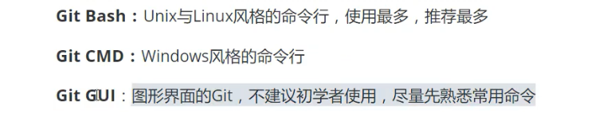
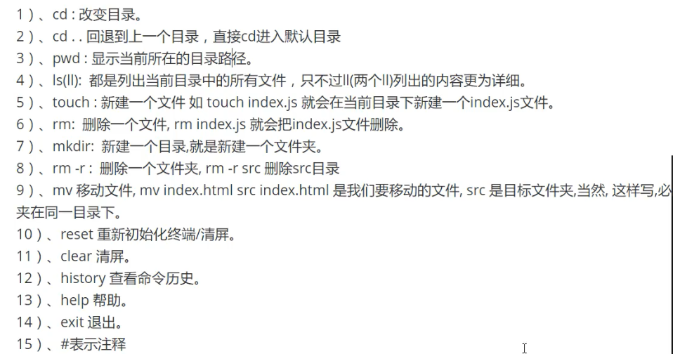
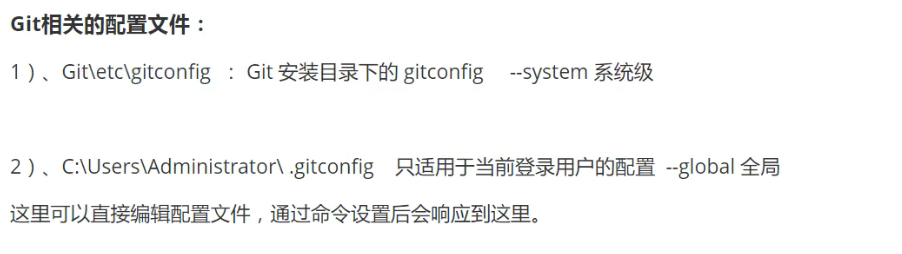
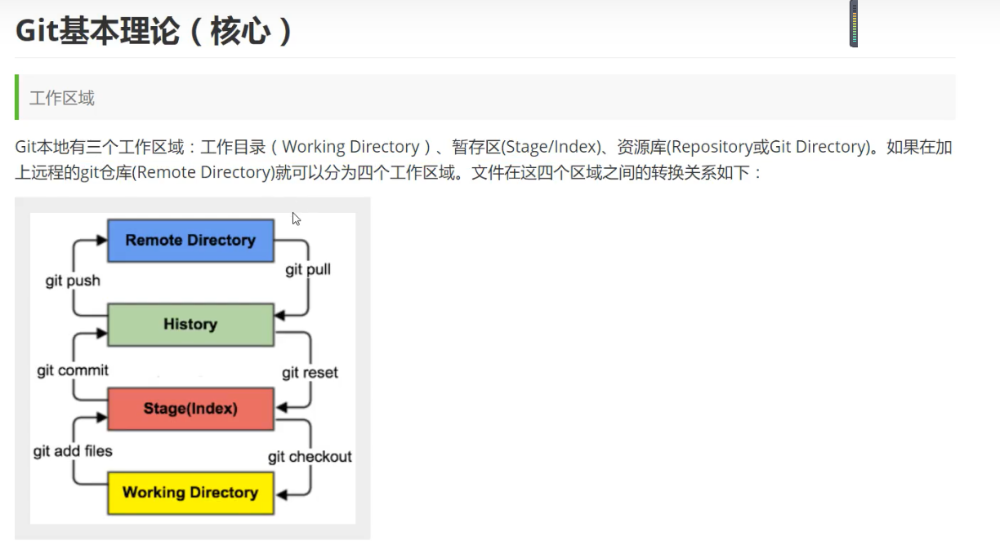
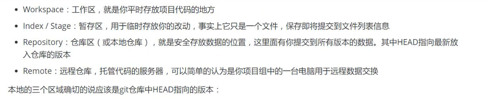
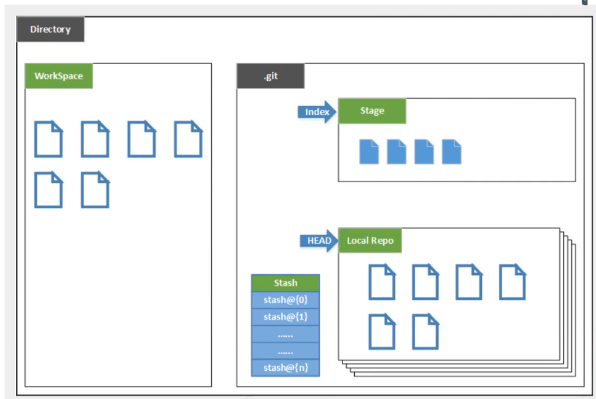
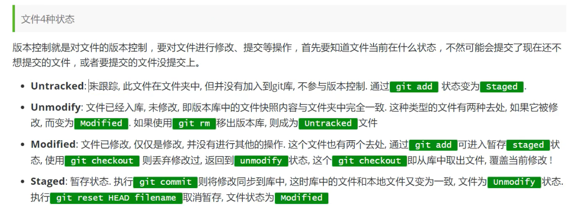
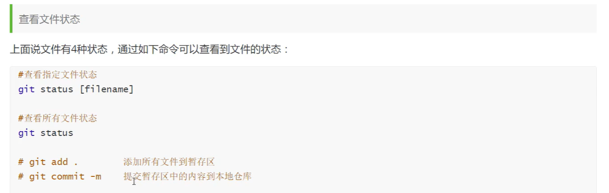
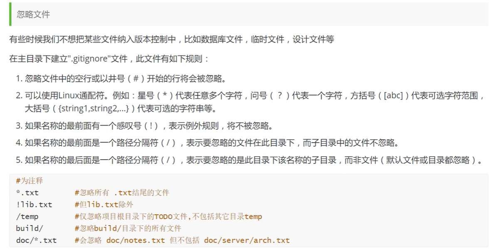

# 下载

Git官网下载较慢，在淘宝镜像下载：

http://npm.taobao.org/mirrors/git-for-windows/v2.25.1.windows.1/

安装，直接点击下一步即可。




# 基本linux命令



## Git配置

查看配置 ：`git config -l`

查看用户自己配置的东西：`git config --global --list`

## Git的配置文件都在本地



# Git的配置

下载完git之后必须进行一下配置

```bash
git config --global user.name "zqy"
git config --global user.email "1020325258@qq.com"

```


# Git基本理论







# + Git项目搭建

> 本地仓库搭建

创建本地仓库的方法有两种：一种是创建全新的仓库，另一种是克隆远程仓库

1、创建全新的仓库，需要用GIT管理的项目的根目录执行：

```bash
$  git  init
```

2、执行后可以看到，仅仅在项目目录中多出了一个.git目录，关于版本等的信息都在这里。

> 克隆远程仓库

1、另一种方式是克隆远程目录，将远程服务器上的仓库完全镜像一份至本地

```bash
$  git  clone  [url]
```

2、去 gitee 上克隆

# Git文件操作







# 码云

 1.注册账号

2.设置本及绑定SSH公钥，实现免密码登录！（免密码登录，这一步挺重要）

`#  进入  C:\Users\Administrator\.ssh  目录`

`#  生成公钥`

`ssh-keygen`

然后再 ` C:\Users\Administrator\.ssh`目录下生成两个文件，打开后缀为pub的文件，复制到马云中，就可以生成密钥了

3.将公钥信息 public key 添加到码云账户即可

4.使用马云创建一个自己的仓库！

克隆自己的仓库 ： git  clone  url


