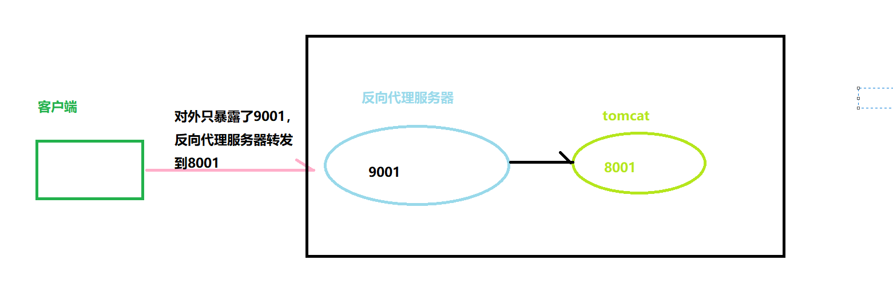
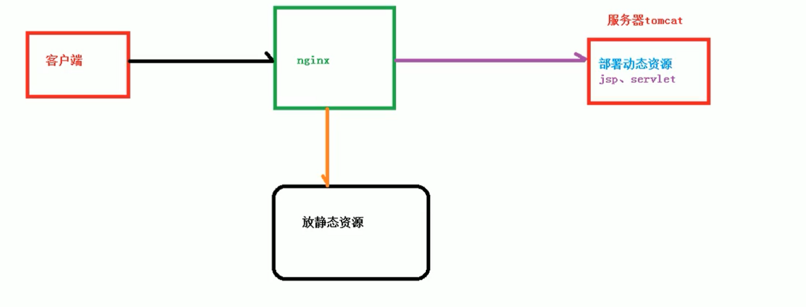
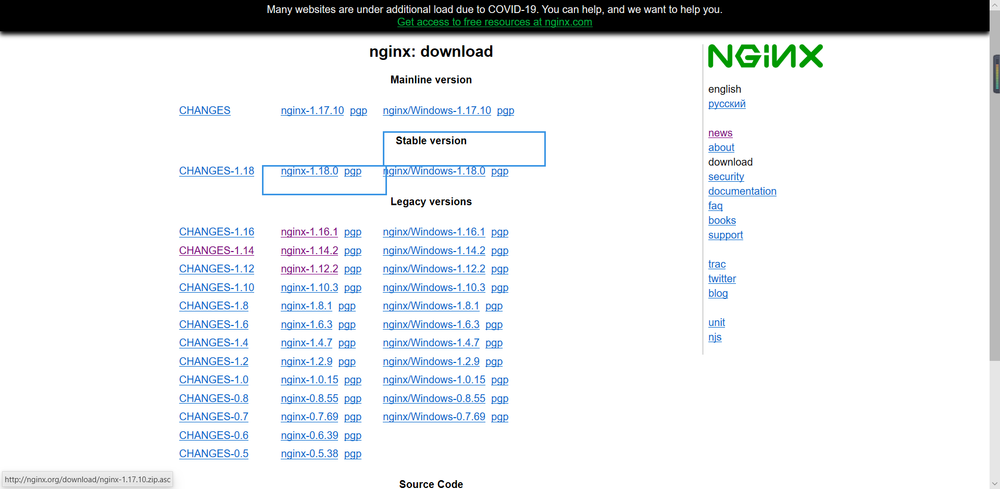
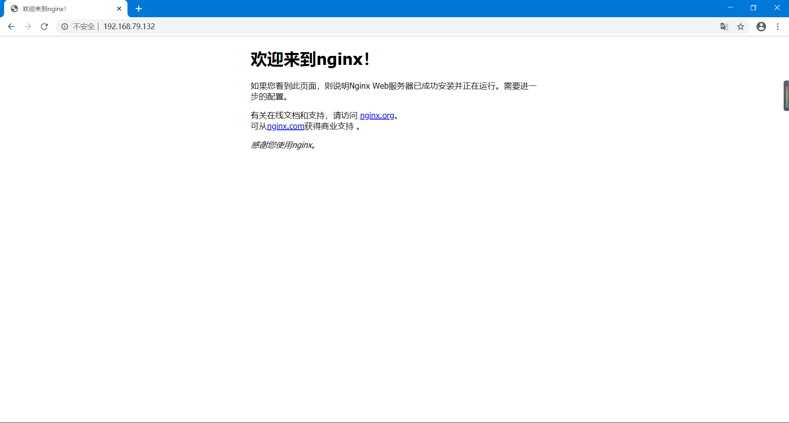
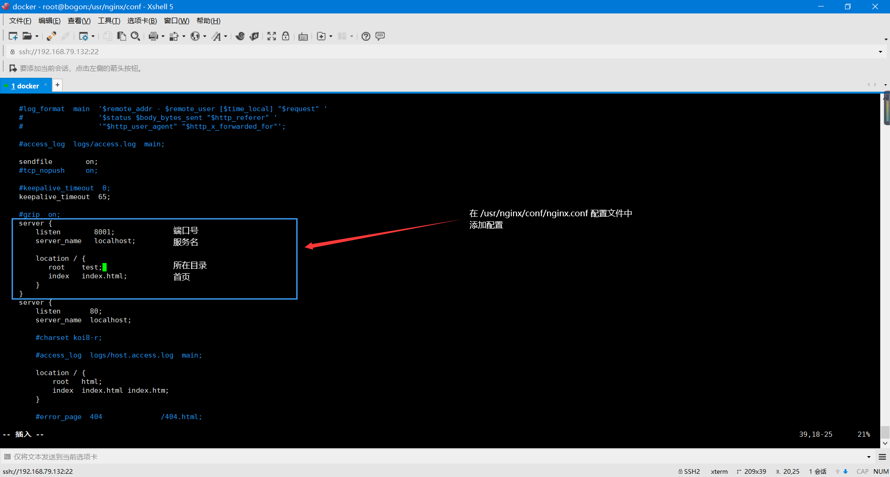
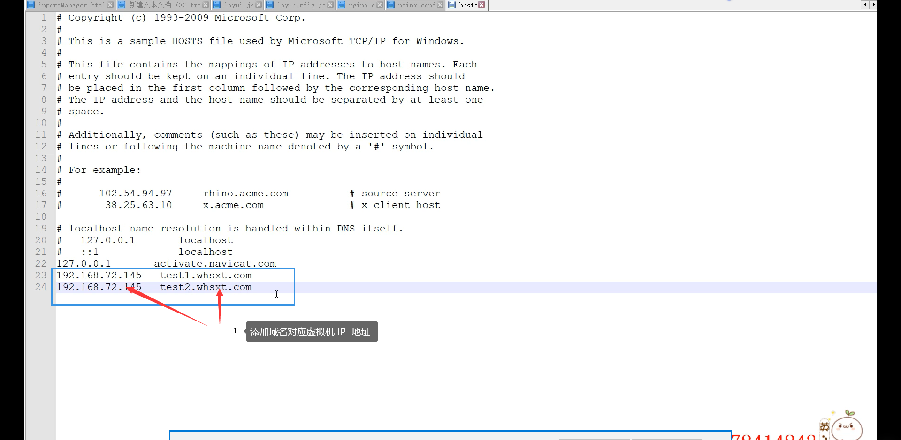
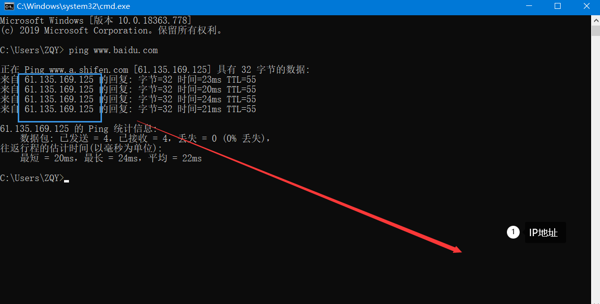

# 1、概述

*Nginx* (engine x) 是一个高性能的[HTTP](https://baike.baidu.com/item/HTTP)和[反向代理](https://baike.baidu.com/item/%E5%8F%8D%E5%90%91%E4%BB%A3%E7%90%86/7793488)web服务器，同时也提供了IMAP/POP3/SMTP[服务](https://baike.baidu.com/item/%E6%9C%8D%E5%8A%A1/100571)。Nginx是由伊戈尔·赛索耶夫为[俄罗斯](https://baike.baidu.com/item/%E4%BF%84%E7%BD%97%E6%96%AF/125568)访问量第二的Rambler.ru站点（俄文：Рамблер）开发的，第一个公开版本0.1.0发布于2004年10月4日。

其将[源代码](https://baike.baidu.com/item/%E6%BA%90%E4%BB%A3%E7%A0%81)以类BSD许可证的形式发布，因它的稳定性、丰富的功能集、示例配置文件和低系统资源的消耗而[闻名](https://baike.baidu.com/item/%E9%97%BB%E5%90%8D/2303308)。2011年6月1日，nginx 1.0.4发布。

Nginx是一款[轻量级](https://baike.baidu.com/item/%E8%BD%BB%E9%87%8F%E7%BA%A7/10002835)的[Web](https://baike.baidu.com/item/Web/150564) 服务器/[反向代理](https://baike.baidu.com/item/%E5%8F%8D%E5%90%91%E4%BB%A3%E7%90%86/7793488)服务器及[电子邮件](https://baike.baidu.com/item/%E7%94%B5%E5%AD%90%E9%82%AE%E4%BB%B6/111106)（IMAP/POP3）代理服务器，在BSD-like 协议下发行。其特点是占有内存少，[并发](https://baike.baidu.com/item/%E5%B9%B6%E5%8F%91/11024806)能力强，事实上nginx的并发能力在同类型的网页服务器中表现较好，中国大陆使用nginx网站用户有：百度、[京东](https://baike.baidu.com/item/%E4%BA%AC%E4%B8%9C/210931)、[新浪](https://baike.baidu.com/item/%E6%96%B0%E6%B5%AA/125692)、[网易](https://baike.baidu.com/item/%E7%BD%91%E6%98%93/185754)、[腾讯](https://baike.baidu.com/item/%E8%85%BE%E8%AE%AF/112204)、[淘宝](https://baike.baidu.com/item/%E6%B7%98%E5%AE%9D/145661)等。


# 2、正向代理和反向代理

### 1. 概念

  正向代理是一个位于客户端和目标服务器之间的代理服务器(中间服务器)。为了从原始服务器取得内容，客户端向代理服务器发送一个请求，并且指定目标服务器，之后代理向目标服务器转交并且将获得的内容返回给客户端。正向代理的情况下客户端必须要进行一些特别的设置才能使用。

  反向代理正好相反。对于客户端来说，反向代理就好像目标服务器。并且客户端不需要进行任何设置。客户端向反向代理发送请求，接着反向代理判断请求走向何处，并将请求转交给客户端，使得这些内容就好似他自己一样，一次客户端并不会感知到反向代理后面的服务，也因此不需要客户端做任何设置，只需要把反向代理服务器当成真正的服务器就好了。

### 2.正向代理

在客户端（浏览器）配置代理服务器，通过代理服务器进行互联网访问。


### 3.反向代理

**`算法： 默认：轮询   `**

**`还有权重 `**

**`ip_hash(根据客户端的ip进行路由)`**：如果客户端请求第一次进来，nginx路由到tomcat1，那么第二次也到tomcat1


反向代理，其实客户端对代理是无感知的，因为客户端不需要任何配置就可以访问，我们只需要将请求发送到反向代理服务器，由反向代理服务器去选择目标服务器获取数据后，再返回给客户端，此时反向代理服务器和目标服务器对外就是一个服务器，暴露的是代理服务器的地址，隐藏了真实服务器的IP地址。




### 4.负载均衡

将请求分发到多个服务器上

### 5.动静分离

为了加快网站的解析速度，可以把动态页面和静态页面由不同的服务器来解析，加快解析速度。降低原来单个服务器的压力。



# 3、nginx在linux的安装

### 1.下载

登录nginx官网 下载`nginx-1.12.1`

官网地址 : http://nginx.org/en/download.html

下载stable稳定版本




### 2.先安装nginx依赖的包

- gcc

  安装nginx需要先将官网下载的源码进行编译，编译依赖gcc环境，如果没有gcc环境，需要安装gcc

  ```bash
  yum  install  gcc-c++
  ```


- PCRE

  PCRE(Perl  Compatible  Regular  Expressions) 是一个Perl库，包括 perl 兼容的正则表达式库。nginx的http模块使用pcre来解析正则表达式。

  ```bash
  yum  install  -y  pcre  pcre-devel
  ```


- zlib

  zlib 库提供了很多压缩和解压缩的方式，nginx使用zlib对http包的内容进行gzip，所以需要在linux上安装zlib库

  ```bash
  yum  install  -y  zlib  zlib-devel
  ```


- openssl

  ​	OpenSSL是一个强大的安全套接字层密码库，囊括主要的密码算法、常用的密钥和证书封装管理功能及SSL协议，并提供丰富的应用程序供测试及其他目的的使用

  ​	nginx不仅支持 http 协议， 还支持 https （即在 ssl 协议上传输 http），所以需要在 linux 安装 openssl 库

  ```bash
  yum  install  -y  openssl  openssl-devel
  ```

  ​

### 3.上传nginx到linux并解压

```bash
[root@bogon Downloads]# tar -zxvf nginx-1.18.0.tar.gz   # 解压
[root@bogon Downloads]# mv nginx-1.18.0 nginx   #  改名
[root@bogon Downloads]# cp -r nginx  /usr/local/src/  # copy 到   /usr/local/src/ 目录下去
```


### 4.安装

进入  /usr/local/src/里边的nginx文件夹

```
cd   /usr/local/src/nginx
```

创建  nginx安装目录

```bash
mkdir   /usr/nginx  # 在 /usr  下创建nginx目录
```

运行 configure

```bash
./configure  --prefix=/usr/nging  # 指定安装目录编译
```

make 编译

```bash
cd  /usr/local/src/nginx
make
```

make  install 编译安装

```bash
cd  /usr/local/src/nginx
make  install
```

查看是否安装成功

```bash
[root@bogon nginx]# ls /usr/nginx/  # 有4个目录 则安装成功
conf  html  logs  sbin     
[root@bogon nginx]# 
```

目录：

conf   配置目录

html   静态文件【cdn加速】

logs   日志文件

sbin   执行文件

### 5.运行nginx

查看防火墙是否关闭

```
[root@bogon nginx]# firewall-cmd  --state
not running
```

sudo systemctl stop firewalld （关闭防火墙）

启动nginx

```bash
cd  /usr/nginx/sbin/  
./nginx   #  启动nginx
ps  -ef|grep  nginx   # 查看nginx 进程
```

访问:  192.168.79.132  (自己虚拟机的IP地址)



### 6.nginx停止

./nginx  -s  stop

### 7.刷新【当用户修改了  conf/nginx.conf】

./nginx  -s  reload  (/usr/nginx/sbin 目录下的nginx命令)


# 4、Nginx基础配置详解

```bash
[root@bogon nginx]# cd conf/  
[root@bogon conf]# pwd  
/usr/nginx/conf
[root@bogon conf]# cp nginx.conf nginx.conf.bak    # 将配置文件备份
[root@bogon conf]# cp -r  html/ test
[root@bogon conf]# vim  nginx.conf
```

### 1.在配置文件中添加一个server结点




### 2.通过域名虚拟机

配置文件增加server结点，并copy test1和test2目录


./nginx -s reload  # 重新加载nginx

`修改windos的hosts文件`

在目录 ： C:\Windows\System32\drivers\etc\hosts



最后访问 ： test1.whsxt.com 即可

**想要知道百度的IP吗？**

cmd : ping www.baidu.com




# 5、Nginx反向代理


```bash
vim  nginx.conf

# 在server结点上加入如下配置
	upstream  www.erp.com{
      		server  192.168.15.131:8080;
      		server  192.168.15.131:8090;
      		server  192.168.15.131:8100;
      		
	}
server {
  		listen 		    80;
  		server_name    www.erp.com; # 配置访问的域名
  		location / {
          		proxy_pass   http://www.erp.com; # 指向上面配置的结点
  		}
}
```

