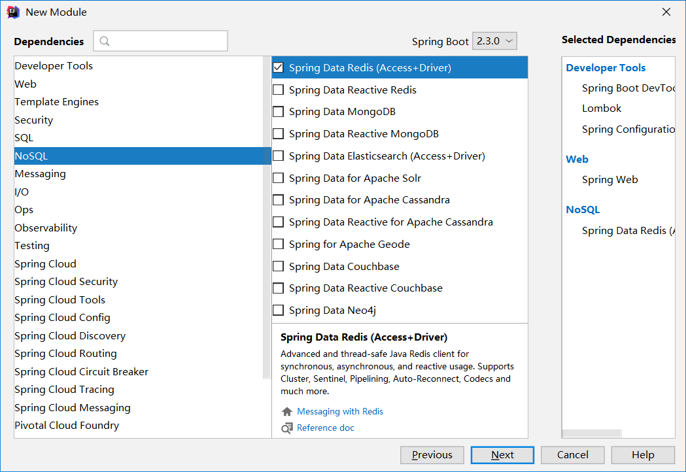
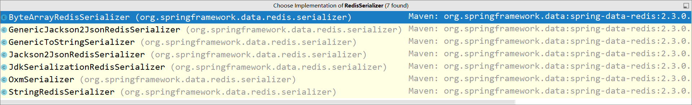

# 1、创建项目




# 2、使用StringRedisTemplate

具体可以查看 ==RedisAutoConfiguration==

使用时需要注入 

```java

@Autowired
private StringRedisTemplate stringRedisTemplate;

```


这里注入的是==StringRedisTemplate==，key和value的类型都必须是String的（可以在源码中进行查看），所以String类型的限制会带来很多不方便


# 3、使用RedisTemplate


编写代码进行测试

### 先查看key和value的序列化方式

是jdk序列化

```java
    @Autowired
    private RedisTemplate redisTemplate;

    @Test
    void testString(){
        System.out.println(this.redisTemplate.getKeySerializer());
        System.out.println(this.redisTemplate.getValueSerializer());
    }

```

### 使用RedisTemplate来存放对象

可以查看==RedisSerializer==源码，查看他的实现类，可以看到有StringRedisSerialize序列化



```java
 @Test
    void test1(){

        ValueOperations opsForValue = redisTemplate.opsForValue();
        /**
         * 一 向redis中存入对象，发现会报错  Cannot serialize
         *    原因是 User对象没有进行序列化
         *    public class User implements Serializable 实现序列化
         * 二 但是此时存入redis中的key又会乱码，这是什么原因呢？
         *       因为key是String类型的，但是redisTemplate的key值默认的序列化方式为jdk序列化方式
         *       所以需要设置key的序列化方式
         *
         */
        // 这是设置key的序列化方式，因为 RedisTemplate<Object,Object>
        // 如果传入Strig，key会被当作Object进行序列化
        redisTemplate.setKeySerializer(new StringRedisSerializer());
        opsForValue.set("user:1",new User(1,"xiaoming","wh"));

    }
```


### GenericJackson2JsonRedisSerializer序列化方式

==一般不使用jdk序列化方式==


```java
    @Test
    void test2(){
        ValueOperations opsForValue = this.redisTemplate.opsForValue();
        // 设置key的序列化方式，否则String会被当做object进行序列化
        redisTemplate.setKeySerializer(new StringRedisSerializer());
        // 设置value的序列化方式，这样，使用redis工具查看存入redis的数据，展现给我们的value值是json形式的
        // 如果不设置的话，value值会被jdk序列化方式进行序列化，看着很头疼，就像下边这样
        /**
         * \xAC\xED\x00\x05sr\x00\x0Bcom.qy.User\xBA\xFBT\xB9k6\x1A\xAA\x02\x00\x03L\x00\x07addresst\
         * x00\x12Ljava/lang/String;L\x00\x02idt\x00\x13Ljava/lang/Integer;L\x00\x04nameq\x00~\x00\
         * x01xpt\x00\x02whsr\x00\x11java.lang.Integer\x12\xE2\xA0\xA4\xF7\x81\x878\x02\x00\x01I\x00\
         * x05valuexr\x00\x10java.lang.Number\x86\xAC\x95\x1D\x0B\x94\xE0\x8B\x02\x00\x00xp\x00\x00\x
         * 00\x01t\x00\x08xiaoming
         */
        redisTemplate.setValueSerializer(new GenericJackson2JsonRedisSerializer());
        opsForValue.set("user:2",new User(2,"zhangsan","bj"));
        
    }

```


# 4、Springboot使用redis注解

相关注解

@EnableCaching ：在启动类上加上注解启动缓存


@Cacheable（key="#id",cacheNames="com.qy.service.impl.MenuServiceImpl"）


@Cacheput   解决脏读(放在更新操作上)


@CachEvict   解决脏读(放在删除操作上)

这些注解放在serviceimpl对应的方法上即可


# 5、设置序列化方式


```java
@Configuration
public class RedisConfiguration {

    @Bean
    public RedisCacheConfiguration redisCacheConfiguration(CacheProperties cacheProperties){
        CacheProperties.Redis redis = cacheProperties.getRedis();
        RedisCacheConfiguration config = RedisCacheConfiguration.defaultCacheConfig();

        config = config.serializeValuesWith(RedisSerializationContext.
                SerializationPair.
                fromSerializer(new GenericJackson2JsonRedisSerializer()));

        if (redis.getTimeToLive() != null)
        {
            config = config.entryTtl(redis.getTimeToLive());
        }
        if (redis.getKeyPrefix() != null)
        {
            config = config.prefixCacheNameWith(redis.getKeyPrefix());
        }
        if (!redis.isCacheNullValues())
        {
            config = config.disableCachingNullValues();
        }
        if (!redis.isUseKeyPrefix())
        {
            config = config.disableKeyPrefix();
        }
        return config;
    }

}
```

