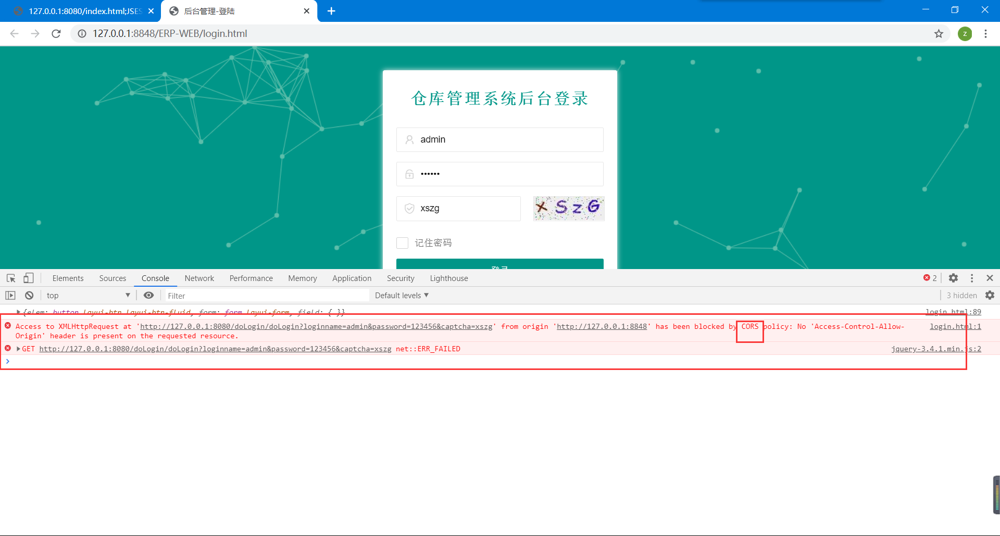

# 1、出现跨域问题



出现CORS则表示出现跨域问题

在 www.leige.tech访问www.laoge.vip就会出现跨域

跨域是后台问题！

# 2、解决跨域问题


### 方法一：

添加跨域配置

```java
package com.qy.system.config;

import org.springframework.boot.web.servlet.FilterRegistrationBean;
import org.springframework.context.annotation.Bean;
import org.springframework.context.annotation.Configuration;
import org.springframework.web.cors.CorsConfiguration;
import org.springframework.web.cors.UrlBasedCorsConfigurationSource;
import org.springframework.web.filter.CorsFilter;
import org.springframework.web.servlet.config.annotation.WebMvcConfigurer;

/**
 * @program: 0812erp  解决跨域的问题
 * @author: 雷哥
 * @create: 2020-01-04 10:29
 **/

@Configuration
public class CorsConfig implements WebMvcConfigurer {
    @Bean
    public FilterRegistrationBean corsFilter() {
        UrlBasedCorsConfigurationSource source = new UrlBasedCorsConfigurationSource();
        CorsConfiguration config = new CorsConfiguration();
        config.setAllowCredentials(true);
        // 设置你要允许的网站域名，*表示任意域名
        // config.addAllowedOrigin("http://127.0.0.1");
        config.addAllowedOrigin("*");

        config.addAllowedHeader("*");//* 表示任意头部信息
        config.addAllowedMethod("GET,POST,PUT,DELETE,HEAD,OPTIONS");
        source.registerCorsConfiguration("/**", config);
        FilterRegistrationBean bean = new FilterRegistrationBean(new CorsFilter(source));
        // 这个顺序很重要，为避免麻烦请设置在最前
        bean.setOrder(0);
        return bean;
    }
}

```


