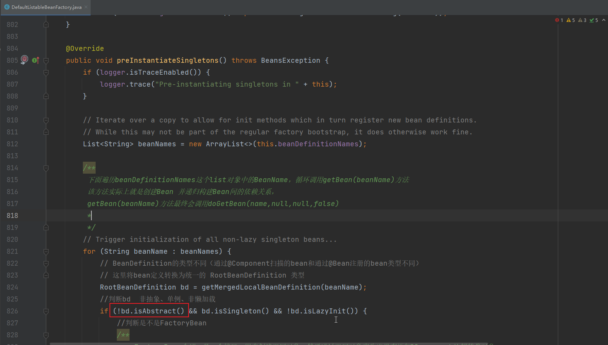

# 1. 抽象的BeanDefinition是什么意思呢？

首先来看一下抽象的 BeanDefinition 在 Spring 源码中出现的位置：

在 `DefaultListableBeanFactory # preInstantiateSingletons` 这个方法中，拿到合并后的 MergeredBeanDefinition，再来判断这个 BeanDefinition 是否是抽象的，如果是抽象的话，就不对这个 BeanDefinition 进行注册，出现位置如下图：




先来演示一下抽象的 BeanDefinition 的用法，如下：


首先在 resources 目录下创建 spring.xml 文件，内容如下：

```xml
<?xml version="1.0" encoding="UTF-8"?>
<beans xmlns="http://www.springframework.org/schema/beans"
	   xmlns:xsi="http://www.w3.org/2001/XMLSchema-instance"
	   xsi:schemaLocation="http://www.springframework.org/schema/beans http://www.springframework.org/schema/beans/spring-beans.xsd">


	<bean id="father" class="com.analysis.AbstractBeanDefinition.Father" abstract="true"></bean>

	<bean id="son" class="com.analysis.AbstractBeanDefinition.Son"></bean>

</beans>
```


再创建 Father 、Son、Main 三个类，如下：

```java
public class Father {
	public int age;
}

public class Son {
	public String name;
}

public class Main {
	public static void main(String[] args) {
		ClassPathXmlApplicationContext context = new ClassPathXmlApplicationContext("spring.xml");
	}
}
```


目录结构如下：


就可以在 `DefaultListableBeanFactory # preInstantiateSingletons` 中打断点，发现 Father 的 BeanDefinition 是抽象的。


抽象的 BeanDefinition 的含义：供其他 BeanDefinition 进行合并的


