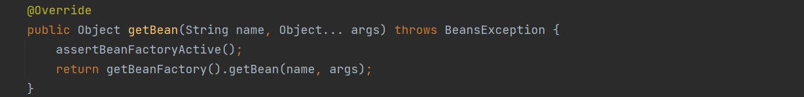

# 1、如何让Spring创建Bean的时候使用我们指定的构造器？


## 方式1：使用getBean指定

如下图，getBean有一个方法，我们可以传入参数，这个参数即为构造方法的入参




代码如下：

```java
// 启动类
public class Deduce {
	public static void main(String[] args) {
		AnnotationConfigApplicationContext context = new AnnotationConfigApplicationContext(MyConfig.class);
		UserService userService = (UserService) context.getBean("userService", new OrderService());
	}
}

// 配置类
@ComponentScan({"com.analysis.constructor"})
@Configuration
public class MyConfig {

}

// 业务类1
@Component
@Lazy
public class UserService {

	private String name;

	@Autowired
	OrderService orderService;

	//public UserService() {
	//	System.out.println(0);
	//}

	public UserService(OrderService orderService) {
		this.orderService = orderService;
		System.out.println(1);
	}
	public UserService(OrderService orderService, OrderService orderService1) {
		this.orderService = orderService;
		this.name = name;
		System.out.println(2);
	}

	public void say() {
		System.out.println("I am UserService");
	}
}

// 业务类2
@Component
public class OrderService {
}
```


我们将 UserService 设置为懒加载（在类上添加 @Lazy 注解）的目的是避免报错。

因为我们在 `Deduce` 启动类中，使用了 `getBean("userService", new OrderService());` 来使用入参为 OrderService 的构造方法创建对象，但是我们创建 UserService 是在 `Deduce` 启动类的第一行，即创建 AnnotationConfigApplicationContext 中就已经创建 UserService 了，而 UserService 中我们将无参构造注释掉（Spring会默认使用无参的构造方法），有两个有参构造，那么这时 Spring 就不知道使用哪个了，就会报错，所以我们让 UserService 为懒加载，在我们调用 getBean 的时候再去创建，就会调用我们指定的构造方法了。


## 方式2：使用@Autowired 指定

这种方式较为简单，直接在构造方法上加 @Autowired 注解即可。

```java
// 启动类
public class Deduce {
	public static void main(String[] args) {
		AnnotationConfigApplicationContext context = new AnnotationConfigApplicationContext(MyConfig.class);
		UserService userService = (UserService) context.getBean("userService");
	}
}

// 配置类
@ComponentScan({"com.analysis.constructor"})
@Configuration
public class MyConfig {

}

// 业务类1
@Component
public class UserService {

	private String name;

	@Autowired
	OrderService orderService;

	//public UserService() {
	//	System.out.println(0);
	//}

    @Autowired
	public UserService(OrderService orderService) {
		this.orderService = orderService;
		System.out.println(1);
	}
	public UserService(OrderService orderService, OrderService orderService1) {
		this.orderService = orderService;
		this.name = name;
		System.out.println(2);
	}

	public void say() {
		System.out.println("I am UserService");
	}
}

// 业务类2
@Component
public class OrderService {
}
```


## 方式3：使用getConstructorArgumentValues()来指定

我们这次不在 UserService 上添加 @Component 注解，我们直接自己创建 BeanDefinition，设置 UserService 为 beanClass 再注册到工厂中，调用 refresh() 进行创建，通过 getConstructorArgumentValues().addGenericArgumentValue() 我们就可以添加构造方法的入参，Spring 会根据入参来寻找构造方法。

```java
// 启动类
public class Deduce {
	public static void main(String[] args) {
		AnnotationConfigApplicationContext context = new AnnotationConfigApplicationContext();
		context.registerBean(MyConfig.class);

		// 我们自己创建 UserService 的 Bean 并指定构造方法的入参
		AbstractBeanDefinition beanDefinition = BeanDefinitionBuilder.genericBeanDefinition().getBeanDefinition();
		beanDefinition.setBeanClass(UserService.class);

		/**
		 * 如果添加两个 OrderService 的参数，就使用 UserService 的第2个构造方法
		 * 如果添加一个 OrderService 的参数，就使用 UserService 的第1个构造方法
		 * 如果添加三个 OrderService 的参数，就会报错，UserService 不知道使用哪个
		 */
		beanDefinition.getConstructorArgumentValues().addGenericArgumentValue(new OrderService());
		beanDefinition.getConstructorArgumentValues().addGenericArgumentValue(new OrderService());

		context.registerBeanDefinition("userService", beanDefinition);
		context.refresh();
	}
}

// 配置类
@ComponentScan({"com.analysis.constructor"})
@Configuration
public class MyConfig {

}

// 业务类1
@Component
public class OrderService {
}

// 业务类2
public class UserService {

	private String name;

	@Autowired
	OrderService orderService;


	public UserService(OrderService orderService) {
		this.orderService = orderService;
		System.out.println(1);
	}

	public UserService(OrderService orderService, OrderService orderService1) {
		this.orderService = orderService;
		this.name = name;
		System.out.println(2);
	}

	public void say() {
		System.out.println("I am UserService");
	}
}

```


# 2、推断构造方法流程

**推断构造方法的位置：doCreateBean方法中的createBeanInstance，也就是实例化阶段，流程如下：**

1. AbstractAutowireCapableBeanFactory类中的createBeanInstance()方法会去创建一个Bean实例

2. 根据BeanDefinition得到Class对象
3. 如果BeanDefinition绑定了一个Supplier，那就调用Supplier的get方法得到一个对象并直接返回
4. 如果BeanDefinition中存在factoryMethodName，那么就调用该工厂方法得到一个bean对象并返回


5. 如果BeanDefinition已经自动构造过了，那就调用`autowireConstructor()`自动构造一个对象
6. **调用SmartInstantiationAwareBeanPostProcessor的determineCandidateConstructors()方法得到哪些构造方法是可以用的**

7. **如果存在可用得构造方法，或者当前BeanDefinition的autowired是AUTOWIRE_CONSTRUCTOR，或者BeanDefinition中指定了构造方法参数值，或者创建Bean的时候指定了构造方法参数值，那么就调用`autowireConstructor()`方法自动构造一个对象**

8. 最后，如果不是上述情况，就根据无参的构造方法实例化一个对象


## 1、首先演示一下如何BeanDefinition绑定Supplier

我们只需要自己创建 UserService 的 BeanDefinition 即可，通过调用 setInstanceSupplier 方法来设置 Supplier，这样就直接通过 Supplier 取出来实例对象了。

```java
public class Deduce {
	public static void main(String[] args) {
		AnnotationConfigApplicationContext context = new AnnotationConfigApplicationContext();
		context.registerBean(MyConfig.class);

		// 我们自己创建 UserService 的 Bean 并指定构造方法的入参
		AbstractBeanDefinition beanDefinition = BeanDefinitionBuilder.genericBeanDefinition().getBeanDefinition();
		beanDefinition.setBeanClass(UserService.class);
		beanDefinition.setInstanceSupplier(new Supplier<Object>() {
			@Override
			public Object get() {
				System.out.println(111);
				return new UserService();
			}
		});
		context.registerBeanDefinition("userService", beanDefinition);
		context.refresh();
		UserService userService = (UserService) context.getBean("userService");
	}
}

```


## 2、解释一下第4步，factoryMethodName

先看一下这一步的源码如何写`（在 createBeanInstance 方法中）`：


我们是通过 BeanDefinition 来判断 FactoryMethodName 是否为空，如果不为空的话，就是用 FactoryMethod 来创建该 bean 的实例化对象，这个 FactoryMethod 是如何来的呢？

假如我们自己写了一个添加了 @Configuration 的配置类 Appconfig，Spring 会把添加了 @Bean 注解的方法解析成 BeanDefinition

> 1. 如果方法是static的，那么解析出来的BeanDefinition中：
>
>    i. `factoryBeanName`为null
>
>    ii. `factoryMethodName`为对应的方法名，比如"aService"
>
>    iii. `factoryClass`为AppConfig.class


> 2. 如果方法不是static的，那么解析出来的BeanDefinition中：
>
>    i. `factoryBeanName`为AppConfig所对应的beanName，比如"appConfig"
>
>    ii. `factoryMethodName`为对应的方法名，比如"aService"
>
>    iii. `factoryClass`也为AppConfig.class


