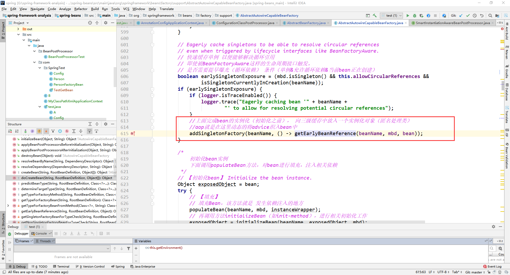
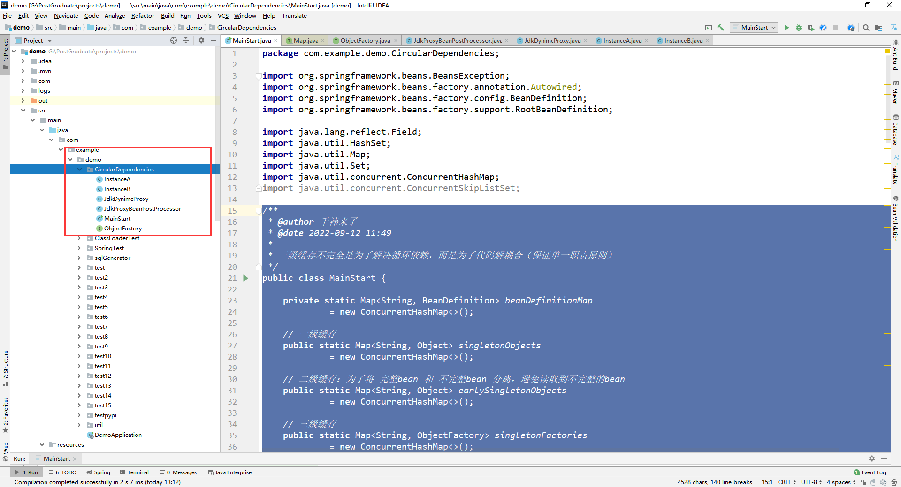
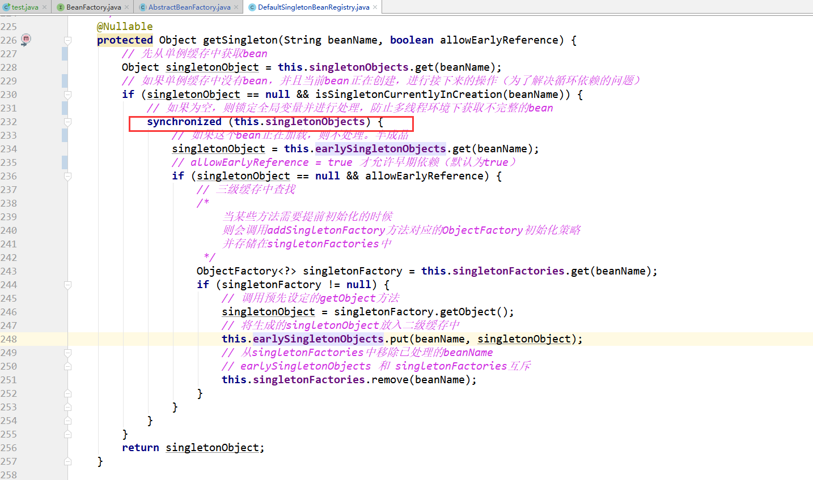
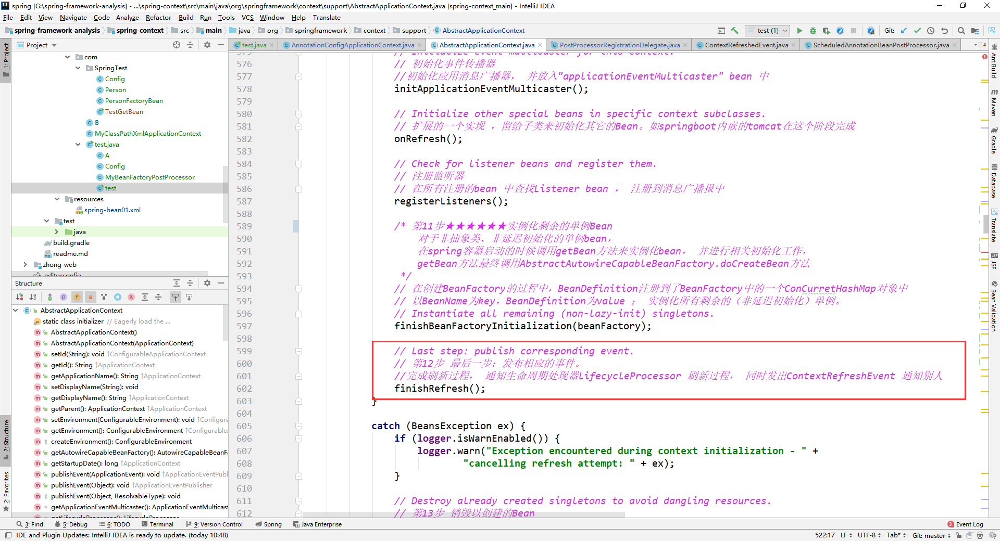
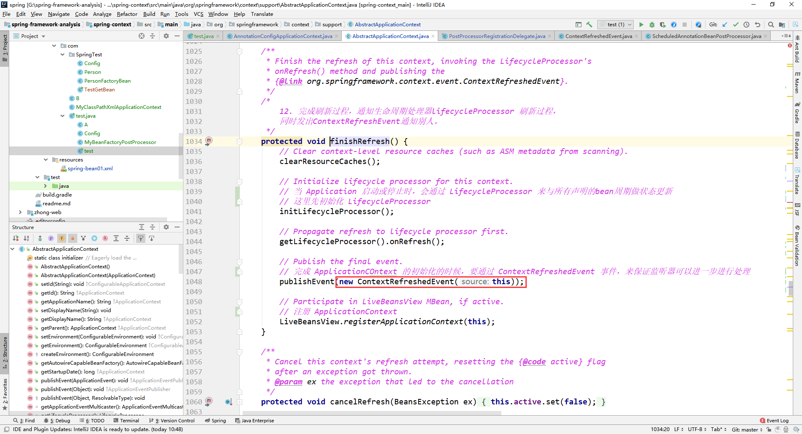
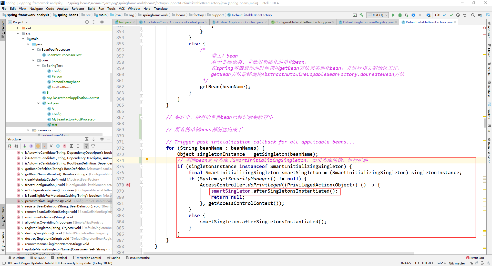

# IOC

IOC：控制反转，目的是解决层层之间、类类之间的耦合。


## 基本概念


### 1、ApplicationContext和BeanFactory的区别

ApplicationContext是BeanFactory的子接口。

BeanFactory的功能简单，采用延迟加载注入bean。

ApplicationContext提供了更为完整的功能，包含了BeanFactory的全部功能。


### 2、BeanFactory和FactoryBean的区别

当使用BeanFactory的时候必须遵守完整的创建过程，这个过程是由Spring管理的

当使用FactoryBean的时候只需要调用getObject就可以返回具体的对象，这个对象的创建过程由用户自己来控制，更加灵活


### 3、BeanFactoryPostProcessor的作用

在 `AbstractApplicationContext` 的 `refresh()` 方法中，通过调用方法 `invokeBeanFactoryPostProcessor` 执行了 BeanFactoryPostProcessor，目的配置类中的 Bean 扫描成 BeanDefinition 并且注册到 `BeanDefinitionMap ` 中去。


### 4、Bean的生命周期

1. 实例化Bean对象。这个时候Bean的对象是非常低级的，连基本的属性都没有设置，可以理解为连Autowired注解都是没有解析的
2. 填充属性。做完这一步，Bean对象基本是完整的了，可以理解为Autowired注解已经解析完毕，依赖注入完成了
3. 如果Bean实现了BeanNameAware接口，则调用setBeanName
4. 如果Bean实现了BeanClassLoaderAware接口，则调用setBeanClassLoade
5. 如果Bean实现了BeanFactoryAware接口，则调用setBeanFactory
6. 调用BeanPostProcessor的postProcessorBeforeInitialization
7. 如果Bean实现了InitializingBean接口，调用afterPropertiesSet方法
8. 如果Bean定义了init-method方法，则进行调用
9. 调用BeanPostProcessor的postProcessorAfterInitialization方法。当进行到这一步，Bean已经被准备就绪了，一直停留在应用的上下文中，直到被销毁
10. 如果应用的上下文被销毁了，如果Bean实现了DisposableBean接口，则调用destory方法，如果Bean定义了destory-method声明了销毁方法也会被带哦用


代码验证：

```java
##############Car#############
@Component
public class Car {
}

##############Config#############
@Configuration
@ComponentScan
public class Config {

    @Bean(initMethod = "initMethod", destroyMethod = "destroyMethod")
    public SpringBean springBean() {
        return new SpringBean();
    }
}

##############MyBeanPostProcessor#############
@Component
public class MyBeanPostProcessor implements BeanPostProcessor {

    @Override
    public Object postProcessBeforeInitialization(Object bean, String beanName) throws BeansException {
        if (beanName.equals("springBean")) {
            System.out.println("postProcessBeforeInitialization");
        }
        return bean;
    }

    @Override
    public Object postProcessAfterInitialization(Object bean, String beanName) throws BeansException {
        if (beanName.equals("springBean")) {
            System.out.println("postProcessAfterInitialization");
        }
        return bean;
    }
}

##############MyBeanPostProcessor#############
// 这里不添加@Component，我们通过工厂手动注入
public class SpringBean implements InitializingBean, DisposableBean, BeanNameAware, BeanFactoryAware,
        BeanClassLoaderAware {

    @Autowired
    Car car;

    public SpringBean() {
        System.out.println("SpringBean的构造方法, car:" + car);
    }

    @Override
    public void setBeanClassLoader(ClassLoader classLoader) {
        System.out.println("SpringBean setBeanClassLoader");
    }

    @Override
    public void setBeanFactory(BeanFactory beanFactory) throws BeansException {
        System.out.println("setBeanFactory");
    }

    @Override
    public void setBeanName(String s) {
        System.out.println("setBeanName");
    }

    @Override
    public void destroy() throws Exception {
        System.out.println("destroy");
    }

    @Override
    public void afterPropertiesSet() throws Exception {
        System.out.println("afterPropertiesSet");
    }

    public void initMethod() {
        System.out.println("initMethod");
    }

    public void destroyMethod() {
        System.out.println("destroyMethod");
    }
}

##############启动类#############
public class Test {
    public static void main(String[] args) {
        AnnotationConfigApplicationContext context = new AnnotationConfigApplicationContext(Config.class);
        context.destroy();
        /**
         * 输出
         * SpringBean的构造方法, car:null
         * setBeanName
         * SpringBean setBeanClassLoader
         * setBeanFactory
         * postProcessBeforeInitialization
         * afterPropertiesSet
         * initMethod
         * postProcessAfterInitialization
         * destroy
         * destroyMethod
         */
    }
}

```


## 三级缓存


### Spring能解决构造函数的循环依赖吗？

不能，构造函数循环依赖的话，此时连 bean 的实例都没有，无法进行解决，直接报错。


### Spring有没有解决多例下的循环依赖？

没有，因为多例是不会想缓存中存放的，循环依赖就是依靠缓存来解决的，所以多例下不解决循环依赖。


### 只有一级缓存可以吗？

想要判断循环依赖，就需要在实例化后将 bean 标记为正在创建，如果只有一级缓存，将实例化后的 bean 放入一级缓存，那么如果此时有另外一个线程来以及缓存中取该 bean 的话，取出来的是刚刚实例化的 bean，是不完整的 bean（还没有进行属性赋值等等..），所以一级缓存不可以


### 二、三级缓存的作用

二级缓存：完整 bean 和不完整 bean 分离

三级缓存：解耦，三级缓存存储的函数式接口如下图（在doCreateBean方法中存入，**注意：如果没有AOP的话，也会使用三级缓存，但是调用三级缓存的函数函数式接口返回的仍然是原来的实例，而不是代理对象**）：



三级缓存的目的不仅仅是为了解决循环依赖，更重要的目的是为了解除方法之间的耦合度（通过这个函数式接口可以在需要生成动态代理对象的时候来三级缓存中取函数式接口进行生成，而不需要每次手写动态代理生成代码，解除方法之间的耦合）。

二级缓存存储 bean 的动态代理对象，三级缓存存储 bean 的生成动态代理对象的函数式接口，也就是这个动态代理对象是通过三级缓存中的函数式接口来生成的。

在对象进行实例化的时候，先去一级缓存中取，如果没有并且这个 bean 正在创建，那么说明出现了循环依赖，那么就去二级缓存中看有没有这个 bean 的动态代理对象，如果没有的话，就去三级缓存中获取函数式接口，来创建这个 bean 的动态代理对象，并且放入二级缓存。


### 三级缓存简陋式代码

目录如下：



```java
############################################################
@Component
@Data
public class InstanceA {

    @Autowired
    private InstanceB instanceB;

    public InstanceA() {
        System.out.println("InstanceA 初始化");
    }
}
############################################################
@Component
public class InstanceB {

    @Autowired
    private InstanceA instanceA;

    public InstanceB() {
        System.out.println("InstanceB 初始化");
    }
}
############################################################
@Data
@NoArgsConstructor
@AllArgsConstructor
public class JdkDynimcProxy {
    Object proxy;
}
############################################################
public class JdkProxyBeanPostProcessor implements SmartInstantiationAwareBeanPostProcessor {

    public Object getEarlyBeanReference(Object bean, String beanName) throws BeansException {

        if (bean instanceof InstanceA) {
            JdkDynimcProxy jdkDynimcProxy = new JdkDynimcProxy(bean);
            return jdkDynimcProxy.getProxy();
        }

        return bean;
    }

}

############################################################
@FunctionalInterface
public interface ObjectFactory<T> {

    /**
     *
     * @return
     * @throws BeansException
     */
    T getObject() throws BeansException;

}

############################################################
/**
 * @author 千祎来了
 * @date 2022-09-12 11:49
 *
 * 三级缓存不完全是为了解决循环依赖，而是为了代码解耦合（保证单一职责原则）
 */
public class MainStart {

    private static Map<String, BeanDefinition> beanDefinitionMap
             = new ConcurrentHashMap<>();

    // 一级缓存
    public static Map<String, Object> singletonObjects
             = new ConcurrentHashMap<>();

    // 二级缓存：为了将 完整bean 和 不完整bean 分离，避免读取到不完整的bean
    public static Map<String, Object> earlySingletonObjects
             = new ConcurrentHashMap<>();

    // 三级缓存
    public static Map<String, ObjectFactory> singletonFactories
             = new ConcurrentHashMap<>();

    // 循环依赖标识
    public static Set<String> singletonsCurrentlyInCreation
             = new HashSet<>();

    /**
     * 读取Bean定义，这里简写
     */
    public static void loadBeanDefinitions() {
        RootBeanDefinition aBeanDefinition = new RootBeanDefinition(InstanceA.class);
        RootBeanDefinition bBeanDefinition = new RootBeanDefinition(InstanceB.class);
        beanDefinitionMap.put("instanceA", aBeanDefinition);
        beanDefinitionMap.put("instanceB", bBeanDefinition);
    }

    /**
     * 获取bean
     */
    public static Object getBean(String beanName) throws IllegalAccessException, InstantiationException {
        Object singleton = getSingleton(beanName);
        if (singleton != null) {
            return singleton;
        }

        // 标识该 bean 正在创建
        if (!singletonsCurrentlyInCreation.contains(beanName)) {
            singletonsCurrentlyInCreation.add(beanName);
        }

        // 实例化
        RootBeanDefinition beanDefinition = (RootBeanDefinition) beanDefinitionMap.get(beanName);
        Class<?> beanClass = beanDefinition.getBeanClass();
        Object instanceBean = beanClass.newInstance();

        /**
         * @★★★：三级缓存的目的
         * 需求：spring还是希望正常的 bean 还是在初始化后再创建动态代理,只有是循环依赖的情况下，才在实例化后创建动态代理
         * 也就是如果出现循环依赖，需要提前创建动态代理，正常bean的话，在初始化后才创建动态代理
         * 如何实现：通过三级缓存，存放 bean 的动态代理生成的 函数式接口，这样在 getSingleton 方法中，如果需要生成动态
         *          代理可以取出三级缓存中的函数式接口进行生成。
         */

        // 放入三级缓存
        singletonFactories.put(beanName, new ObjectFactory() {
            @Override
            public Object getObject() throws BeansException {
                return new JdkProxyBeanPostProcessor().getEarlyBeanReference(earlySingletonObjects.get(beanName), beanName);
            }
        });


        // 属性赋值
        Field[] declaredFields = beanClass.getDeclaredFields();
        for (Field field : declaredFields) {
            Autowired annotation = field.getAnnotation(Autowired.class);
            // 说明属性存在Autowired注解
            if (annotation != null) {
                field.setAccessible(true);
                // 拿到 instanceB 的bean
                Object bean = getBean(field.getName());
                // 把 B 的 bean 设置到 instanceBean中去
                field.set(instanceBean, bean);
            }
        }
        // 初始化：判断bean有没有实现InitializingBean接口和是否有init-method（这里就略了）

        // 如果二级缓存中存在该 bean 的动态代理对象的话，就将 instanceBean(原始对象) 转换为动态代理对象放入一级缓存
        if (earlySingletonObjects.containsKey(beanName)) {
            instanceBean = earlySingletonObjects.get(beanName);
        }

        // 添加到一级缓存
        singletonObjects.put(beanName, instanceBean);

        return instanceBean;
    }

    public static Object getSingleton(String beanName) {
        // 先去一级缓存中拿
        Object bean = singletonObjects.get(beanName);

        // 说明是循环依赖
        if (bean == null && singletonsCurrentlyInCreation.contains(beanName)) {
            // 先从二级缓存中取
            bean = earlySingletonObjects.get(beanName);
            // 如果二级缓存中没有，就去三级缓存中取
            if (bean == null) {
                // 先从三级缓存中创建动态代理
                ObjectFactory factory = singletonFactories.get(beanName);
                if (factory != null) {
                    bean = factory.getObject();
                    /**
                     * 创建动态代理
                     * 将生成的代理对象放在二级缓存中
                     * 这样当再次发生循环依赖的时候，在二级缓存中取出来的对象就已经是
                     * 动态代理对象了，不再需要去重复的创建动态代理对象
                     */
                    earlySingletonObjects.put(beanName, bean);
                }
            }
        }

        return bean;
    }

    public static void main(String[] args) throws InstantiationException, IllegalAccessException {

        // 1、加载 BeanDefinition
        loadBeanDefinitions();

        // 2、循环创建 Bean
        for (String key : beanDefinitionMap.keySet()) {
            // 先创建A
            Object bean = getBean(key);
            System.out.println(bean);
        }

    }

}
```


### Spring如何避免在多线程环境下获取不完整bean？

Spring通过加锁，来防止获取不完整的Bean。




## 监听器


### 怎样可以在Bean创建完成后扩展代码？

**有两种方法：1、事件监听 2、通过`SmartInitializingSingleton`接口**

#### 1、事件监听

在容器的 refresh 方法中，当单例 bean 实例化完成之后，会调用 `finishRefresh` 方法，在该方法中发布了事件 `ContextRefreshedEvent`，可以通过监听这个事件来完成对 bean 的扩展。






监听该事件的代码如下：

```java
@Component
public class ContextRefreshedEventListener {

    @EventListener(ContextRefreshedEvent.class)
    public void onApplicationEvent(ContextRefreshedEvent event) {
        if (event.getApplicationContext().getParent() == null) {
            System.out.println("Spring容器初始化已经完成，已经监听到Spring内置定义的事件");
        }
    }

}

```


#### 2、`SmartInitializingSingleton`接口

让`Bean`实现`SmartInitializingSingleton`接口，就可以在Bean创建完成后进行扩展。




该听7-6 aop 源码