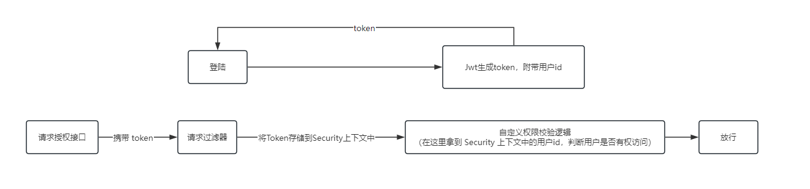

# 1、SpringBoot整合Security授权

项目目录结构如下图所示：


授权流程：




### 引入依赖

```xml
<dependency>
    <groupId>org.springframework.boot</groupId>
    <artifactId>spring-boot-starter-security</artifactId>
    <version>2.7.14</version>
</dependency>

<dependency>
    <groupId>org.springframework.boot</groupId>
    <artifactId>spring-boot-starter-web</artifactId>
    <version>2.7.14</version>
</dependency>

<!-- 工具类相关 -->
<dependency>
    <groupId>com.google.guava</groupId>
    <artifactId>guava</artifactId>
    <version>32.0.1-jre</version>
</dependency>

<!-- https://mvnrepository.com/artifact/io.jsonwebtoken/jjwt -->
<dependency>
    <groupId>io.jsonwebtoken</groupId>
    <artifactId>jjwt</artifactId>
    <version>0.9.1</version>
</dependency>
```


### 配置类


> 自定义过滤器

自定义过滤器，每次请求进来时都会经过该过滤器，在该过滤器中，我们会解析请求中的 token，并且将 token 中所带有的用户信息给存储 Security 的上下文中，为什么要存入 Security 的上下文呢？因为 JWT 是无状态的，只要登陆之后，发送请求都需要携带上 token，而服务端不会存储登陆用户的信息，因此需要我们手动将 token 解析存储到服务端。

```java
@Component
public class JwtAuthenticationTokenFilter extends OncePerRequestFilter {

    public static void main(String[] args) {
        String issuer = "zqy";
        long ttlMillis = 7 * 24 * 60 * 60 * 1000L;
        Map<String, Object> claims = new HashMap<>();
        claims.put("key", "value");

        // 编码
        String token = JwtUtil.encode(issuer, ttlMillis, claims);
        System.out.println(token);

        // 解码
        Claims parser = JwtUtil.decode(token);
        // 获取签发人
        System.out.println(parser.getSubject());
        // 获取额外信息
        System.out.println(parser.get("key"));
    }

    @Override
    protected void doFilterInternal(HttpServletRequest request, HttpServletResponse response, FilterChain filterChain) throws ServletException, IOException {
        //获取token
        String token = request.getHeader("token");
        // 对 token 进行解析，可以获得 token 中的签发人信息以及额外信息
        Claims parser = JwtUtil.decode(token);
        // 获取签发人
        String subject = parser.getSubject();
        // 将签发人放入 Security 的上下文环境中
        UsernamePasswordAuthenticationToken authenticationToken =
                new UsernamePasswordAuthenticationToken(subject,null,null);
        SecurityContextHolder.getContext().setAuthentication(authenticationToken);
        //放行
        filterChain.doFilter(request, response);
    }
}
```


**在 SpringSecurity 6.0 之后，配置类的使用发生了变化，新的版本不需要再继承 `WebSecurityConfigurerAdapter` ，只需要添加注解`@EnableWebSecurity` 即可，因此根据自己 SpringSecurity 的版本来选择下边两种配置类中的一个**

> SpringSecurity5.7 版本的配置类

```java
@Configuration
@EnableGlobalMethodSecurity(prePostEnabled = true)
public class SecurityAutoConfig extends WebSecurityConfigurerAdapter {

    @Bean
    public PasswordEncoder passwordEncoder(){
        return new BCryptPasswordEncoder();
    }

    // 这个自定义的过滤器
    @Autowired
    JwtAuthenticationTokenFilter jwtAuthenticationTokenFilter;

    @Override
    protected void configure(HttpSecurity http) throws Exception {
        http
                //关闭csrf
                .csrf().disable()
                //不通过Session获取SecurityContext
                .sessionManagement().sessionCreationPolicy(SessionCreationPolicy.STATELESS)
                .and()
                .authorizeRequests()
                // 对于登录接口 允许匿名访问
                .antMatchers("/user/login").anonymous()
                // 除上面外的所有请求全部需要鉴权认证
                .anyRequest().authenticated();

        //把token校验过滤器添加到过滤器链中
        http.addFilterBefore(jwtAuthenticationTokenFilter, UsernamePasswordAuthenticationFilter.class);
    }

    @Bean
    @Override
    public AuthenticationManager authenticationManagerBean() throws Exception {
        return super.authenticationManagerBean();
    }

}
```

> SpringSecurity6.0 版本的配置类

```java
@Configuration
@EnableWebSecurity
@EnableGlobalMethodSecurity(prePostEnabled = true)
public class SecurityAutoConfig {

    @Bean
    public PasswordEncoder passwordEncoder(){
        return new BCryptPasswordEncoder();
    }

    // 这个自定义的过滤器
    @Autowired
    JwtAuthenticationTokenFilter jwtAuthenticationTokenFilter;

    @Bean
    public SecurityFilterChain configure(HttpSecurity http) throws Exception {
        http
                .csrf()
                .disable()
                .sessionManagement().sessionCreationPolicy(SessionCreationPolicy.STATELESS)
                .and()
                .authorizeHttpRequests()
                .anyRequest()
                .authenticated()
                ;
        http.addFilterBefore(jwtAuthenticationTokenFilter, UsernamePasswordAuthenticationFilter.class); //把token校验过滤器添加到过滤器链中)
        return http.build();
    }

    @Bean
    public AuthenticationManager authenticationManager(AuthenticationConfiguration config) throws Exception {
        return config.getAuthenticationManager();
    }
}
```


> 自定义权限校验

我们在这里可以自己定义权限校验的逻辑，可以在 `Security` 的上下文中拿到我们在过滤器中存储的用户信息，在这里我写的比较简单，可以通过用户信息去数据库中拿到用户的权限再来判断。

```java
@Component("ss") // SpringSecurity 缩写
public class MyExpressionRoot {
    public boolean hasAuthority(String authority){
        //获取当前用户的权限
        Authentication authentication = SecurityContextHolder.getContext().getAuthentication();
        String principal = (String) authentication.getPrincipal();
        //判断用户权限集合中是否存在authority
        return principal.equals(authority);
    }
}
```


### JWT 工具类

```java
package com.example.springbootsecuritystarter.utils;

import io.jsonwebtoken.Claims;
import io.jsonwebtoken.JwtBuilder;
import io.jsonwebtoken.Jwts;
import io.jsonwebtoken.SignatureAlgorithm;

import java.util.Date;
import java.util.HashMap;
import java.util.Map;

public class JwtUtil {

    private static final String signingKey = "B*B^5Fe";

    /**
     * 生成 JWT Token 字符串
     *
     * @param issuer    签发人
     * @param ttlMillis 有效期
     * @param claims    额外信息
     * @return Token
     */
    public static String encode(String issuer, long ttlMillis, Map<String, Object> claims) {
        if (null == claims) {
            claims = new HashMap<>();
        }

        // 签发时间（iat）：荷载部分的标准字段之一
        long nowMillis = System.currentTimeMillis();
        Date now = new Date(nowMillis);

        // 签发操作
        JwtBuilder builder = Jwts.builder()
                // 荷载部分
                .setClaims(claims)
                // 签发时间
                .setIssuedAt(now)
                // 签发人；类似 userId、userName
                .setSubject(issuer)
                // 设置生成签名的算法和秘钥
                .signWith(SignatureAlgorithm.HS256, signingKey);

        if (ttlMillis >= 0) {
            long expMillis = nowMillis + ttlMillis;
            Date exp = new Date(expMillis);
            // 过期时间（exp）：荷载部分的标准字段之一，代表这个 JWT 的有效期。
            builder.setExpiration(exp);
        }

        return builder.compact();
    }

    public static Claims decode(String token) {
        return Jwts.parser()
                // 设置签名的秘钥
                .setSigningKey(signingKey)
                // 设置需要解析的 jwt
                .parseClaimsJws(token)
                .getBody();
    }

}
```


### Controller

请求处理类 Controller

```java
@RestController
public class HelloController {

    @GetMapping("/hello")
    @PreAuthorize("@ss.hasAuthority('zqy')")
    public String hello(){
        return "hello";
    }
}
```


# 2、常见问题


> 整合 SpringSecurity 只进行授权，不进行登陆认证，未登录时，捕获不到未授权异常；登陆之后可以捕获到未授权异常

先看一下 SpringSecurity 中对异常捕获的配置：

- 配置类

在这里通过 exceptionHandling 进行自定义异常捕获类为 securityAccessDeniedHandler

```java
@Configuration
@EnableWebSecurity
@EnableGlobalMethodSecurity(prePostEnabled = true)
public class SecurityAutoConfig {

    @Bean
    public PasswordEncoder passwordEncoder(){
        return new BCryptPasswordEncoder();
    }

    // 这个自定义的过滤器
    @Autowired
    JwtAuthenticationTokenFilter jwtAuthenticationTokenFilter;

    @Autowired
    SecurityAccessDeniedHandler securityAccessDeniedHandler;

    @Bean
    public SecurityFilterChain configure(HttpSecurity http) throws Exception {
        http
                .csrf()
                .disable()
                .sessionManagement().sessionCreationPolicy(SessionCreationPolicy.STATELESS)
                .and()
                .authorizeHttpRequests()
                .anyRequest().permitAll()
                .and().exceptionHandling(exception -> {
                    exception.accessDeniedHandler(securityAccessDeniedHandler);
                })
                ;
        http.addFilterBefore(jwtAuthenticationTokenFilter, UsernamePasswordAuthenticationFilter.class); //把token校验过滤器添加到过滤器链中)
        return http.build();
    }

    @Bean
    public AuthenticationManager authenticationManager(AuthenticationConfiguration config) throws Exception {
        return config.getAuthenticationManager();
    }
}
```

- 自定义异常捕获类

当出现 AccessDeniedHandler 异常时，我们在这里自定义返回码以及返回信息。

```java
@Component
public class SecurityAccessDeniedHandler implements AccessDeniedHandler {
    @Override
    public void handle(HttpServletRequest request, HttpServletResponse response, AccessDeniedException accessDeniedException) throws IOException, ServletException {
        ResultBody resultVO = new ResultBody(ResultStatus.AUTHORIZE_FAIL, "无权访问！", null);
        doResponse(response, resultVO);
    }

    /**
     * 没带token或者检验失败响应给前端
     *
     * @param response
     * @param resultVO
     * @throws IOException
     */
    private void doResponse(HttpServletResponse response, ResultBody resultVO) throws IOException {
        response.setContentType("application/json");
        response.setCharacterEncoding("utf-8");
        PrintWriter out = response.getWriter();
        String s = new ObjectMapper().writeValueAsString(resultVO);
        out.print(s);
        out.flush();
        out.close();
    }
}
```


那么判断登陆之后对 SpringSecurity 做了哪些修改就知道是哪里的问题了。

根据代码，我们发现在登陆之后，会返回前端一个 token，而后端的请求过滤器如果发现前端发送请求携带 token，就会解析 token，将 token

放到 Security 的上下文环境中，如下：

```java
@Component
public class JwtAuthenticationTokenFilter extends OncePerRequestFilter {


    @Override
    protected void doFilterInternal(HttpServletRequest request, HttpServletResponse response, FilterChain filterChain) throws ServletException, IOException {
        //获取token
        String token = request.getHeader("token");
        if (!StringUtils.isBlank(token)) {
            // 解析 token
			Long userId = 解析...;       
            UsernamePasswordAuthenticationToken authenticationToken =
                    new UsernamePasswordAuthenticationToken(userId,null,null);
            SecurityContextHolder.getContext().setAuthentication(authenticationToken);
        }
        //放行
        filterChain.doFilter(request, response);
    }
}

```

那么，如果用户没登陆的话，则 token 为空，则不会将 token 放入 Security 上下文，问题就出现在这里，因此我们判断当 token 为空的时候，也创建一个 token 放入即可，如下：

```java
@Component
public class JwtAuthenticationTokenFilter extends OncePerRequestFilter {

    @Override
    protected void doFilterInternal(HttpServletRequest request, HttpServletResponse response, FilterChain filterChain) throws ServletException, IOException {
        //获取token
        String token = request.getHeader("token");
        if (!StringUtils.isBlank(token)) {
            // 解析 token
			Long userId = 解析...;       
            UsernamePasswordAuthenticationToken authenticationToken =
                    new UsernamePasswordAuthenticationToken(userId,null,null);
            SecurityContextHolder.getContext().setAuthentication(authenticationToken);
        } else {
          UsernamePasswordAuthenticationToken authenticationToken =
                    new UsernamePasswordAuthenticationToken("",null,null);
            SecurityContextHolder.getContext().setAuthentication(authenticationToken);
        }
        //放行
        filterChain.doFilter(request, response);
    }
}
```

