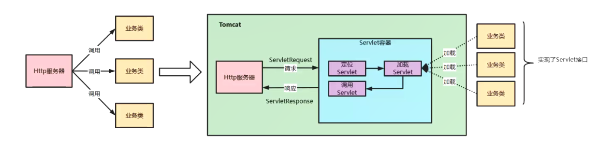

# 1.Tomcat整体架构

Tomcat：是一个http服务器+servlet容器

Tomcat要实现的2个核心功能：

- 处理 Socket 连接，负责网络字节流与 Request 和 Response 对象的转化
- 加载和管理 Servlet，以及具体处理 Request 请求

因此 Tomcat 设计了两个核心组件：Connector和Container来分别做这两件事情

# 2.Tomcat核心组件

## Server 组件

Server 组件就是 Tomcat 服务器，包含多个 Service 

`每个 Service 组件都包含了若干用于接收客户端消息的 Connector 组件和处理请求的 Engine 组件`

Service 组件还包含了若干 Executor 组件，每个 Executor 都是一个线程池，它可以为 Service 内的所有组件提供线程池执行任务。

Tomcat 支持多种 IO 模型和应用层协议。

`Tomcat 内部实现了 Reactor 线程模型，用于实现 NIO ，性能较高`

## Connector 组件

Connector 对 Servlet 容器屏蔽了不同的应用层协议以及IO模型，无论是 HTTP 还是 AJP，在容器中获取到的都是一个标准的 ServletRequest 对象。

Connector 需要实现 3 个高内聚的功能：

- 网络通信
- 应用层协议解析
- Tomcat Request/Response 与 ServletRequest/ServletResponse 的转化

Tomcat 设计了3个组件来实现这3个功能，分别为：`EndPoint、Processor和Adapter`

- EndPoint 负责提供字节流给 Processor
- Processor 负责提供 Tomcat Request 对象给 Adapter
- Adapter 负责提供 ServletRequest 对象给容器

> 组件之间通过抽象接口交互，这样做的好处是可以封装变化，将系统中经常变化的部分和稳定的部分隔离，可以增加复用性，降低耦合度

由于IO模型和应用层协议可以自由组合，比如 NIO+HTTP 或 NIO2+AJP。Tomcat将网络通信和应用层协议解析放在一起考虑，设计了 `ProtocolHandler` 的接口来封装这两种的变化。

各个协议和通信模型对应具体的实现类，如 Http11NioProtocol 和 AjpNioProtocol。

除了这些变化点，系统也存在一些相对稳定的部分，`因此 Tomcat 设计了一系列抽象基类来封装稳定的部分`，如抽象基类 AbstractProtocol 实现了 ProtocolHandler 接口，再通过具体实现类 AbstractAjpProtocol 和 AbstractHttp11Protocol 来扩展抽象基类。

## ProtocolHandler 组件

Connecor 使用 ProtocolHandler 来处理网络连接和应用层协议，包含了两个重要组件：EndPoint 和 Processor

> EndPoint：EndPoint是通信端点，即通信监听的端口，`是对传输层的抽象`，因此`EndPoint是用来实现TCP/IP协议的`

> Processor：Processor用来实现HTTP/AJP协议，用来接收来自EndPoint的Socket，读取字节流解析成 Tomcat 的 Request 和 Response 对象，`Processor 是对应用层的抽象`

### Engine

对于 Engine 来说是一层嵌套一层的，Tomcat是如何来管理这些容器呢？

`Tomcat 采用组合模式来管理。`

即所有组件都实现了 Container 接口，因此组合模式可以使得用户对但容器对象和组合容器对象的使用具有一致性。

