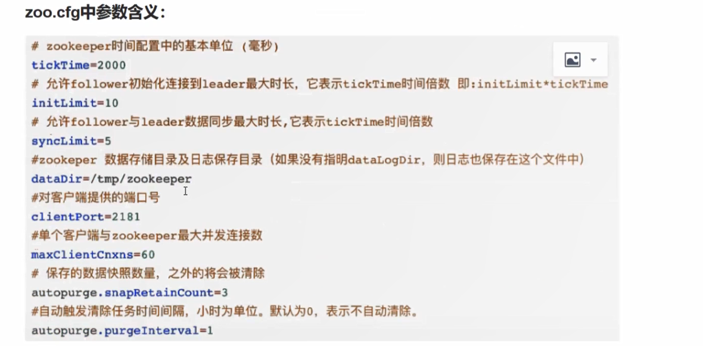
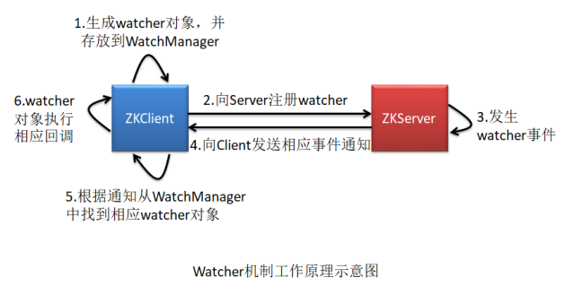
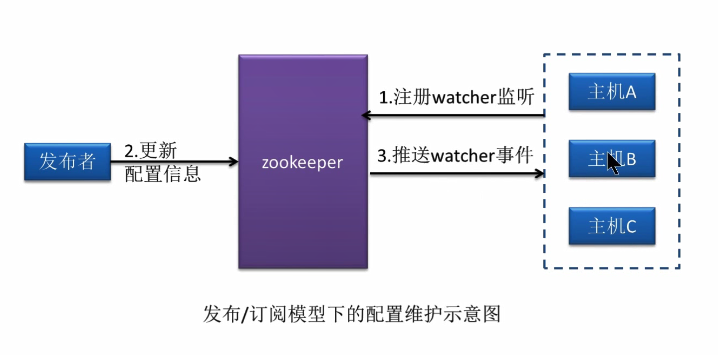
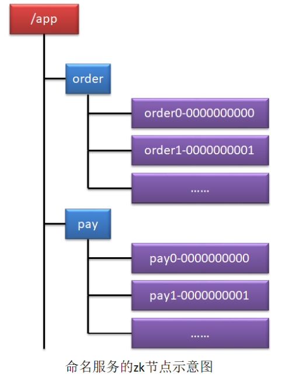

# 1、Zk特性与节点数据类型


## CAP理论

CAP理论指出对一个分布式计算系统来说，不可能同时满足三点：

- 一致性（Consistency）：数据在多个副本中保持一致，在数据更新后，系统的数据也应该处于一致性状态
- 可用性（Availability）：每次请求都能获取正确响应，但不能保证获取的数据为最新数据
- 分区容错性（Partition tolerance）：分布式系统在遇到任何网络分区故障时，仍需要对外提供一致性和可用性的服务，除非整个网络故障

`一个分布式系统最多只能满足这三项的两项`

**Zookeeper保证的时CP，即一致性和分区容错性，spring cloud的注册中心eureka实现的是AP**


`思考：zookeeper是强一致性吗？`

Zookeeper写入是强一致性的，读取是顺序一致性的


## BASE理论

BASE是Basically Available（基本可用）、Soft-state（软状态）、Eventually Consistent（最终一致性）的缩写

- `基本可用`: 在分布式系统出现故障，允许损失部分可用性 (服务降级、页面降级)。

- `软状态`:允许分布式系统出现中间状态。而且中间状态不影响系统的可用性。这里的中间状态是指不同的 data replication (数据备份节点)之间的数据新可以出现延时的最终一致性

- `最终一致性`: data replications 经过一段时达到一致性。

BASE 理论是对 CAP 中的一致性和可用性进行一个权衡的结果，理论的核心思想就是: 我们无法做到强一致，但每个应用都可以根据自身的业务特点，采用适当的方式来使系统达到最终一致性。

## Zookeeper介绍

ZooKeeper 是一个开源的分布式协调框架，是Apache Hadoop 的一个子项目，主要用来解决分布式集群中应用系统的一致性问题。

Zookeeper为分布式系统提供`一致性服务`。其一致性服务是通过基于Paxos算法的ZAB协议完成的。

其主要功能包括：配置维护、域名服务、分布式同步、集群管理等。

> 暂时可以理解为 Zookeeper 是一个用于存储少量数据的基于内存
> 的数据库，主要有如下两个核心的概念：文件系统数据结构+监听通知机制。


## Zookeeper使用

### 1、下载

https://www.apache.org/dyn/closer.lua/zookeeper/zookeeper-3.8.0/apache-zookeeper-3.8.0-bin.tar.gz

### 2、解压

```bash
[root@iZbp18v0qr5lwwe90x94pyZ /]# tar -zxvf apache-zookeeper-3.8.0-bin.tar.gz  # 解压
[root@iZbp18v0qr5lwwe90x94pyZ /]# cd apache-zookeeper-3.8.0-bin
[root@iZbp18v0qr5lwwe90x94pyZ apache-zookeeper-3.8.0-bin]# cd conf/
[root@iZbp18v0qr5lwwe90x94pyZ conf]# cp zoo_sample.cfg zoo.cfg
[root@iZbp18v0qr5lwwe90x94pyZ conf]# vi zoo.cfg 

# 修改dataDir为：dataDir=/zookeeperdata/zookeeper
# 修改zoo.cfg文件，修改dataDir，不要放在tmp目录下，linux有可能清空tmp目录
```





### 3、启动

```bash
[root@iZbp18v0qr5lwwe90x94pyZ apache-zookeeper-3.8.0-bin]# bin/zkServer.sh start conf/zoo.cfg  # 指定修改后的配置文件
[root@iZbp18v0qr5lwwe90x94pyZ apache-zookeeper-3.8.0-bin]# bin/zkServer.sh status # 查看状态
ZooKeeper JMX enabled by default
Using config: /apache-zookeeper-3.8.0-bin/bin/../conf/zoo.cfg
Client port found: 2181. Client address: localhost. Client SSL: false.
Mode: standalone
[root@iZbp18v0qr5lwwe90x94pyZ apache-zookeeper-3.8.0-bin]# bin/zkCli.sh # 启动zookeeper客户端连接
# 也可以连接远程的zookeeper，命令为： bin/zkCli.sh -server ip:port
```


## 节点类型

每个 znode 根据节点类型的不同，具有不同的生命周期。

- **持久节点**：节点被创建后会一直保存在 zk 中，直到将其删除。
- **持久顺序节点**：一个父节点可以为它的第一级子节点维护一份顺序，用于记录每个子节点创建的先后顺序。其在创建子节点时，会在子节点名称后添加数字序号，作为该子节点的完整节点名。序号由 10 位数字组成，从 0 开始计数。
-  **临时节点**：临时节点的生命周期与客户端的会话绑定在一起，会话消失则该节点就会被自动清理。**临时节点只能作为叶子节点**，不能创建子节点。
- **临时顺序节点**：添加了创建序号的临时节点。


## 节点状态

- cZxid：Created Zxid，表示当前 znode 被创建时的事务 ID
- ctime：Created Time，表示当前 znode 被创建的时间
- mZxid：Modified Zxid，表示当前 znode 最后一次被修改时的事务 ID
- mtime：Modified Time，表示当前 znode 最后一次被修改时的时间
- pZxid：表示当前 znode 的子节点列表最后一次被修改时的事务 ID。注意，只能是其子节点列表变更了才会引起 pZxid 的变更，子节点内容的修改不会影响 pZxid。
- cversion：Children Version，表示子节点的版本号。该版本号用于充当乐观锁。
- dataVersion：表示当前 znode 数据的版本号。该版本号用于充当乐观锁。


- aclVersion：表示当前 znode 的权限 ACL 的版本号。该版本号用于充当乐观锁。


- ephemeralOwner：若当前 znode 是持久节点，则其值为 0；若为临时节点，则其值为创

建该节点的会话的 SessionID。当会话消失后，会根据 SessionID 来查找与该会话相关的
临时节点进行删除。

- dataLength：当前 znode 中存放的数据的长度。


- numChildren：当前 znode 所包含的子节点的个数。


## Watcher机制


### watcher工作原理




### watcher特性

- `一次性`：一旦一个watcher被触发，zk会将其从客户端的 WatchManager 中删除，也会从服务端删除。
- 串行性：同一 node 的相同事件类型引发的 watcher 回调方法串行执行（也就是只有执行完watcher的回调，才可以重新生成watcher对象进行监听，如果回调执行事件太长，可能会导致监听事件的丢失，因此zk也不适合在watcher回调中执行耗时的IO操作）
- 轻量级：客户端向服务端注册 watcher，没发送整个 watcher 实例，只发送了必要数据。

也存在持久的watcher，但是如果持久的watcher监听事件，事件变化很频繁，那么服务端会不停向client发送时间通知，服务端压力很大且占用大量网络带宽

因此zk的watcher机制不适合监听变化非常频繁的场景


# 2、Zookeeper典型应用场景

## 2.1 配置维护

分布式系统中，很多服务都是集群部署，集群中的Web服务的配置文件都是相同的，配置维护就是用来维护集群中Web服务的配置文件的一致。

原理图：




## 2.2 命名服务

给一个范围内的元素一个唯一标识。

可以理解为域名解析，百度的域名肯定对应了多个ip，那么命名服务就是对这么多个ip命名为百度的域名。




## 2.3 集群管理


## 2.4 DNS服务


## 2.5 Master选举


## 2.6 分布式同步


## 2.7 分布式锁


## 2.8 分布式队列

