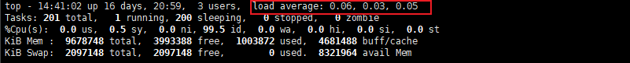

参考文章：

https://wx.zsxq.com/dweb2/index/topic_detail/588151458582424


参考课程：

1. 极客时间java高级体系课程中的刘亚雄老师讲解的第1节教程:项目性能优化与压测
2. 学习极客时间最新的0元免费课:程序员的18种的开发解决方案


压测结果优化建议:
1.调整tomcat的线程池，redis连接池类型与数量，tomcat默认200太小，jedis默认8，看你的服务器挺大的可以往上调整，性能和结果会生一大截。
2.压测并发度至少达到200-500的并发。
当前并发梯度教小，所以有些性能指标变化不明显
3.尝试替换tomcat为undertow，据说有性能提升
4.并发度提升到几百以上时候，会出现性能问题，把skyworking部署上，看看优化下。这些都是你接下来面试的竞争力，你现在这样压测的能力已经可以秒杀绝大多数的求职者


# 0、JMeter 实战


# 1、压测


## 1.1、主机环境


服务器环境搭建：1台压力机，1台应用服务主机，1台数据库与缓存服务器，1CICD服务器（这里的服务器使用阿里云的按量付费，如何购买查看[服务器购买指南](#A-服务器购买)）

- hero01：CICD服务器4C8G：Nginx、JMeter、CICD

  内网ip：172.17.187.81（I/O优化）25Mbps峰值

- hero02：数据库与缓存服务器4C8G：MySQL、Redis、MQ、ES

  内网ip：172.17.187.78（I/O优化）25Mbps峰值

- hero03：应用服务器01-4C8G：Application

  内网ip：172.17.187.79（I/O优化）25Mbps峰值

- hero04：监控服务器02-4C8G：Grafana、Prometheus、InfluxDB

  内网ip：172.17.187.80（I/O优化）25Mbps峰值

这里的 25Mbps = 3.125 MB/s

## 1.2、压力测试的指标

QPS用来表示吞吐量的话，有点不全面，QPS 即每秒的查询次数，而 TPS 是每秒的事务次数，而一次事务可能包含了多个增删改查，因此使用 TPS 来代表吞吐量比 QPS 范围更广一些


响应时间、吞吐量、资源利用率 3 个指标是相互关联的


## 1.3、压力测试工具 JMeter

这里使用 **Apache JMeter**


## 1.4、压测目标

1. 负载上升各项指标是否正常
2. 发现性能短板
3. 高并发下系统是否稳定
4. 预估系统最大负载能力


## 1.5、案例


**问题：SpringBoot 服务的 TPS 的理论上线是多少？**

答：经过 JMeter 测试，吞吐量在700左右。

接口性能与 RT 和服务端线程数相关，RT 越短，接口性能肯定越好；服务端线程数量越多，接口性能越好。


工具


## A-服务器购买

使用按量付费


选择私有 ip 时，可以查看自己服务器 ip，让云服务器和自己服务器在一个网段内，传输文件速度较快


Prometheus + node_exporter 可以将更多服务器详细信息导入到 Prometheus  中，再通过 Grafana 展示出来


# 2、资源监控

## 2.1、服务器硬件资源监控


### 配置服务端代理（ServerAgent）

注意：服务器硬件资源的监控，必须在服务端安装serverAgent代理服务，JMeter才能实现监控服务端的cpu、内存、io的使用情况。

ServerAgent下载地址：https://github.com/undera/perfmon-agent/blob/master/README.md


```bash
## 默认启动运行 startAgent.sh 脚本即可
## 服务启动默认4444端口，根本连接不上，因此自己创建一个部署脚本文件对此进行部署，且把端口修改为7879
vim startAgent.sh
nohup java -jar ./CMDRunner.jar --tool PerfMonAgent --udp-port 7879 --tcp-port 7879 > log.log 2>&1 &
## 赋予可执行权限
chmod 755 startAgent.sh
```


## 2.2、监控服务器整体负载

如何判断系统负载高不高?

cpu 占用率高，系统负载就高吗？ 

不是，如果写一个死循环(while true)，这样程序不耗时，cpu 会飙高，但是 load average 不会走高，因此在核查服务器负载需要重点关注 **load average**

判断系统负载使用 `top` 命令，查看 load average 



```
load average: 0.06, 0.03, 0.05 # 指标说明
三个值分别为：1分钟负载、5分钟负载、15分钟负载
```


### 什么是 Load Average？

系统负载System Load是系统CPU繁忙程度的度量，即有多少进程在等待被CPU调度（进程等待队列的长度）。

平均负载（Load Average）是一段时间内系统的平均负载，这个一段时间一般取1分钟、5分钟、15分钟。

多核CPU和单核CPU的系统负载数据指标的理解还不一样。


### Load 的数值含义是什么？

对于不同 CPU 来说，Load 数值代表含义不同。

- 单核 CPU：
  1. Load < 1，系统不繁忙
  2. Load = 1，已经没有资源应对更多请求（所有资源都在被使用，也没有请求在阻塞）
  3. Load > 1，已经有很多请求阻塞，等待处理
- 双核 CPU：
  1. Load < 2，系统不繁忙
  2. Load = 2，已经没有资源应对更多请求（所有资源都在被使用，也没有请求在阻塞）


### 根据 top 命令分析系统负载？

如下分析针对单核CPU的四种情况：

- 情况1：1分钟负载 > 5，5分钟负载 < 1，15分钟负载 < 1
  - 举例： 5.18 , 0.05 , 0.03
  - 短期内繁忙，中长期空闲，初步判断是一个“抖动”或者是“拥塞前兆”
- 情况2：1分钟负载 > 5，5分钟负载 > 1，15分钟负载 < 1
  - 举例： 5.18 , 1.05 , 0.03
  - 短期内繁忙，中期内紧张，很可能是一个“拥塞的开始”
- 情况3：1分钟负载 > 5，5分钟负载 > 5，15分钟负载 > 5
  - 举例： 5.18 , 5.05 , 5.03
  - 短中长期都繁忙，系统“正在拥塞”
- 情况4：1分钟负载 < 1，5分钟负载 > 1，15分钟负载 > 5
  - 举例： 0.18 , 1.05 , 5.03
  - 短期内空闲，中长期繁忙，不用紧张，系统“拥塞正在好转”


# 3、压测监控平台搭建


Docker + JMeter + InfluxDB + Grafana + node_exporter

## 3.1安装Docker

```bash
yum update # 更新 yum 包
yum install -y yum-utils device-mapper-persistent-data lvm2
yum-config-manager --add-repo http://mirrors.aliyun.com/docker-ce/linux/centos/docker-ce.repo
yum install docker-ce
docker -v # 查看版本
```


## 3.2安装InfluxDB

```bash
docker pull influxdb:1.8
docker run -d --name influxdb -p 8086:8086 -p 8083:8083 influxdb:1.8
docker exec -it influxdb /bin/bash # 进入容器，创建名为jmeter的数据库
influx # 进入 influx 操作界面
> create database jmeter # 创建数据库
> show databases
> use jmeter 
> select * from jmeter # 此时应该没有数据
```


## 3.3设置 Jmeter 脚本后置监听器

需要再 JMeter 中使用 Backend Listener 配置，才可以将 JMeter 测试数据导入 InfluxDB


配置说明：


- influxdbUrl：需要改为自己influxdb的部署ip和映射端口，我这里是部署在阿里云服务器，所以就是47.93.59.248，口是容器启动时映射的8086端口，db后面跟的是刚才创建的数据库名称
- application：可根据需要自由定义，只是注意后面在 grafana 中选对即可
- measurement：表名，默认是 jmeter ，也可以自定义
- summaryOnly：选择true的话就只有总体的数据。false会记录总体数据，然后再将每个transaction都分别记录
- samplersRegex：样本正则表达式，将匹配的样本发送到数据库
- percentiles：响应时间的百分位P90、P95、P99
- testTitle：events表中的text字段的内容
- eventTags：任务标签，配合Grafana一起使用

## 3.4运行JMeter脚本

运行 JMeter 脚本，在 influxdb 中查看数据即可


## 3.5安装 Grafana 

```bash
docker pull grafana/grafana
docker run -d --name grafana -p 3000:3000 grafana/grafana
```

访问 http://17.93.59.248:3000 验证部署成功

默认账号密码：admin / admin

- 添加数据源

  

- 选择 influxdb

  

- 配置数据源

  

- 导入模板

  

  导入模板有3中方式，可以导入json文件、json内容、选择模板id号

  

- 在grafana的官网找到我们需要的展示模板

  - Apache JMeter Dashboard

    ​dashboad-ID：5496（选择这个即可）

  - JMeter Dashboard(3.2 and up)

    ​dashboad-ID：3351

  

- 展示

  


## 3.6安装node_exporter

```bash
# 下载
wget -c https://github.com/prometheus/node_exporter/releases/download/v0.18.1/node_exporter-0.18.1.linux-amd64.tar.gz
# 解压
tar zxvf node_exporter-0.18.1.linux-amd64.tar.gz -C /usr/local/hero/
# 启动
cd /usr/local/hero/node_exporter-0.18.1.linux-amd64
nohup ./node_exporter > node.log 2>&1 &
```

**需要在被监控的服务器中配置开启端口9100**

可以访问 ip:9100/metrics 就可以看到监控的数据了


## 3.7安装Prometheus

```bash
# 下载
wget -c https://github.com/prometheus/prometheus/releases/download/v2.15.1/prometheus-2.15.1.linux-amd64.tar.gz
# 解压
tar zxvf prometheus-2.15.1.linux-amd64.tar.gz -C /usr/local/hero/
# 运行
nohup ./prometheus > prometheus.log 2>&1 &
```


在prometheus.yml加入配置：

```yaml
- job_name: 'hero-Linux'
	static_configs:
- targets: ['172.17.187.78:9100','172.17.187.79:9100','172.17.187.81:9100'] # 这里填写的就是安装node_exporter的机器ip:端口
```


**数据展示流程：node_exporter 采集数据，prometheus 拿到这些数据，再推送给 Grafana 进行展示**


测试是否安装配置成功

http://47.93.59.248:9090/targets


在Grafana中配置Prometheus的数据源：


导入 Linux 系统 Dashbord

- Node Exporter for Prometheus Dashboard EN 20201010
  - dashboard-ID: 11074
- Node Exporter Dashboard
  - dashboard-ID: 16098


# 4、梯度压测

压测接口说明：

响应时间：20ms

响应数据包：3.8kb

请求数据包：0.421kb

url：http://123.56.249.139:9001/spu/goods/10000005620800 


## 4.1压测配置

### 情况1

模拟低延时场景，用户访问接口并发逐渐增加

预计接口的响应时间为20ms

- 线程梯度：5、10、15、20、25、30、35、40个线程
- 循环请求次数5000次
- 时间设置：Ramp-up period(inseconds)的值设为对应线程数
  - 测试总时长：约等于20ms x 5000次 x 8 = 800s = 13分
- 配置断言：超过3s，响应状态码不为20000，则为无效请求

#### 线程、循环次数设置

该接口响应时间 20ms，延迟较低，因此压测如果想要达到较高的 TPS 的话，并不是需要很多的线程，只需要加大循环请求的次数即可


可以观察 Grafana 监控指标


会发现网络带宽会一直处于很高的直线，说明该接口的瓶颈在于**网络带宽**

瓶颈在于带宽是因为请求次数太多，需要下载接口返回数据太大，被网络带宽限制了下载速度。

#### 优化方案

- 提升网络带宽
- 内网测试


#### 问题：根据 RT 与 TPS 计算服务端并发线程数？

服务端并发线程数 = TPS / （1000 ms / RT）

即 TPS 为 1 s 可以执行的事务数量，1s / RT 就是单线程 1s 可以处理的失误数量 


## 

### 情况2

模拟高延时场景，用户访问接口并发逐渐增加的过程。接口的响应时间为500ms，

- 线程梯度：100、200、300、400、500、600、700、800个线程;
- 循环请求次数200次
- 时间设置：Ramp-up period(inseconds)的值设为对应线程数的1/10；
  - 测试总时长：约等于500ms x 200次 x 8 = 800s = 13分
- 配置断言：超过3s，响应状态码不为20000，则为无效请求

```java
//慢接口
@GetMapping("/goods/slow/{spuId}")
public Result findGoodsBySpuIdTwo(@PathVariable String spuId){
Goods goods = spuService.findBySpuId(spuId);
//模拟慢接口
try {
//休眠500ms
TimeUnit.MILLISECONDS.sleep(500);
} catch (InterruptedException e) {
e.printStackTrace();
}
return new Result(true, StatusCode.OK, "查询成功", goods);
}
```

响应慢接口：500ms+，响应数据包3.8kb，请求数据包0.421kb

响应数据包大小可以在控制端查看接口得到


#### 线程、循环次数设置

对于情况2来说，接口响应时间很长，就需要多个线程去压测才可以达到很高的qps

如果接口响应时间很短（如情况1），就只需要很少的线程就可以达到很高的qps


#### 优化方案

- 在高延时场景下，服务瓶颈主要卡在容器最大并发线程数量
- 在 RT = 500ms 的情况下，如果想要达到 TPS = 800 的目标，就需要让服务端线程数为：800 / (1000ms / RT) = 400

  - 而在 Tomcat 中，默认的最大线程数为：200！


因此，通过观察服务容器最大线程数，会发现处理能力瓶颈卡在容器端、


# 5、分布式压测

使用JMeter做大并发压力测试的场景下，单机受限与内存、CPU、网络IO，会出现服务器压力还没有上

去，但是压测机压力太大已经死机！为了让JMeter拥有更强大的负载能力，JMeter提供分布式压测能

力。

单机网络带宽有限

高延时场景下，单机可模拟最大线程数有限

如下是分布式压测架构：


注意：在JMeter Master节点配置线程数10，循环100次【共1000次请求样本】。如果有3台Salve 节点。那么Master启动压测后，每台Salve都会对被测服务发起10x100次请求。因此，压测产生的总样本数量是：10 x 100 x 3 = 3000次。


## 5.1搭建环境

搭建 JMeter Master 控制机和 JMeter Slave 施压机

- 第一步：三台JMeter Salve搭建在Linux【Centos7】环境下
- 第二步：JMeter Master搭建在Windows Server环境下【当然也可以搭建在Linux里面，这里用win是为了方便观看】


**搭建注意事项：**

- 需保证Slave和Server都在一个网络中。如果在多网卡环境内，则需要保证启动的网卡都在一个网段。
- 需保证Server和Salve之间的时间是同步的。
- 需在内网配置JMeter主从通信端口【1个固定，1个随机】，简单的配置方式就是关闭防火墙，但存在安全隐患。


### 部署 JMeter Slave


#### 下载

```bash
wget https://mirrors.tuna.tsinghua.edu.cn/apache//jmeter/binaries/apache-jmeter-5.4.1.tgz
tar -zxvf apache-jmeter-5.4.1.tgz
mv apache-jmeter-5.4.1 ./apache-jmeter-5.4.1-salve
```


#### 配置修改rmi主机hostname

rmi 是 远程方法调用

```bash
# 1.改ip  文件在 jmeter 的 bin 目录下
vim jmeter-server
RMI_HOST_DEF=-Djava.rmi.server.hostname=本机ip
# 2.改端口
vim jmeter.properties
# RMI port to be used by the server (must start rmiregistry with same port)
server_port=1099
# To change the default port (1099) used to access the server:
server.rmi.port=1098
# ssl安全检查关闭
server.rmi.ssl.disable=true
# 启动 jmeter-server 
nohup ./jmeter-server > ./jmeter.out 2>&1 &
```


## 5.2分布式环境配置

（1）确保JMeter Master和Salve安装正确。

（2）Salve启动，并监听1099端口。

（3）在JMeter Master机器安装目录bin下，找到jmeter.properties文件，修改远程主机选项，添加3个Salve服务器的地址。

```bash
remote_hosts=172.17.187.82:1099,172.17.187.83:1099,172.17.187.84:1099
```

（4）启动jmeter，如果是多网卡模式需要指定IP地址启动

```bash
jmeter -Djava.rmi.server.hostname=172.26.233.201
```

（5）验证分布式环境是否搭建成功：


# 6、性能优化

## 6.1Tomcat调优

**为什么对SpringBoot嵌入式的Web服务器Tomcat进行调优？**

- 基于梯度压测分析瓶颈得出结论：当接口响应时间比较长时，性能瓶颈主要卡在Web服务器中

- Tomcat三大配置maxThreads、acceptCount、maxConnections

  1. 最大线程数maxThreads

     决定了Web服务器最大同时可以处理多少个请求任务数量

      线程池最大线程数，默认值200

  2. 最大等待数accept-count

     是指队列能够接受的最大等待数，如果等待队列超了请求会被拒绝

      默认值100

  3. 最大连接数MaxConnections

      是指在同一时间，Tomcat能够接受的最大连接数，如果设置为-1，则不限制连接数

      最大连接数和最大等待数关系：当连接数达到最大连接数后还会继续接请求，但不能超过最大等待数，否则拒绝连接


**最大线程数的值应该设置多少合适呢？**

- 需要基于业务系统的监控结果来定：RT均值很低不用设置，RT均值很高考虑加线程数
- 接口响应时间低于100毫秒，足以产生足够的TPS
- 如果没有证据表明系统瓶颈是线程数，则不建议设置最大线程数
- 个人经验值：1C2G线程数200，4C8G线程数800


### 优化Tomcat最大线程数

**调优结论：在高负载场景下，TPS提升近1倍，RT大幅降低，异常占比降低**

注意：配置修改需确认配置生效，否则再苦再累也白搭！


1. 修改配置

在 SpringBoot 项目中的 yml 文件中，对嵌入的 Tomcat 进行如下配置：

```yaml
# Tomcat的maxConnections、maxThreads、acceptCount三大配置，分别表示最大连接数，最大线程数、最大的等待数，可以通过application.yml配置文件来改变这个三个值，一个标准的示例如下：
server.tomcat.uri-encoding: UTF-8
# 思考问题：一台服务器配置多少线程合适？
server.tomcat.accept-count: 1000 # 等待队列最多允许1000个请求在队列中等待
server.tomcat.max-connections: 20000 # 最大允许20000个链接被建立
## 最大工作线程数，默认200, 4核8g内存，线程数经验值800
server.tomcat.threads.max: 800 # 并发处理创建的最大的线程数量
server.tomcat.threads.min-spare: 100 # 最大空闲连接数，防止突发流量
```


修改之后，我们使用 SpringBoot Actuator 来管理和监听应用程序

#### 集成 Actuator

官方文档：https://docs.spring.io/spring-boot/docs/current/reference/html/actuator.html#actuator.enabling

- 引入依赖

```xml
<dependencies>
    <dependency>
        <groupId>org.springframework.boot</groupId>
        <artifactId>spring-boot-starter-actuator</artifactId>
    </dependency>
</dependencies>

```

- 配置文件暴露监控点

```yaml
# 暴露所有的监控点
management.endpoints.web.exposure.include: '*'
# 定义Actuator访问路径
management.endpoints.web.base-path: /actuator
# 开启endpoint 关闭服务功能
management.endpoint.shutdown.enabled: true
# 暴露的数据中添加application label
management.metrics.tags.application: hero_mall
```


访问 http://localhost:8081/actuator 可以查看所有配置


找到configprops，访问链接，搜索tomcat查看是否配置成功


## 6.2网络IO模型调优


### 使用 NIO2 的 Http 协议实现，对 Web 服务器进行优化

**调优结论：可以发现服务响应时间大幅缩短，并且稳定**


配置修改

```java
package com.example.nginxtest1.config;

import org.apache.catalina.connector.Connector;
import org.apache.coyote.http11.Http11Nio2Protocol;
import org.springframework.boot.web.embedded.tomcat.TomcatServletWebServerFactory;
import org.springframework.context.annotation.Bean;
import org.springframework.context.annotation.Configuration;

@Configuration
public class TomcatConfig {
    //自定义SpringBoot嵌入式Tomcat
    @Bean
    public TomcatServletWebServerFactory servletContainer() {
        TomcatServletWebServerFactory tomcat = new
                TomcatServletWebServerFactory() {
                };
        tomcat.addAdditionalTomcatConnectors(http11Nio2Connector());
        return tomcat;
    }

    //配置连接器nio2
    public Connector http11Nio2Connector() {
        Connector connector = new
                Connector("org.apache.coyote.http11.Http11Nio2Protocol");
        Http11Nio2Protocol nio2Protocol = (Http11Nio2Protocol)
                connector.getProtocolHandler();
        //等待队列最多允许1000个线程在队列中等待
        nio2Protocol.setAcceptCount(1000);
        // 设置最大线程数
        nio2Protocol.setMaxThreads(1000);
        // 设置最大连接数
        nio2Protocol.setMaxConnections(20000);
        //定制化keepalivetimeout,设置30秒内没有请求则服务端自动断开keepalive链接
        nio2Protocol.setKeepAliveTimeout(30000);
        //当客户端发送超过10000个请求则自动断开keepalive链接
        nio2Protocol.setMaxKeepAliveRequests(10000);
        // 请求方式
        connector.setScheme("http");
        connector.setPort(9003); //自定义的端口，与源端口9001
        //可以共用，知识改了连接器而已
        connector.setRedirectPort(8443);
        return connector;
    }
}
```


## 6.3容器优化

### Tomcat容器升级为Undertow

Undertow是一个用Java编写的灵活的高性能Web服务器，提供基于NIO的阻塞和非阻塞API。

- 支持Http协议
- 支持Http2协议
- 支持Web Socket
- 最高支持到Servlet4.0
- 支持嵌入式

SpringBoot的web环境中默认使用Tomcat作为内置服务器，其实SpringBoot提供了另外2种内置的服务器供我们选择，我们可以很方便的进行切换。

- Undertow红帽公司开发的一款基于 NIO 的高性能 Web 嵌入式服务器 。轻量级Servlet服务器，比Tomcat更轻量级没有可视化操作界面，没有其他的类似jsp的功能，只专注于服务器部署，因此undertow服务器性能略好于Tomcat服务器；
- Jetty开源的Servlet容器，它是Java的web容器。为JSP和servlet提供运行环境。Jetty也是使用Java语言编写的。


#### 配置Undertow

1. 在spring-boot-starter-web排除tomcat

```xml
<dependency>
  <groupId>org.springframework.boot</groupId>
  <artifactId>spring-boot-starter-web</artifactId>
  <exclusions>
    <exclusion>
      <groupId>org.springframework.boot</groupId>
      <artifactId>spring-boot-starter-tomcat</artifactId>
    </exclusion>
  </exclusions>
</dependency>
```

2. 导入其他容器的starter


```xml
<!--导入undertow容器依赖-->
<dependency>
  <groupId>org.springframework.boot</groupId>
  <artifactId>spring-boot-starter-undertow</artifactId>
</dependency>
```

3. 配置

```yaml
# 设置IO线程数, 它主要执行非阻塞的任务,它们会负责多个连接
server.undertow.threads.io: 800
# 阻塞任务线程池, 当执行类似servlet请求阻塞IO操作, undertow会从这个线程池中取得线
程
# 默认值是IO线程数*8
server.undertow.threads.worker: 8000
# 以下的配置会影响buffer,这些buffer会用于服务器连接的IO操作,有点类似netty的池化内
存管理
# 每块buffer的空间大小越小，空间就被利用的越充分，不要设置太大，以免影响其他应用，合
适即可
server.undertow.buffer-size: 1024
# 每个区分配的buffer数量 , 所以pool的大小是buffer-size * buffers-per-region
# 是否分配的直接内存(NIO直接分配的堆外内存)
server.undertow.direct-buffers: true
```

小结：

- 更换了服务容器之后，RT更加平稳，TPS的增长趋势更平稳，异常数（超时3s）几乎为0。
- 在低延时情况下，接口通吐量不及Tomcat。
- 稳定压倒一切，如果只是写json接口，且对接口响应稳定性要求高，可以选用Undertow


## 6.4JVM调优

**调优的最终目的都是为了应用程序使用最小的硬件消耗来承载更大的吞吐量。**JVM调优主要是针对垃圾收集器的收集性能进行优化，减少GC的频率和Full GC的次数。从而令运行在虚拟机上的应用，能够使用更少的内存，用更低的延迟，获得更大吞吐量，和减少应用的GC暂停时间！GC暂停会在高并发场景下，P99百分位的响应时间会产生影响。


### 什么时候JVM调优？

1. 系统吞吐量与响应性能不高或下降
2. Heap内存（老年代）持续上涨达到设置的最大内存值
3. full GC 次数频繁
4. GC 停顿时间过长，运行P99百分位响应时间；
5. 应用出现OutOfMemory 等内存异常；
6. 应用中有使用本地缓存，且占用了大量的内存空间；


### JVM调优核心是什么？

> 内存分配 + 垃圾回收！

1. 合理使用堆内存
2. GC高效回收垃圾对象，释放内存空间


**是否可以把内存空间设置足够大，那么就不需要回收垃圾呢？**

问题背景：JVM回收垃圾时，当JVM内存占满触发垃圾回收！

不可以原因如下：

1. 不回收垃圾，内存增长巨快，再大的空间都不够用；10w请求，3GB垃圾对象
2. 物理层面：64位操作系统可以支持非常大的内存，但不是无限
   1. 32位操作系统： 2~32 = 4GB
   2. 64位操作系统： 2~64 =16384PB
3. 内存设置既不能太大，也不能太小需要基于业务场景平衡考量：内存空间设置过大，一旦内存空间触发垃圾回收，就会非常危险，寻找这个垃圾非常耗时，由于内存空间足够大，寻找这个垃圾的时候，极其的消耗时间，因此导致程序停顿；


### 调优原则及目标

- 优先原则：优先架构调优和代码调优，JVM优化是不得已的手段
  - 大多数的Java应用不需要进行JVM优化
- 观测性原则：发现问题解决问题，没有问题不找问题

调优目标：

> 下面展示了一些JVM调优的量化目标的参考。注意：不同应用的JVM调优量化目标是不一样的。

- 堆内存使用率 <= 70%;
- 老年代内存使用率<= 70%;
- avg pause <= 1秒;
- Full GC 次数0 或 avg pause interval >= 24小时 ;
- 创建更多的线程