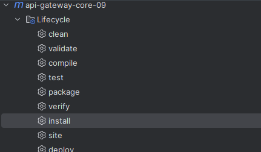

# maven install

maven 的 install 命令，当我们的一个 maven 模块想要依赖其他目录下的模块时，直接添加会找不到对应的模块，只需要找到需要引入的模块，执行 install 命令，就会将该模块放入本地仓库，就可以进行引入。

例如，我们在 api-gateway-core-09 模块中执行 install 命令




之后我们进入本地的 maven 仓库中查看，即可看到我们打包的 maven 项目：

我本地的 maven 仓库为：`D://CodeTools/MAVEN_REPOSITORY`


在 maven 中可引入该模块：

```xml
<dependency>
    <groupId>cn.bugstack.gateway</groupId>
    <artifactId>api-gateway-core-09</artifactId>
    <version>1.0-SNAPSHOT</version>
</dependency>
```

