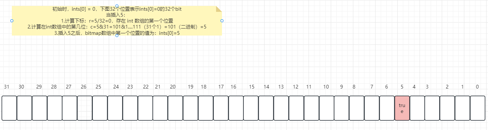

# 位图 BitMap


> BitMap 到底用于解决什么问题？

BitMap 常常用于解决一些`数据量比较大`的问题，比如说对于1千万个整数，整数的范围在 `1~100000000`，对于一个整数 `x` ，我们怎么知道在不在这1千万个整数中呢？

使用 BitMap 来解决的话，就把存在的整数位置给设置为 true，比如 `arr[k]=true`，那么判断整数 `x` 是否在这1千万个整数中，只需要判断 `arr[x] == true` 即可。

那既然这样为什么不使用数组来标记呢？因为数组所占空间过大，会导致内存溢出。比如使用 `int[] arr = new int[10];`，在 java 中，一个 int 占用 4B，4B = 32bit，那如果使用 BitMap 一个标记仅仅占 1bit，使用数组所占用空间是数组的 `32` 倍，


> Java 中 BitMap 如何实现了？


**Java 中 hutool 工具包中实现了 BitMap，引入Maven依赖为：**

```xml
<dependency>
    <groupId>cn.hutool</groupId>
    <artifactId>hutool-all</artifactId>
    <version>5.8.0.M2</version>
</dependency>
```


Java 中有两种 bitmap，分别为 `IntMap`、`LongMap`，这里以 `IntMap` 为例：

初始时，`ints` 数组即为 bitmap 数组，如果我们要向数组中添加 `5`，过程如下：

- 计算存储下标，如果要添加 5，那么在 add() 方法中 i=5，因为 int 数组中一个位置是 4B=32bit，所以计算下标时需要对 32 进行取模
- 之后计算 5 需要存储的位置，也就是在当前这个 32 个位置中，处于第几个位置，所以和 31 进行与操作，31 也就是全1，通过和全1进行与操作就可以计算出位置

图片解释如下：



```java
public class IntMap implements BitMap, Serializable {
    private static final long serialVersionUID = 1L;
    private final int[] ints;

    public IntMap() {
        this.ints = new int[93750000];
    }

    public IntMap(int size) {
        this.ints = new int[size];
    }

    public void add(long i) {
        int r = (int)(i / 32L);
        int c = (int)(i & 31L);
        this.ints[r] |= 1 << c;
    }

    public boolean contains(long i) {
        int r = (int)(i / 32L);
        int c = (int)(i & 31L);
        return (this.ints[r] >>> c & 1) == 1;
    }

    public void remove(long i) {
        int r = (int)(i / 32L);
        int c = (int)(i & 31L);
        int[] var10000 = this.ints;
        var10000[r] &= ~(1 << c);
    }
}
```

**BitMap总结：**

- BitMap适合存储数据密集的数据，如果对于稀疏数据会造成空间浪费。
- 相比于其他数组更加节省空间


**BitMap的一些适用场景：**

- 统计指定用户一年中的登陆天数，哪几天登陆了，哪几天没有登陆？
- 判断用户的在线状态
- 统计活跃用户，使用时间作为缓存的key，用户id值为value中的偏移量，这一时间段如果活跃就设置为1


# 布隆过滤器

对于仅仅为整数的判断可以使用 BitMap 来进行实现，那么我们来考虑下边这个场景：

> 如果网站需要设置一个黑名单，url数量会上亿，我们怎么将 url 给存储进 BitMap 中呢？存储在 BitMap 中的下标该如何计算呢？

对于这些复杂情况，就可以使用 Redis 的一种数据结构`布隆过滤器`，首先布隆过滤器的特点就是判断一个 url 的哈希值的位置，如果是1，则`可能`在集合中，但是如果不是1，则`一定不在`集合中。

这是为什么呢？

因为布隆过滤器使用了一组哈希函数，如果仅仅使用一个哈希函数，当 url 数量变多时，计算出来的`哈希值冲突`概率极高，假设使用的一组哈希函数为`h1,h2,...hk`，那么布隆过滤器会对一个 url 计算 k 次哈希值，得到 k 个哈希值，将 BitMap 中这 k 个位置都设置为1，那么在判断一个 url 是否存在时，判断这 k 个位置的值是否全部为1，如果有一个位置不为1，则表示该 url 并不在集合中。


**布隆过滤器总结：**

- 时间、空间效率高
- 误判率低，可以通过调整哈希函数数量和数组大小来控制误判率
- 支持并发
- `无法确定元素一定集合中！` 
- 常用于作为一层程序拦截，


# 常见面试题

> 1. 如果有 256 种优先级，每次要选择当前优先级最高的任务来执行，设计一个算法如何实现？

有两种方案：

1. 使用最大堆

创建一个最大堆，根据任务的优先级进行排序，堆顶元素优先级最高，每次执行任务取堆顶元素，执行后移除。

当任务优先级发生变化时，可以更新堆中元素位置，保证优先级最高在堆顶。

**优点：**

- 适用于任意数量的优先级，不限制256种。


2. 使用 bitmap

可以使用一个 256 为的 bitmap，每一位对应一种优先级。当有任务到达时，将对应优先级位置设置为1，每次执行任务时，取最高位的1，表示优先执行该优先级下的任务，执行之后，将该位设置为0.


Java 中取最高位1的方法：

```java
Integer.highestOneBit(5)
// 输出：4  
```


**优点：**

- 使用于固定256种优先级，因为位图的长度是固定的