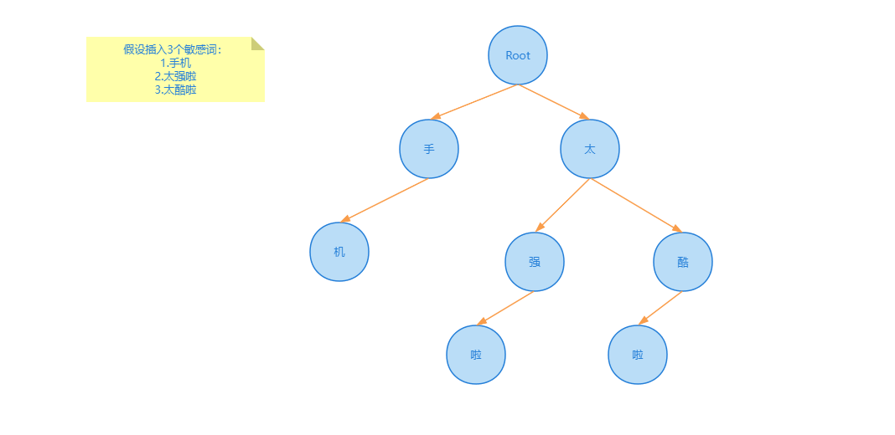

> 敏感词库的设计，要求增删改查敏感词。敏感词文本匹配，敏感词一万个，文本长度在 20 - 1000 

答：使用 trie 树来实现敏感词库的设计，可以利用字符串公共前缀来节约存储空间。

生成 trie 树结构如下：



> 1亿数据只有 1gb 内存怎么去重？

答：问题的本质是`海量数据去重`，解决方案有两种 bitmap、布隆过滤器。

方案一：bitmap

对于 1 亿的数据来说，如果直接将所有数据读入内存使用 bitmap 来去重的话，对每条数据使用 1 个 bit 标记是否存在即可，1 亿 bit ≈ 12MB，对于一条数据 a 来说，会在 bitmap 中计算出他所放入的下标 `x`，之后将 `x` 这个位置标记为1，这样判断一个数据是否存在，只占用 1 bit。


bitmap 方案适用场景：

- bitmap 适合值域较小的场景，如果值域较大会导致计算出在 bitmap 数组中的下标过大，比较占用存储空间
- 适合数据密集场景，对于数据稀疏场景比较浪费存储空间，比如数据a下标为0，但是数据b下标为1000000，两个数据中间并没有数据，但是却需要占用存储空间。


方案二：布隆过滤器

当值域较大的情况下，可以使用布隆过滤器进一步压缩 bitmap 的存储空间。

在布隆过滤器中，对一个数据a，布隆过滤器会使用 `k` 个哈希函数，计算出 `k` 个哈希值，在 bitmap 中将这 k 个位置都标记为1，来表示这个数据存在。


布隆过滤器适用场景：

- 适用于不严格去重的场景，因为布隆过滤器的特性会导致存在误判率，当判断为true时，该数据可能在集合中；当判断为 false 时，该数据一定不在集合中。
- Java中可以使用第三方库来实现布隆过滤器，常见的有Google Guava库和Apache Commons库以及Redis。

> 项目的登陆密码怎么存储，用的什么加密算法，为什么用 MD5？

答：项目登陆密码都会通过 `MD5 + 加盐` 操作对明文密码加密存储在数据库中。

MD5 会对每一个铭文密码生成一个对应的固定密码，虽然 MD5 不可逆，但是可以被暴力枚举出来，所以在 MD5 的基础上还会添加加盐操作，通过在密码任意固定位置插入特定的字符串，让散列后的结果和使用原始密码的散列结果不相符。


> 订单到期后，如何关闭订单？

 答：参考文章：https://mp.weixin.qq.com/s/BG1PqUWX0XwJX6aMCXCgvw

- 方案一：定时任务，定时去扫描所有到期的订单，然后执行关单的动作。

  - 缺点：
    1. 时间不精确，可能订单已经到了超时时间，但是还没有到定时任务执行时间，导致订单关闭时间比超时时间晚。
    2. 无法处理大订单量，如果订单量较大，会导致定时任务执行时间很长，导致后边订单被扫描到的时间很晚。
    3. 对数据库造成压力，定时任务集中扫描表，会大量占用数据库io，可以将定时任务将其他正常业务做好隔离
    4. 分库分表问题，订单系统，在订单量大时会分库分表，在分库分表中进行全表扫描很不推荐
  - 适用场景：
    1. 对过期时间精度要求不高，业务量不大的场景

- 方案二：JDK自带的延迟队列，`DelayQueue`，在用户创建订单时，把订单加到 `DelayQueue` 中，此外，还需要一个常驻任务不断从队列读取已经超时的订单，并进行关闭，之后再将该订单从队列中删除。

  该方案需要有一个线程添加 `while(true)` 循环，才能确保任务不断执行并及时取出超时订单。

  - 缺点：
    1. 该方案是基于 JVM 内存的，一旦机器重启，会导致数据消失，虽然可以配合数据库的持久化一起使用，但是应用一般都是集群部署，集群中的多台实例的 `DelayQueue` 如何配合也是一个很大的问题。
    2. 当订单量过大时，可能会导致 OOM 的问题。
  - 适用场景：
    1. 单机，订单量不大

- 方案三：RockerMQ延迟消息，在订单创建好之后，发送一个延迟消息，指定延迟时间，在延迟时间到达之后，消息就会被消费者消费。

  - 缺点：
    1. RocketMQ的延迟时间不支持任意的，只支持：1s、5s、10s、30s，1m、2m等等（商业版支持任意时长）
  - 适用场景：RocketMQ支持延迟时间和我们所需延迟时间正好符合

- 方案四：RabbitMQ插件，基于 rabbitmq_delayed_message_exchange 插件，该插件从 RabbitMQ 的 3.6.12 版本开始支持，该插件为官方开发的。

  在 RabbitMQ 中，我们设置一个消息，并且不去消费他，当过了存活时间之后，这个消息会变成死信，会被发送到死信队列中。

  在该插件中，消息并不会立即进入队列，而是先将他们保存到一个基于 Erlang 开发的 Mnesia 数据库，再通过一个定时器去查询需要被投递的消息，再投递到 x-delayed-message 队列中。

  - 适用场景：基于 RabbitMQ 插件的方式实现延迟消息，最大延长时间大概为 49 天，超过时间会被立即消费。可用性，性能都不错。

- 方案五：Redis 过期监听，监听 key 的过期消息，在接收到过期消息之后，进行订单的关单操作。

  - 缺点：
    1. Redis 不保证 key 在过期时会被立即删除，也不保证消息能立即发出，因此存在消息延迟
    2. 在 Redis5.0 之前，这个消息是通过 PUB/SUB 模式发出的，不会进行持久化，如果发送消息时，客户端挂了，之后再恢复的话，这个消息就会彻底丢失。

- 方案六：Redis 的 zset

  zset 是一个有序集合，每一个元素关联一个 score，通过 score 来对集合中的元素进行排序

  我们可以将（下单时间 + 超时时间） 与订单号分别设置为 score 和 元素值，通过 redis 进行排序之后，再开启 redis 扫描任务，获取 “当前时间 > score” 的任务，扫描到之后取出订单号，进行关单操作。

  - 优点：使用 redis zset 可以借助 redis 的持久化、高可用机制，避免数据丢失。在高并发场景中，可能多个消费者同时获取同一个订单号，一般采用分布式锁进行解决，也可以做幂等性（多个消费者获取同一个订单号也不影响）进行处理。

    ```bash
    # 命令示例
    # 添加两个元素 a、b 分数为 10、25
    127.0.0.1:6379> zadd delay_queue 10 a
    (integer) 1
    127.0.0.1:6379> zadd delay_queue 25 b
    (integer) 1
    # 查询分数为 9-12 的元素
    127.0.0.1:6379> zrangebyscore delay_queue 9 12 limit 0 1
    1) "a"
    ```

- 方案七：Redission，Redission 中定义了分布式延迟队列 RDelayedQueue，即在 zset 基础上增加了一个基于内存的延迟队列，当我们添加一个元素到延迟队列时，redission 会把 数据+超时时间 放到 zset 中，并且启动一个延时任务，当任务到期时，再去 zset 中把数据取出来进行消费，允许以指定的延迟时长将元素放到目标队列中。

  - 优点：可以解决方案六中的并发问题，稳定性，性能较高

- 方案八：RocketMQ时间轮（https://mp.weixin.qq.com/s/I91QRel-7CraP7zCRh0ISw）

- **总体来讲，Redission + Redis、RabbitMQ插件、Redis的zset、RocketMQ延迟消息这几种方案比较推荐**

> 一个系统用户登陆信息保存在服务器A上，服务器B如何获取到Session信息？（分布式 Session 共享的解决方案）

答：将 Session 数据存储到分布式缓存比如 Redis 中，所有的服务器都可以访问。

- 优点：性能优秀、支持横向扩展（Redis集群）
- 缺点：存在数据丢失风险（虽然 Redis 支持数据持久化，但仍可能丢失小部分数据）


> 如果让你来评估项目的QPS的话，你会用什么方式来评估?(补充: 不要做压测，就通过现在的设计以及硬件配置推导OPS应该达到什么水准?)

答：首先需要根据业务提供的推广规模、渠道、人数，来评估。这里根据 28 原则进行评估，**即 80% 的请求访问在 20% 时间内到达**。

假如系统有1000万用户，那么每天来点击页面的占比20%，也就是200万用户访问。

假设平均每个用户点击50次，那么总用有1亿的PV（页面浏览量）

一天24个小时，平均活跃时间段算在5个小时内【24*20%】，那么5个小时预计有8000万点击，也就是平均每秒4500个请求。

4500是一个均值，按照电商类峰值的话，一般是3~4倍均值量，也就是5个小时每秒18000个请求【QPS=1.8万】