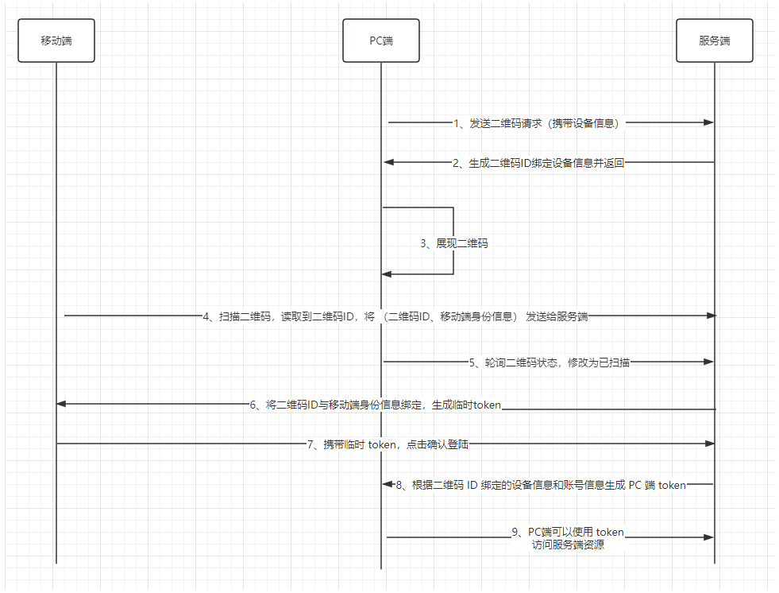
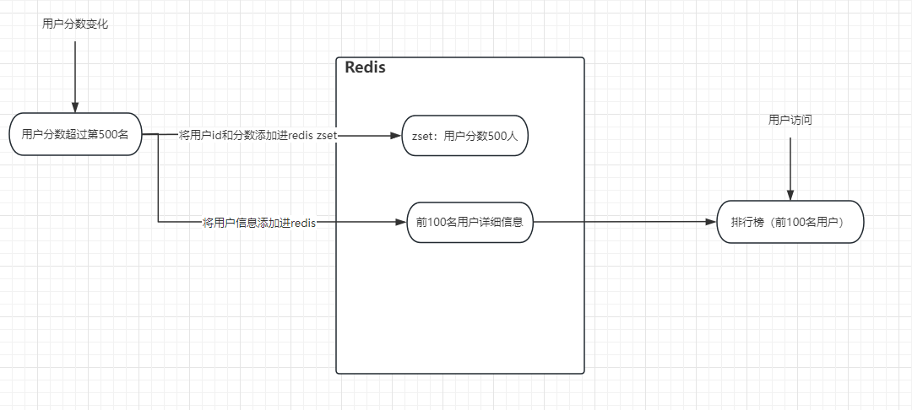

> 微信二维码扫描原理：

答：**流程：**



总的来说，PC 端需要进行扫码登陆的原理是通过二维码绑定移动端的身份信息以及PC端的设备信息，根据这两个信息生成 token 给 PC 端，PC 端就登陆成功了。

二维码准备：

1. PC端向服务器发起请求，表示要生成用户二维码，并且把 PC 端设备信息也传递给服务端
2. 服务端收到请求后，生成唯一的二维码 ID，并将二维码 ID 与 PC 端设备信息进行绑定
3. 服务端将二维码 ID 返回给 PC 端
4. PC 端收到二维码 ID 后，生成二维码
5. PC 端为了及时知道二维码的状态（是否已经扫描，扫描后是否已经确认），会不断轮询服务端，请求服务端当前二维码的状态及相关信息

扫描状态切换：

1. 用户扫描二维码后，读取到二维码 ID
2. 向服务端发送请求，并携带移动端的身份信息与二维码 ID
3. 服务端接收之后将身份信息与二维码 ID 进行绑定，生成临时 token，返回给移动端
4. 在移动端扫描完之后，PC 端会轮询二维码状态，修改为已扫描，此时二维码 ID 会与账号信息进行绑定

第三步返回给移动端临时 token 是要保证移动端在下一步操作时，使用这个临时 tokne 作为凭证，保证两步操作是同一部设备发出的，临时 token 只可以使用一次就失效。

登陆确认：

1. 移动端接收到临时 token 后会弹出确认登陆界面，点击确认，移动端会携带临时 token 调用服务端接口
2. 服务端收到确认后，根据二维码 ID 绑定的设备信息与账号信息，生成 PC 端 token
3. PC 端轮询二维码状态，修改为已确认
4. 登陆成功


> 你知道哪些实现业务解耦的方法？

答：解耦是一种很重要的软件工程原则，它可以提高代码的质量和可复用性，降低系统的耦合度和维护成本。

解耦在日常开发中很常见，如 AOP 可以将需要切入的逻辑（日志、事务、权限）从核心业务中分离出来、IOC 可以将对象的创建和依赖管理交给容器。

可以通过 `事件驱动` 实现业务之间的解耦，通过事件驱动的实现方式常用的有两种：

1. 基于发布订阅模式的事件驱动

MQ 就是这样实现解耦，这种方式在解耦的同时，还实现了异步，提高了系统的吞吐量和接口响应速度。

成熟的消息队列的功能一般比较成熟，自带消息持久化、负载均衡、消息高可用。

除此之外 Redis 也有发布订阅功能（pub/sub），但是存在消息丢失、消息堆积等问题，不如专业的消息队列。

2. 基于观察者模式的事件驱动

常见的基于观察者模式的事件驱动框架有：Spring Event、Guava EventBus 等

Spring Event 和 Guava EventBus 默认是同步的，但也能实现异步，只是功能比较鸡肋。

观察者模式就只有观察者和被观察者，两者是直接进行交互的。

Spring Event 示例：

```java
// 事件发布者
@Component
public class CustomSpringEventPublisher {
    @Autowired
    private ApplicationEventPublisher applicationEventPublisher;

    public void publishCustomEvent(final String message) {
        System.out.println("Publishing custom event. ");
        CustomSpringEvent customSpringEvent = new CustomSpringEvent(this, message);
        applicationEventPublisher.publishEvent(customSpringEvent);
    }
}

// 事件监听者
@Component
public class CustomSpringEventListener implements ApplicationListener<CustomSpringEvent> {
    @Override
    public void onApplicationEvent(CustomSpringEvent event) {
        System.out.println("Received spring custom event - " + event.getMessage());
    }
}
```


发布订阅模式和观察者模式对比：

- 发布订阅模式：发布者和订阅者完全解耦，通过中间件进行消息传递；可以利用中间件（MQ、Redis）来实现分布式的消息传递，可应用于跨应用或跨进程的场景；大多数是异步的；
- 观察者模式：需要维护观察信息，被观察者和观察者直接交互；基于对象本身的数据变化来通信，不能使用在跨应用或跨进程的场景；大多数是同步的；


> 接口重试策略如何设计？

常见的重试策略有两种：

1. 固定间隔时间重试：实现简单、但是可能导致重试过于频繁或稀疏，从而影响系统性能。如果重试间隔太短，可能导致雪崩效应；如果太长，可能影响用户体验
2. 梯度间隔重试：根据重试次数去延长重试间隔时间。例如第一次重试间隔1s，第二次2s，第三次4s。能有效提高重试的几率，也能通过梯度增加间隔时间来避免对下游系统造成更大压力。此种策略需要设置合理的上下限值，否则可能导致延长时间过长。

重试策略对分布式系统来说是自私的，客户端认为他的消息很重要，并要求服务端花费更多资源来处理，盲目的重试设计不可取。


重试策略最佳实践：

- 合理设置消费的最大超时时间和次数（尽快向客户端返回成功或失败，不要以超时或者异常抛出来代替消费失败）
- 重试会导致相同的消息进行`重复消费`，消费方应该有一个良好的`幂等设计`

支付系统中补单操作如何完成：https://mp.weixin.qq.com/s/9Z-N3cfWu7oMVJsTDkbb-Q

简单来讲，补单利用 RocketMQ 对操作失败进行补偿操作，但不能一直进行补偿操作，需要设置一个最大重试次数，在多次补偿失败之后，需要延缓补偿频率，这些都通过 RocketMQ 进行实现，这里还存在几个问题：

1. 如果异常消息发送失败，上游没有重试机制，这笔订单就会卡住，因为系统并不知道需要去补偿
2. 在补偿消息时失败
3. 如果重试达到最大次数仍然没有成功，该如何处理？

针对问题1，可以将异常消息落库，存在异常消息表中，记录订单号、当前重试次数、一场分类、记录状态、消息体等字段，设置定时任务去扫描该表进行处理。对当前 MQ 的可用性，异常数据很少出现。

针对问题2，如果补偿失败，会向上抛出 error，利用 RocketMQ 的梯度重试机制，当消费次数上限后会进入死信队列。这种情况一般是网络出现问题，恢复之后，可以从死信队列拉取这些消息再统一处理。如果 MQ 和 DB 都失败了，为极端情况，人工介入即可。

针对问题3，如果达到最大次数仍然没有成功，将他放入异常表。

还可以有一些在业务低峰期的兜底任务，扫描业务表，对未完成的订单进行补偿。**兜底任务可能造成信息的短暂堆积，影响线上补偿流程推进，可以使用独立的队列隔离开。**


> 场景题：实时排行榜，几千万的流量！要高可用高并发

答：假如我们要对前100名用户进行实时排行，在数据库中创建一张用户总分表。总分表里会存入用户头像，姓名，总分，用户id。将总分表的前500名放到 Redis 的 zset 集合中。

- 当用户访问排行榜接口时，会从 Redis 中获取前 100 名用户的信息。
- 当用户的分数发生变化时，会拿当前用户分数和第100名用户的分数对比，如果大于，则放入Redis中。

排行榜只有100名用户，我们将前500名用户都放入 Redis 有必要吗？有必要，数据冗余一些可以避免频繁的更新数据，也能保证数据的准确性（否则，就需要加全局锁保证数据的准确性）。


可以加一个定时器，隔一段时间从数据库重新取数据，避免时间长了，redis中存储的数据越来越多。



```java
Map<String, Double> map = new HashMap<>();
for (int i = 0; i < 300000; i++) {
    map.put("userId" + i, Double.valueOf(i));
}
// zadd 批量添加，或者单个添加，或者更新
jedis.zadd("ranking", map);
jedis.zadd("ranking", 10.00, "userA");
User user = new User();
// 单独往hash中添加数据
jedis.hset("user-list", "userA", JSON.toJSONString(user));
Map<String, String> map1 = new HashMap<>();
for (int i = 0; i < 10; i++) {
    map1.put("userId" + (char)('A' + i), JSON.toJSONString(user));
}
// 批量添加
jedis.hset("user-list", map1);
// 设置过期时间
jedis.expire("user-list", 5 * 60);
jedis.expire("ranking", 5 * 60);
// hash获取
jedis.hget("user-list", "userA");
// 查看某个用户排名，zset是按照分数从小到大排列，所以排行榜要使用zrevrank
jedis.zrevrank("ranking","userA")
// 查看前10名，并查出分数
jedis.zrevrangeWithScores("ranking",0,9)
```


> 幂等性如何设计？

答：幂等性的设计有以下几种方案：

**方案一：唯一索引或唯一组合索引**

对订单的幂等性设计，可以使用订单号作为唯一索引，这样如果多次插入的话，就会报错 ` DuplicatedKeyException`， 那么我们就可以捕获该错误，来返回友好提示。


**方案二：乐观锁**

使用乐观锁会给数据库表增加一个`版本号 version`字段，查询数据时，读取到 version，当更新数据时判断数据库版本号和自己拿到的版本号是否相同，相同则更改，每次更新操作对 version 字段加 1。

`update order set name = #{name}, version=#{version}+1 where id=#{id} and version=#{version}`


**方案三：Token + Redis**

针对调用方重试接口的情况，例如重复提交订单，这种幂等性设计可以使用 Token 机制来防止重复提交。

调用方在调用接口时，先向后端请求一个 Token，该 Token 存储在 Redis 中并设置过期时间，在调用时携带上 Token（放入Header存储），后端在 Redis 中检查该 Token 是否存在，如果存在表示是第一次请求，删除token中的缓存**（使用 lua 脚本，保证操作的原子性）**，如果不存在，表示重复请求，直接返回。

如果第一次调用接口失败了，可以通过设计来重新生成 token，再次尝试调用。

```java
public void invoke(){
  String token = genToken();
  // 提交订单信息
  submitOrder(token, order);
}
```


