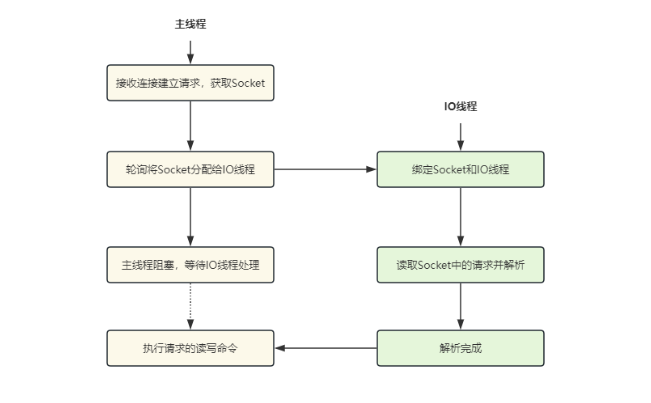
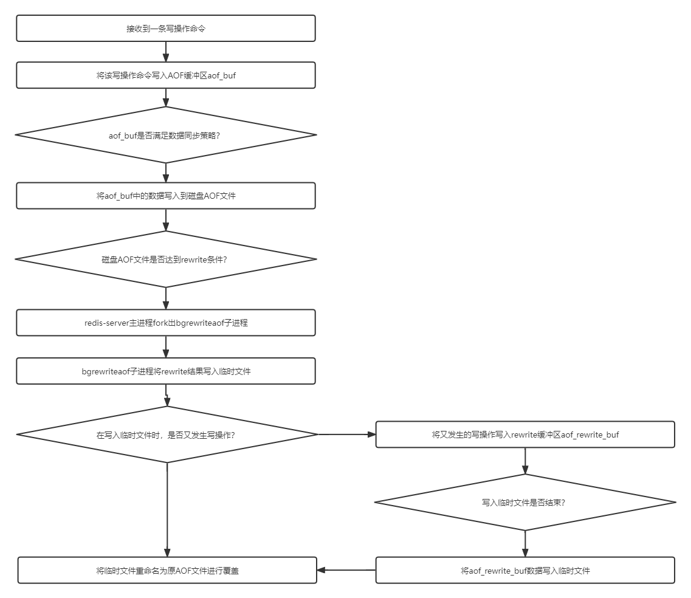
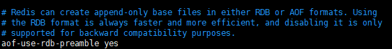
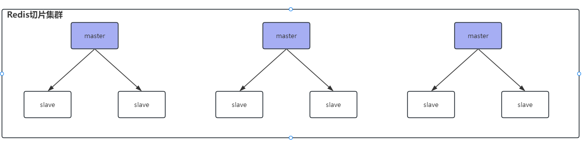

> 了解 redis 中的大key吗？多大算是大key呢？如何解决？

答：

redis 的大 key 指的是 key 对应的 value 所占用的内存比较大。

对于 string 类型来说，一般情况下超过 10KB 则认为是大 key；对于set、zset、hash 等类型来说，一般数据超过5000条即认为是大 key

bigkey 除了会消耗更多的内存空间和带宽，还会对性能造成比较大的影响。应该避免系统中出现 bigkey。

**查找大key：**

1. 使用命令 `redis-cli -p 6379 --bigkeys -i 3` 在 redis 中查找大 key，通过 `-i` 控制扫描频率，表示扫描过程中每次扫描后休息的时间间隔为 3 秒。
2. 分析 RDB 文件来找出大 key。

**解决大key：**

1. 将大key切割为多个小key。（不推荐，这样需要修改业务代码）
2. 如果大key不是热点key，手动删除。redis4.0+ 使用 `unlink` 命令异步删除传入的key

> 了解 redis 中的热 key 吗？

答：

热 key 指的是在 redis 接收的读写请求中，某个 key 就占了一般甚至更多的请求，称为热 key。

处理热 key 会占用大量的 CPU 和带宽，如果在某一时间内大量访问热key，请求数量超过 redis 的处理能力或者热key正好在缓存中过期，就会导致线上服务崩溃。

需要对系统中的热 key 进行优化，确保系统的高可用和稳定性。


**查找热key：**

1. 使用 `redis-cli --hotkeys` 来查找热key，使用该命令时，需要设置 `maxmemory-policy` 为 LRU 算法，否则会报错。

2. 使用 `monitor` 命令来实时查看 redis 实例的操作情况，包括读写删除等操作。

   该命令对 redis 性能影响较大，谨慎使用。

   使用 `monitor` 命令并输出重定向至文件，在关闭 `monitor` 命令后对文件进行分析，即可找到这段时间内的热 key。

**解决热key：**

1. 使用二级缓存。将热 key 存储一份到 JVM 本地内存中（可以使用Caffeine）
2. 使用 redis 集群：在多个 redis 实例上都存储一份热 key，分散热 key 的访问请求
3. 读写分离：主节点处理写请求，从节点处理读请求


> redis用的什么版本，6.0多线程体现在哪里？redis的性能瓶颈在哪里？

答：自己项目中的 redis 使用的 6.2.6版本。redis的性能瓶颈在于内存、网络IO处理速度。

redis6.0 引入了多线程，引入多线程的目的是为了提高`网络IO`的处理性能.

redis 的多线程只是用来处理网络请求，对于读写命令，还是使用单线程进行处理，因此并不存在线程安全的问题。


6.0多线程默认关闭，在 redis.conf 中设置 `io-threads-do-reads yes` 进行开启，并且设置线程个数`io-threads  6` 

**主线程与IO线程的协作流程：**

1. 服务端和客户端建立Socket连接，并分配处理线程

   主线程负责接收建立连接请求。当有客户端请求和实例建立Socket连接时，主线程会创建和客户端的连接，并把 Socket 放入全局等待队列中。 紧接着，主线程通过轮询方法把Socket连接分配给IO线程。

2. IO线程读取并解析请求

   主线程一旦把Socket分配给IO线程，就会进入阻塞状态，等待IO线程完成客户端请求读取和解析。因为有多个IO线程在并行处理，所以，这个过程很快就可以完成。

3. 主线程执行请求操作

   等到IO线程解析完请求，主线程还是会以单线程的方式执行这些命令操作

   


> 谈谈Redis 的持久化策略？

`Redis`的确是将数据存储在内存的，但是也会有相关的持久化机制将内存持久化备份到磁盘，以便于重启时数据能够重新恢复到内存中，避免数据丢失的风险。而`Redis`持久化机制有三种：`AOF`、`RDB`、`混合型持久化（4.x版本后提供）`


- **RDB持久化**

  `关闭 RDB 持久化只需要将 save 保存策略注释掉即可`

  RDB持久化的方式有两种：

  - 手动save：阻塞当前 Redis，直到持久化完成，可能造成长时间阻塞，线上不建议使用。

    Redis 中 save 操作的配置：从右向左条件主键变弱，如果60s发生了10000次写操作，就进行持久化，如果没有达到，在300s时，如果有100次写操作就会持久化，如果没有达到在3600s，如果有一次写操作就会持久化

    

    ​

  - 手动bgsave：Redis 进程执行 `fork` 创建子进程进行持久化，阻塞事件很短。在执行`Redis-cli shutdown`关闭`Redis`服务时或执行`flushall`命令时，如果没有开启`AOF`持久化，自动执行`bgsave`

  ​

  `bgsave子进程工作原理：` 

  由子进程继承父进程所有资源，且父进程不能拒绝子进程继承，bgsave子进程先将内存中的全量数据copy到磁盘的一个`RDB临时文件`，持久化完成后将该临时文件替换原来的`dump.rdb`文件。

  如果持久化过程中出现了新的写请求，则系统会将内存中发生数据修改的物理块copy出一个副本，bgsave 子进程会把这个副本数据写入 RDB 文件，在这个过程中，主线程仍然可以直接修改原来的数据，`fork` 使用了 `写时复制技术（Copy-On-Write）`。

  ​

  `写时复制技术：` 

  目的是避免不必要的内存拷贝。

  在Linux系统中，调用 `fork` 系统调用创建子进程时，并不会把父进程所有占用的内存页复制一份，而是与父进程共用相同的**内存页**，而当子进程或者父进程对**内存页**进行修改时才会进行复制 —— 这就是著名的 `写时复制` 机制。

  那么bgsave中的写时复制技术即如果在持久化过程中，写入了新的数据，此时再去将元数据重新拷贝一份进行修改。

  ​

  `优点：` 

  - 使用单独子进程持久化，保证 redis 高性能。
  - RDB 持久化存储压缩的二进制文件，适用于备份、全量复制，可用于灾难备份，同时`RDB`文件的加载速度远超于`AOF`文件。

  `缺点：`

  - 没有实时持久化，可能造成数据丢失。
  - 备份时占用内存，因为`Redis` 在备份时会独立创建一个子进程，将数据写入到一个临时文件（需要的内存是原本的两倍）
  - `RDB`文件保存的二进制文件存在新老版本不兼容的问题。

- **AOF持久化**

  默认AOF没有开启，可在`redis.conf`中配置

  

  Redis7发生了重大变化，原来只有一个appendonly.aof文件，现在具有了三类多个文件：

  - 基本文件：RDB格式或AOF格式。存放RDB转为AOF当时内存的快照数据。该文件可以有多个。
  - 增量文件：以操作日志形式记录转为AOF后的写入操作。该文件可以有多个。
  - 清单文件：维护AOF文件的创建顺序，保证激活时的应用顺序。该文件只可以有1个。

  ​

  aof 文件中存储的 resp 协议数据格式，如果执行命令`set a hello`，aof文件内容如下：`（*3代表有3条命令，$5代表有5个字符）`

  ```bash
  *3
  $3
  set
  $1
  a
  $5
  hello
  ```

  AOF持久化时，其实是先写入缓存中，之后再同步到磁盘中，同步策略有三种：

  - `appendfsync always`：每次写入都同步到磁盘，最安全，但影响性能。
  - `appendfsync everysec`（推荐、默认配置）：每秒同步一次，最多丢失1秒的数据。
  - ``appendfsync no` ：`Redis`并不直接调用文件同步，而是交给操作系统来处理，操作系统可以根据`buffer`填充情况/通道空闲时间等择机触发同步；这是一种普通的文件操作方式。性能较好，在物理服务器故障时，数据丢失量会因`OS`配置有关。

  `优点：` 

  - 数据丢失风险较低，后台线程处理持久化，不影响客户端请求处理的线程。

  `缺点：`

  - 文件体积由于保存的是所有命令会比`RDB`大上很多，而且数据恢复时也需要重新执行指令，在重启时恢复数据的时间往往会慢很多。

  `AOF的重写（Rewrite）机制：`

  - 为了防止AOF文件太大占用大量磁盘空间，降低性能，Redis引入了Rewrite机制对AOF文件进行压缩

    Rewrite就是对AOF文件进行重写整理。当开启Rewrite，主进程redis-server创建出一个子进程bgrewriteaof，由该子进程完成rewrite过程。

    首先会对现有aof文件进行重写，将计算结果写到一个临时文件，写入完毕后，再重命名为原aof文件，进行覆盖。

  ​

    `配置AOF重写频率`

  ```bash
  # auto‐aof‐rewrite‐min‐size 64mb //aof文件至少要达到64M才会自动重写，文件太小恢复速度本来就很快，重写的意义不大
  # auto‐aof‐rewrite‐percentage 100 //aof文件自上一次重写后文件大小增长了100%则再次触发重写
  ```

  `AOF的持久化流程图：` 

  

  ​

​    


  ​

- **混合持久化开启**

  默认开启，即AOF持久化的基本文件时的基本文件是RDB格式的。（必须先开启aof）

  

  **混合持久化重写aof文件流程**：aof 在重写时，不再将内存数据转为 resp 数据写入 aof 文件，而是将之前的内存数据做 RDB 快照处理，将 `RDB快照+AOF增量数据` 存在一起写入新的 AOF 文件，完成后覆盖原有的 AOF 文件。

  ​

  **Redis重启加载数据流程：**

  1. 先加载 RDB 数据到内存中
  2. 再重放增量 AOF 日志，加载 AOF 增量数据

  `优点：`

  - 结合了 RDB 和 AOF，既保证了重启 Redis 的性能，又降低数据丢失风险

  `缺点：`

  - AOF 文件中添加了 RDB 格式的内容，使得 AOF 文件的可读性变得很差； 


> Redis 的数据备份策略


1. 写crontab定时调度脚本，每小时都copy一份rdb或aof的备份到一个目录中去，仅仅保留最近48小时的备份


1. 每天都保留一份当日的数据备份到一个目录中去，可以保留最近1个月的备份
2. 每次copy备份的时候，都把太旧的备份给删了
3. 每天晚上将当前机器上的备份复制一份到其他机器上，以防机器损坏


> Redis内存过期策略

答：

Redis中提供了8种内存淘汰策略：

`volatile-lru：`针对设置了过期时间的key，使用LRU算法进行淘汰 
`allkeys-lru：`针对所有key使用LRU算法进行淘汰 
`volatile-lfu：`针对设置了过期时间的key，使用LFU算法进行淘汰 
`allkeys-lfu：`针对所有key使用LFU算法进行淘汰 
`volatile-random: `从设置了过期时间的key中随机删除  

`allkeys-random: `从所有key中随机删除 
`volatile-ttl：`删除生存时间最近的一个键 
`noeviction`（默认策略）：不删除键，返回错误OOM，只能读取不能写入 


总结一下：也就是从过期的key或者所有的key中使用 LRU或者LFU或者随机 删除策略进行淘汰


> 缓存雪崩是什么？如何解决？

答：缓存雪崩造成的原因是：大量缓存数据在同一时间过期或者Redis宕机，此时如果有大量的请求无法在Redis中处理，会直接访问数据库，从而导致数据库的压力骤增，甚至数据库宕机


出现原因：缓存过期、Redis故障

`缓存过期解决：`

1. 给过期时间加上一个随机数
2. 互斥锁，当缓存失效时，加互斥锁，保证同一时间只有一个请求来构建缓存
3. 缓存预热，在系统启动前，提前将热点数据加载到缓存中，避免大量请求同时访问数据库

`Redis故障解决：`

1. 服务熔断或请求限流
2. 构建Redis缓存高可靠集群

> 缓存穿透是什么？如何解决？

答：缓存穿透造成的原因是访问数据库中不存在的数据，即数据库和缓存都不命中

缓存穿透就是访问大量数据库中不存在的设备，每次都需要去数据库中查询，失去了缓存保护后端存储的意义。

`造成原因：`

- 自身代码问题
- 恶意攻击

`解决方案有两种：`

1. 如果访问数据库中不存在的数据，则将该数据设置为字符串`{}`并且放入缓存，避免访问不存在的数据而大量请求打到数据库，缓存 kv 格式为：`empty_cache_key: {}`

```java
// 设置key为空缓存
redisUtil.set(productCacheKey, "{}", 60 + new Random().nextInt(30), TimeUnit.SECONDS);
// 如果访问到空缓存，重新刷新空缓存的过期时间
redisUtil.expire(productCacheKey, 60 + new Random().nextInt(30), TimeUnit.SECONDS);
```

1. 布隆过滤器：在使用布隆过滤器时，先将所有数据hash到一个位图中，之后接收客户端请求时，先去布隆过滤器中判断数据是否存在，如果不存在，则直接返回空，不会请求数据库。

   在SpringBoot中，我们可以使用Guava提供的布隆过滤器实现缓存穿透的解决方案。

> 缓存击穿是什么？如何解决？

答：缓存击穿造成的原因是：热点key失效

同一时间批量添加数据，并且数据的过期时间相同，大量数据同一时间缓存失效可能导致大量请求直达数据库，如果请求过多，数据库会挂掉。

`解决：`

批量添加数据的话，在设置的过期时间上再加上一个随机时间即可。

```java
// 过期时间 = cache_timeout + new Random().nextInt(5) * 60 * 60;
```

还可通过互斥锁解决


> Redis 的 key 删除策略了解吗？

答：

- 惰性删除：`key`过期后任然留在内存中不做处理，当有请求操作这个`key`的时候，会检查这个`key`是否过期，如果过期则删除，否则返回`key`对应的数据信息。（惰性删除对CPU是友好的，因为只有在读取的时候检测到过期了才会将其删除。但对内存是不友好，如果过期键后续不被访问，那么这些过期键将积累在缓存中，对内存消耗是比较大的。）
- 定期删除：`Redis`数据库默认每隔`100ms`就会进行随机抽取一些设置过期时间的`key`进行检测，过期则删除。（定期删除是定时删除和惰性删除的一个折中方案。可以根据实际场景自定义这个间隔时间，在CPU资源和内存资源上作出权衡。）
- `Redis`默认采用定期+惰性删除策略。


> Redis 的主从机制有哪些好处？哪里存在问题？

答：

`主从机制好处：`

- 主从机制为后续的高可用机制打下了基础，可以将数据同步到多个从节点，做到灾备的效果
- 通过主写从读的形式实现读写分离，提高 Redis 吞吐量。

`主从机制同样存在一些问题：`

- 如果主节点宕机，需手动从 slave 选择一个新的 master，同时需修改应用方的主节点地址，还需要命令所有从节点去复制新的主节点。
- 写入性能受主节点限制
- 木桶效应：整个`Redis`节点群能够存储的数据容量受到所有节点中内存最小的那台限制，比如一主两从架构：`master=32GB、slave1=32GB、slave2=16GB`，那么整个`Redis`节点群能够存储的最大容量为`16GB`


> Redis Sentinele 有什么作用？


答：

在主从集群基础上，使用 Sentinel（哨兵） 角色来帮我们监控 Redis 节点运行状态，并自动实现故障转移，当 master 节点出现故障时，Sentinel 根据规则选一个 slave 升级为 master，确保集群可用性，在这个过程中不需要人工介入。


Redis Sentinel的主要功能是：

- 监控 redis 节点状态是否正常
- 故障转移，确保 redis 系统的可用性


一般主从复制+哨兵一起使用，使用3台哨兵+1个主从集群（1master，2slave）


`Redis Sentinel + 主从模式 存在的问题：` 

- Redis Sentinel 在主节点挂了之后，选举主节点中断时间达几秒甚至十几秒，期间无法进行写入操作
- 只有一个主节点对外提供服务，无法提供很高的并发，并且单个节点内存不宜设置过大，导致持久化文件过大，影响数据恢复和主从同步效率


> Redis 切片集群了解吗？

答：

Redis 切片集群是目前使用比较多的方案，Redis 切面集群支持多个主从集群进行横向扩容，架构如下：



**使用切片集群有什么好处？**

- 提升 Redis 读写性能，之前的主从模式中，只有 1 个 master 可以进行写操作，在切片集群中，多个 master 承担写操作压力

- 多个主从集群进行存储数据，比单个主从集群存储数据更多

  比如10G数据，1个主从集群的话，1个master需要存储10G，对有3个主从集群的切片集群来说，只需要master1存储3G，master2存储3G，master3存储4G即可

- 具备主从复制、故障转移

  切片集群中的每一个主从集群中，slave 节点不支持读，只做数据备份，因为已经有其他master节点分担压力


**切片集群支持水平扩容，可以无限扩容吗？**

不可以，官方推荐不要超过1000个，因为各个小集群之间需要互相进行通信，如果水平节点过多，会影响通信效率。


**切片集群中插入数据时，数据被放在哪个master中？**

Redis 切片集群中，数据是通过 `哈希槽分区` 来存储的，Redis 切片集群中有 `16384` 个哈希槽，每一个 master 会拿到一些槽位，在向切片集群中插入数据时，会根据 key 计算对应的哈希槽，插入到对应的哈希槽中，那么计算出来的哈希槽在哪个master中，数据当然也就被存放在对应的master上。（在切片集群中，只有master节点才有插槽，slave节点没有插槽）


**切片集群中如果一个master挂了，如何选举主节点？**

当 master 挂了之后，该 master 下的所有 slave 会向所有节点广播 `FAILOVER_AUTH_REQUEST` 信息，其他节点收到后，只有 master 响应，master 会相应第一个收到的 `FAILOVER_AUTH_REQUEST` 信息，并返回一个 ack，尝试发送 failover 的 slave 会收集 master 返回的  `FAILOVER_AUTH_ACK`，当 slave 收到超过半数的 master 的 ack 后，就会变成新的 master。


**这样会导致 slave 一直没收到超过半数的 master 的 ack，难道要一直选举吗？**

其实不会导致 slave 一直选举的，因为在 slave 知道 master 挂了之后，会经过一个延时时间 `delay` 之后再去给所有节点发送选举消息

延迟时间计算：`delay = 500ms + random(0~500ms) + slave_rank * 1000ms` （版本不同可能不一样，原理大致相同）

slave_rank表示slave已经从master复制数据的总量的rank，rank越小，表示复制的数据越新，该slave节点也就越先发起选举。

因此数据量越多的 slave 就越早发送选举消息，也就越早得到 master 的 ack，成为新的 master。


**集群切片中的脑裂问题了解吗？如何解决？**

比如一个主从集群：master1 对应两个从节点 slave1、slave2，如果master1和两个从节点出现网络分区，两个slave会选举出来一个新的master节点，客户端是可以感知到两个master，但是两个master之间因为网络分区无法感知，客户端会向这两个master都写入数据，之后如果网络分区恢复，其中一个master变为slave，就会导致数据丢失问题。


如何解决？添加redis配置：

```bash
min-slave-to-write 1 
```

表示写数据时，写入master之后，不立即返回客户端写成功，而是去slave同步数据，取值为1表示最少同步1个slave之后，才算数据写成功，如果同步的slave节点数量没有达到我们配置的值，就算数据写失败，取值建议：集群总共3个节点，可以取1，这样集群中超过半数（1个master + 1个slave）都写入数据成功，才算写成功。

但是这个配置为了数据的一致性，牺牲了一定的集群可用性，如果一个master的所有slave都挂了，这个小集群就不可用了，master无法写入数据。

`一般不使用，redis丢一点数据也影响不大，所以主要还是保证redis的可用性` 


**集群是否完整才能对外提供服务？**

当redis.conf配置 `cluster-require-full-coverage no` 时，表示如果一个主从集群全部挂掉之后，集群仍然可用，如果为 yes，表示不可用

比如有3个主从集群，其中一个主从集群全部瘫痪，配置为no，则整个集群仍然可以正常工作


**Redis集群如何对批量操作命令的支持？**

对于 mset、mget 这样的多个 key 的原生批量操作命令，redis 集群只支持所有key落在同一个slot的情况，如果多个key一定要用mset在redis集群上操作，则可以在key之前加上{XX}，这样就会根据大括号中的内容计算分片hash，确保不同的key落在同一slot内，例如：

```
mset {user1}: name zhuge {user1}:age 18
```

虽然name和age计算出来的 hash slot 值不同，但是前边加上大括号{user1}，redis集群就会根据 user1 计算插槽值，最后name和age可以放入同一插槽。


