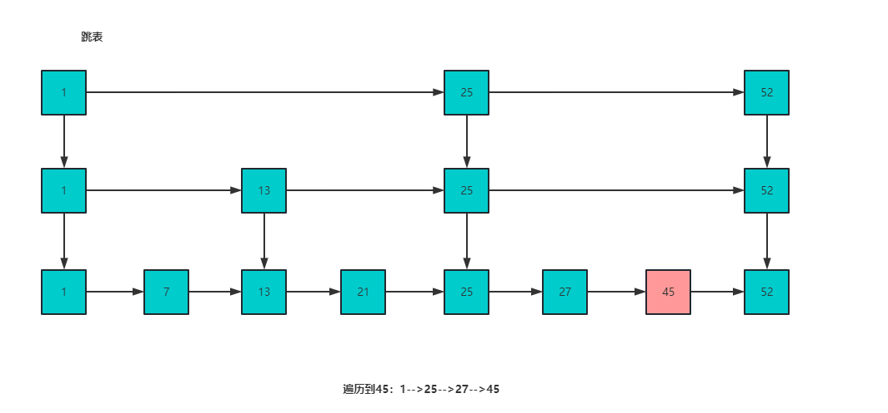

> Redisson 分布式锁？在项目中哪里使用？多久会进行释放？如何加强一个分布式锁？

答：

首先入门级别的分布式锁是通过 `setnx` 进行实现，使用 `setnx` 实现有四个注意点

1. 需要设置锁的超时时间（如果不设置，在释放锁时，如果机器宕机，会导致锁无法释放）

2. 需要设置一个唯一 ID，表示这个锁是哪个用户添加的，必须由添加锁的用户释放

   （如果不设置，线程1在执行任务时，可能锁的超时时间已经达到，被自动释放，此时线程2加锁，开始执行业务，但正好线程1执行完毕，释放锁，由于没有唯一ID表示，线程1将线程2加的锁给释放掉了）

3. 需要`锁续命` 

   有可能锁的过期时间设置的太短，导致业务没有执行完毕，锁就被自动释放，因此要使用锁续命来解决（大概逻辑是使用子线程执行定时任务，定时任务间隔时间要小于 key 的过期时间，子线程隔一段时间判断主线程是否在执行，如果在执行，就重新设置一下过期时间）

4. 可重入问题：setnx 实现的分布式锁不可重入，这样获取锁的线程在重复进入相同锁的代码块中会造成死锁


而在 Redission 中已经帮我们实现好了分布式锁，下来看一下 Redission 中的分布式锁：


**Redission 中获取锁逻辑：**

在 Redission 中加锁，通过一系列调用会到达下边这个方法

他的可重入锁的原理也就是使用 hash 结构来存储锁，key 表示锁是否存在，如果已经存在，表示需要重复访问同一把锁，会将 value + 1，即每次重入一次 value 就加 1，退出一次 value 就减 1

下列方法有三个参数分别为：

- KEYS[1] ： 锁名称
- ARGV[1]： 锁失效时间
- ARGV[2]： id + “:” + threadId; 锁的小key

```java
    <T> RFuture<T> tryLockInnerAsync(long leaseTime, TimeUnit unit, long threadId, RedisStrictCommand<T> command) {
        internalLockLeaseTime = unit.toMillis(leaseTime);

        return commandExecutor.evalWriteAsync(getName(), LongCodec.INSTANCE, command,
                  "if (redis.call('exists', KEYS[1]) == 0) then " +
                      "redis.call('hset', KEYS[1], ARGV[2], 1); " +
                      "redis.call('pexpire', KEYS[1], ARGV[1]); " +
                      "return nil; " +
                  "end; " +
                  "if (redis.call('hexists', KEYS[1], ARGV[2]) == 1) then " +
                      "redis.call('hincrby', KEYS[1], ARGV[2], 1); " +
                      "redis.call('pexpire', KEYS[1], ARGV[1]); " +
                      "return nil; " +
                  "end; " +
                  "return redis.call('pttl', KEYS[1]);",
                    Collections.<Object>singletonList(getName()), internalLockLeaseTime, getLockName(threadId));
    }
```


**Redission 中锁续命原理：**

Redission 底层有个看门狗机制，加锁成功后会有一个定时任务，默认锁的失效时间是 30s，该定时任务每隔锁失效时间的 1/3 就会去续约锁时间，也就是每隔 10s 进行锁续命


**如何加强一个分布式锁？**

也就是如何提升一个分布式锁的性能，分布式锁本质上是将并行操作改为串行，那么我们可以通过使用`分段锁`来提升性能，比如说有 1000 个库存的话，读入到缓存中将分为 10 份进行存储，即 `product_stock_1 = 100, product_stock_2 = 100, ...`，给每一份都加上所，那么多个线程来竞争这 10 把锁，比原来竞争 1 把锁的性能提高 10 倍


> zset 的底层实现？为什么不用红黑树？

答：

zset 的底层实现是：`压缩列表 + 跳表`


**什么时候使用压缩列表？**

- 有序集合保存的元素个数要小于 128 个；
- 有序集合保存的所有元素成员的长度都必须小于 64 字节。

否则使用跳表


跳表中每个节点都有多个跳跃指针，因此每个节点的平均跳跃长度较长，可以一次跳过多个节点，当找到大于或等于目标元素的节点后，再使用普通指针开始移动（可以向后移动，也可以向前移动，跳表含有前边节点的指针）寻找目标元素，跳表可以在 `O(logn)` 的时间内遍历跳表


**跳表结构图：**




**为什么不用红黑树？**

- 跳表和红黑树的查找时间复杂度都是`O(logn)`，但是红黑树比跳表的插入/删除效率更低
  - 跳表在插入或删除时，只需考虑相邻节点，而红黑树需考虑节点的旋转问题，焦虑较低
- 跳表实现比红黑树更简单


> zset 几个命令的时间复杂度？ 

答：

- `zadd`：O(logn)，添加一个元素的时间复杂度是 O(logn)（因为插入元素的话，时间开销都在查找插入位置上，在 zset 中，查找时间复杂度是 O(logn)，因此插入复杂度同是）
- `zrange`：O(logn + m) ，n 是集合中元素数量，m 是指定范围内的用户数量


> redis 里面的命令，比如 setnx 和 setex 还有 zset 中的命令？

答：

zset 中的常用命令为：

- `zadd <key> <score1> <value1> <score2> <value2> ...` 

  向集合 key 中添加元素

- `zrange <key> <start> <stop> [withscores]`

  查找下标在 start 和 stop 之间的元素，如果后边带上 `withscores` 参数，会将分数也查询出来

- `zrevrange <key> <start> <stop> [withscores]` 

  将分数从大到小进行查询，和 zrange 查询顺序相反

- `zrangebyscore <key> <min> <max> [withscores]`

  返回集合 key 中所有 score 介于 min 和 max 之间的成员，如果后边带上 `withscores` 参数，会将分数也查询出来

- `setex <key> <seconds> <value>`

  设置 key、value 并且设置过期时间

- `setnx <key> <value>`

  仅当 key 不存在时，才将 key 的值设置为 value，成功返回1，失败返回0


> 缓存怎么保证数据的一致性？

答：

- `先删除缓存，再更新数据库`  （操作简单）

  这种情况造成的缓存不一致为：线程 A 先删除缓存，再去更新数据库，在线程 A 更新数据库之前，如果线程 B 去读取缓存，发现并不存在，去读取数据库，此时读取的是旧数据，再将旧数据写入缓存，此时缓存存储的就是脏数据了。

  使用`更新数据库 + 延时双删`可以解决此情况的数据不一致，在延时双删中，会删除两次缓存，分为以下几步：

  ```bash
  1. 删除缓存
  2. 更新数据库
  3. 睡眠  Thread.sleep()
  4. 再删除缓存
  ```

  即延时双删在线程 A 更新完数据库之后，休眠一段时间，再去删除缓存中可能存在的脏数据。

  这样第二次删除缓存可能导致线程 A 执行时间过长，第二次可以使用`异步`去删除缓存 


- `先更新数据库，再删除缓存` 

  这种情况可能因为线程 A 没有及时删除缓存或者删除缓存失败而导致线程 B 读取到旧数据

  可以使用消息队列来完成：

  1. 先将要删除的缓存值或者是要更新的数据库值暂存到消息队列中
  2. 当程序没有成功删除缓存值或者更新数据库值时，从消息队列中读取这些值，再次进行删除或更新
  3. 如果成功删除缓存或者更新数据库，要将这些值从消息队列中取出，以免重复操作

  ​

**高级扩展点**：`Canal 监听日志更新 + 定时任务缓存处理`，简单概括来说就是 Canal 可以监控 MySQL 的 binlog，当发现数据库的数据发生变化后，就去同步缓存，就可以达到最终的数据一致性了


> redis基本数据结构？

答：

有 5 中基本数据结构：字符串、list列表、hash字典、set集合、zset有序集合


**基本数据结构添加数据命令：**

- 字符串： `set key value [ex seconds | px milliseconds] [nx | xx]`

  nx：指定 key 不存在才会设置成功

  xx：指定的 key 必须存在才会设置成功，用于更新 key

- list：`lpush key value [value...]`  `rpush key value [value...]`

- hash： `hset key field value` 将 key 中的 field 的值设置为 value

- set： `sadd key value [value...]`

- zset：`zadd key score value` 向 key 中添加一个 value 和 score，根据 score 排序

**数据结构基本介绍：**

- list 列表是链表，不是数据
- set 集合内部的键值对是无序且唯一的

**基本数据结构应用场景：**

- 字符串

  - 限速器：防止 DoS 攻击，对 ip 进行访问次数限制，但是无法防止 DDoS 攻击，因为 DDoS 是分布式拒绝服务，使用了不同 ip 不断访问服务器

    ```java
    // 等价于 set 192.168.55.1 ex 60 nx
    // 如果该ip不存在，指定key为ip，value为1，过期时间为60秒
    Boolean exists = redis.set(ip, 1, "ex 60", "nx");
    if(exists != null || redis.incr(ip) <= 5) {
      // 通过访问
    } else {
      // 限流
    }
    ```

- list

  - 栈  `lpush + lpop` 实现
  - 列表  `rpush + lpop`  或 `lpush + rpop` 实现
  - 阻塞式消息队列 `lpush + brpop` 实现

- hash

  - 存储对象数据：key 为对象名称，value 为描述对象属性的 Map，对象属性的修改在 Redis 中就可直接完成

- set

  - 去重操作

- zset

  - 用户排行榜
  - 用户点赞统计