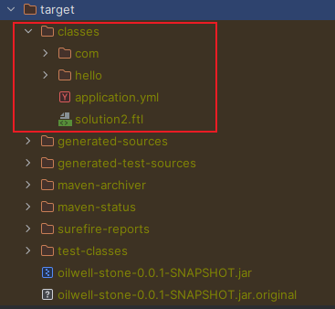
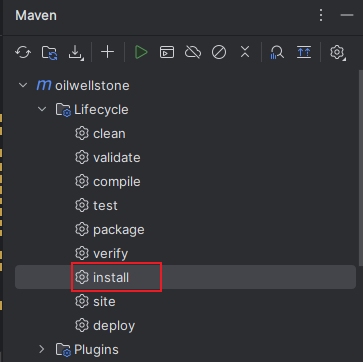
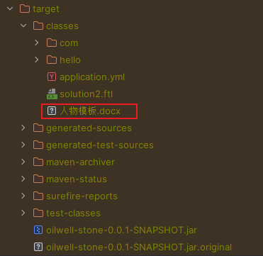

# SpringBoot 从 resources 读取文件


使用 Spring 给我们提供的工具类来进行读取

```java
File file = org.springframework.util.ResourceUtils.getFile("classpath:人物模板.docx");
```


可能读取失败，出现如下错误：

```java
java.io.FileNotFoundException: class path resource [人物模板.docx] cannot be resolved to absolute file path because it does not exist
```


该问题是因为 `resources/人物模板.docx` 这个文件并没有被编译到 `target/classes` 目录下，所以需要在 pom.xml 中进行配置



根据上图发现 classes 中并没有我们需要的文件

在 pom 中添加如下配置：

```xml
<resources>
    <resource>
        <directory>src/main/resources</directory>
        <includes>
            <include>**/*.*</include>
        </includes>
        <filtering>false</filtering>
    </resource>
</resources>
```


再次通过 maven 的 install 工具打包项目：



可以发现，`target/classes` 目录出现需要文件，此时就可以进行读取

