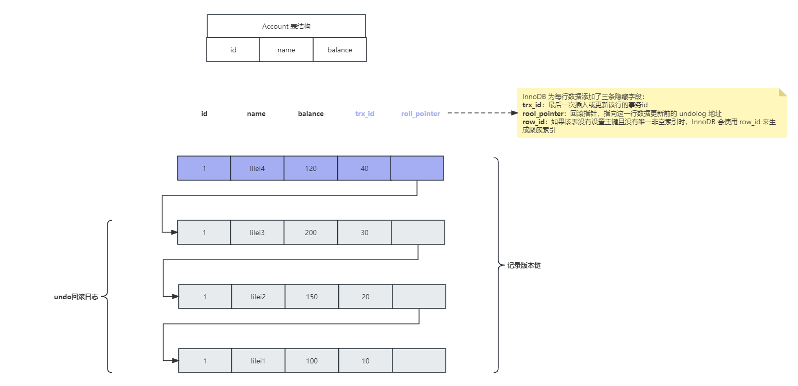
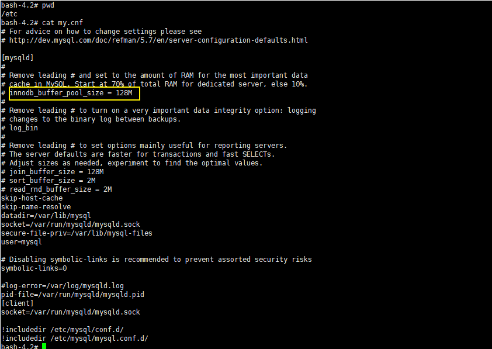
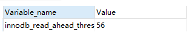
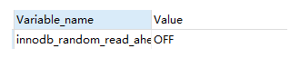
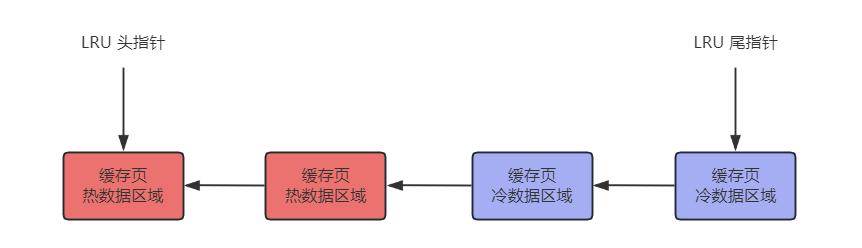

## 了解 MVCC 吗？

答：

MVCC（Multi-Version Concurrency Control） 是用来保证 MySQL 的事务隔离性的，对一行数据的读和写两个操作默认是不会通过加锁互斥来保证隔离性，避免了频繁加锁互斥，而在串行化隔离级别为了保证较高的隔离性是通过将所有操作加锁互斥来实现的。

**MySQL 在`读已提交`和`可重复读`隔离级别下都实现了 MVCC 机制，ReadView 生成规则为：**

- 在读已提交隔离级别下，ReadView 生成的时机是每个 Select 生成一个 ReadView
- 在可重复读隔离级别下，ReadView 生成的时机是每个事务生成一个 ReadView

MVCC 是基于 **undolog**、**版本链**、**readview** 实现的。

在每次更新或者删除数据时，都会将操作记录在 `undo 日志`中，每条 `undo 日志` 通过 `roll_pointer` 进行关联，构成了数据的`版本链`

**ReadView** 中包含以下参数：

- m_ids：表示生成 ReadView 时，当前系统中活跃（未提交）的事务 id 数组
- min_trx_id：表示生成 ReadView 时，当前系统中活跃的事务中最小的事务 id，也就是 m_ids 中的最小值
- max_trx_id：表示生成 ReadView 时，已经创建的最大事务 id`（事务创建时，事务 id 是自增的）`
- creator_trx_id：表示生成 ReadView 的事务的事务 id

那么在事务里的 sql 查询会和 ReadView 进行对比，来判断是否取该行的数据：

1. 如果 row 的 trx_id < min_trx_id，表示这一行数据的事务 id 比 ReadView 中活跃事务的最小 id 还要小，表示这行数据是已提交事务生成的，因此该行数据可见
2. 如果 row 的 trx_id > max_id，表示这一行数据是由将来启动的事务生成的，不可见（如果 row 的 trx_id 就是当前事务自己的 id，则可见）
3. 如果 row 的 min_id <= trx_id <= max_id，则有两种情况：
   1. 如果 trx_id 在 ReadView 的活跃事务 id 数组（m_ids）中，则表明该事务还未提交，则该行数据不可见
   2. 如果不在，则表明该事务已经提交，可见

**注意：**

- 执行 start transaction 之后，并不会立即生成事务 id，而是在该事务中，第一次修改 InnoDB 时才会为该事务生成事务 id
- MVCC 机制就是通过 ReadView 和 undo 日志进行对比，拿到当前事务可见的数据

## 了解 BufferPool 缓存机制吗？

参考:

https://blog.csdn.net/mingyuli/article/details/120347093

https://www.processon.com/view/6080de691e08534b2ef0218b

答：

Buffer Pool 本质就是数据库的一个内存组件，Buffer Pool 的大小在 `/etc/my.cnf` 中进行配置：

**为什么不直接更新磁盘上的数据，而是需要设置一套复杂的机制来执行 SQL 呢？**

因为针对数据库数据的读写其实是随机的读写，而对于日志文件的读写是顺序的读写，而顺序读写和随机读写速度差距在 2~3 个数量级，磁盘的顺序 IO 几乎可以和操作内存相媲美。

通过 BufferPool 可以保证每个更新请求都是更新内存 BufferPool，然后顺序写日志文件，同时可以保证各种异常情况下的数据一致性，正是通过这套配置，才能让我们的 MySQL 数据库在较高配置的机器上每秒可以抗下几千的读写请求

**为什么数据库数据的读写是随机 IO 呢？**

因为数据库存储在磁盘中的数据是会被删除的，我们在写的时候就算一直顺序写，但是如果后边删除了中间的一些数据，那么在之后读就不能顺序读了，因为中间有一些数据已经不存在了

**InnoDB SQL 执行流程：**

1. 加载数据页，把需要修改数据所在的数据页，缓存到 BufferPool，`BufferPool 中缓存的其实就是一个个的数据页`

2. 修改前记录，写 undo 日志，记录更改前数据，如果事务执行失败，使用 undo 日志进行数据回滚

3. 更新 Buffer Pool 中的数据

4. 准备提交事务，写  redo 日志，保存操作记录。redo 日志用来恢复 BufferPool 中的数据

5. 准备提交事务，写 bin-log 日志，保存操作记录。bin-log 日志用来恢复磁盘数据

6. 事务提交完成，此时 bin-log 日志写入成功，并在 redo 日志中记录 commit 标记

   redo 日志作用：`恢复 BufferPool 中的数据`，bin-log 日志是用于恢复磁盘中的数据，其中 redo 日志和 undo 日志是 InnoDB 引擎特有的，而 bin-log 是属于 Server 层的，与引擎无关

   在 redo 日志中记录 commit 标记是为了保证事务提交之后，redo 与 binlog 数据一致，那么想一下如果 BufferPool 缓存中数据更新完毕，但是在数据库将修改后的数据刷到磁盘之前，数据库宕机了，会不会造成 BufferPool 和磁盘的数据不一致呢？

   其实不会，因此当数据库宕机恢复之后，会使用 redo 日志中的数据恢复 BufferPool 中的数据，那么 BufferPool 的数据就是更新后的数据了，等待刷回磁盘即可

7. 数据持久化，IO 线程不定期把 Buffer Pool 中的数据随机写入到磁盘，完成持久化

**MySQL 的预读机制：**

当从磁盘上加载一个数据页时，MySQL 可能会连带着把这个数据页相邻的其他数据页也加载到缓存里去。

**触发 MySQL 的预读机制的场景？**

1. 线性预读：参数 `innodb_read_ahead_threshold` 默认值是 56，表示如果顺序的访问了一个区里的多个数据页，访问的数据页的数量超过了这个阈值，就会触发预读机制，把下一个相邻区中的所有数据页都加载到缓存里去

   查看默认值：`show variables like 'innodb_read_ahead_threshold'`

   

2. 随机预读：如果 Buffer Pool 里缓存了一个区里的 13 个连续的数据页，而且这些数据页都是比较频繁会被访问的，此时就会直接触发预读机制，把这个区里的其他的数据页都加载到缓存里去。`性能不稳定，在 5.5 中已经被废弃，默认是 OFF`

   `show variables like 'innodb_random_read_ahead'`

   

   ​

**LRU 优化——冷热分离**

MySQL 通过使用 LRU 来判断哪些缓存页经常访问，哪些缓存页不常访问，来判断当 BufferPool 缓存被占满之后去淘汰哪些缓存页。

在 MySQL 的 LRU 链表中，采取了 `冷热数据分离的思想` ，LRU 链表被拆为了两部分，一部分是热数据，一部分是冷数据，冷数据默认占比 37%，由 `innodb_old_blocks_pct` 参数控制

> 查看参数：`show variables like 'innodb_old_blocks_pct'`，默认是37

`原理：数据页第一次被加载到缓存页之后，这个缓存页被放在 LRU 链表的冷数据区域的头部，在 1s（可配置） 之后，如果这个缓存页再次配访问，该缓存页才会被移动到热数据区域的头部。`

> 查看参数：`show variables like 'innodb_old_blocks_time'` ，默认是 1000 毫秒（配置多长时间之后访问该缓存页，才将该缓存页加入热数据区域头部）

**为什么 LRU 要进行冷热分离？**

如果不这样优化，在 LRU 只使用一个链表，那么在预读机制中多加载的一些缓存页，可能就在刚加载进缓存时使用一下，之后就不再使用了，如果被放在 LRU 链表头部了，会将频繁访问的缓存页挤在 LRU 链表尾部，最后被淘汰。预读机制和全表扫描加载进来的一大堆缓存页，此时都在冷数据区域里，跟热数据区域里的频繁访问的缓存页时没有关系的。

**LRU 中热数据区域访问的一些优化：**

一般在热数据区域头部的缓存页可能是经常被访问的，所以频繁移动性能不太好，所以 MySQL 对于热数据区域的访问优化了一下，只有在热数据区域的后 3/4 部分的缓存页被访问了，才会被移动到链表头部去（这样就

不会出现链表头部数据频繁交替访问，导致频繁移动链表头部数据）。

**什么时间将缓存页刷入磁盘呢？**

会有一个后台线程运行定时任务，定时将 LRU 链表的冷数据区域尾部的一些缓存页刷入磁盘里去，清空这几个缓存页，将他们加入到 free 链表中（free 链表存放的就是 BufferPool 中的空缓存页的地址）

并且这个后台线程也会在 MySQL 空闲时，将 flush 链表（flush 链表存放的是 BufferPool 中被修改过的缓存页，也称为脏页，脏页都是需要刷回磁盘的）中的缓存页都刷入磁盘中

