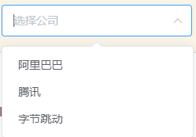

[TOC]

# 输入筛选框实现


## 效果图




## 需求

通过筛选框，选择公司，传入后端，后端根据公司名称去文章的内容中进行模糊查询


## 前端

### 工具版本

- node.js   v16.6.0
- vue3

ui 使用 Element-Plus 实现


#### 添加依赖

在 package.json 添加依赖，并 npm i 导入

```json
"element-plus": "^1.1.0-beta.15",
```


#### main.js导入依赖

```javascript
import ElementPlus from 'element-plus'
import 'element-plus/dist/index.css'
import { createApp } from 'vue'; // 使用 createApp 替换 Vue 的导入方式
import App from './App.vue';

... 

const app = createApp(App); // 使用 createApp 创建 Vue 应用
app.use(ElementPlus)
app.mount('#app'); // 挂载 Vue 应用到 DOM 节点
```


### 代码


```html
<el-select
  v-model="companyCondition"
  multiple
  filterable
  placeholder="选择公司"
  style="width: 240px"
  collapse-tags
  clearable
  @change="handleChangeCompany"
>
  <el-option
    v-for="item in companyOptions"
    :key="item.value"
    :label="item.label"
    :value="item.value"
  />
</el-select>
```


```javascript
// script 对应数据
const companyOptions = ref([])
companyOptions.value = [{value: '阿里巴巴', label: '阿里巴巴'}, {value: '腾讯', label: '腾讯'}, {value: '字节跳动', label: '字节跳动'}]
let companyCondition = ref("")

// 公司筛选框
const handleChangeCompany = () => {
  console.log(companyCondition.value)
  let condition = {
      pageNo: page.value,
      pageSize: size.value,
      param: {
        company: companyCondition.value
      }
    }
    // 使用 axios 向后端发送请求进行查询
    axios.post('/interview-experience/selectByCondition',condition
        ).then(res => {
          console.log(res)
          // ...
        })
}
```


## 后端代码

前端发送查询的 company 名称为数组，后端使用 like 进行查询，通过 or 拼接即可


前端传入数据格式为：

```json
param: {
  company: ['公司1', '公司2', '公司3']
}
```

### 对应 sql

```sql
select * from article where article.job_id = ? and (article.content like '公司1' or article.content like '公司2' or article.content like '公司3')
```


### 对应 mapper.xml 文件的动态 sql

```xml
<select id="selectByCondition" parameterType="com.javagpt.back.dto.InterviewArticleDto" resultMap="ArticleVOMap">

    select article.id                id,
           article.user_id           user_id,
           article.title             title,
           article.new_title         new_title,
           article.content           content,
           article.new_content       new_content,
           article.type              type,
           article.status            status,
           article.has_edit          has_edit,
           article.is_anonymous_flag is_anonymous_flag,
           article.create_at         create_at,
           article.edit_time         edit_time,
           article.job_id            job_id,
           article.content_type      content_type,
           article.source_id         source_id,
           career.name               career_name
    from interview_experience_article article
             left join career career on article.job_id = career.id
    <where>
        <if test="dto.jobId != null and dto.jobId != ''">
            and article.job_id = #{dto.jobId,jdbcType=INTEGER}
        </if>
        <if test="dto.company != null and dto.company.size > 0">
            and (
            <trim prefixOverrides="or">
                <foreach collection="dto.company" item="company">
                    or article.content like concat('%',#{company,jdbcType=VARCHAR},'%')
                </foreach>
            </trim>
            )
        </if>
    </where>
</select>
```


在动态 sql 中 dto.company 就是我们通过前端传入的 param.company 的数组，不要关心命名，看一下动态 sql 怎么写就可以。

我们这里说的是第二个 `<if>` 标签里的语句 

注意：

1. `<where>` 标签可以过滤掉后边的第一个 and，因此 `<if>` 标签中可以直接添加 and，但是这里我们要拼接多个 or ，所以还要在外边加上左括号 `(` ，因此这里 and 要和 左括号中间距离一个空格，要不然 where 标签过滤不掉后边的第一个 and。 
2. `<foreach>` 标签要生成多个 or 语句，因此每个语句前边都直接添加上 or，通过 `<trim>` 标签的 `prefixOverrides` 来去掉后边的第一个 or 即可

