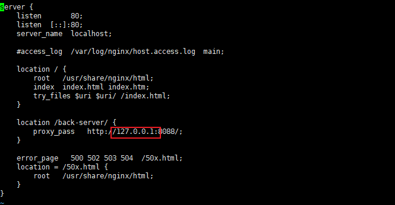
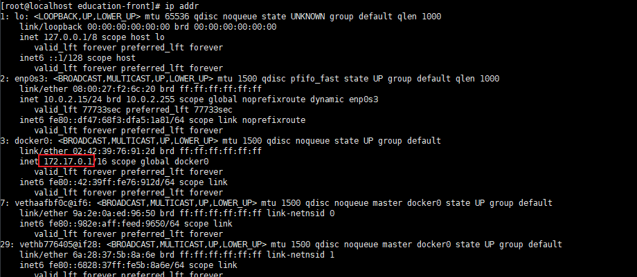

[TOC]

参考链接：https://blog.csdn.net/qq_38623939/article/details/129582950

# docker部署nginx时，proxy_pass填localhost报错502

配置以及错误如图：

## 原因

使用docker部署时，127.0.0.1指向的是[docker容器](https://so.csdn.net/so/search?q=docker%E5%AE%B9%E5%99%A8&spm=1001.2101.3001.7020)的ip

查询部署的 nginx 容器的 ip 是多少

使用 `docker ps ` 查看部署 nginx 镜像的名称

`docker inspect nginx`  // 这里的 nginx 为部署的 nginx 镜像名称

网关 ip 为 ：172.17.0.1

ip 为：172.17.0.3

使用命令 `ip addr` 查看 `docker0`  网桥下的 ip ：

那么将 nginx 中的 proxy_pass 改为 `docker0` 网桥下分配的 ip 即可。

**原理：当安装了docker，宿主机会和docker新建一个叫docker0的网桥，用于宿主机和docker容器进行通信。每个docker容器都有一个docker0网桥里分配的ip。**

