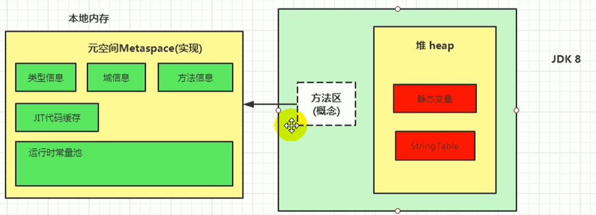
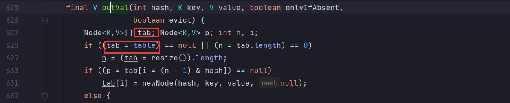
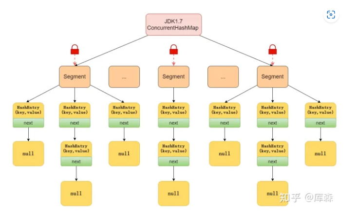

面试好文：https://www.cnblogs.com/xrq730/p/5260294.html


# 路线

## 待办

- [ ] 学习grpc框架
- [ ] 学习京东并发框架https://gitee.com/jd-platform-opensource/asyncTool


# 1、Shiro面试题

Shiro的核心概念：Subject、SecurityManager、Realm

Subject：Subject代表当前用户（不一定是人，与当前应用程序交互的任何东西都是Subject）

SecurityManager：安全管理器。与安全有关的操作都会与SecurityManager交互，并且它管理着所有的Subject，是Shiro的核心。

Realm：域，shiro从Realm中获取安全数据（如用户、角色、权限），就是说SecurityManager要验证用户身份，那么它需要从Realm获取相应的用户进行比较以确定用户身份是否合法；也需要从Realm得到用户相应的角色/权限进行验证用户是否能进行操作；可以把Realm看成DataSource，即安全数据源。

**总结：**
1、应用代码通过Subject来进行认证和授权，而Subject又委托给SecurityManager；

2、我们需要给Shiro的SecurityManager注入Realm，从而让SecurityManager能得到合法的用户及其权限进行判断。


# 2、反射

反射：在Java运行时环境中，对任何一个类，可以知道类中有哪些属性和方法。


```java
public static void main(String[] args) {

    //第一种方式获取Class对象
    Student stu1 = new Student();//这一new 产生一个Student对象，一个Class对象。
    Class stuClass = stu1.getClass();//获取Class对象
    System.out.println(stuClass.getName());

    //第二种方式获取Class对象
    Class stuClass2 = Student.class;
    System.out.println(stuClass == stuClass2);//判断第一种方式获取的Class对象和第二种方式获取的是否是同一个

    //第三种方式获取Class对象
    try {
        Class stuClass3 = Class.forName("reflect.Student");//注意此字符串必须是真实路径，就是带包名的类路径，包名.类名
        System.out.println(stuClass3 == stuClass2);//判断三种方式是否获取的是同一个Class对象
    } catch (ClassNotFoundException e) {
        e.printStackTrace();
    }
}
/***************输出结果******************/
reflect.Student
true
true

尝试用第三种方式，前两种方式需要导入Student类的包，对Student依赖性比较强。
```

## 2.1 通过反射获取类的构造器

```java
/**************************测试类*****************************/
package reflect;
/**
 * @author 千祎来了
 * @date 2022-03-29 18:07
 */
public class Student {

    public Student(){
        System.out.println("调用无参构造方法");
    }

    public Student(String name) {
        System.out.println("调用String类型有参构造方法，学生姓名：" + name);
    }

    public Student(char name) {
        System.out.println("调用char类型有参构造方法，学生姓名：" + name);
    }

    // 受保护的构造方法
    protected Student(boolean n){
        System.out.println("受保护的构造方法 n = " + n);
    }

    // 私有构造方法
    private Student(int age) {
        System.out.println("私有的构造方法   年龄：" + age);
    }

}

/**************************测试类*****************************/
package reflect;
import java.lang.reflect.Constructor;
/**
 * @author 千祎来了
 * @date 2022-03-29 18:07
 */
public class test1 {

    public static void main(String[] args) throws Exception {

        /**
         * 1、获取学生类的反射对象
         */
        Class clzz = Class.forName("reflect.Student");

        /**
         * 2、根据反射对象获取构造器
         */
        Constructor[] constructors = clzz.getConstructors();
        System.out.println("所有公共的构造器：");
        for (Constructor constructor : constructors) {
            System.out.println(constructor);
        }

        /**
         * 3、获取所有受保护的构造器
         */
        System.out.println("所有的构造器：");
        Constructor[] declaredConstructors = clzz.getDeclaredConstructors();
        for(Constructor constructor : declaredConstructors) {
            System.out.println(constructor);
        }

        /**
         * 4、根据参数类型取获得对应构造器
         */
        System.out.println("获取参数类型为char的构造器");
        Constructor charContructor = clzz.getConstructor(char.class);
        System.out.println(charContructor);
        // 使用获得的构造器实例化对象
        Object aChar = charContructor.newInstance('男');
    }

}

```

## 2.2 通过反射获取类的字段

```java
/**************************测试*****************************/
package reflect;
/**
 * @author 千祎来了
 * @date 2022-03-29 18:07
 */
public class Student {

    public Student(){

    }

    public String name;

    protected int age;

    char sex;

    private String phoneNum;

    @Override
    public String toString() {
        return "Student [name=" + name + ", age=" + age + ", sex=" + sex
                + ", phoneNum=" + phoneNum + "]";
    }

}
/**************************测试*****************************/
package reflect;

import java.lang.reflect.Constructor;
import java.lang.reflect.Field;

/**
 * @author 千祎来了
 * @date 2022-03-29 18:07
 */
public class test1 {

    public static void main(String[] args) throws Exception{

        /**
         * 1、获取反射对象
         */
        Class clzz = Class.forName("reflect.Student");

        /**
         * 2、获取所有公共字段
         */
        System.out.println("获取所有公共字段：");
        Field[] fields = clzz.getFields();
        for(Field field : fields) {
            System.out.println(field);
        }

        /**
         * 3、获取所有字段（包含私有、受保护、默认、公有）
         */
        System.out.println("获取所有字段（包含私有、受保护、默认、公有）：");
        Field[] declaredFields = clzz.getDeclaredFields();
        for(Field field : declaredFields) {
            System.out.println(field);
        }

        /**
         * 4、获取某个共有的字段
         */
        System.out.println("获取某个共有的字段：");
        Field name = clzz.getField("name");
        System.out.println(name);

        /**
         * 4、获取某个字段(可以是私有的)
         */
        System.out.println("获取某个字段(可以是私有的)：");
        Field phoneNum = clzz.getDeclaredField("phoneNum");
        System.out.println(phoneNum);

        /**
         * 5、获取公有字段并调用（获取私有的使用使用get）
         */
        System.out.println("获取公有字段并调用：");
        Field f = clzz.getField("name");
        Object obj = clzz.newInstance();
        f.set(obj, "张三");
        Student student = (Student) obj;
        System.out.println("姓名：" + student.name);
        System.out.println(student);
    }

}
```


## 2.3 反射的应用


# 3、序列化

序列化：将Java对象转换为字节序列

反序列化：将字节序列转换为Java对象


> `序列化目的：`
>
> Java对象运行在JVM的堆内存中，在JVM停止之后，将这些对象通过磁盘或网络传输到其他机器时，就需要将这些对象转化为字节数组。


> `序列化需要注意：`
>
> - static和transient修饰的字段不会被序列化
> - 如果某个序列化类的成员变量是对象类型，则该对象类型的类也必须实现序列化
> - 子类实现了序列化，父类没有实现序列化，父类中的字段会丢失
> - serialVersionUID
>   - Java序列化机制通过判断类的serialVersionUID来验证版本是否一致，在反序列化时，JVM会将传来的字节流中的serialVersionUID和本地相应实体类的serialVersionUID比较，如果相同，反序列化成功，如果不同，就抛出InvalidClassException异常。

## 3.1 Java序列化的缺点

java通过实现Serializable接口来实现序列化，速度很慢！

**为什么不推荐使用 JDK 自带的序列化？**

我们很少或者说几乎不会直接使用 JDK 自带的序列化方式，主要原因有下面这些原因：

- **不支持跨语言调用** : 如果调用的是其他语言开发的服务的时候就不支持了。
- **性能差** ：相比于其他序列化框架性能更低，主要原因是序列化之后的字节数组体积较大，导致传输成本加大。
- **存在安全问题** ：序列化和反序列化本身并不存在问题。但当输入的反序列化的数据可被用户控制，那么攻击者即可通过构造恶意输入，让反序列化产生非预期的对象，在此过程中执行构造的任意代码。


## 3.2 自己实现序列化

```java
// 自动序列化方法1
public byte[] codeC() {
    ByteBuffer buffer = ByteBuffer.allocate(1024);
    byte[] value = this.userName.getBytes();
    buffer.putInt(value.length); // 写入字节数组value的长度
    buffer.put(value); // 写入字节数组value
    buffer.putInt(this.userId);
    buffer.flip();
    value = null;
    byte[] result = new byte[buffer.remaining()];
    buffer.get(result);
    return result;
}
```


## 3.3 自定义序列化过程

对于序列化一个对象需调用 ObjectOutputStream.writeObject(saveThisObject), 并用 ObjectInputStream.readObject() 读取对象, 但 Java 虚拟机为你提供的还有一件事, 是定义这两个方法。如果在类中定义这两种方法, 则 JVM 将调用这两种方法, 而不是应用默认序列化机制。同时，可以声明这些方法为私有方法，以避免被继承、重写或重载。

> 如果自定义序列化方法`writeObject`和`readObject`的话，在我们需要序列话的时候，直接调用我们自定义的序列化方法就可以

在hashMap中就自定义了writeObject和readObject


## 3.4 不序列化某些字段-transient

对于不想进行序列化的变量，使用 `transient` 关键字修饰。

`transient` 关键字的作用是：阻止实例中那些用此关键字修饰的的变量序列化；当对象被反序列化时，被 `transient` 修饰的变量值不会被持久化和恢复。

关于 `transient` 还有几点注意：

- `transient` 只能修饰变量，不能修饰类和方法。
- `transient` 修饰的变量，在反序列化后变量值将会被置成类型的默认值。例如，如果是修饰 `int` 类型，那么反序列后结果就是 `0`。
- `static` 变量因为不属于任何对象(Object)，所以无论有没有 `transient` 关键字修饰，均不会被序列化。


# 4、克隆

克隆分为浅克隆和深克隆

- **浅克隆：**在浅克隆中，如果原型对象的成员变量是值类型，将赋值一份给克隆对象；如果原型对象的成员变量是引用类型，则将引用对象的地址复制一份给克隆对象

  浅克隆通过覆盖Object类的clone()方法可以实现浅克隆

- **深克隆：**在深克隆中，无论原型对象的成员变量是值类型，都会复制一份给克隆对象。（主要是对引用类型的成员变量进行赋值）

  但是如果引用类型里边还包含引用类型的成员变量，那么需要深克隆的话，使用覆盖clone()方法来深克隆就会很麻烦，这是我们可以使用序列化的方式来实现对象的深克隆。

https://www.cnblogs.com/Qian123/p/5710533.html


## 4.1未克隆对象产生的问题

对象的复制只复制了对象在堆中的地址，修改原对象之后，克隆对象也会发生修改。

```java
public class Student {

    public Integer id;

    public String name;

    public Integer age;

    @Override
    public String toString(){
        return "Student { id:" + this.id + ", name:" + this.name + ", age:" + this.age + "}";
    }

    public Integer getId() {
        return id;
    }

    public void setId(Integer id) {
        this.id = id;
    }

    public String getName() {
        return name;
    }

    public void setName(String name) {
        this.name = name;
    }

    public Integer getAge() {
        return age;
    }

    public void setAge(Integer age) {
        this.age = age;
    }
}

public class test1 {

    public static void main(String[] args) throws Exception{
        Student stu1 = new Student();
        stu1.id = 1;
        stu1.name = "张三";
        stu1.age = 22;
        Student stu2 = stu1;
        System.out.println("修改属性前：");
        System.out.println(stu1);
        System.out.println(stu2);
        stu1.name = "李四";
        System.out.println("修改属性后：");
        System.out.println(stu1);
        System.out.println(stu2);
    }

}

```

## 4.2深克隆和浅克隆代码（实现Cloneable接口方式）

```java
/******************Address类**********************/
public class Address implements Cloneable{
    public String addr;

    public String getAddr() {
        return addr;
    }

    public void setAddr(String addr) {
        this.addr = addr;
    }

    @Override
    public String toString() {
        return "Address{" +
                "addr='" + addr + '\'' +
                '}';
    }

    @Override
    public Object clone(){
        Address address = null;
        try {
            address = (Address) super.clone(); // 实现浅克隆
        } catch (CloneNotSupportedException e) {
            e.printStackTrace();
        }
        return address;
    }
}
/******************Student类**********************/
public class Student implements Cloneable{

    public String name;

    public Address address;

    public String getName() {
        return name;
    }

    public void setName(String name) {
        this.name = name;
    }

    public Address getAddress() {
        return address;
    }

    public void setAddress(Address address) {
        this.address = address;
    }

    @Override
    public String toString() {
        return "Student{" +
                "name='" + name + '\'' +
                ", address=" + address +
                '}';
    }

    @Override
    public Object clone()  {
        Student stu = null;
        try {
            stu = (Student) super.clone(); // 浅克隆
        } catch (CloneNotSupportedException e) {
            e.printStackTrace();
        }
        stu.address = (Address)address.clone(); // 深克隆
        return stu;
    }
}

/******************测试类**********************/
public class test1 {

    public static void main(String[] args) throws Exception{
        /**
         * 1、创建原对象并赋值
         */
        Student stu1 = new Student();
        stu1.name = "张三";
        Address address = new Address();
        address.addr = "山东";
        stu1.address = address;

        /**
         * 2、创建克隆对象
         */
        Student stu2 = (Student) stu1.clone();

        /**
         * 3、输出修改前的数据
         */
        System.out.println("修改属性前：");
        System.out.println(stu1);
        System.out.println(stu2);
        /**
         * 4、修改原对象，并输出修改后的数据
         */
        stu1.name = "李四";
        address.addr = "山西";
        System.out.println("修改属性后：");
        System.out.println(stu1);
        System.out.println(stu2);
    }

}

```

看到通过序列化实现深克隆


# 5、ThreadLocal

提供了`线程本地变量`。


## 5.1 简单使用

```java
public class Demo1 {

    // 初始化
    ThreadLocal<Integer> number = ThreadLocal.withInitial(() -> 0);

    public void incr(int cnt) {
        number.set(number.get() + cnt);
    }

    public static void main(String[] args) {
        Demo1 demo = new Demo1();
        for (int i = 0; i < 5; i++) {
            new Thread(() -> {
                try {
                    int cnt = new Random().nextInt(5) + 1;
                    // 随机增加
                    demo.incr(cnt);
                    System.out.println(Thread.currentThread().getName() + "完成操作，number：" + demo.number.get());
                } finally {
                    // 阿里巴巴手册规定使用之后，需要进行回收，否则ThreadLocal里的值可能影响后续逻辑以及造成内存泄漏
                    demo.number.remove();
                }
            }, String.valueOf(i)).start();
        }

        /**
         * 输出：
         * 3完成操作，number：1
         * 4完成操作，number：2
         * 2完成操作，number：4
         * 0完成操作，number：2
         * 1完成操作，number：1
         */
    }
}
```


## 5.2 ThreadLocal造成内存泄漏


ThreadLocalMap结构如下图，其中`ThreadLocal`为key，通过继承`WeakReference<ThreadLocal<?>>`将key变为了弱引用


### 5.2.1 为什么使用弱引用？

`弱引用：`只要被垃圾回收线程扫描到，就会进行回收。

`强引用：`最普遍的引用，如果一个对象具有强引用，那么垃圾回收器绝对不会回收他。new对象就相当于强引用

```java
public static void main(String[] args) {
  ThreadLocal tl = new ThreadLocal();
  tl.set("1020");
  tl.get();
}
```

上边代码中，ThreadLocal与ThreadLocalMap中的Entry关系如下图所示。

我们知道Entry中的key存储的是ThreadLocal对象，并且是弱引用，为什么需要使用弱引用呢？

假如是强引用的话，当我们把tl置为null的话，那么线程栈中tl指向ThreadLocal对象的强引用就消失了，如果Entry中的key强引用指向ThreadLocal对象，那么我们访问不到ThreadLocal对象，而且有强引用指向ThreadLocal对象，GC无法回收，从而造成内存泄露。

假如是弱引用的话，当tl指向ThreadLocal对象的强引用消失之后，Entry中的key指向ThreadLocal是弱引用，因此只要被扫描到，就会对ThreadLocal进行垃圾回收，不会导致ThreadLocal对象无法回收导致内存泄漏。


### 5.2.2 使用弱引用还会存在的问题

当ThreadLocal对象的外部强引用tl被置为null时，系统GC的时候，根据可达性分析，这个ThreadLocal对象没有任何一条链路可以引用到它，就会将ThreadLocal对象给回收，这样Entry中的key为该ThreadLocal对象的Entry就会出现key为null的情况，那么无法获取他的value，那么这个key为null的entry就会存在一条强引用链：`Thread Ref -> Thread -> ThreadLocalMap -> Entry -> value`，value无法回收，造成内存泄露

**如何避免：在使用完ThreadLocal后，使用remove来删除。**

> 但是如果当前Thread运行结束，ThreadLocal、ThreadLocalMap、Entry没有引用链可达，那么这个Entry就会被回收
>
> 但是实际使用会使用线程池维护我们的线程，因此更加需要小心ThreadLocal造成的内存泄漏


# 6、volatile

## 6.1 前置知识-Java内存模型


Java内存模型规定，所有的变量都放在主内存中，线程如果使用的话，会从主内存拷贝到自己的工作内存，在工作内存中进行处理，之后再将处理后的值更新到主内存中。

## 6.2 volatile特性

**volatile并不保证原子性**

- 可见性

  - 当变量被声明为volatile时，线程在写入变量时，不会将变量缓存在寄存器或其他地方，会将变量值直接写回主内存，线程在读入变量时，会从主内存读取最新变量

- 有序性

  - Java内存模型允许编译器和处理器对指令重排序以提高运行性能，并且只会对不存在数据依赖性的指令重排序。

    > 如果有两个操作，其中有一个操作是写操作，那么这两个操作就有数据依赖性

  - volatile通过在编译生成字节码时，在指令序列中添加`内存屏障`来禁止指令重排的


## 6.3 volatile实现DCL-双端检锁

构造单例对象——双端检锁代码

```java
public class Singleton {
    private static Singleton INSTANCE;

    private Singleton() {

    }

    public static Singleton getInstance() {
        //第一次校验单例对象是否为空
        if (INSTANCE == null) {
            //同步代码块
            synchronized (Singleton.class) {
                //第二次校验单例对象是否为空
                 if (INSTANCE == null) {
                    INSTANCE = new Singleton();
                 }
            }
        }
        return INSTANCE;
    }

    public static void main(String[] args) {
        for (int i = 0; i < 20; i++) {
            new Thread(() -> System.out.println(Singleton.getInstance().hashCode())).start();
        }
    }
}
```

> 从字节码层面来看上述代码

```bash
 0 getstatic #2 <com/qy/nettychat/Volatile/Demo1.INSTANCE : Lcom/qy/nettychat/Volatile/Demo1;>
 3 ifnonnull 37 (+34)
 6 ldc #3 <com/qy/nettychat/Volatile/Demo1>
 8 dup
 9 astore_0
10 monitorenter
11 getstatic #2 <com/qy/nettychat/Volatile/Demo1.INSTANCE : Lcom/qy/nettychat/Volatile/Demo1;>
14 ifnonnull 27 (+13)
17 new #3 <com/qy/nettychat/Volatile/Demo1>
20 dup
21 invokespecial #4 <com/qy/nettychat/Volatile/Demo1.<init> : ()V>
24 putstatic #2 <com/qy/nettychat/Volatile/Demo1.INSTANCE : Lcom/qy/nettychat/Volatile/Demo1;>
27 aload_0
28 monitorexit
29 goto 37 (+8)
32 astore_1
33 aload_0
34 monitorexit
35 aload_1
36 athrow
37 getstatic #2 <com/qy/nettychat/Volatile/Demo1.INSTANCE : Lcom/qy/nettychat/Volatile/Demo1;>
40 areturn
```


> 其中DCL部分字节码如下

```java
17 new #3 <com/qy/nettychat/Volatile/Demo1>
20 dup
21 invokespecial #4 <com/qy/nettychat/Volatile/Demo1.<init> : ()V>
24 putstatic #2 <com/qy/nettychat/Volatile/Demo1.INSTANCE : Lcom/qy/nettychat/Volatile/Demo1;>
```

- new 创建一个对象，并将其引用压入栈顶
- dup 复制栈顶数值并将值压入栈顶
- invokespecial 调用Demo1的初始化方法
- putstatic 将该引用赋值给静态变量 INSTANCE

在单线程下 `putstatic` 和 `invokespecial` 进行指令重排，可以提高效率；在多线程下，指令重排可能会出现意想不到的结果

- 单线程情况下，JVM在执行字节码时，会出现指令重排情况：在执行完`dup`指令之后，跳过构造方法的指令(`invokespecial`) ，直接执行`putstatic`指令，然后再将操作数栈上剩下的引用来执行`invokespecial`。单线程情况下JVM任何打乱`invokespecial`和`putstatic`执行顺序并不会影响程序执行的正确性。
- 多线程情况下，如果发生上述指令重排，此时第二个线程执行`getInstance`会执行到`if(INSTANCE==NULL)`，**此时会拿到一个尚未初始化完成的对象，那么使用未初始化完成的对象时可能会发生错误。**

# 7、JDK源码

## 7.0 Java集合面试题

### 7.0.1 有哪些集合是线程不安全的？怎么解决呢？


## 7.1 Map源码

JDK1.8引入了红黑树，HashMap底层数据结构发生了改变：`数组+链表` --> `数组+链表+红黑树`

使用红黑树来优化过长的链表。


我们通过HashMap常用的方法来进行深入了解

### 7.1.1 初始化


```java
public HashMap(int initialCapacity, float loadFactor) {
    if (initialCapacity < 0)
        throw new IllegalArgumentException("Illegal initial capacity: " +
                                           initialCapacity);
    if (initialCapacity >  MAXIMUM_CAPACITY)
        initialCapacity = MAXIMUM_CAPACITY;
    if (loadFactor <= 0 || Float.isNaN(loadFactor))
        throw new IllegalArgumentException("Illegal load factor: " +
                                           loadFactor);
    this.loadFactor = loadFactor;
    this.threshold = tableSizeFor(initialCapacity);
}

public HashMap(int initialCapacity) {
    this(initialCapacity, DEFAULT_LOAD_FACTOR);
}

public HashMap() {
    this.loadFactor = DEFAULT_LOAD_FACTOR; // all other fields defaulted
}

public HashMap(Map<? extends K, ? extends V> m) {
    this.loadFactor = DEFAULT_LOAD_FACTOR;
    putMapEntries(m, false);
}
```

总共有4个构造方法，其余三个都不复杂，看一下第一个含有两个参数的构造函数，其中`tableSizeFor`方法给threshold赋值，我们来看一下`tableSizeFor`方法

```java
static final int tableSizeFor(int cap) {
    int n = cap - 1;
    n |= n >>> 1;
    n |= n >>> 2;
    n |= n >>> 4;
    n |= n >>> 8;
    n |= n >>> 16;
    return (n < 0) ? 1 : (n >= MAXIMUM_CAPACITY) ? MAXIMUM_CAPACITY : n + 1;
}
```

`该方法的目的`：返回一个大于等于cap的2的整数次幂的数

假如`cap=128`，二进制为`1000 0000`

- `n |= n >>> 1：  1000 0000| 0100 0000 = 1100 0000` 前两位变为1
- `n |= n >>> 2： 1100 0000| 0011 0000 = 1111 0000` 前四位变为1
- `n |= n >>> 4： 1111 0000 | 00001111 = 1111 1111`前八位变为1

那么我们知道了这个移位之后或运算的目的是`将最高位的1后边都变为1`

>  那么为什么要`int n = cap - 1;`？

就像上边的举例，如果`cap = 1000 0000`

- 不减去1的话，处理后的数为`1111 1111`，最后结果再加1为`1 0000 0000`
- 如果减去1的话，处理后的数为`0111 1111`，最后结果再加1为`1000 0000`

很显然，如果减1才可以获取大于`等于`cap的2的整数次幂的值。


### 7.1.2 hash

HashMap中是如何来计算key的hash值的？

```java
static final int hash(Object key) {
    int h;
    return (key == null) ? 0 : (h = key.hashCode()) ^ (h >>> 16);
}
```

`>>>`：无符号右移

计算hash值时，将key的hashCode与key的hashCode高位进行异或操作，我们在putVal时，存入`<key,val>`时计算下标i的公式为：`i=(n-1) & hash`，其中n为map的容量，那么计算下标i的时候采用了`与运算`，只有hash的低位会参与运算，高位就没有影响了，那么我们为了让计算的结果更加平均，将`hashCode`与`hashCode的高位`进行异或操作，**增加高位对于计算下标的影响**。


### 7.1.3 put方法


> 我们跟随调用链一步一步向下看

```java
public class HashDemo {
    public static void main(String[] args) {
        HashMap<String, Object> map = new HashMap<>();
        map.put("key", new Object());
    }
}
```

> 在put方法中调用putVal，key的hash值计算在上边已经讲过了

```java
public V put(K key, V value) {
    return putVal(hash(key), key, value, false, true);
}
```

> 这里传入的 `onlyIfAbsent=false`，`evict=true`

```java
final V putVal(int hash, K key, V value, boolean onlyIfAbsent,
               boolean evict) {
    Node<K,V>[] tab; Node<K,V> p; int n, i;
    // 1.第一次向hashMap中放<key,value>时，会对table进行初始化操作，在resize()中进行
    // 这里有个细节：先定义变量tab，将table赋值给tab，之后会使用tab不适用table，原因在于tab变量存在于栈中，而table变量存在于堆中，去栈中去变量要比去堆中去变量效率更高
    if ((tab = table) == null || (n = tab.length) == 0)
        n = (tab = resize()).length;
    // 2.获取当前节点在tab中存储的下标，如果该下标位置没有元素
    if ((p = tab[i = (n - 1) & hash]) == null)
        // 2.1 直接初始化
        tab[i] = newNode(hash, key, value, null);
    // 3.发生碰撞
    else {
        
        Node<K,V> e; K k;
        // 3.1 如果key相同，更新key的值
        if (p.hash == hash &&
            ((k = p.key) == key || (key != null && key.equals(k))))
            e = p;
        // 3.2 如果该节点为TreeNode，调用红黑树的方法进行插入
        else if (p instanceof TreeNode)
            e = ((TreeNode<K,V>)p).putTreeVal(this, tab, hash, key, value);
        // 3.3 如果该节点为链表
        else {
            // 3.3.1 遍历链表，并统计链表长度
            for (int binCount = 0; ; ++binCount) {
                // 3.3.1.1
                if ((e = p.next) == null) {
                    p.next = newNode(hash, key, value, null);
                    // 3.3.1.2 将链表结构变为树结构
                    if (binCount >= TREEIFY_THRESHOLD - 1) // -1 for 1st
                        treeifyBin(tab, hash);
                    break;
                }
                if (e.hash == hash &&
                    ((k = e.key) == key || (key != null && key.equals(k))))
                    break;
                p = e;
            }
        }
        // 3.4如果对于给的key，已经存在节点了
        if (e != null) { // existing mapping for key
            V oldValue = e.value;
            if (!onlyIfAbsent || oldValue == null)
                e.value = value;
            afterNodeAccess(e);
            return oldValue;
        }
    }
    ++modCount;
    // 4.如果大小大于threshold的话，会进行扩容
    if (++size > threshold)
        resize();
    afterNodeInsertion(evict);
    return null;
}

```


#### put()总结

1. 将节点放入table数组，如果第一次放入，则会调用`resize`初始化table数组
2. 计算下标
   1. 如果下标位置没有节点，直接放入
   2. 如果下标位置有节点
      1. 如果key相同，更新原来value
      2. 如果为TreeNode，调用红黑树的方法进行插入
      3. 如果为链表，遍历链表直到末尾，将节点插入末尾，如果在中间找到了key相同的节点，则更新value值；在遍历链表过程中统计链表节点数，如果达到转为红黑树的个数，就将链表转为红黑树
3. 如果节点数超过`threshold`，就进行扩容

### 7.1.4 扩容resize方法

> 在该方法中堆table进行初始化或者两倍扩容

```java
final Node<K,V>[] resize() {
    Node<K,V>[] oldTab = table;
    int oldCap = (oldTab == null) ? 0 : oldTab.length;
    int oldThr = threshold;
    int newCap, newThr = 0;
    // 1.table不为空，进行扩容操作
    if (oldCap > 0) {
        // 1.1 如果之前的容量已经达到最大，就不进行扩容，这里MAXIMUM_CAPACITY=1<<30
        if (oldCap >= MAXIMUM_CAPACITY) {
            // 1.1.1 直接将阈值跳到最大
            threshold = Integer.MAX_VALUE;
            return oldTab; 
        }
        // 1.2 将容量扩容为原来的二倍
        else if ((newCap = oldCap << 1) < MAXIMUM_CAPACITY &&
                 oldCap >= DEFAULT_INITIAL_CAPACITY)
            // 1.2.1 threshold=capacity*loadfactor，那么capacity乘2的话，threshold也乘2
            newThr = oldThr << 1; // double threshold
    }
    // 2.若不满足oldCap>0，则说明数组为初始化，那么为什么oldThr会大于0呢？
    // 因为如果调用HashMap的有参构造函数，会对threshold进行初始化，threshold大小为第一个大于你指定容量的2的次幂的数
    else if (oldThr > 0) // initial capacity was placed in threshold
        // 2.1在初始化时，将threshold值赋给newCap，HashMap使用threshold暂存initialCapacity的值
        newCap = oldThr;
    else {               // zero initial threshold signifies using defaults
        // 3.调用无参构造HashMap时，桶数组容量为默认容量，阈值为默认容量(16)与默认负载因子(0.75)乘积
        newCap = DEFAULT_INITIAL_CAPACITY;
        newThr = (int)(DEFAULT_LOAD_FACTOR * DEFAULT_INITIAL_CAPACITY);
    }
    // 4.阈值为0，按阈值计算公式计算
    // 经过上边执行完，newCap一定有值，但是如果执行的是第2个if语句，则newThr仍然为0
    if (newThr == 0) {
        float ft = (float)newCap * loadFactor;
        newThr = (newCap < MAXIMUM_CAPACITY && ft < (float)MAXIMUM_CAPACITY ?
                  (int)ft : Integer.MAX_VALUE);
    }
    threshold = newThr;
    @SuppressWarnings({"rawtypes","unchecked"})
    // 5.创建新的桶数组
    Node<K,V>[] newTab = (Node<K,V>[])new Node[newCap];
    table = newTab;
    if (oldTab != null) {
        for (int j = 0; j < oldCap; ++j) {
            Node<K,V> e;
            if ((e = oldTab[j]) != null) {
                oldTab[j] = null;
                // 5.1当前位置只有一个节点，直接赋值即可
                if (e.next == null)
                    newTab[e.hash & (newCap - 1)] = e;
                // 5.2若该节点为TreeNode，则该位置的链表已经被转换为红黑树，则调用红黑树的方法将节点加入到新数组中
                else if (e instanceof TreeNode)
                    ((TreeNode<K,V>)e).split(this, newTab, j, oldCap);
                else { // preserve order
                    // 5.3到这里说明该链表不止一个节点，遍历链表，保留原来的顺序
                    // 这里的逻辑放到下边单独讲解
                    Node<K,V> loHead = null, loTail = null;
                    Node<K,V> hiHead = null, hiTail = null;
                    Node<K,V> next;
                    do {
                        next = e.next;
                        if ((e.hash & oldCap) == 0) {
                            if (loTail == null)
                                loHead = e;
                            else
                                loTail.next = e;
                            loTail = e;
                        }
                        else {
                            if (hiTail == null)
                                hiHead = e;
                            else
                                hiTail.next = e;
                            hiTail = e;
                        }
                    } while ((e = next) != null);
                    if (loTail != null) {
                        loTail.next = null;
                        newTab[j] = loHead;
                    }
                    if (hiTail != null) {
                        hiTail.next = null;
                        newTab[j + oldCap] = hiHead;
                    }
                }
            }
        }
    }
    return newTab;
}
```

下面讲一下上边代码5.3的逻辑

> resize()时，如果原节点位置的链表上有多个节点，会如何分配这些节点到新数组呢？

首先，下图为HashMap扩容图，原本的节点经过扩容后，节点会重新计算下标，放置在新数组中

.jpg)


> 首先来看，节点放入数组的下标是如何计算的

```java
newTab[e.hash & (newCap - 1)] = e;
```

是通过key的`hash值 & (newCap-1)`，也就是相当于`hash % newCap`。


原先的几个节点hash值分别为：2、10、18、26，在原数组的下标为2的位置

那么下标计算为：

hash = 2：  `原位置：`0010 & 111 = 010   `新位置：`0010 & 1111 = 0010 

hash = 10:  `原位置：`1010 & 111 = 010   `新位置：`1010 & 1111 = 1010

hash = 18:  `原位置：`10010 & 111 = 010  `新位置：`10010 & 1111 = 0010

hash = 26:  `原位置：`11010 & 111 = 010  `新位置：`11010 & 1111 = 1010

我们会发现

- 如果`hash&oldCap=0`也就是`hash&1000=0`的话，该节点在新数组的位置不会发生改变
- 如果`hash&oldCap=1`的话，新位置就是原位置加上`oldCap`

那么下边这段代码的含义也就清晰了，在721行，如果`e.hash & oldCap == 0`，那么节点在新数组的位置跟节点在原数组位置相同；如果`e.hash & oldCap == 1`，那么节点在新数组的位置就比节点在原数组的位置多`oldCap`个单位


#### resize()总结

对hashMap进行扩容，扩容为原数组的2倍，扩容之后，下标遍历原数组，将原数组的节点加入到新数组，有3中情况

- 原数组下标只有一个节点，那么直接放入新数组
- 原数组下标指向的节点为TreeNode，那么调用红黑树的方法将节点加入新数组中
- 原数组下标指向的节点是一个链表（包含多个节点），那么遍历链表，逐个插入新数组


### 7.1.5 modCount


modCount记录HashMap的修改次数


> 在哪里使用了？

在HashIterator中，初始化时，会将当前HashMap的`modCount`赋值给HashIterator的`expectedModCount`，那么在遍历的时候，如果发现`expectedModCount != modCount`，那就说明在遍历过程中，HashMap被修改了，因此直接抛出`ConcurrentModificationException`


通过上边代码，可以发现如果在Iterator遍历的时候，HashMap发生了修改，那么就会抛出`ConcurrentModificationException`异常

**总结：modCount就是为了避免在遍历过程中，HashMap被修改而设计的**

有的文章说modCount是为了防止其他线程修改HashMap而设计的，因为HashMap是线程不安全的，这是不对的，因为在JDK8中并没有将modCount定义为volatile，那对于其他线程来说，不一定能读取到最新的modCount值。

> 参考：https://blog.csdn.net/dabusiGin/article/details/105483426

### 7.1.6 transient


我们发现HashMap中的这四个变量都是使用`transient`进行修饰的，首先看一下`transient`关键字的作用：

>  transient是Java语言的关键字，用来表示一个域不是该对象串行化的一部分。当一个对象被串行化的时候，transient型变量的值不包括在串行化的表示中，也就是说没法持久化。

那么使用transient修饰的意思就是，HashMap需要将table、entrySet、size、modeCount这几个变量进行持久化，这是为什么呢？

有两个原因

> 1. table数组中并不是所有位置都存储元素了，那么保存table数组时，只需要保存那些存有数据的节点即可，因此不需要持久化整个table数组
>
> 2. 元素放入table数组的下标是通过key的hash值来计算的，而hashCode的计算是本地方法，也就是如果运行在不同的JVM上，hashCode的取值会不同，因此直接序列化table，在反序列化的时候，如果hashCode计算的不一样，会导致找不到节点
>
>    

## List、Map、Set源码


## 7.2 ReentrantLock、AQS


## 7.3 AtomicInteger

实现原理，主要能说清楚CAS机制并且AtomicInteger是如何利用CAS机制实现的


## 7.4 线程池的实现原理


## 7.5 Object类

Object中的方法以及每个方法的作用


# 8、JVM

## 8.1 核心

### 8.1.1 JVM内存结构


方法区和堆是所有线程共享的内存区域；而java栈、本地方法栈和程序计数器是运行时线程私有的内存区域。

- Java堆（Heap）,是Java虚拟机所管理的内存中最大的一块。Java堆是被所有`线程共享`的一块`内存区域`，在虚拟机启动时创建。此内存区域的唯一目的就是存放对象实例，几乎所有的对象实例都在这里分配内存。
- 方法区（Method Area）,方法区（Method Area）与Java堆一样，是各个线程共享的内存区域，它用于存储已被虚拟机加载的`类信息、常量、静态变量、即时编译器编译后的代码`等数据。
- 程序计数器（Program Counter Register）,程序计数器（Program Counter Register）是一块较小的内存空间，它的作用可以看做是当前线程所执行的字节码的行号指示器。
- Java虚拟机栈（JVM Stacks）,与程序计数器一样，Java虚拟机栈（Java Virtual Machine Stacks）也是线程私有的，它的生命周期与线程相同。虚拟机栈描述的是Java方法执行的内存模型：每个方法被执行的时候都会同时创建一个栈帧（Stack Frame）用于存储`局部变量表、操作数栈、动态链接、方法返回地址`等信息。每一个方法被调用直至执行完成的过程，就对应着一个栈帧在虚拟机栈中从入栈到出栈的过程。
- 本地方法栈（Native Method Stacks）,本地方法栈（Native Method Stacks）与虚拟机栈所发挥的作用是非常相似的，其区别不过是虚拟机栈为虚拟机执行Java方法（也就是字节码）服务，而本地方法栈则是为虚拟机使用到的Native方法服务。

### 8.1.2 元空间和方法区的关系

方法区只是一个规范，元空间是对JVM规范中方法区的实现，元空间不在JVM内存，而是使用**本地内存**。


使用元空间Metaspace代替永久代


**jvm中方法区的演变**

| 版本        | 变化                                       |
| --------- | ---------------------------------------- |
| jdk1.6及之前 | 有永久代（Permanent generation），静态变量存放在永久代    |
| jdk1.7    | 字符串常量池、静态变量移出永久代，存放在堆中                   |
| jdk1.8及之后 | 去除了永久代，类型信息、字段、方法、常量保存在本地内存的元空间，<br />但字符串常量池、静态变量仍在堆中 |

`jdk1.7中字符串常量池StringTable为什么从永久代移到堆中？`

1. 永久代回收效率低，只有full gc才会触发，导致开发中创建的大量StringTable不能及时回收

`为什么去掉永久代？`

1. 永久代在JVM中，合适的大小难以确定，在某些场景下，如果动态加载类过多，容易产生永久代OOM

   > 元空间（`也就是HotSpot虚拟机的方法区）`分配在本地内存，无需考虑大小




### 8.1.3 栈、堆、方法区的用法

**`栈：`**

在方法体中定义的引用和基本数据类型的变量都保存在栈中


**`堆：`**

**堆是垃圾收集器管理的主要区域**


- Java8之后，堆内存逻辑上分为2部分：新生代、老年代
  - 新生代分为Eden、From Survivor（也称Survivor0）、To Survivor（也称Survivor1）
    - 默认`-XX:NewRatio=2`，表示新生代占1/3，老年代占2/3的对空间
    - 默认`-XX:SurvivorRatio=8`，表示`Eden:Survivor0:Survivor1=8:1:1`


#### 对象内存分配策略

> 对象如何分配空间？
>
> 1. new的对象先放在Eden区
>
> 2. 当Eden区空间满了，程序又需要创建对象，垃圾回收器对Eden区执行一次Minor GC， 回收Eden区不再被其他对象所引用的对象，再将新创建的对象放到Eden区
>
> 3. 然后将Eden区的剩余存活对象移动到Survivor0区
>
> 4. 如果再次触发GC，上次幸存下来放到Survivor0区中的对象，如果还没有被回收，就会放到Survivor1区，同时Eden区中幸存的对象也会放到Survivor1区中 
>
> 5. 如果再次经历垃圾回收，会重新放回Survivor0区
>
> 6. 啥时候去老年代呢？可以设置次数。默认是15次（经过一次MinorGC，对象要么从Eden到Survivor，要么从Survivor0到Survivor1，会记录这个转移次数，也就是该对象的年龄）
>
>    `-XX:MaxTenuringThreshold=<N>`进行设置
>
> 7. 当老年代空间不足时，触发Major GC，清理老年代空间
>
> 8. 若老年代执行了Major GC后发现仍然无法保存对象，就会产生OOM异常


### 8.1.4 Minor GC、Major GC和Full GC

针对HotSpot VM的实现，它里面的GC按照回收区域分两种类型：一种是部分收集、一种是整堆收集

- 部分收集又分为：
  - 新生代收集（Minor GC/ Young GC）：只回收新生代
  - 老年代收集（Major GC/ Old GC）：只回收老年代
    - 目前，只有CMS GC会有单独收集老年代的行为
  - 混合收集（Mixed GC）：收集整个新生代以及部分老年代的垃圾
    - 目前，只有G1 GC会有这种行为
- 整堆收集（Full GC）：收集整个Java堆和方法区的垃圾收集

> Minor GC触发机制
>
> - Eden空间不足，会触发，Survivor满不会触发
> - Minor GC很频繁，回收速度也比较快
> - Minor GC会引发STW(Stop The World)，暂停其他用户线程，等垃圾回收结束后，用户线程恢复运行


> Major GC触发机制
>
> - 出现了Major GC，经常会伴随至少一次的Minor GC（但非绝对，在Parallel Scavenge收集器的收集策略里就有直接进行Major GC的策略选择过程）
> - Major GC速度比Minor GC慢10倍以上，STW时间更长
> - 如果Major GC后，内存还不足，就OOM


> Full GC触发机制
>
> - 调用System.gc()时，系统建议执行Full GC，但是不必然执行
> - 老年代空间不足
> - 方法区空间不足
> - 通过Minor GC后进入老年代的平均大小大于老年代的可用内存
> - 由Eden区、Survivor0区向Survivor1区复制时，对象大小大于Survivor1区可用内存时，则把该对象转存到老年代，且老年代的可用内存小于该对象大小
>
> 要尽量避免Full GC


### 8.1.5 对象都分配在堆中吗？

不是。

存在一种特殊情况，那就是**如果经过逃逸分析后发现，一个对象并没有逃逸出方法的话，那么就可能被优化成栈上分配。**

分配在栈中的话，可以减少GC的压力

**不过大对象无法在栈上进行分配**

> 在HashMap源码中，先声明tab变量，再将table分配给tab变量，tab变量就存储在了栈中，提高了速度。
>
> 


### 8.1.6 JVM加载class文件流程

分为三个步骤：

- 加载：将类的.class文件读入内存，获取该.class文件的二进制字节流，再将这个字节流代表的存储结构转化为方法去的运行时数据结构，产生与之对应的Class对象，作为方法区这个类的各种数据的访问入口

- 链接：包括3个步骤

  - 验证：确保class文件的字节流符合当前虚拟机的要求

  - 准备：为类变量(静态变量)分配内存并设置初始值

  - 解析：将常量池内的符号引用转换为直接引用

    - 符号引用：在编译时并不直到引用目标具体位置，因此使用符号引用，例如`org.simple.People`，来表示People这个类`（符号引用的目标不一定存在于内存）`

    - 直接引用：类变量、类方法的直接引用是指向方法区的指针；实例变量、实例方法的直接引用是偏移量；直接引用还是能间接定位到目标的句柄`（直接引用的目标已经加载入内存）`

      ```java
      // 符号引用
      String str = "abc";
      System.out.println(str);
      // 直接引用
      System.out.println("abc");
      ```

      ​

- 初始化：执行类构造器方法`<clinit>()`的过程，`<clinit>()`并不同于类的构造器，构造器是`<init>()`

  - clinit构造方法只会初始化`类变量、静态代码块`，也就是如果一个类有类变量或静态代码块，该类才会有`<clinit>()`方法


### 8.1.7 双亲委派机制

加载类的class文件时，Java虚拟机采用的是`双亲委派机制`，即把请求交给父类加载器去加载


> **工作原理：**
>
> 1. 如果一个类加载器收到了类加载请求，他并不会自己先去加载，而是把这个请求委托给父类的加载器去执行
> 2. 如果父类加载器也存在其父类加载器，则继续向上委托
> 3. 如果父类加载器可以完成类加载任务，就成功返回；如果父类加载器无法完成类加载任务，则会由自家在其尝试自己去加载


> **优势：**
>
> 1. 避免类的重复加载
> 2. 保护程序安全，防止核心API被篡改（例如，如果我们自定义一个java.lang.String类，然后我们去new String()，我们会发现创建的是jdk自带的String类，而不是我们自己创建的String类）

### 8.1.8 判断一个对象应该被回收

Java使用了`可达性分析算法`来标记存活对象

> 可达性分析算法以根对象集合（GC Roots）为起点，从上至下搜索被根对象集合所连接的对象是否可达，只有被GC Roots直接或间接连接着的对象才是存活对象。
>
> 被GC Roots直接或间接连接的这条路径称为`引用链`
>
> **GC Root包含一下几类：**
>
> - 虚拟机栈中引用的对象
> - 本地方法栈内引用的对象
> - 方法区中类静态属性引用的对象
> - 方法区中常量引用的对象
> - synchronized持有的对象
> - Java虚拟机内部的引用
> - ...

**注意：使用可达性分析算法标记存活对象时，需要让用户线程停顿，为了保持一致性**


> **finalization机制：**
>
> - 在垃圾回收某个对象前，会先调用这个对象的finalize()方法
> - finalize()方法允许在子类中被重写，`用于在对象回收时进行资源释放`。
> - 不要主动调用某个对象的finalize()方法，应该交给垃圾回收机制调用，理由如下：
>   - finalize()可能导致对象复活
>   - finalize()的执行时间是没有保障的，完全由GC线程决定，极端情况下，若不发生GC，则finalize()方法将不会执行
>   - 一个糟糕的finalize()方法会严重影响GC性能


> **判定对象objA是否可以回收，至少需要经过两次标记：**
>
> 1. 如果对象objA到GC Roots没有引用链，则进行第一次标记
> 2. 进行筛选，判断此对象是否有必要执行finalize()方法
>    1. 若objA没有重写finalize()或finalize()方法已经被虚拟机调用，则视为没必要执行，objA被判定为不可初级
>    2. 若objA重写了finalize()，且还未执行过，那么objA会被插入到F-QUEUE队列，由一个虚拟机自动创建的、低优先级的Finalizer线程触发其finalize()方法
>    3. finalize()方法是对象逃脱死亡的最后机会，稍后GC会对F-QUEUE队列中的对象进行第二次标记，如果objA在finalize()方法中与引用链上的任何一个对象建立了联系，那么第二次标记时，objA会被移除“即将回收”集合。之后如果该对象再次出现没有引用存在的情况下，不会再去调用该对象的finalize方法，对象会直接变为不可触及状态。`finalize方法只会被调用一次`

### 8.1.9 垃圾收集算法

GC最基础的算法有三种： 标记 -清除算法、复制算法、标记-压缩算法，我们常用的垃圾回收器一般都采用分代收集算法。

- `标记-清除算法`：在标记阶段，从GC Roots开始遍历，标记所有被引用的对象，标记为可达对象，再对堆内存从头到尾遍历，回收没有标记为可达对象的对象
  - 这里并不是真正清除，而是将清除对象的地址放在空闲的地址列表中
  - 缺点
    - 效率不高
    - gc时需要停止整个应用进程，用户体验不好
    - 会产生内存碎片
- `复制算法`：它将可用内存按容量划分为大小相等的两块，每次只使用其中的一块。当这一块的内存用完了，就将还`存活`着的对象复制到另外一块上面，然后再把已使用过的内存空间一次清理掉。
  - 优点
    - 实现简单，运行高效
    - 复制之后，保证空间的连续性，不会出现“内存碎片”
  - 缺点
    - 需要两倍内存空间 
  - 应用场景
    - 在新生代，常规的垃圾回收，一次可以回收大部分内存空间，`剩余存活对象不多`，因此现在的商业虚拟机都是用这种收集算法回收新生代
- `标记-压缩算法`：标记过程仍然与“标记-清除”算法一样，之后将所有的存活对象压到内存的一端，按顺序排放，之后，清理边界外所有的空间
  - 优点
    - 解决了标记-清除算法出现内存碎片的问题
    - 解决了赋值算法中，内存减半的高二代价
  - 缺点
    - 效率上低于复制算法
    - 移动对象时，如果对象被其他对象引用，则还需要调整引用的地址
    - 移动过程中，需要暂停用户应用程序。即STW
- `分代收集算法`：把Java堆分为新生代和老年代，这样就可以对不同生命周期的对象采取不同的收集方式，以提高回收效率
  - **目前几乎所有的GC都是采用`分代收集算法`执行垃圾回收的**
    - 新生代中的对象生命周期短，存活率低，因此适合使用`复制算法`（存活对象越少，复制算法效率越高）
    - 老年代中对象生命周期长，存活率高，回收没有新生代频繁，一般使用`标记-清除`或者是`标记-清除`与`标记-压缩`的混合实现

### 8.1.10 垃圾收集器 

#### Serial：串行回收

- Serial是最基本、最古老的垃圾收集器
- `Serial收集器采用复制算法、串行回收和“STW”机制的方式进行内存回收`
- 除了年轻代之外，Serial收集器还提供了用于执行老年代垃圾收集的Serial Old收集器。`Serial Old同样采用串行回收和“STW”机制，只不过内存回收算法使用的是标记-压缩算法。`


- **`优势`**
  - 简单高效（与其他收集器的单线程相比），在垃圾收集时暂停了用户线程，专心回收内存，因此单线程效率很高
- **`缺点`**
  - 垃圾回收时，有STW时间，不适用于交互性强的应用程序
- **`应用场景`**
  - 可以在Client模式下的虚拟机运行
  - 在用户的桌面应用场景中，可用内存一般不大（几十MB至上百MB），可以在较短时间内完成垃圾收集

#### ParNew：并行回收

- Par指Parallel，New指处理新生代的垃圾收集
- ParNew在新生代采用`并行回收、复制算法、STW机制`回收内存
- ParNew是很多JVM运行在Server模式下新生代的默认垃圾收集器


ParNew + SerialOld配合使用，ParNew回收新生代，并行更高效，老年代回收次数少，使用串行更节省资源

 

#### Parallel：吞吐量优先

- Parallel Scavenge收集器采用`复制算法、并行回收和STW机制`进行内存回收
- Paralle收集器和ParNew收集器是否重复呢？
  - 不是。Parallel Scavenge收集器的目标是达到一个`可控制的吞吐量`，他也被称为吞吐量优先的垃圾收集器
  - `自适应调节策略`也是Parallel与ParNew一个重要区别
    - 自适应调节策略即Parallel收集器自动调整 年轻代的大小、Eden和Survivor的比例、晋升老年代的对象年龄等参数，为了更好的平衡堆大小、吞吐量和停顿时间
- 高吞吐量可以高效地利用CPU时间，尽快完成程序的运算任务，主要适合`在后台运算不需要太多交互的任务`
- Parallel收集器在JDK1.6时提供了用于回收老年代的Parallel Old收集器，用来代替老年代的Serial Old收集器
- Parallel Old收集器采用了`标记-压缩算法、并行回收和STW`机制回收老年代内存


#### CMS：低延迟

- 在JDK1.5时，HotSpot推出了CMS收集器，CMS收集器是HotSpot虚拟机中第一款真正意义上的`并发收集器`，它第一次实现了让`垃圾收集线程和用户线程同时工作`
- CMS收集器关注尽可能地降低用户线程的停顿时间，停顿时间越短，用户的体验越好
- CMS收集器采用`标记-清除算法和STW机制`来回收内存
- CMS作为老年代的收集器无法与之前的新生代收集器Parallel Scavenge配合工作，所以在JDK1.5时使用CMS收集老年代，新生代只可以选择ParNew或者Serial


##### CMS收集过程

CMS收集过程较为复杂，分为4个阶段：

- 初始标记：会出现STW，所有工作线程停止，该阶段主要`标记与GC Roots能直接关联的对象`，由于直接关联的对象很少，所以`速度很快`
- 并发标记：从GC Roots的`直接关联对象开始遍历整个对象图的过程`，这个阶段比较耗时但是不需要暂停用户线程
- 重新标记：在并发标记阶段，由于用户线程和垃圾收集线程同时运行，因此在这个阶段`修正并发标记阶段因为用户线程运行而产生变动的对象的标记`，这个阶段速度虽然比初始标记阶段慢点，但是比并发标记阶段快多了
- 并发清除：`清除标记阶段判断的已经死亡的对象，释放内存空间`


虽然CMS是并发收集器，但是仍然存在短暂的STW时间

并且在CMS回收过程中，需要确保用户线程有足够的内存可以使用，因此在堆内存使用率达到某一阈值，就需要开始内存回收，如果CMS运行期间预留的内存不够用户线程使用的话，会临时启动Serial Old收集器来回收老年代。


**`优点`**

- 并发收集
- 低延迟

**`缺点`**

- **使用标记-清除算法，会有内存碎片**。在无法分配大对象的情况下，不得不提前触发Full GC
- **CMS收集器对CPU资源非常敏感**。虽然不会导致用户线程停顿，但是会因为占用了一部分线程而导致应用线程变慢，总吞吐量降低
- **CMS收集器无法处理浮动垃圾**。如果在并发标记阶段产生新的垃圾对象，CMS收集器将无法对这些垃圾对象进行标记，只能等下一次执行GC的时候进行回收


##### JDK后续版本中CMS的变化

- JDK9中，CMS被标记为Deprecate，即CMS未来将会被废弃
- JDK14中，删除CMS垃圾收集器


#### G1:区域化分代式

G1（Garbage-First）垃圾收集器是在Java7 update4之后引入的一个新的垃圾收集器，是当前收集器技术发展的最前沿成果之一。

G1的出现就是为了适应`不断扩大的内存和不断增加的处理器数量`，进一步降低暂停时间，同时兼顾良好的吞吐量


> 为什么叫做Garbage First呢？
>
> - Garbage First也就是垃圾优先，G1是一个并行回收器，将堆内存分割为多个不相关区域，称为Region，使用不同的Region来表示Eden、Survivor0、Survivor1、老年代等
> - G1有计划地避免在整个Java堆中进行全区域的垃圾收集，G1跟踪各个Region的垃圾堆积的价值大小，在后台维护一个优先级列表，每次根据允许的收集时间，优先回收价值最大的Region，G1侧重于回收垃圾最大量的区间，因此称之为Garbage-First 垃圾优先。


- G1是一款面向服务端应用的垃圾收集器，主要针对配备多核CPU以及大容量内存的机器，兼顾了低GC停顿时间和高吞吐量
- 在JDK1.7正式启用，是JDK9以后的默认垃圾收集器，取代了CMS以及Parallel+Parallel Old的组合，被Oracle官方称为“全功能的垃圾收集器”


- **`优势`**

  - `并行与并发`
    - 并行：G1在回收期间，可以有多个GC线程同时工作，此时用户线程STW
    - 并发：G1部分工作可以和应用程序同时执行
  - `分代收集`
    - G1将堆空间分为若干个区域Region，这些区域包含了逻辑上的新生代和老年代
    - 之前的垃圾收集器要么工作在新生代，要么工作在老年代，而G1同时`兼顾了新生代和老年代`
  - `空间整合`
    - G1将堆内存划分为若干Region，内存回收以Region为单位，Region之间是`复制算法`，整体上可以看作是`标记-压缩算法`，两种算法都可以避免出现内存碎片
  - `可预测的停顿时间模型`
    -  G1除了追求低停顿外，还能建立可预测的停顿时间模型，能让使用者明确指定在一个长度为M毫秒的时间片段内，消耗在垃圾收集上的时间不超过N毫秒


  

一个小方格就是一个Region

##### G1应用场景

- 服务端应用，针对具有大内存、多处理器的机器
- 最主要的应用是需要低GC延迟、并且具有大堆的应用程序
- HotSpot除了G1，其他的垃圾收集器使用内置的JVM线程执行GC的多线程操作，而G1采用应用线程承担后台运行的GC工作，即当JVM的GC线程处理速度慢时，系统会调用应用程序线程帮助加速垃圾回收过程


##### G1执行过程

- 当新生代的Eden区用尽时开始新生代回收u过程，G1的新生代收集阶段是`并行的独占式的收集（即多个GC线程并行，用户线程STW）`，之后从新生代Region移动存活对象到Survivor或者老年代区间
- 当堆内存使用达到一定值（默认45%），开始老年代并发标记过程
- 标记完成后开始混合回收，在混合回收期，G1从老年Region移动存活对象到空间的区间（Region之间采用复制算法），这些空间的区间也就成为了老年代的一部分，`G1的老年代回收器一次只需要回收一小部分老年代的Region即可`


##### G1回收新生代

当Eden空间耗尽时，G1会启动Young GC，新生代垃圾回收只回收Eden和Survivor，Survivor区不会触发Young GC


#### 垃圾收集器的选择

Serial GC：最小化使用内存和并行开销

Parallel GC：最大化应用程序吞吐量

CMS GC：最小化GC的停顿时间


#### **`垃圾收集器总结`**


- 并发：GC线程和用户线程同时运行
- 并行：多个GC线程同时运行

| 垃圾收集器        | 分类      | 作用位置 | 使用算法           | 特点     | 适用场景                  |
| ------------ | ------- | ---- | -------------- | ------ | --------------------- |
| Serial       | 串行运行    | 新生代  | 复制算法           | 响应速度优先 | 单CPU下的Client端         |
| ParNew       | 并行运行    | 新生代  | 复制算法           | 响应速度优先 | 多CPU下Server模式与CMS配合使用 |
| Parallel     | 并行运行    | 新生代  | 复制算法           | 吞吐量优先  | 适用于后台运算不需要太多交互的场景     |
| Serial Old   | 串行运行    | 老年代  | 标记压缩           | 响应速度优先 | 单CPU下的Client端         |
| Parallel Old | 并行运行    | 老年代  | 标记压缩           | 吞吐量优先  | 适用于后台运算不需要太多交互的场景     |
| CMS          | 并发运行    | 老年代  | 标记清除           | 响应速度优先 | 适用于互联网或B/S业务          |
| G1           | 并发、并行运行 | 老年代  | 标记压缩<br />复制算法 | 响应速度优先 | 面向服务端应用               |


- Serial收集器，串行收集器是最古老，最稳定以及效率高的收集器，可能会产生较长的停顿，只使用一个线程去回收。
- ParNew收集器，ParNew收集器其实就是Serial收集器的多线程版本。
- Parallel收集器，Parallel Scavenge收集器类似ParNew收集器，Parallel收集器更关注系统的吞吐量。
- Parallel Old 收集器，Parallel Old是Parallel Scavenge收集器的老年代版本，使用多线程和“标记－整理”算法
- CMS收集器，CMS（Concurrent Mark Sweep）收集器是一种以获取最短回收停顿时间为目标的收集器。
- G1收集器，G1 (Garbage-First)是一款面向服务器的垃圾收集器,主要针对配备多颗处理器及大容量内存的机器. 以极高概率满足GC停顿时间要求的同时,还具备高吞吐量性能特征


### 8.1.11 内存溢出与内存泄漏

> - 内存溢出
>   - 没有空闲内存，并且垃圾回收器也无法提供更多内存
> - 内存泄露
>   - 对象不会再被程序用到了，但是GC又不能进行回收
>   - 如果因为一些不太好的操作导致对象的生命周期变得很长，也可以叫做宽泛意义上的“内存泄漏”
>   - 举例：1、单例模型中单例的生命周期和应用程序一样长，可能导致内存泄漏 2、一些提供close的资源未关闭导致内存泄漏，例如数据库连接、网络连接和io连接


### 8.1.12 强软弱虚

> Java设计这四种引用的主要目的有两个：
>
> - 可以让程序员通过代码的方式来决定某个对象的生命周期
> - 有利于垃圾回收


- 强引用-不回收：强引用是最普遍的对象引用，也是默认的引用类型，强引用的对象是可触及的，垃圾回收器永远不会回收被引用的对象，因此`强引用是造成Java内存泄漏的主要原因之一`。

  - 当使用new操作创建一个新对象时，并且将其赋值给一个变量时，这个变量就成为该对象的一个`强引用`

- 软引用-内存不足回收：在即将发生内存溢出时，会将这些对象列入回收范围进行第二次回收，如果回收之后仍然没有足够的内存，则会抛出`内存溢出异常`

  - 软引用通常用来实现内存敏感的缓存，例如`高速缓存`使用了软引用，如果内存足够就暂时保留缓存；如果内存不足，就清理缓存

  - 弱引用简单使用

    ```java
    // 创建弱引用
    SoftReference<User> softReference = new SoftReference<>(user);
    // 从软引用中获取强引用对象
    System.out.println(softReference.get());
    ```

- 弱引用-发现即回收


## 8.2 面试题

### 8.2.1 常用GC算法？

常用GC算法为：标记-清除算法、复制算法、标记-压缩算法，我们常用的垃圾回收器一般都采用分代收集算法。

- 标记-清除算法即从GC Roots标记存活对象，将未标记对象放入空闲等待列表等待再次利用（这一步即为清除）。
- 复制算法即将可用内存分为两部分，只是用其中一部分，当使用完后，将可用对象移到另一部分，清除原先使用的内存。
- 标记-压缩算法即从GC Roots标记存活对象，将存活对象压缩到内存的一端，清除边界以外的非存活对象。
- 分代收集算法即新生代老年代使用不同GC算法，新生代使用`复制算法`（因为新生代存活对象少，使用复制算法效率高），老年代使用`标记-清除算法`（因为老年代回收不频繁，且存活对象较多）


### 8.2.2 常用垃圾收集器？

- Serial是单个GC线程进行回收，回收期间需要暂停用户线程
- ParNew是多个GC线程并行回收，回收期间需要暂停用户线程
- Parallel也是多个GC线程并行回收，需要暂停用户线程，和ParNew的一个重要的区别是Parallel收集器是吞吐量优先的，它有`自适应调节策略`，会自动调整新生代大小、Eden和Survivor的比例等参数，来更好的平衡堆大小、吞吐量和停顿时间
- CMS回收包括4个步骤：初次标记、并发标记、重新标记、并发清除，只有初次标记时暂停用户线程，该过程很快，因为只需要标记与GC Roots直接关联的对象，CMS的特点就是`低延迟`
- G1是Garbage First，即垃圾优先，特点是将堆内存分为不同的Region，使用不同的Region代表Eden、Survivor0、Survivor1、老年代等，特点是`优先收集垃圾最多的Region`。


### 8.2.3 触发Full GC的条件？

`答案在8.1.4`

### 8.2.4 类加载机制？

`答案在8.1.6`

### 8.2.5 class文件结构？

包括8个部分：

1. 魔数：固定为`0xCAFEBABE`，用来表示当前class文件为合法的class文件
2. class文件版本号：版本号与java的编译器相对应，不同版本的java编译器编译的class文件是不同的
3. 常量池：主要存放整个class文件中用到的`字面量（文本、final常量）`和`符号引用（类、接口的全限定名，字段名，描述符名称，方法名称）`
4. 访问标识：标识该class是类还是接口、是否是public、是否是abstract、如果是的话，是否被声明为final
5. 类索引、父类索引、接口索引集合：由这三项确定该类的继承关系
6. 字段表集合：描述类或接口中的变量
7. 方法表集合：描述了类或接口中的方法
8. 属性表集合：这里是class文件所携带的辅助信息，通常被用于Java虚拟机的验证和运行


- GC算法及几种垃圾收集器
- 类加载机制，也就是双亲委派模型
- Java内存模型
- happens-before规则
- volatile关键字使用规则


# 9、Web

1. 谈谈分布式Session的几种实现方式
2. 讲一下Session和Cookie的区别和联系以及Session的实现原理
3. Filter、Servlet、Listener
4. HTTPS的实现原理
5. 如果有兴趣有时间，建议学习、研究一下SOA和RPC，面向服务体系，大型分布式架构必备，救命良方、包治百病、屡试不爽。
6. ​


# 10、JDK1.8新特性


## 10.1 lambda表达式

`语法格式：(parameters) -> {expression}`


## 10.2 函数式接口

lambda的设计者为了让现有的功能和lambda表达式更好的兼容，设计出函数式接口

- 函数式接口：只有一个函数的接口
- Java8提供了注解`@FunctionalInterface`显式声明一个函数式接口


函数式接口示例：


### 10.2.1 Java8内置的四大核心函数式接口

- `Consumer<T> `：消费型接口 

  void accept(T t);

- `Supplier<T>`：供给型接口

  T get();

- `Function<T , R>`：T参数 R返回值  函数型接口

  R apply(T t);

- `Predicate<T>`：断言型接口

  boolean test(T t);

## 10.3 方法引用

可以直接引用已有Java类或对象实例的方法或构造器，使代码更简洁

方法引用的前提：

- 基于lambda，必须可以使用lambda的时候才能判断是否可以使用方法引用

>  主要有三种语法格式：

`对象::实例方法名`

`类::静态方法名`

`类::实例方法名`

方法引用使用：

```java
public interface Person {
    public void print(String name);
}


public class ListDemo {
    public static void main(String[] args) {
        ListDemo demo = new ListDemo();
        // 这里定义System.out::println为Person接口的实现
        demo.userPrint(System.out::println);
        // demo.userPrint((s)->System.out.println(s))
    }
    public void userPrint(Person person) {
        person.print("hello");
    }
}
```


## 10.4 默认方法

默认方法就是接口可以有实现方法，而且不需要实现类去实现其方法。

默认方法产生的目的：为了给接口添加新方法而不影响已有的实现

上边方法引用中的Consumer接口中就有一个默认方法


## 10.5 Stream 这里先略


## 10.6 JVM新特性

使用原空间Metaspace代替永久代


**jvm中方法区的演变**

| 版本        | 变化                                       |
| --------- | ---------------------------------------- |
| jdk1.6及之前 | 有永久代（Permanent generation），静态变量存放在永久代    |
| jdk1.7    | 字符串常量池、静态变量移出永久代，存放在堆中                   |
| jdk1.8及之后 | 去除了永久代，类型信息、字段、方法、常量保存在本地内存的元空间，<br />但字符串常量池、静态变量仍在堆中 |

`jdk1.7中字符串常量池StringTable为什么从永久代移到堆中？`

1. 永久代回收效率低，只有full gc才会触发，导致开发中创建的大量StringTable不能及时回收

`为什么去掉永久代？`

1. 永久代在JVM中，合适的大小难以确定，在某些场景下，如果动态加载类过多，容易产生永久代OOM

   > 元空间（`也就是HotSpot虚拟机的方法区）`分配在本地内存，无需考虑大小


# 11、优化if-else

## 11.1 策略模式+工厂方法

在策略模式（Strategy Pattern）中，一个类的行为或其算法可以在运行时更改。

代码：

```java
// 1.接口
public interface Car {
    public void say();
}
// 2. 实现类
public class SmallCar implements Car{
    @Override
    public void say() {
        System.out.println("我是SmallCar");
    }
}
// 3.实现类
public class BigCar implements Car{
    @Override
    public void say() {
        System.out.println("我是BigCar");
    }
}
// 4.测试
public class Demo {
    private static final Map<String, Car> map = new HashMap<>();
    static {
        map.put("SmallCar", new SmallCar());
        map.put("BigCar", new BigCar());
    }
    public static Car getImpl(String type) {
        return map.get(type);
    }

    public static void main(String[] args) {
        Car smallCar = Demo.getImpl("SmallCar");
        Car bigCar = Demo.getImpl("BigCar");
        smallCar.say();
        bigCar.say();
    }
}
```


## 11.2 枚举

在枚举中，进行for循环遍历，返回符合状态的枚举

```java
public enum Status {

    TALL(0, "高"), MEDI(1, "中"), SHORT(2, "矮"),;

    private int index;
    private String des;

    public int getIndex() {return index;}

    public String getDes() {return des;}

    Status(int index, String des) {
        this.index = index;
        this.des = des;
    }

    // 循环找出符合条件的Status
    static Status of(int index) {
        for (Status status : Status.values()) {
            if (status.getIndex() == index) {
                return status;
            }
        }
        return null;
    }

}

public class Test {
    public static void main(String[] args) {
        System.out.println(Status.of(0));
        System.out.println(Status.of(1));
        System.out.println(Status.of(2));
        /**
         * 输出：
         * TALL
         * MEDI
         * SHORT
         */
    }
}
```


# 12、泛型

## 12.1 面试题

### 12.1.1 Java中的泛型是什么 ? 使用泛型的好处是什么?

- 泛型本质就是参数化类型，用于`解决不确定具体对象类型的问题`
- 使用泛型的好处：**安全简单**，泛型的好处是在编译的时候检查类型安全，并且不需要进行强制类型转换


### 12.1.2 Java的泛型是如何工作的 ? 什么是泛型擦除 ? 

- Java泛型在编译期完成，依赖于编译器实现，编译器主要做了两项工作

  1. set()方法的类型检验
  2. get()处的类型转换，编译器插入了一个checkcast语句

  看一个示例

  ```java
  public class GenericTest<T> {
      private T t;

      public T get(){
          return t;
      }
      public void set(T t) {
          this.t = t;
      }

      public static void main(String[] args) {
          GenericTest<String> generic = new GenericTest<>();
          generic.set("张三");
          generic.get();
      }

  }
  ```

  > 我们来看一下main方法的字节码：

  ```bash
   0 new #3 <com/qy/nettychat/Enum/GenericTest>
   3 dup
   4 invokespecial #4 <com/qy/nettychat/Enum/GenericTest.<init> : ()V>
   7 astore_1
   8 aload_1
   9 ldc #5 <张三>
  11 invokevirtual #6 <com/qy/nettychat/Enum/GenericTest.set : (Ljava/lang/Object;)V>
  14 aload_1
  15 invokevirtual #7 <com/qy/nettychat/Enum/GenericTest.get : ()Ljava/lang/Object;>
  18 checkcast #8 <java/lang/String> 
  21 astore_2
  22 return
  ```

  - 11行：我们可以发现在set的时候，类型是Object类型
  - 15行：在get时，获得的也是Object类型
  - 18行：强转为了String类型

  ​

- 泛型擦除是指`Java中的泛型只在编译期有效，在运行期间会被删除，也就是所有的泛型参数在编译后都被删除`

  `泛型擦除的表现：`

  ```java
  public static void main(String[] args) {  
      List<String> ls = new ArrayList<String>();  
      List<Integer> li = new ArrayList<Integer>();  
      // ArrayList<String>经泛型擦除后为ArrayList
      // ArrayList<Integer>经泛型擦除后为ArrayList
      // 因此这两个ArrayList的class相同
      System.out.println(ls.getClass() == li.getClass());  // true
  }  

  ```

  ​

### 12.1.3 什么是泛型中的限定通配符和非限定通配符 ? 

- 对于`T, E, K, V, ?`这些都是通配符，可以换为其他字母，为了可读性通常定义如下：
  - `?` ：不确定的java类型
  - `T`：标识具体的一个java类型
  - `K V`：分别代表java键值中的key value
  - `E`：代表Element
- 通配符通常分为三类：
  1. 无边界通配符 `List<?>`
  2. 上边界限定通配符 `<? extends E>`
  3. 下边界通配符 `<? super E>


# 13、Java并发

## 13.1 面试题

### 13.1.1 线程池实践

#### 13.1.1.1 如何去构造线程池？

《阿里巴巴 Java 开发手册》中强制创建线程池需要通过 `ThreadPoolExecutor` 的构造函数去创建线程池，不可以使用 `Executors` 去创建线程池，**这样可以让开发者更明确线程池的运行规则，规避资源耗尽的问题。**

#### 13.1.1.2 Executors创建线程池的弊端？

- `FixedThreadPool` 和 `SingleThreadExecutor`：使用 Executors 创建这两种线程池的时候，阻塞队列默认使用的是 `new LinkedBlockingQueue<Runnable>()` ，可能会导致堆积大量的请求，导致OOM
- `CachedThreadPool` 和 `ScheduledThreadPool`：使用 Executors 创建这两种线程池的时候，`maximumPoolSize`属性值设置的是`Integer.MAX_VALUE`，可能会导致创建大量线程，导致OOM


- 13.1.2：按线程池内部机制，当提交新任务时，有哪些异常要考虑。
- 13.1.3：线程池都有哪几种工作队列？
- 13.1.4：使用无界队列的线程池会导致内存飙升吗？
- 13.1.5：说说几种常见的线程池及使用场景?


### 13.1.2 线程怎么进入等待？


### 13.1.3 什么是进程和线程？

进程即`程序的一次执行过程`，是动态的

线程即`操作系统最基本的调度单位`，一个进程可以包含多个线程

在JVM层面上来说的话，多个线程是`共享进程的堆空间和元空间的，同时每个线程的虚拟机栈、本地方法栈、程序计数器又是线程自己所私有的`


### 13.1.4 sleep()和wait()的区别？

|    sleep()    | wait()                                   |
| :-----------: | ---------------------------------------- |
|     不释放锁      | 释放锁                                      |
|  调用后，线程会自动苏醒  | 调用后，线程不会自动苏醒，需要其他线程调用同一对象的`notify()`或`notifyAll()`进行唤醒 |
| 是Object类的本地方法 | 是Thread类的静态本地方法                          |


### 13.1.5 为什么wait()不定义在Thread中？

`wait()`方法定义在Object类中，`wait()`的目的是让持有该对象锁的线程释放锁进行等待，因此是需要作用在对象上。

`sleep()`方法定义在Thread类中，`sleep()`的目的是让线程进行等待，只需要指定线程即可，不涉及对象锁，因此定义在Thread中。


### 13.1.6 可以直接调用Thread的run()方法吗？

new一个Thread之后，线程为`新建状态`，start()之后，线程变为`就绪状态`，等待CPU分配时间片即可运行，在start()之后，会自动执行线程的run()方法

但是如果直接执行线程的run()的话，则该run()方法会被当成一个普通方法执行，在当前main线程执行，不会另外启动线程执行


### 13.1.7 如何创建线程池？

《阿里巴巴 Java 开发手册》中强制线程池不允许使用 Executors 去创建，而是通过 ThreadPoolExecutor 的方式，这样的处理方式让写的同学更加明确线程池的运行规则，规避资源耗尽的风险

> Executors 返回线程池对象的弊端如下：
>
> - **FixedThreadPool 和 SingleThreadExecutor** ： 允许请求的队列长度为 Integer.MAX_VALUE ，可能堆积大量的请求，从而导致 OOM。
> - **CachedThreadPool 和 ScheduledThreadPool** ： 允许创建的线程数量为 Integer.MAX_VALUE ，可能会创建大量线程，从而导致 OOM。


### 13.1.8 线程池参数

`标红为重要参数`

`int corePoolSize`：常驻线程数量

`int maximumPoolSize`：最大线程数量

long keepAliveTime、TimeUnit unit：线程存活时间，当时间超过keepAliveTime还没有任务时，此时除核心线程以外的线程会被销毁

`BlockingQueue<Runnable> workQueue`：阻塞队列

ThreadFactory threadFactory：线程工厂

RejectedExecutionHandler handler：拒绝策略


### 13.1.9 线程池处理流程？

1-线程池执行任务（核心线程即线程池中的常驻线程）

2-如果核心线程未满，创建核心线程执行

3-如果核心线程已满，查看任务队列是否已满

4-如果任务队列未满，将任务放到任务队列

5-如果任务队列已满，看当前运行线程数是否达到最大线程数

6-如果未达到最大线程数，则创建临时线程执行

7-如果达到最大线程数，根据拒绝策略处理


### 13.1.10 为什么有新任务时，要先放到任务队列，而不是创建临时线程？

创建新线程的时候，需要获取全局锁，此时其他线程会阻塞，影响其他线程执行


### 13.1.11 线程池的拒绝策略？

如果当前同时运行的线程数量达到最大线程数量并且队列也已经被放满了任务时，`ThreadPoolTaskExecutor` 定义一些策略:

- **ThreadPoolExecutor.AbortPolicy：** 抛出 `RejectedExecutionException`来拒绝新任务的处理。
- **ThreadPoolExecutor.CallerRunsPolicy：** 调用执行自己的线程运行任务，也就是直接在调用`execute`方法的线程中运行被拒绝的任务，如果执行程序已关闭，则会丢弃该任务。因此这种策略会降低对于新任务提交速度，影响程序的整体性能。如果您的应用程序可以承受此延迟并且你要求任何一个任务请求都要被执行的话，你可以选  择这个策略。
- **ThreadPoolExecutor.DiscardPolicy：** 不处理新任务，直接丢弃掉。
- **ThreadPoolExecutor.DiscardOldestPolicy：** 此策略将丢弃最早的未处理的任务请求。


我们直接通过 `ThreadPoolExecutor` 的构造函数创建线程池的时候，当我们不指定 `RejectedExecutionHandler` 饱和策略的话来配置线程池的时候默认使用的是 `ThreadPoolExecutor.AbortPolicy`。在默认情况下，`ThreadPoolExecutor` 将抛出 `RejectedExecutionException` 来拒绝新来的任务 ，这代表你将丢失对这个任务的处理。 对于可伸缩的应用程序，建议使用 `ThreadPoolExecutor.CallerRunsPolicy`。当最大池被填满时，此策略为我们提供可伸缩队列。（这个直接查看 `ThreadPoolExecutor` 的构造函数源码就可以看出，比较简单的原因，这里就不贴代码了）


### 13.1.12 AQS

#### 13.1.12.1 AQS是什么？

AQS 全称为 `AbstractQueuedSynchronizer`，即抽象队列同步器，AQS 是一个抽象类，位于 java.util.concurrent.locks 包下，**使用 AQS 能简单且高效地构造出应用广泛的大量的同步器**，比如我们提到的 `ReentrantLock`，`Semaphore`，其他的诸如 `ReentrantReadWriteLock`，`SynchronousQueue`等等皆是基于 AQS 的。


#### 13.1.12.2 AQS原理？

AQS 维护一个 CLH 双向队列，CLH 队列中的每个节点都是一个请求共享资源的线程

AQS 使用 `int state` 来表示当前临界资源的锁获取情况。

```java
// 共享变量，使用volatile修饰保证线程可见性
private volatile int state;
```

以 ReentrantLock 为例，初始时 `state=0` 表示该临界资源未锁定。当线程A进行 `lock()` 时，会调用 `tryAcquire()` 独占该锁并且设置 `state+1`，此时其他线程无法再通过 `tryAcquire()` 获取锁，直至A线程通过 `unlock()` 达到 `state=0` 的状态，其他线程才可以获取锁。

ReentrantLock可重入的原理就是，在A线程重复获取锁时，只需要判断当前获取锁的线程与已上锁线程是否相同，如果相同，只需要将`state`累加即可。


#### 13.1.12.3 公平锁和非公平锁的区别？

公平锁会按照线程 lock 的顺序去获得锁，线程需要直接进入队列排队获取锁，而非公平锁是线程直接去获取锁，如果获取不到，则会加入到等待队列中。

公平锁的优点就是所有线程都可以得到资源，但是会降低吞吐量，因为其他线程被阻塞需要cpu来唤醒

非公平锁的优点是可以减少cpu唤醒阻塞线程的开销，但是可能会导致某些线程一直获取不到资源。

`ReentrantLock` 默认是非公平锁。


#### 13.1.12.4 happens-before原则是什么？

JSR-133对happens-before的定义是：

- 如果一个操作 happens-before 另一个操作，那么第一个操作的执行结果将对第二个操作可见，并且第一个操作的执行顺序排在第二个操作之前。
- 两个操作之间存在 happens-before 关系，并不意味着 Java 平台的具体实现必须要按照 happens-before 关系指定的顺序来执行。如果重排序之后的执行结果，与按 happens-before 关系来执行的结果一致，那么 JMM 也允许这样的重排序。

**happens-before原则主要是想表达前一个操作的结果对后一个操作的结果是可见的，无论两个操作是否在同一个线程中。**


# 14、IO

## 14.1 面试题

### 14.1.1 什么是IO？

IO也就是计算机与外部设备进行输入/输出的通信，平常接触最多的IO是`磁盘IO（读写文件）`和`网络IO（发送网络请求）`

Java中常见的IO：BIO、NIO

`BIO(Blocking IO)`即如果发生IO请求，应用程序会阻塞，直到IO请求完成，BIO的缺点就是当面对大量连接的时候，会显得乏力

`NIO(Non-Blocking/New IO)`即同步非阻塞IO，服务器实现模式为`一个线程处理多个请求（通过轮询）`，但是由于需要轮询是否有事件发生，比较耗费CPU资源 


# 15、字节面试题

## 1、TCP三次握手/四次挥手

| 参数      | 用途                                    |
| ------- | ------------------------------------- |
| SYN     | 用于启动和建立连接时，同步设备之间的序列号。0到2^32 - 1的随机数。 |
| ACK     | 向另一端确认已经收到 SYN，数值为收到 SYN 增一。          |
| SYN-ACK | 确认之前收到了 SYN，数值为自定义值。                  |
| FIN     | 终止连接。                                 |
| RST     | 重置连接。                                 |

**三次握手**


第一次握手：主机A请求建立连接，发送SYN包（SYN=1）到主机B，并进入SYN_SEND状态，等待B回应

第二次握手：主机B向主机A发送SYN+ACK包，并进入SYN_RECV状态

第三次握手：主机A收到主机B发送的SYN+ACK包，向主机B发送ACK包

**为什么需要三次握手？因为经过了三次握手，主机A和主机B才可以保证自己的发送能力和接收能力都是正常的，可以进行通信。**


**四次挥手**


1. 第一次挥手：客户端想要终止连接时，向服务端发送 FIN。该 segment 有两个功能：
   - FIN 用于告诉服务端不会再向其发送数据。
   - FIN 中的 ACK 标记要终止的连接。
2. 第二次挥手：服务端收到客户端终止请求后，回复 ACK 确认 FIN。
3. 第三次挥手：TCP 的连接是相互独立的。因此，服务端也需要向客户端发送 FIN。
4. 第四次挥手：客户端收到服务端的 FIN 后，回复 ACK 确认，序列号增一。

**TCP是全双工通信，所以需要双方都确认关闭连接，四次挥手是需要主机A向主机B表明要断开连接，同时也要B向A断开连接，因此四次挥手的报文发送顺序为：**

**A->B, B->A, B->A, A->B**


**TCP三次握手漏洞—SYN洪泛攻击**

定义：通过网络服务所在的端口发送大量伪造源地址的攻击报文，发送到服务端，造成服务端上的半开连接队列被占满，从而阻止其他用户的访问

原理：攻击者伪造IP地址向服务端发送第一次握手，但是服务器发送的第二次握手由于发送不到真正的客户端而导致第二次握手无法被回应，服务器一直等待，直至资源耗尽


**解决方案**

- 无效连接监控释放
- 延缓TCP分配方法
- 防火墙


### TIME_WAIT状态

MySQL数据库可能会产生大量TIME_WAIT，原因如下：


上图为四次挥手的过程图，假如说甲方主动发起关闭连接的请求，那么甲方会出现TIME_WAITING的状态，那么MySQL数据库产生大量TIME_WAIT的原因可能是因为我们在代码中没有主动close连接，导致服务器端长时间没有收到客户端的报文，服务器端判定该客户下线，于是主动发起请求关闭，因此MySQL服务器会产生大量的TIME_WAIT。


## 2、Https概念和加密过程

https://zhuanlan.zhihu.com/p/43789231


## 3、double占多少个字节，为什么会精度丢失？

8个字节

有些十进制小数无法用二进制完全表示


## 4、Redis内存过期策略

Redis中提供了8种内存淘汰策略：

volatile-lru：针对设置了过期时间的key，使用LRU算法进行淘汰
allkeys-lru：针对所有key使用LRU算法进行淘汰
volatile-lfu：针对设置了过期时间的key，使用LFU算法进行淘汰
allkeys-lfu：针对所有key使用LFU算法进行淘汰
volatile-random: 从设置了过期时间的key中随机删除
allkeys-random: 从所有key中随机删除
volatile-ttl：删除生存时间最近的一个键
noeviction（默认策略）：不删除键，返回错误OOM，只能读取不能写入


总结一下：也就是从过期的key或者所有的key中使用 LRU或者LFU或者随机 删除策略进行淘汰


## 5、缓存雪崩

大量缓存数据在同一时间过期或者Redis宕机，此时如果有大量的请求无法在Redis中处理，会直接访问数据库，从而导致数据库的压力骤增，甚至数据库宕机


出现原因：缓存过期、Redis故障

`缓存过期解决：`

1. 给过期时间加上一个随机数
2. 互斥锁，当缓存失效时，加互斥锁，保证同一时间只有一个请求来构建缓存

`Redis故障解决：`

1. 服务熔断或请求限流
2. 构建Redis缓存高可靠集群

## 6、缓存穿透

访问数据库中不存在的数据，即数据库和缓存都不命中

缓存穿透就是访问大量数据库中不存在的设备，每次都需要去数据库中查询，失去了缓存保护后端存储的意义。

`造成原因：`

- 自身代码问题
- 恶意攻击

`解决：`

如果访问空数据，放入redis一个空缓存，格式为：`empty_cache_key: {}`


## 7、缓存击穿

热点key失效

同一时间批量添加数据，并且数据的过期时间相同，大量数据同一时间缓存失效可能导致大量请求直达数据库，如果请求过多，数据库会挂掉。

`解决：`

批量添加数据的话，在设置的过期时间上再加上一个随机时间即可。

```java
// 过期时间 = cache_timeout + new Random().nextInt(5) * 60 * 60;
```

还可通过互斥锁解决


## 8、MySQL索引使用的数据结构

MySQL索引使用的数据结构为B+树。

不适用红黑树的原因是红黑树是二叉树，如果数据量大的时候，会造成树的高度不可控


## 9、索引设计原则

1. 代码先行，索引后上

先开发主体业务，再去分析sql表，建立索引

2. 联合索引尽量覆盖条件

比如可以设计一个或者两三个联合索引(尽量少建单值索引)，让每一个联合索引都尽量去包含sql语句里的where、order by、group by的字段，还要确保这些联合索引的字段顺序尽量满足sql查询的最左前缀原则。

3. 不要在小基数字段上建立索引

索引基数就是指这个字段有多少不同的值。

如果在sex性别上建立索引，那么筛选之后还是会有大量数据

4. 长字符串我们可以采用前缀索引

如果对varchar(255)的大字段建立索引可能比较占用磁盘空间，可以稍微优化，对前20个字符建立索引，`当然也不是绝对的，有时候就是需要对varchar(255)的大字段建立索引，多占用点磁盘空间可以接受`

5. where和order by冲突时优先where

当where和order by出现索引设计冲突时，先针对where设计索引，经过where查询后，数据量较小，可以减小排序的性能消耗

6. 基于慢sql查询做优化


核心思想就是，尽量利用一两个复杂的多字段联合索引，抗下你80%以上的查询，然后用一两个辅助索引尽量抗下剩余的一些非典型查询，保证这种大数据量表的查询尽可能多的都能充分利用索引，这样就能保证你的查询速度和性能了


## 10、java的垃圾回收算法

见8.2.1


## 11、排序算法的稳定性

**不稳定排序算法**

[堆排序](https://link.zhihu.com/?target=http%3A//baike.baidu.com/view/157305.htm)、[快速排序](https://link.zhihu.com/?target=http%3A//baike.baidu.com/view/115472.htm)、[希尔排序](https://link.zhihu.com/?target=http%3A//baike.baidu.com/view/178698.htm)、[选择排序](https://link.zhihu.com/?target=http%3A//baike.baidu.com/view/3632419.htm)

**稳定排序算法**

[基数排序](https://link.zhihu.com/?target=http%3A//baike.baidu.com/view/1170573.htm)、[冒泡排序](https://link.zhihu.com/?target=http%3A//baike.baidu.com/view/254413.htm)、[插入排序](https://link.zhihu.com/?target=http%3A//baike.baidu.com/view/1193395.htm)、[折半插入排序](https://link.zhihu.com/?target=http%3A//baike.baidu.com/view/9681546.htm)、[归并排序](https://link.zhihu.com/?target=http%3A//baike.baidu.com/view/90797.htm)

**稳定性的意义**

排序算法稳定性的意义在于当多个复杂对象需要排序，`并且原始的顺序是有一定意义的`，那么在进行二次排序的时候，如果需要保证原有的顺序语义，就得使用稳定性的排序算法。


## 12、hashcode和equals

**hashCode介绍**

hashCode()的作用是获取哈希码，也成为散列码，它实际上是返回一个int整数，这个哈希码的作用是确定该对象在哈希表中的索引位置（即数据在堆中存放的地址）。hashCode()定义在JDK的Object.java中，Java中的任何类都包含有hashCode()函数。散列表存储的是键值对（key-value），它的特点是：能根据“键”快速检索出对应的“值”。这其中就利用到了散列码。

**为什么要有hashCode？**

HashCode的存在主要是为了查找的快捷性

**以“HashSet如何检查重复”为例子来说明为什么要有hashCode：**

对象加入HashSet时，HashSet会先计算对象的hashCode值来判断对象加入的位置，看该位置是否有值，如果没有，HashSet会假设对象没有重复出现。但是如果发现有值，这是会调用`equals()`方法来检查两个对象是否真的相同，如果两者相同，HashSet就不会让其加入集合，如果不同，就会再次散列到其他位置，这样就大大减少了调用equals的次数，大大提高了执行速度。

- 如果两个对象相同，就适用于`equals(java.lang.Object)`方法，那么这两个对象的hashCode一定要相同
- 如果对象的equals方法被重写，那么对象的hashCode方法也要重写，并且产生hashCode使用的对象一定要和equals方法中使用的一致，否则会违反上一条原则


> 总的来说，hashcode的作用就是简化对象的查找，并且简化对象的相等判断


## 13、hashcode的设计原则

一致性：如果 a==b 那么 hashcode(a) = hashcode(b)

高效性：计算高效

均匀性：哈希值均匀分布


## 14、线程安全的map

https://zhuanlan.zhihu.com/p/350099474

线程安全的 map 有 HashTable、SynchronizedMap、ConcurrentHashMap


**ConcurrentHashMap的实现原理：**

在jdk1.7中，ConcurrentHashMap是由 `Segment` 和 `HashEntry` 数据结构组成的，即 ConcurrentHashMap 把哈希桶数组切分为小数组（Segment），每个小数组有 n 个 HashEntry 组成。



将数据分成了一个个的 `Segment` ，给每个 `Segment` 加锁，来实现多线程的并发访问

其中 `HashEntry` 保存的是节点的信息，其中的 value 和 next 属性通过 volatile 关键字进行修饰，保证了多线程下的数据可见性。


在jdk1.8中，ConcurrentHashMap 选择了与 HashMap 相同的 `Node数组 + 链表 + 红黑树`，锁的粒度也更小了，采用`CAS + synchronized`来实现更细粒度的锁，将锁的级别控制到了哈希桶数组元素的级别，也就是说只需要锁住数组中每个元素的位置，大大提高了并发度。


**jdk1.7和jdk1.8他俩的区别：**

- 数据结构：取消了 Segment 分段锁的数据结构，取而代之的是数组+链表+红黑树的结构。
- 保证线程安全机制：JDK1.7 采用 Segment 的分段锁机制实现线程安全，其中 Segment 继承自 ReentrantLock 。JDK1.8 采用`CAS+synchronized`保证线程安全。
- 锁的粒度：JDK1.7 是对需要进行数据操作的 Segment 加锁，JDK1.8 调整为对每个数组元素加锁（Node）。
- 链表转化为红黑树：定位节点的 hash 算法简化会带来弊端，hash 冲突加剧，因此在链表节点数量大于 8（且数据总量大于等于 64）时，会将链表转化为红黑树进行存储。
- 查询时间复杂度：从 JDK1.7的遍历链表O(n)， JDK1.8 变成遍历红黑树O(logN)。


**在jdk1.8中使用`synchronized`代替了`ReentrantLock`的原因是：**

- 在jdk1.6中，对synchronized锁的实现引入了大量的优化，并且 synchronized 有多种锁状态，会从无锁 -> 偏向锁 -> 轻量级锁 -> 重量级锁一步步转换。
- 减少内存开销 。假设使用可重入锁来获得同步支持，那么每个节点都需要通过继承 AQS 来获得同步支持。但并不是每个节点都需要获得同步支持的，只有链表的头节点（红黑树的根节点）需要同步，这无疑带来了巨大内存浪费。


## 15、synchronized

synchronized的锁升级

这里总结一下：

首先是无锁状态，没有线程竞争

当有线程要使用锁的时候，会先加入偏向锁，锁中会保存线程id，当前线程在下次使用这个锁的时候，发现锁保存的线程id就是当前线程，不需要加锁，可以直接使用，如果不存在其他线程竞争，偏向锁就不会主动撤销

如果有其他线程竞争，为了公平，偏向锁升级为轻量锁。（轻量锁通过CAS进行加锁）

如果线程冲突性很高，CAS自旋达到一定次数之后，就会升级为重量锁。（重量锁使用`monitor enter`和`monitor exit`来实现）


8.2022-05-28