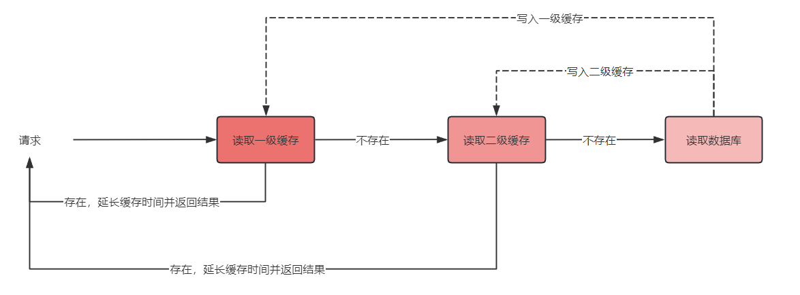

项目中使用的多级缓存也就是 `分布式缓存 Redis + 本地缓存 Caffeine`，那么令 Caffeine 作为一级缓存，Redis 作为二级缓存，在项目中通过记录数据的访问次数，将热点数据放在 `本地缓存`，将非热点数据放在 `Redis缓存` 中，访问流程如下：

`使用多级缓存的好处`在于 Redis 单机每秒可以接收 10w 次的请求，本地缓存比 Redis 缓存可以抗更高数量级的并发，本地缓存可以每秒接收百万的请求，使用两级缓存极大增加访问效率

但是使用多级缓存之后，存在**数据一致性问题**：

- Redis 缓存和 MySQL 数据不一致：可以使用 `延时双删` 来保证数据的一致性，如果需要更准确的数据一致性，可以使用 `Canal` 来监听 MySQL 的 binlog 日志来保证数据的一致性

- 在分布式环境下，多台应用之间本地缓存以及和 MySQL 之间的数据不一致：`可以通过 MQ 来保证数据一致性` 。

  当应用 1 收到请求更新数据库，同时应用 1 更新本地缓存，并且发送更新 MQ 广播消息，让其他的应用也更新本地缓存

  ​

**如何对热点数据进行存储？**

其实就是将数据的访问次数记录起来，当发现访问量非常大，在本地记录一下，可以使用 HashMap 进行存储，记录一下热点数据，再通知所有的服务将热点数据放入到本地缓存中来

参考文章：

[缓存数据一致性探究](https://mp.weixin.qq.com/s?__biz=MzIzOTU0NTQ0MA==&mid=2247533377&idx=1&sn=02f82eab941437e686d3111f96f46c57&chksm=e92a7e4ede5df7584bef40d6a5375491205ecf4c121e37abe15e43adce4b7761d97903d15a05&mpshare=1&scene=1&srcid=0605YBsO5X7XEPxK1SHAKJPR&sharer_sharetime=1685928526570&sharer_shareid=334cb5e2dcea88a20a92276cd6ba2e03&version=4.1.0.99228&platform=mac#rd)