- 多看优秀的场景设计文章、

- 性能优化：https://wx.zsxq.com/dweb2/index/topic_detail/214251284118481

- sql 刷题建议牛客网

- Kafka、RocketMQ、RabbitMQ 学习资源推荐：https://articles.zsxq.com/id_i16imeqka5ip.html

- 算法刷哪些题？：https://wx.zsxq.com/dweb2/index/topic_detail/588124821214444

- SpringCloud常见组件：https://articles.zsxq.com/id_mcfcqao0ptha.html

- 技术资源/技术问题：

  1. 支付系统学习资料和开源项目推荐：<https://t.zsxq.com/11wxKtaWK>
  2. 腾讯课堂-马士兵教育-源码五班：<https://t.zsxq.com/11OCvwDA8>
  3. 代码场景设计实践专栏 ：<https://t.zsxq.com/11DvHH3Bk>
  4. 《深入理解缓存原理与实战设计》：<https://t.zsxq.com/11LNrIgaX>
  5. 沈剑老师的架构师之路干货精选：<https://t.zsxq.com/11ndmliJW>
  6. 常见的脱敏工具总结：<https://t.zsxq.com/11rvTAIRR>
  7. OHC（堆外缓存）资料推荐：<https://t.zsxq.com/11G56hsji>
  8. 如何通过IP 地址找到用户的地址：<https://t.zsxq.com/11BDUhHVh>
  9. 转转游戏的账号订单流程重构之路：<https://t.zsxq.com/110G8VIov>
  10. 从1到亿，如何玩好异步消息？CQRS架构下的异步事件治理实践：<https://t.zsxq.com/11hHcUJ2s>
  11. Redis学习路线的补充：[【学习笔记】Redis学习路线的补充](https://t.zsxq.com/115otI0gs)
  12. 算法学习路径：[【学习笔记】算法学习路径](https://t.zsxq.com/117aydfBp)
  13. 计算机网络学习体系&计划：[计算机网络学习体系&计划](https://t.zsxq.com/11vSZ0eQf)
  14. Devops学习资料推荐：<https://t.zsxq.com/115sbW6RX>

- Bilibili 高并发下点赞功能的实现：[文章链接](https://mp.weixin.qq.com/s/mwZQYk1vJu6rOGzxuNeGyg)

- [典型系统设计案例](https://articles.zsxq.com/id_juvseuue9xa3.html)

- [通用架构设计](https://insights.thoughtworks.cn/common-architecture-design/)

- 集合源码

  这周抽时间完善了一下JavaGuide上集合源码分析部分的内容，新增了 LinkedList  和  CopyOnWriteArrayList 核心源码解析，清晰易懂

  1、ArrayList 源码分析：[ArrayList 源码分析 | JavaGuide(Java面试   学习指南)](https://javaguide.cn/java/collection/arraylist-source-code.html)
  2、LinkedList 源码分析：[LinkedList 源码分析 | JavaGuide(Java面试   学习指南)](https://javaguide.cn/java/collection/linkedlist-source-code.html)
  3、HashMap 源码分析：[HashMap 源码分析 | JavaGuide(Java面试   学习指南)](https://javaguide.cn/java/collection/hashmap-source-code.html)
  4、ConcurrentHashMap 源码分析：[ConcurrentHashMap 源码分析 | JavaGuide(Java面试   学习指南)](https://javaguide.cn/java/collection/concurrent-hash-map-source-code.html)
  5、CopyOnWriteArrayList 源码分析：[CopyOnWriteArrayList 源码分析 | JavaGuide(Java面试   学习指...](https://javaguide.cn/java/collection/copyonwritearraylist-source-code.html)

- [两年经验面试题](https://articles.zsxq.com/id_8awjlbk832bx.html)

- 海量数据处理：https://blog.csdn.net/qq_44797267/article/details/120228705、https://blog.csdn.net/v_july_v/article/details/7382693


待办：

- ConcurrentHashMap 源码分析整理


观看记录

Java Guide：2023-05-15 09:03


# 简历编写

- 使用  Redis+Caffeine 多级缓存优化热门数据（如首页、热门商品）的访问，解决了缓存击穿和穿透问题，查询速度毫秒级，QPS 30w+。
- 性能优化指南

很多球友不知道如何从性能角度优化项目，这里推荐几个比较容易实现的点，单体项目和分布式项目都适用，涉及到多线程、JVM、数据库/缓存、数据结构优化这4个常见的性能优化方向：

多线程方向优化：

1、如何在 SpringBoot 中使用异步方法优化 Service 逻辑提高接口响应速度? - 2022: [如何在SpringBoot中使用异步方法优化Service逻辑提高接口响应速度?_springboo...](https://blog.csdn.net/weixin_43441509/article/details/119855613)
2、asyncTool: [asyncTool: 解决任意的多线程并行、串行、阻塞、依赖、回调的并行框架，可以任意组合各线程的执...](https://gitee.com/jd-platform-opensource/asyncTool)（京东零售开源的一个并行框架，里面大量使用到了 CompletableFuture ，可以学习其精华来运用在自己的项目上）
3、CompletableFuture 原理与实践-外卖商家端 API 的异步化 - 美团技术团队- 2022: [CompletableFuture原理与实践-外卖商家端API的异步化 - 知乎](https://zhuanlan.zhihu.com/p/515993095)
4、简述 CompletableFuture 异步任务编排 - 掘金 - 2022: [简述CompletableFuture异步任务编排 - 掘金](https://juejin.cn/post/7168261825165787149)

JVM方向优化：

5、JVM 调优实战 - 掘金 - 2022: [JVM调优-JVM调优实践一 - 掘金](https://juejin.cn/post/7128377003224334373)

数据库/缓存方向：

6、MySQL 索引与查询优化 - 西召 - 2019: [MySQL索引与查询优化 - 掘金](https://juejin.cn/post/6844903818056974350)
7、基于 Spring 接口，集成 Caffeine+Redis 两级缓存 - 码农参上 - 2022: [基于Spring接口，集成Caffeine Redis两级缓存 - 掘金](https://juejin.cn/post/7117497031714865159)
8、J2Cache: [J2Cache: Java 两级缓存框架，可以让应用支持两级缓存框架 ehcache(Caffein...](https://gitee.com/ld/J2Cache)（基于内存和 Redis 的开源两级 Java 缓存框架）
9、MySQL 读写分离实战 - 遇见0和1 - 2023：[MySQL8读写分离集群](https://mp.weixin.qq.com/s/N81ES1TGmBb3DJMyROvGBQ)
10、MaxScale 实现 MySQL读写分离 - 爱可生开源社区 - 2022：[技术分享 | MaxScale 实现 MySQL读写分离](https://mp.weixin.qq.com/s/lInWPsTfrywUjT6VgZCbyQ)

数据结构结构方向优化：

11、换个数据结构，一不小心节约了 591 台机器！ - why 技术 - 2022: [换个数据结构，一不小心节约了 591 台机器！ - why技术 - 博客园](https://www.cnblogs.com/thisiswhy/p/16066548.html)（将系统中的本地缓存实现由 HashMap 替换为了 IntObjectHashMap(这个类出自 Netty)节约了2364C 的服务器资源。）
12、这个队列的思路是真的好，现在它是我简历上的亮点了。 - why 技术 - 2022: [java - 这个队列的思路是真的好，现在它是我简历上的亮点了。 - 个人文章 - SegmentF...](https://segmentfault.com/a/1190000041943100)


# 场景题

> 1. 场景题：匹配系统，一个用户多次匹配，要求不能匹配重复的人，之后双方都点击确认开始聊天。

   答：对于用户不可以匹配重复的人，可以使用 bitmap 来做。

> 2. 实现短信验证码生成和验证两个功能，只能使用Java语言，不能使用Redis等外部存储工具。


> 3. 如果抽奖项目真正应用于实际还有哪些地方需要改进？

答：目前架构、设计、实现上已经做了很多的优化方案，但上线肯定是会有很多的业务场景的细节，需要技术处理。为了更好的适配这些场景，在实现上留出扩展、在系统上添加监控、在日志上做好排查等。

代码的扩展性、系统的可用性


> 4. 敏感词库的设计，要求增删改查敏感词。敏感词文本匹配，敏感词一万个，文本长度在 20 - 1000 

答：使用 trie 树来实现敏感词库的设计，可以利用字符串公共前缀来节约存储空间。

生成 trie 树结构如下：

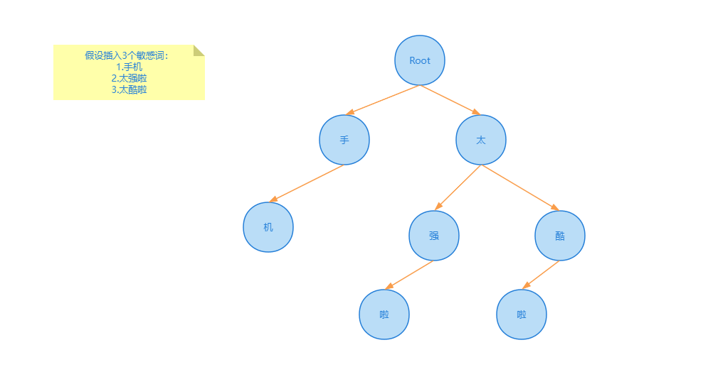

> 5. 1亿数据只有 1gb 内存怎么去重？

答：问题的本质是`海量数据去重`，解决方案有两种 bitmap、布隆过滤器。

方案一：bitmap

对于 1 亿的数据来说，如果直接将所有数据读入内存使用 bitmap 来去重的话，对每条数据使用 1 个 bit 标记是否存在即可，1 亿 bit ≈ 12MB，对于一条数据 a 来说，会在 bitmap 中计算出他所放入的下标 `x`，之后将 `x` 这个位置标记为1，这样判断一个数据是否存在，只占用 1 bit。


bitmap 方案适用场景：

- bitmap 适合值域较小的场景，如果值域较大会导致计算出在 bitmap 数组中的下标过大，比较占用存储空间
- 适合数据密集场景，对于数据稀疏场景比较浪费存储空间，比如数据a下标为0，但是数据b下标为1000000，两个数据中间并没有数据，但是却需要占用存储空间。


方案二：布隆过滤器

当值域较大的情况下，可以使用布隆过滤器进一步压缩 bitmap 的存储空间。

在布隆过滤器中，对一个数据a，布隆过滤器会使用 `k` 个哈希函数，计算出 `k` 个哈希值，在 bitmap 中将这 k 个位置都标记为1，来表示这个数据存在。


布隆过滤器适用场景：

- 适用于不严格去重的场景，因为布隆过滤器的特性会导致存在误判率，当判断为true时，该数据可能在集合中；当判断为 false 时，该数据一定不在集合中。
- Java中可以使用第三方库来实现布隆过滤器，常见的有Google Guava库和Apache Commons库以及Redis。


> 6. 项目的登陆密码怎么存储，用的什么加密算法，为什么用 MD5？

答：项目登陆密码都会通过 `MD5 + 加盐` 操作对明文密码加密存储在数据库中。

MD5 会对每一个铭文密码生成一个对应的固定密码，虽然 MD5 不可逆，但是可以被暴力枚举出来，所以在 MD5 的基础上还会添加加盐操作，通过在密码任意固定位置插入特定的字符串，让散列后的结果和使用原始密码的散列结果不相符。


> 7. 订单到期后，如何关闭订单？

 答：参考文章：https://mp.weixin.qq.com/s/BG1PqUWX0XwJX6aMCXCgvw

   - 方案一：定时任务，定时去扫描所有到期的订单，然后执行关单的动作。

     - 缺点：
       1. 时间不精确，可能订单已经到了超时时间，但是还没有到定时任务执行时间，导致订单关闭时间比超时时间晚。
       2. 无法处理大订单量，如果订单量较大，会导致定时任务执行时间很长，导致后边订单被扫描到的时间很晚。
       3. 对数据库造成压力，定时任务集中扫描表，会大量占用数据库io，可以将定时任务将其他正常业务做好隔离
       4. 分库分表问题，订单系统，在订单量大时会分库分表，在分库分表中进行全表扫描很不推荐
     - 适用场景：
       1. 对过期时间精度要求不高，业务量不大的场景

   - 方案二：JDK自带的延迟队列，`DelayQueue`，在用户创建订单时，把订单加到 `DelayQueue` 中，此外，还需要一个常驻任务不断从队列读取已经超时的订单，并进行关闭，之后再将该订单从队列中删除。

     该方案需要有一个线程添加 `while(true)` 循环，才能确保任务不断执行并及时取出超时订单。

     - 缺点：
       1. 该方案是基于 JVM 内存的，一旦机器重启，会导致数据消失，虽然可以配合数据库的持久化一起使用，但是应用一般都是集群部署，集群中的多台实例的 `DelayQueue` 如何配合也是一个很大的问题。
       2. 当订单量过大时，可能会导致 OOM 的问题。
     - 适用场景：
       1. 单机，订单量不大

   - 方案三：RockerMQ延迟消息，在订单创建好之后，发送一个延迟消息，指定延迟时间，在延迟时间到达之后，消息就会被消费者消费。

     - 缺点：
       1. RocketMQ的延迟时间不支持任意的，只支持：1s、5s、10s、30s，1m、2m等等（商业版支持任意时长）
     - 适用场景：RocketMQ支持延迟时间和我们所需延迟时间正好符合

   - 方案四：RabbitMQ插件，基于 rabbitmq_delayed_message_exchange 插件，该插件从 RabbitMQ 的 3.6.12 版本开始支持，该插件为官方开发的。

     在 RabbitMQ 中，我们设置一个消息，并且不去消费他，当过了存活时间之后，这个消息会变成死信，会被发送到死信队列中。

     在该插件中，消息并不会立即进入队列，而是先将他们保存到一个基于 Erlang 开发的 Mnesia 数据库，再通过一个定时器去查询需要被投递的消息，再投递到 x-delayed-message 队列中。

     - 适用场景：基于 RabbitMQ 插件的方式实现延迟消息，最大延长时间大概为 49 天，超过时间会被立即消费。可用性，性能都不错。

   - 方案五：Redis 过期监听，监听 key 的过期消息，在接收到过期消息之后，进行订单的关单操作。

     - 缺点：
       1. Redis 不保证 key 在过期时会被立即删除，也不保证消息能立即发出，因此存在消息延迟
       2. 在 Redis5.0 之前，这个消息是通过 PUB/SUB 模式发出的，不会进行持久化，如果发送消息时，客户端挂了，之后再恢复的话，这个消息就会彻底丢失。

   - 方案六：Redis 的 zset

     zset 是一个有序集合，每一个元素关联一个 score，通过 score 来对集合中的元素进行排序

     我们可以将（下单时间 + 超时时间） 与订单号分别设置为 score 和 元素值，通过 redis 进行排序之后，再开启 redis 扫描任务，获取 “当前时间 > score” 的任务，扫描到之后取出订单号，进行关单操作。

     - 优点：使用 redis zset 可以借助 redis 的持久化、高可用机制，避免数据丢失。在高并发场景中，可能多个消费者同时获取同一个订单号，一般采用分布式锁进行解决，也可以做幂等性（多个消费者获取同一个订单号也不影响）进行处理。

       ```bash
       # 命令示例
       # 添加两个元素 a、b 分数为 10、25
       127.0.0.1:6379> zadd delay_queue 10 a
       (integer) 1
       127.0.0.1:6379> zadd delay_queue 25 b
       (integer) 1
       # 查询分数为 9-12 的元素
       127.0.0.1:6379> zrangebyscore delay_queue 9 12 limit 0 1
       1) "a"
       ```

   - 方案七：Redission，Redission 中定义了分布式延迟队列 RDelayedQueue，即在 zset 基础上增加了一个基于内存的延迟队列，当我们添加一个元素到延迟队列时，redission 会把 数据+超时时间 放到 zset 中，并且启动一个延时任务，当任务到期时，再去 zset 中把数据取出来进行消费，允许以指定的延迟时长将元素放到目标队列中。

     - 优点：可以解决方案六中的并发问题，稳定性，性能较高

   - 方案八：RocketMQ时间轮（https://mp.weixin.qq.com/s/I91QRel-7CraP7zCRh0ISw）

   - **总体来讲，Redission + Redis、RabbitMQ插件、Redis的zset、RocketMQ延迟消息这几种方案比较推荐**


> 8. 一个系统用户登陆信息保存在服务器A上，服务器B如何获取到Session信息？（分布式 Session 共享的解决方案）

答：将 Session 数据存储到分布式缓存比如 Redis 中，所有的服务器都可以访问。

- 优点：性能优秀、支持横向扩展（Redis集群）
- 缺点：存在数据丢失风险（虽然 Redis 支持数据持久化，但仍可能丢失小部分数据）


> 9. 如果让你来评估项目的QPS的话，你会用什么方式来评估?(补充: 不要做压测，就通过现在的设计以及硬件配置推导OPS应该达到什么水准?)

答：首先需要根据业务提供的推广规模、渠道、人数，来评估。这里根据 28 原则进行评估，**即 80% 的请求访问在 20% 时间内到达**。

假如系统有1000万用户，那么每天来点击页面的占比20%，也就是200万用户访问。

假设平均每个用户点击50次，那么总用有1亿的PV（页面浏览量）

一天24个小时，平均活跃时间段算在5个小时内【24*20%】，那么5个小时预计有8000万点击，也就是平均每秒4500个请求。

4500是一个均值，按照电商类峰值的话，一般是3~4倍均值量，也就是5个小时每秒18000个请求【QPS=1.8万】


> 10. 比如说: 16核64G的机器，普通机械硬盘，这种情况下让你来做秒杀的系统，你会去修改和配置哪些参数?(不考虑redis、kafka等，只考虑springboot的应用)

答：如果这么个机器，一般会拆分4核16G 的4台虚拟机，之后是 JVM、Tomcat 的参数配置。拆分为4台虚拟机之后，相当于是互备容灾。

不存在使用64G内存机器的配置，在云原生时代，大家更倾向于用小机器组成阵列，去扛流量。不够就伸缩，到阿里云去买公有云，这就要求你10分钟能上架应用。（微博的XX出轨应对策略，也是这个意思，加机器抗流量）

因此在答这道题时，需要首先关注的就是配置上的缺陷，之后再去解决JVM配置调优的问题。


> 11. ​


https://zhuanlan.zhihu.com/p/490965101


> 12. 接上面，SpringBoot和JVM需要配置的参数还有哪些?

答：主要集中在池化和组件的使用配置上，如；线程池、连接池、RPC重试和超时等


> 13. 秒杀场景下用哪种垃圾回收器合适?

答：基本就是G1，但估计想让你解释下 G1 【分代收集、并发标记、区域回收、自适应调整】- 理由；在秒杀场景中，由于请求量大、并发高，需要尽量减少应用的停顿时间，以提高系统的响应速度和吞吐量。


> 14. Full GC卡顿时间长短跟什么有关系? 如果堆大小为128G的话，Full GC可能停顿多久?

答：堆大小、垃圾回收器，此场景快速秒杀就结束了，预计也就在百十毫秒。如果更准确这个就太依赖于环境配置的验证了。


> 15.微信二维码扫描原理：

答：**流程：**

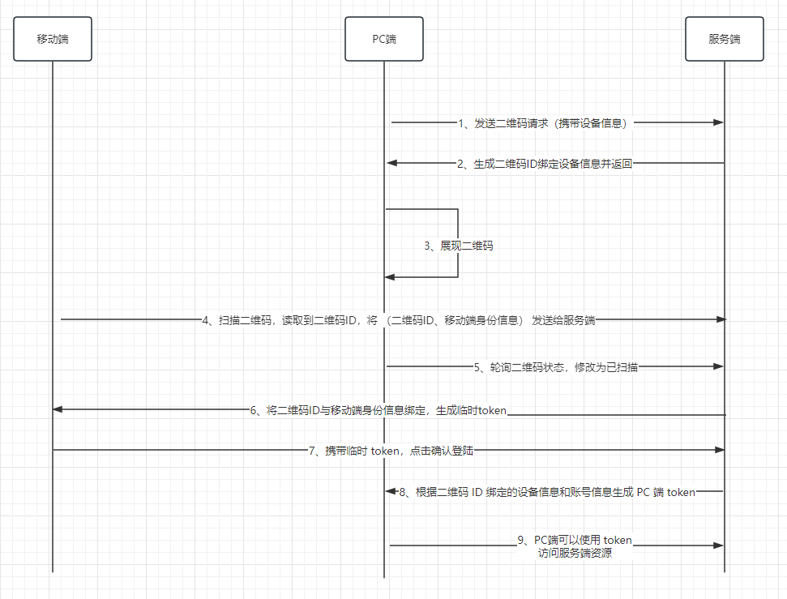

总的来说，PC 端需要进行扫码登陆的原理是通过二维码绑定移动端的身份信息以及PC端的设备信息，根据这两个信息生成 token 给 PC 端，PC 端就登陆成功了。

二维码准备：

1. PC端向服务器发起请求，表示要生成用户二维码，并且把 PC 端设备信息也传递给服务端
2. 服务端收到请求后，生成唯一的二维码 ID，并将二维码 ID 与 PC 端设备信息进行绑定
3. 服务端将二维码 ID 返回给 PC 端
4. PC 端收到二维码 ID 后，生成二维码
5. PC 端为了及时知道二维码的状态（是否已经扫描，扫描后是否已经确认），会不断轮询服务端，请求服务端当前二维码的状态及相关信息

扫描状态切换：

1. 用户扫描二维码后，读取到二维码 ID
2. 向服务端发送请求，并携带移动端的身份信息与二维码 ID
3. 服务端接收之后将身份信息与二维码 ID 进行绑定，生成临时 token，返回给移动端
4. 在移动端扫描完之后，PC 端会轮询二维码状态，修改为已扫描，此时二维码 ID 会与账号信息进行绑定

第三步返回给移动端临时 token 是要保证移动端在下一步操作时，使用这个临时 tokne 作为凭证，保证两步操作是同一部设备发出的，临时 token 只可以使用一次就失效。

登陆确认：

1. 移动端接收到临时 token 后会弹出确认登陆界面，点击确认，移动端会携带临时 token 调用服务端接口
2. 服务端收到确认后，根据二维码 ID 绑定的设备信息与账号信息，生成 PC 端 token
3. PC 端轮询二维码状态，修改为已确认
4. 登陆成功


> 16. 你知道哪些实现业务解耦的方法？

答：解耦是一种很重要的软件工程原则，它可以提高代码的质量和可复用性，降低系统的耦合度和维护成本。

解耦在日常开发中很常见，如 AOP 可以将需要切入的逻辑（日志、事务、权限）从核心业务中分离出来、IOC 可以将对象的创建和依赖管理交给容器。

可以通过 `事件驱动` 实现业务之间的解耦，通过事件驱动的实现方式常用的有两种：

1. 基于发布订阅模式的事件驱动

MQ 就是这样实现解耦，这种方式在解耦的同时，还实现了异步，提高了系统的吞吐量和接口响应速度。

成熟的消息队列的功能一般比较成熟，自带消息持久化、负载均衡、消息高可用。

除此之外 Redis 也有发布订阅功能（pub/sub），但是存在消息丢失、消息堆积等问题，不如专业的消息队列。

2. 基于观察者模式的事件驱动

常见的基于观察者模式的事件驱动框架有：Spring Event、Guava EventBus 等

Spring Event 和 Guava EventBus 默认是同步的，但也能实现异步，只是功能比较鸡肋。

观察者模式就只有观察者和被观察者，两者是直接进行交互的。

Spring Event 示例：

```java
// 事件发布者
@Component
public class CustomSpringEventPublisher {
    @Autowired
    private ApplicationEventPublisher applicationEventPublisher;

    public void publishCustomEvent(final String message) {
        System.out.println("Publishing custom event. ");
        CustomSpringEvent customSpringEvent = new CustomSpringEvent(this, message);
        applicationEventPublisher.publishEvent(customSpringEvent);
    }
}

// 事件监听者
@Component
public class CustomSpringEventListener implements ApplicationListener<CustomSpringEvent> {
    @Override
    public void onApplicationEvent(CustomSpringEvent event) {
        System.out.println("Received spring custom event - " + event.getMessage());
    }
}
```


发布订阅模式和观察者模式对比：

- 发布订阅模式：发布者和订阅者完全解耦，通过中间件进行消息传递；可以利用中间件（MQ、Redis）来实现分布式的消息传递，可应用于跨应用或跨进程的场景；大多数是异步的；
- 观察者模式：需要维护观察信息，被观察者和观察者直接交互；基于对象本身的数据变化来通信，不能使用在跨应用或跨进程的场景；大多数是同步的；


> 17. 接口重试策略如何设计？

常见的重试策略有两种：

1. 固定间隔时间重试：实现简单、但是可能导致重试过于频繁或稀疏，从而影响系统性能。如果重试间隔太短，可能导致雪崩效应；如果太长，可能影响用户体验
2. 梯度间隔重试：根据重试次数去延长重试间隔时间。例如第一次重试间隔1s，第二次2s，第三次4s。能有效提高重试的几率，也能通过梯度增加间隔时间来避免对下游系统造成更大压力。此种策略需要设置合理的上下限值，否则可能导致延长时间过长。

重试策略对分布式系统来说是自私的，客户端认为他的消息很重要，并要求服务端花费更多资源来处理，盲目的重试设计不可取。


重试策略最佳实践：

- 合理设置消费的最大超时时间和次数（尽快向客户端返回成功或失败，不要以超时或者异常抛出来代替消费失败）
- 重试会导致相同的消息进行`重复消费`，消费方应该有一个良好的`幂等设计`


支付系统中补单操作如何完成：https://mp.weixin.qq.com/s/9Z-N3cfWu7oMVJsTDkbb-Q

简单来讲，补单利用 RocketMQ 对操作失败进行补偿操作，但不能一直进行补偿操作，需要设置一个最大重试次数，在多次补偿失败之后，需要延缓补偿频率，这些都通过 RocketMQ 进行实现，这里还存在几个问题：

1. 如果异常消息发送失败，上游没有重试机制，这笔订单就会卡住，因为系统并不知道需要去补偿
2. 在补偿消息时失败
3. 如果重试达到最大次数仍然没有成功，该如何处理？

针对问题1，可以将异常消息落库，存在异常消息表中，记录订单号、当前重试次数、一场分类、记录状态、消息体等字段，设置定时任务去扫描该表进行处理。对当前 MQ 的可用性，异常数据很少出现。

针对问题2，如果补偿失败，会向上抛出 error，利用 RocketMQ 的梯度重试机制，当消费次数上限后会进入死信队列。这种情况一般是网络出现问题，恢复之后，可以从死信队列拉取这些消息再统一处理。如果 MQ 和 DB 都失败了，为极端情况，人工介入即可。

针对问题3，如果达到最大次数仍然没有成功，将他放入异常表。

还可以有一些在业务低峰期的兜底任务，扫描业务表，对未完成的订单进行补偿。**兜底任务可能造成信息的短暂堆积，影响线上补偿流程推进，可以使用独立的队列隔离开。**


> 18. 数据库里有3个字端Uid，type，score，其中type为1代表加分，-1代表扣分，给一堆数据记录，让计算出排名前10的uid。
>

答：


```mysql
select uid, sum(score*type) as total_score 
from t1 
group by uid 
order by total_score 
desc limit 10 
```


> 19. 如何实现Score的排行榜，实现细节，如果用Redis的话缓存数据太多怎么办，集群切片会有影响吗？

答：使用 Redis 的 zset，zset里面的元素是唯一的，有序的，按分数从小到大排序。

```bash
zadd ranking 10 a
zadd ranking 5 b
zadd ranking 15 c
zrevrange ranking 0 9 withscores # 获取排行榜前N名用户  zrevrange是将分数从大到小排序 zrange是将分数从小到大排序
```

#### 集群切片待完善 


集群切片即集群的横向扩展，将数据分开存储在多个Redis实例中，


> 20. 场景题：实时排行榜，几千万的流量！要高可用高并发

答：假如我们要对前100名用户进行实时排行，在数据库中创建一张用户总分表。总分表里会存入用户头像，姓名，总分，用户id。将总分表的前500名放到 Redis 的 zset 集合中。

- 当用户访问排行榜接口时，会从 Redis 中获取前 100 名用户的信息。
- 当用户的分数发生变化时，会拿当前用户分数和第100名用户的分数对比，如果大于，则放入Redis中。


排行榜只有100名用户，我们将前500名用户都放入 Redis 有必要吗？有必要，数据冗余一些可以避免频繁的更新数据，也能保证数据的准确性（否则，就需要加全局锁保证数据的准确性）。


可以加一个定时器，隔一段时间从数据库重新取数据，避免时间长了，redis中存储的数据越来越多。

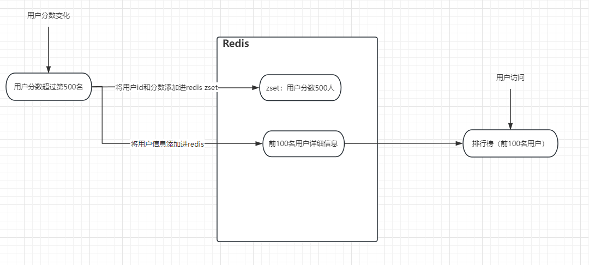

```java
Map<String, Double> map = new HashMap<>();
for (int i = 0; i < 300000; i++) {
    map.put("userId" + i, Double.valueOf(i));
}
// zadd 批量添加，或者单个添加，或者更新
jedis.zadd("ranking", map);
jedis.zadd("ranking", 10.00, "userA");
User user = new User();
// 单独往hash中添加数据
jedis.hset("user-list", "userA", JSON.toJSONString(user));
Map<String, String> map1 = new HashMap<>();
for (int i = 0; i < 10; i++) {
    map1.put("userId" + (char)('A' + i), JSON.toJSONString(user));
}
// 批量添加
jedis.hset("user-list", map1);
// 设置过期时间
jedis.expire("user-list", 5 * 60);
jedis.expire("ranking", 5 * 60);
// hash获取
jedis.hget("user-list", "userA");
// 查看某个用户排名，zset是按照分数从小到大排列，所以排行榜要使用zrevrank
jedis.zrevrank("ranking","userA")
// 查看前10名，并查出分数
jedis.zrevrangeWithScores("ranking",0,9)
```


> 21. 幂等性如何设计？

答：幂等性的设计有以下几种方案：

**方案一：唯一索引或唯一组合索引**

对订单的幂等性设计，可以使用订单号作为唯一索引，这样如果多次插入的话，就会报错 ` DuplicatedKeyException`， 那么我们就可以捕获该错误，来返回友好提示。


**方案二：乐观锁**

使用乐观锁会给数据库表增加一个`版本号 version`字段，查询数据时，读取到 version，当更新数据时判断数据库版本号和自己拿到的版本号是否相同，相同则更改，每次更新操作对 version 字段加 1。

`update order set name = #{name}, version=#{version}+1 where id=#{id} and version=#{version}`


**方案三：Token + Redis**

针对调用方重试接口的情况，例如重复提交订单，这种幂等性设计可以使用 Token 机制来防止重复提交。

调用方在调用接口时，先向后端请求一个 Token，该 Token 存储在 Redis 中并设置过期时间，在调用时携带上 Token（放入Header存储），后端在 Redis 中检查该 Token 是否存在，如果存在表示是第一次请求，删除token中的缓存**（使用 lua 脚本，保证操作的原子性）**，如果不存在，表示重复请求，直接返回。

如果第一次调用接口失败了，可以通过设计来重新生成 token，再次尝试调用。

```java
public void invoke(){
  String token = genToken();
  // 提交订单信息
  submitOrder(token, order);
}
```


> 23. 定时任务调度的常见实现方案Quartz和Spring的@Schedule和xxl-job(面试的时候一直叫它xxx-job)的区别


> 24. 如果大量请求进来你怎么限流？


**单机环境下：**

单机模式下，Google 开发了 Guava包，其中提供了限流操作，可以使用  `RateLimiter + AOP` 来进行限流操作。

1. RateLimiter 是一个频率限制器，通过配置频率来发放许可，如果 1 秒内可以访问十次，那么这十次许可发送的间隔是完全相同的
2. 并发使用是安全的
3. RateLimiter 还可以去配置先处于一个预热器，每秒增加发放的许可直到达到稳定的频率
4. RateLimiter 不影响请求本身的节流，而是影响下一次请求的节流，比如当前任务如果占用许可较多，到达 RateLimiter 之后，会立即占用，当下一个请求到达 RateLimiter 时就会经历节流，因为上一个请求已经占用大量的许可。

一个小示例用法，如果想要发送一组数据，我们限制他在 5kb 每秒：

```java
// 给每一个字节发放 1 个许可，限制在 5kb 每秒的话，只需要每秒发放 5000 个许可即可
final RateLimiter rateLimiter = RateLimiter.create(5000.0);
void submitPacket(byte[] packet) {
   rateLimiter.acquire(packet.length);
   networkService.send(packet);
}
```

**分布式环境下：**

分布式环境下，就不能向单节点模式那样对单个节点限流，这样 n 个节点时，总流量就是单节点的 n 倍。

在分布式环境中，所有流量都会先打到网关层，那么就可以对网关进行限流：

- Nginx 限流：思想是漏桶算法（将所有请求缓存到一个队列中，以固定速度处理，如果队列满了，就只能丢弃新进入的请i去），即能够强行保证请求实时处理的速度不会超过设置的阈值
- mq 限流
- redis+lua限流：lua脚本保证redis操作的原子性，使用redis中的数据结构进行限流

https://blog.csdn.net/zhouhengzhe/article/details/122406253


**扩展：常见限流算法**

- 计数器限流算法：在有效时间内计算请求次数，调用一次+1，调用结束-1。可以使用Redis的incr或其他计数工具实现。
- 滑动窗口限流算法：每过一个步长，整体时间区域滑动一下，以滑动窗口的机制减少临界值带来的超过阈值的问题。
- 漏桶限流算法：恒定速率的限流算法，不论客户端请求量是多少，服务端处理请求的速度都是恒定的。
- 令牌桶限流算法：有一个令牌桶和定时器，在一个时间段内往令牌桶里生成固定数量的令牌，请求就从桶里拿一个令牌，如果令牌没了，就排队或拒绝服务。


#### 待完善


> 25. 写 MQ 时程序宕机了怎么办？


> 26. 服务端出现大量 close_wait 状态，可能的情况？


> 27. Java 程序运行了一周，发现老年代内存溢出，分析一下？


> 28. 4G 的文件，里面是 8 位的手机号码，内存是 200M，怎么实现去重？


> 29. 100g的文件，每行一个url，机器4g的内存，统计出top100的url并输出为一个新的文件。


> 30. ​


# 线上常见问题

https://wx.zsxq.com/dweb2/index/topic_detail/185425252544152

https://articles.zsxq.com/id_izrmpuk43owr.html


> 1. 你在做这个项目的时候遇到了什么问题？（OOM问题、GC问题等等）


> 2. 你用过哪些分析定位 Java 故障/性能的工具？（JDK 自带工具、MAT、Arthas 等等）


> 3. 如果项目遇到了 OOM 问题，你会如何排查？（常用 MAT）


> 4. 有什么办法可以监控到 JVM 的实时运行状态？（Arthas）


> 5. 生产环境有一个接口很慢，如何排查？（Arthas）


> 6. 你是如何定位线上问题的？（说说自己了解的工具，然后根据面试官提示继续深入聊即可）


> 7. 有一个程序占用大量cpu，并且一直运行，怎么排查？


> 8. Redis延迟问题全面排查


https://mp.weixin.qq.com/s/mIc6a9mfEGdaNDD3MmfFsg


> 1. 线上问题：

   环境 suse + redis4 （3台虚拟机，3主3从）

   分析日志： redis 访问超时偶然发生，大部分超时在应用重试后可正常访问。

   排查结果： 容器与 redis 连接正常、网络设备负载正常、cpu 使用率正常、redis 的 qps 正常、redis 无慢查询

   运维给出结论：redis 连接数过多，性能达到瓶颈

   生产处置：

- redis 服务重启，为缓解
- 收集系统日志，低峰期重启 redis 所在虚拟机，现象缓解

   后续排查结果：

   redis 配置文件中 `tcp-backlog` 参数可能会导致该现象。每个 TCP 请求都要经过半连接队列 -> 已完成队列 -> redis 主线程 的排队执行过程，发生问题的机器 `tcp-backlog` 使用默认值时为 511，由于 `redis` 为单线程，出现连接队列满的情况时，后续 tcp 请求将会被丢弃，客户端发生超时。并且 `tcp-backlog` 对应系统层 `net.coire.somaxconn`，该参数虚拟机设置为 2048，将 `tcp-backlog` 改为 2048，该现象消失。

   最终结论：tcp 请求半连接队列打满，导致后续 tcp 请求被丢弃，发生超时

   后续处理：

- 部署虚拟机监控，监控 overflowed 增长情况
- redis 设施升级，改为7主7从，redis 升级为 6


# 项目难点

> 1. 登陆日志原本是同步写入库的，后来为了提升效率，加入了队列，先写队列后消费入库，做解耦，但是队列用了同步操作，有一个 mq 挂了，导致登陆服务不可用，这种事不可以接受的，记录日志不能影响登录，所以将其改为了异步方式


> 2. 讲讲项目难点以及怎么解决的


> 3. 你的rpc轮子怎么划分模块的


> 4. （手写 rpc 项目中）你自定义的序列化方式偏向于Json还是Protobuf？这俩序列化有啥区别？和你的自定义序列化性能差异对比？怎么解决分包粘包？怎么注册注销？讲一下你的SPI实现依赖倒置？动态桩讲一下？可以客户端指定调用ip吗


> 5. 如何跟面试官聊项目？


这个问题挺有意思的，聊项目主打一个交心。
简单说下我的看法：
（1）首先简历上的项目需要比较丰富，这里的丰富不是对项目的功能的堆砌，而是要从以下几个方面进行阐述：
   1.项目背景
   2.项目规模
   3.你负责的核心模块、开发的功能
   4.项目痛点、难点
   5.你做了什么事情，用到了那些技术，解决了什么难题，达成了什么效果，带来了什么效益，还有哪些可以改进的地方
（2）然后你得把你学过的一些技术带入进来，尽量让面试官对你运用的技术感兴趣，然后如何用这些技术解决问题的。
（3）最后你可以说下如何改进方案，引导面试官提供一些其他的建议。

相信经过这么几个来回，面试官会对你“很有意思的”。


# 计算机基础

> 1. 堆和树的区别？应用场景？二叉搜索树是什么？


> 2. 进程间的通信方式？死锁条件？怎么解决？


> 3. 操作系统内存满了怎么办？如何回收？有什么影响


> 4. 什么是僵尸进程？应该怎么去操作？


> 5. 为什么会有线程安全的问题，如何解决？


> 6. 乐观锁和悲观锁？CAS？aba问题是什么，如何解决？


> 7. http 常见的方法和状态码有哪些？502是什么错误？如何排查问题？讲一下反向代理？


> 8. token 和 cookie 的区别？

> 9. https 怎么存放密钥？


> 10. cpu 爆了怎么排查，怎么优化，具体怎么写命令？


> 11. 共享内存，如何控制读取写入的一致性（信号量）


> 12. 进程可以忽视信号吗（可以，不过看级别）


> 13. HTTP协议的组成？报文格式？头和body如何分割？cookie在哪一部分？如何让请求携带cookie？


> 14. 计算机网络分层模型


> 15. TCP的可靠性怎么保障的，怎么保证接收到的内容是正确的


> 16. HTTPS校验的哈希算法是什么


> 17. HTTP 2.0和HTTP 1的区别？


> 18. 什么是队头阻塞？2.0为什么不用UDP？


> 19. HTTPS与HTTP区别


> 20. HTTPS TLS层四次握手


> 21. CA证书的认证


> 22. 建立 TCP 连接后，客户端下线了会发生什么


> 23. 介绍一下知道哪些 IO 模型，IO 多路复用了解吗


> 24. 对网络方面有了解吗？讲解一下TCP/IP协议的网络分层；


> 25. 讲讲ARP，ICMP


> 26. 什么时候不用查ARP表


> 27. ICMP是哪个路由器回的，什么地方用了icmp，traceroute怎么做的。


# Java 基础

> 1. hashcode 和 equals 区别？只重写 equals 行不行？
> 2. Collection 和 List 详细讲一下？arraylist和linkedkist ？ArrayList扩容？
> 3. hash map 和 hash table 的区别？hashmap 操作的时间复杂度？HashMap底层数据结构，扩容（可以从哈希函数说起，扩容不要忘记考虑负载因子）？HashMap为什么总是保证数组个数为2的幂次方（我觉得有两个角度：取余用&代替，扩容方便）


> 4. 序列化，String 和枚举类有什么区别，如果序列值一样会有什么问题？


> 5. 排序的稳定性，解释一下？ 


> 6. 为什么 ConcurrentHashMap 的 key 和 value 不支持 Null 值?

key 和 value 不能为 null 主要是为了避免二义性。null 是一个特殊的值，表示没有对象或没有引用。如果你用null作为键，那么你就无法区分这个键是否存在于ConcurrentHashMap中，还是根本没有这个键。同样，如果你用null作为值，那么你就无法区分这个值是否是真正存储在ConcurrentHashMap中的，还是因为找不到对应的键而返回的。


多线程环境下，存在一个线程操作该ConcurrentHashMap时，其他的线程将该 ConcurrentHashMap 修改的情况，所以无法通过 containsKey(key) 来判断否存在这个键值对，也就没办法解决二义性问题了。


于此相比，HashMap 可以存储 null 的 key 和 value，但是 null 作为键只有一个，作为值可以有多个。如果传入null作为参数，就会返回hash值为0的位置的值。单线程环境下，不存在一个线程操作该HashMap时，其他的线程将该HashMap修改的情况，所以可以通过contains(key)来做判断是否存在这个键值对，从而做相应的处理，也就不存在二义性问题。


**那么为什么 ConcurrentHashMap 源码不设计成可以判断是否存在 null 值的 key？**

如果 key 为 null，那么就会带来很多不必要的麻烦和开销。比如，你需要用额外的数据结构或者标志位来记录哪些key是null的，而且在多线程环境下，还要保证对这些额外的数据结构或者标志位的操作也是线程安全的。而且，key为null的意义也不大，因为它并不能表示任何有用的信息。


**执行containsKey()后，在调用get()方法之前可能会被其他线程修改或者删除，这算是不可重复读，那这算是线程不安全吗？**

ConcurrentHashMap 是线程安全的，但它不能保证所有的复合操作都是原子性的。如果需要保证复合操作的原子性，就要使用额外的同步或协调机制。这并不违反线程安全的定义，而是属于不同层次的一致性要求。

containsKey() 和 get() 方法都是单独的操作，它们之间没有同步保证。因此，如果在调用 containsKey() 后，另一个线程修改或删除了相应的键值对，那么 get() 方法可能会返回 null 或者过期的值。这确实是不可重复读的情况，但这并不违反线程安全的定义。


> 7. Map这种结构在java里有有哪些实现的对象呢？


> 8. Java多态的底层实现


> 9. 讲讲jdk1.8的垃圾回收


> 10. HashMap树化时除了remove还有什么时候链表化


> 11. 双亲委派的实现原理


> 12. 说一下 hashmap 的 put 过程


> 13. 作为 map 的 key 需要重写哪些方法？


> 14. JVM，JDK，JRE三者的之间的联系？


> 15. 方法重载和方法重写区别？


> 16. 接口和抽象类之间的区别？


> 17. 创建对象的几种方式


> 18. 这三行代码jvm做了什么事情
>
> String a = "123";
>
> String b = new("456");
>
> String c = a + b;


> 19. hashmap，为什么要转成红黑树，不是一开始就用（红黑树的缺点）


> 20. 双向链表的缺点？


# 设计模式

> 1. 你对设计模式的了解？最近用了什么 


> 2. 为什么用代理模式，用继承不行吗 


# Mysql

> 1. 为什么 mysql 删了行记录，反而磁盘空间没有减少？（软删除）

> 2. 数据导入，如何批量导入，这么大的数据量能一次性导入吗？

> 3. 索引构成？（B+树）索引优化？给个 sql 让判断走索引的情况？

> 4. 为什么索引能提高查询速度？

> 5. 聚集索引和非聚集索引的区别？非聚集索引一定回表查询吗？

> 6. 索引这么多有点，为什么不对表中的每一个列创建一个索引呢？使用索引一定提高查询性能吗？

> 7. 索引底层的数据结构了解吗？Hash 索引和 B + 树索引优劣分析

> 8. B+树做索引比红黑树好在哪里？

> 9. 最左前缀匹配原则？

> 10. 什么是覆盖索引？

> 11. 如何查看某条 SQL 语句是否用到了索引？

> 12. 什么是慢 sql，如何查找，如何优化？

> 13. mysql 的三大日志？

> 14. mysql 的事务隔离级别？各自解决了什么问题？mvcc的流程？

> 15. mysql 性能怎么优化？

索引（比如覆盖索引、最左前缀匹配原则）、表结构（选择合适的字段属性和数据类型）、SQL基本编写规范、优化慢SQL（慢SQL定位、Explain 命令使用）、分库分表和读写分离、加强运维（比如通过一些监控工具监控慢 SQL）

可以先聊慢SQL定位以及EXPLAIN 命令的应用，再聊索引、表结构以及SQL基本编写规范，分库分表和读写分离这些最后考虑。如非迫不得已，一定不需要选择分库分表，带来的问题不少

读写分离：https://javaguide.cn/high-performance/read-and-write-separation-and-library-subtable.html

https://javaguide.cn/database/mysql/mysql-high-performance-optimization-specification-recommendations.html


> 16. 索引失效七种？


> 17. mysql 的三大 log 的执行时机？redolog刷盘时机？


> 18. 一条模糊查询语句，查询速度越来越慢怎么排查？

从两个方面进行排查：

1. 确认是否建立了索引
2. 确认索引是否生效

> 19. MySQL如何保证事务的一致性？


> 20. 一张 MySQL 数据库表存多少条数据合适？


> 21. B+ 树索引有哪些好处？还有哪些数据结构索引？


> 22. InnoDB 怎么实现的事务？


> 23. MySQL 执行一个 update 语句的全流程？（客户端到服务器）


> 24. MySQL ACID 怎么实现的？


> 25. MySQL 新旧数据同步，怎么切流量使同步更平滑？


> 26. 分布式数据库的主从怎么做的？（读写分离）


> 27. 如果主数据库崩了怎么办？


> 28. 介绍一下 join？left join、right join 区别？join和inner join的区别？Union和union all的区别？


> 29. mysql 什么语句会触发什么样的锁？（这里挖坑了，说select查询时会用表锁，实际上比较少用，alter这种ddl语句会用）


> 30. 什么是幻读？脏读等等，，，


> 31. 加行锁一定要设计索引吗？


> 32. 知道项目用的什么事务模型吗？


> 33. b+树与b树区别，为什么选择b+树

实际场景中，我们需要的是一个时间复杂度稳定的数据结构，而不是忽高忽低


> 34. select for update


> 35. 数据库如何做乐观锁？


> 36. 如何保证mysql的RR（用锁和MVCC）


> 37. 调试过数据库参数吗


> 38. 讲讲红黑树


> 39. mysql主从数据库设计


> 40. mydql刷盘原理


> 41. 什么情况下加什么行锁


> 42. SELECT COUNT(*)怎么走索引


> 43. 已经用了MQ了为什么还会出现mysql连接数过高，怎么优化mysql的性能瓶颈，怎么分库分表？

mysql 连接数过高的原因？？？


> 44. MySql怎么删除数据。


> 45. delete和truncate的区别（不会）


> 46. 写查询语句的时候应该从哪些方面考虑来注意性能。


> 47. 什么是联合索引，为什么要建联合索引？


> 48. a,b,c,d，四个字段，查询语句的where条件a=b，orderby c。（mysql翻页越翻越慢怎么优化，满足a=b的字段很多，怎么高效的排序，分页查询）


> 49. SQL explain 会输出哪些信息？


> 50. sql怎么手动加锁


# SQL语句

https://javaguide.cn/database/sql/sql-questions-01.html#%E6%A3%80%E7%B4%A2%E9%A1%BE%E5%AE%A2%E5%90%8D%E7%A7%B0%E5%B9%B6%E4%B8%94%E6%8E%92%E5%BA%8F


# 锁

> 1. 什么是滑块锁?


> 2. synchronized 锁升级？


> 3. 公平与不公锁的区别


> 4. 介绍一下volatile？


> 5. 比较一下悲观锁和乐观锁？乐观锁的使用场景


> 6. 分布式锁

1、分布式锁介绍：[https://javaguide.cn/distributed-system/distribute...](https://javaguide.cn/distributed-system/distributed-lock.html)
2、分布式锁常见实现方案总结：[https://javaguide.cn/distributed-system/distribute...](https://javaguide.cn/distributed-system/distributed-lock-implementations.html)


> 7. 说一下synchronized的实现原理？


# 消息队列

> 1. 除了使用 mq 解耦发奖流程外，有没有别的解决方案？

   答：异步MQ的方案非常成熟，也没有见到其他更合适的方案（如果面试官问了，可以反问他）

   这里mq的用途可以看作是中转分流的任务。中转分流不止MQ可以做，网关也是在中转分流，只不过是没有存储功能。

   无非就是你设计一个能分发任务的路由层，保证任务分发前别丢了，就行。这就是思想，出题人要的是这个。然后再谈具体实现，这又是基本功了。


> 2. RabbitMQ 的消息可靠性


> 3. RabbitMQ 的消息幂等性


> 4. 为什么用 MQ 不用 HTTP？

削峰、解耦、异步


> 5. rocketmq怎么保证消费顺序性


> 6. 怎么解决重复消费


> 7. mq 能解决什么问题


# Netty

参考文章：

https://blog.csdn.net/crazymakercircle/article/details/124588880

https://www.yuque.com/snailclimb/mf2z3k/wlr1b0

https://blog.csdn.net/zhiyikeji/article/details/131131367

《Netty原理解析与开发实战》


> Netty 是什么呢？Netty 用于做什么呢？

答：

Netty 是一个 NIO 客户服务端框架，可以`快速开发网络应用程序`，如协议服务端和客户端，极大简化了网络编程，如 TCP 和 UDP 套接字服务（来自官网） 

热门开源项目如 Dubbo、RocketMQ 底层都是用了 Netty

> Netty怎么实现高性能设计？

答：

Netty 高性能的三个方面：

1. 传输：用什么样的通道将数据发送给对方，BIO、NIO 或者 AIO，IO 模型在很大程度上决定了框架的性能。`IO模型的选择`
2. 协议：采用什么样的通信协议，HTTP 或者内部私有协议。协议的选择不同，性能模型也不同。相比于公有协议，内部私有协议的性能通常可以被设计的更优。`协议的选择`
3. 线程：数据报如何读取？读取之后的编解码在哪个线程进行，编解码后的消息如何派发，Reactor 线程模型的不同，对性能的影响也非常大。`线程模型的选择`


> 介绍一下 AIO、BIO 和 NIO？

答：

- **AIO：**

从 Java.1.7 开始，Java 提供了 AIO（异步IO），Java 的 AIO 也被称为 “NIO.2”

Java AIO 采用`订阅-通知`模式，应用程序向操作系统注册 IO 监听，之后继续做自己的事情，当操作系统发生 IO 事件并且已经准备好数据时，主动通知应用程序，应用程序再进行相关处理

（Linux 平台没有这种异步 IO 技术，而是使用 epoll 对异步 IO 进行模拟）


- **BIO：**

BIO 即同步阻塞 IO，服务端实现模式为一个连接对应一个线程，即客户端有连接请求时服务器端就需要启动一个线程进行处理

`BIO简单工作流程：`

1. 服务器端启动一个 ServerSocket
2. 客户端启动 Socket 对服务器进行通信，默认情况下服务器端需要对每个客户端建立一个线程与之通讯
3. 客户端发出请求后, 先咨询服务器是否有线程响应，如果没有则会等待，或者被拒绝
4. 如果有响应，客户端线程会等待请求结束后，再继续执行


`BIO存在问题：`

1. 当并发量较大时，需要创建大量线程来处理连接，比较占用系统资源
2. 连接建立之后，如果当前线程暂时没有数据可读，则线程会阻塞在 Read 操作上，造成线程资源浪费


- **NIO：**

从 Java1.4 开始，Java 提供了 NIO，NIO 即 “Non-blocking IO”（同步非阻塞IO）

NIO 的几个核心概念：

1. Channel、Buffer：BIO是基于字节流或者字符流的进行操作，而NIO 是基于`缓冲区`和`通道`进行操作的，数据总是从通道读取到缓冲区中，或者从缓冲区写入到通道中

2. Selector：选择器用于监听多个通道的事件（如，连接打开，数据到达），因此，单个线程可以监听多个数据通道，极大提升了单机的并发能力

   当 Channel 上的 IO 事件未到达时，线程会在 select 方法被挂起，让出 CPU 资源，直到监听到 Channel 有 IO 事件发生，才会进行相应的处理


- **NIO和BIO有什么区别？**

1. NIO是以`块`的方式处理数据，BIO是以`字节流或者字符流`的形式去处理数据。 
2. NIO是通过`缓存区和通道`的方式处理数据，BIO是通过`InputStream和OutputStream流`的方式处理数据。 
3. NIO的通道是双向的，BIO流的方向只能是单向的。
4. NIO采用的多路复用的同步非阻塞IO模型，BIO采用的是普通的同步阻塞IO模型。
5. NIO的效率比BIO要高，NIO适用于网络IO，BIO适用于文件IO。


**NIO如何实现了同步非阻塞？**

通过 Selector 和 Channel 来进行实现，一个线程使用一个 Selector 监听多个 Channel 上的 IO 事件，通过配置监听的通道Channel为非阻塞，那么当Channel上的IO事件还未到达时，线程会在select方法被挂起，让出CPU资源。直到监听到Channel有IO事件发生时，才会进行相应的响应和处理。


> 介绍一下 Netty 使用的线程模型？

答：

Netty 主要基于主从 Reactor 多线程模型，其中主从 Reactor 多线程模型将 Reactor 分为两部分：

- mainReactor：监听 Server Socket，用来处理网络 IO 连接建立操作，将建立的 SocketChannel 指定注册给 subReactor
- subReactor：和建立起来的 socket 做数据交互和业务处理操作


因为客户端的连接数量相对来说比较少，而数据的读和写会比较多一点，使用 mainReactor 只接受客户端连接，由其他线程 subReactor 负责读和写，将业务处理剥离出，让线程池来处理，降低了 Reactor 的性能开销


**扩展：单 Reactor 单线程模型、单 Reactor 多线程模型**

- 单 Reactor 单线程模型

  通过 1 个线程负责客户端连接、网络数据的读写、业务处理

  `缓存 Redis 就是单 Reactor 单线程模型`

- 单 Reactor 多线程模型

  通过 1 个线程负责客户端的连接、网络数据的读写，将业务处理剥离出去，通过线程池来进行处理


**三种 Reactor 模型的优缺点：**

- 单 Reactor 单线程模型是单线程进行业务处理，当负载过重时，处理速度将会变慢，影响系统性能，因此引出单 Reactor 多线程模型
- 单 Reactor 多线程模型时多个线程处理业务，业务处理速度上来了，但是单 Reactor 承担了所有时间的监听和响应，可能存在性能问题。当有数百万客户端进行连接或者服务端需要对客户端握手进行安全认证，认证本身非常消耗性能，因此出现了主从 Reactor 多线程模型
- 主从 Reactor 多线程模型中 1 个主 Reactor 只用来处理网络 IO 的连接建立操作，而对于接入认证、IP 黑白名单过滤、握手等操作由从 Reactor 进行处理，这样进一步提升性能，在主从 Reactor 多线程模型中，从 Reactor 有多个，可以与 CPU 个数相同


> TCP 粘包、拆包是什么？如何解决？

答：

TCP本身的机制决定了一定会有粘包、拆包，因为 TCP 传输协议时基于数据流传输的，而流化的数据没有界限，因此 TCP 作为传输层协议并不了解上层业务数据的具体含义，会根据 TCP 缓冲区的实际情况进行数据包的划分，所以业务上认为的一个完整的包，可能被 TCP 拆成多个包或者把多个小的包封装成一个大的包进行发送。


**产生原因：**

- 粘包：客户端发送的包的大小比socket的缓存小或者接收方读取socket缓存不及时，因此多个包一起发送了
- 拆包：客户端发送的包的大小比socket的缓存大或者发送的数据大于协议的MTU（最大传输单元）必须拆包，那么这个包就被拆分成了多个包进行发送


**解决方法：**

有三种方式：

- 通过指定分隔符来进行分割
- 通过指定固定长度来进行分割
- 上边两种方式灵活性不好，因此常用的是通过指定接收数据的长度来解决，也就是`LengthFieldBasedFrameDecoder()`这个类


> Netty 中常用组件?

答：

- `Channel`：Netty 网络操作抽象类，包括了基本的 IO 操作，如 bind、connect、read、write 等等
- `EventLoop`：主要是配合 Channel 处理 IO 操作，用来处理连接的生命周期中所发生的事件
- `ChannelFuture`：Netty 中的所有 IO 操作都是异步的，我们通过 ChannelFuture 的 addListener() 注册一个 ChannelFutureListener 监听事件，当操作执行完毕后，监听就会返回结果
- `ChannelHandler`：作为处理器，用于处理入站和出战的数据
- `ChannelHandlerContext`：用于包裹 ChannelHandler，维护了 pipeline 这个双向链表中的 pre 和 next 指针，这样可以方便的找到与其相邻的 ChannelHandler，并且过滤出一些符合执行条件的 ChannelHandler，Netty 的异步事件在 pipeline 中传播就是依靠 ChannelHandlerContext
- `ChannelPipeline`：每一个 Channel 都会分配一个 ChannelPipeline，pipeline 是一个双向链表的结构，Netty 中产生的 IO 异步事件都会在这个 pipeline 中传播


> Netty 如何发送消息？

答：

有两种发送消息的方式：

- 直接写入 Channel，消息从 ChannelPipeline 的尾节点开始向前传播至头节点，代码`channelHandlerContext.write()` 
- 使 write 事件从当前 ChannelHandler 开始沿着 pipeline 向前传播，代码`channelHandlerContext.channel().write()`


**这里解释一下，上边发送消息为什么是向前传播：**

在 Netty 中，IO 异步事件基本上分为两类：inbound（入站） 事件、outbound（出站） 事件，那么入站事件是沿着 pipeline 的头结点一直向后传播，因此出站事件就是沿着 pipeline 的尾结点一直向前传播，而上边发送消息也就是出站事件，因此是沿着 pipeline `从后向前`进行传播 


> 直接内存比堆内存快在了哪里？

答：

首先直接内存不是 Java 虚拟机中的内存，是直接向系统内存申请的空间，来源于 NIO，通过 Java 堆中的 DirectByteBuffer 来进行操作。

直接内存相比于堆内存，避免了数据的二次拷贝。

- 我们先来分析`不使用直接内存`的情况，我们发送数据需要将数据先写入 Socket 的缓冲区内，那么如果数据存储在 JVM 的堆内存中的话，会先将堆内存中的数据复制一份到直接内存中，再将直接内存中的数据写入到 Socket 缓冲区中，之后进行数据的发送 

  - **`为什么不能直接将 JVM 堆内存中的数据写入 Socket 缓冲区中呢？`**

    在 JVM 堆内存中有 GC 机制，GC 后可能会导致堆内存中数据位置发生变化，那么如果直接将 JVM 堆内存中的数据写入 Socket 缓冲区中，如果写入过程中发生 GC，导致我们需要写入的数据位置发生变化，就会将错误的数据写入 Socket 缓冲区

- 那么如果使用直接内存的时候，我们将`数据直接存放在直接内存中`，在堆内存中只存放了对直接内存中数据的引用，这样在发送数据时，直接将数据从直接内存取出，放入 Socket 缓冲区中即可，`减少了一次堆内存到直接内存的拷贝`  

  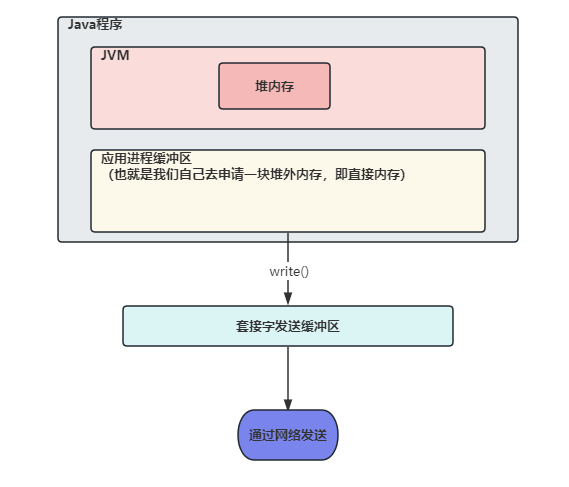


> 什么是 Netty 的零拷贝？什么是 TCP 缓冲区？

答：

Netty 的零拷贝主要包含三个方面：

- Netty 的接收和发送使用堆外（直接内存）进行 Socket 读写，不需要进行字节缓冲区的二次拷贝。 

- Netty 提供 CompositeByteBuf 组合缓冲区类，可以将多个 ByteBuf合并为一个逻辑上的ByteBufer，避免了各个ByteBufer之间的拷贝，将几个小buffer合并成一个大buffer的繁琐操作。

- Netty 的文件传输使用了 `FileChannel` 的 `transferTo` 方法，该方法底层使用了 `sendfile` 函数实现了 cpu 零拷贝。

  `sendfile` 函数通过网络发送数据的流程为：

  磁盘 `----DMA拷贝---->`文件读取缓冲区 `----CPU拷贝---->` 套接字发送缓冲区(SO_SNDBUF) `----DMA拷贝---->` 网络设备缓冲区(网卡) 

  图片流程如下：（3次拷贝、2次上下文切换，这里上下文切换是在用户空间发起write操作，此时用户态切换为内核态，write调用完毕后又会从内核态切换回用户态）

  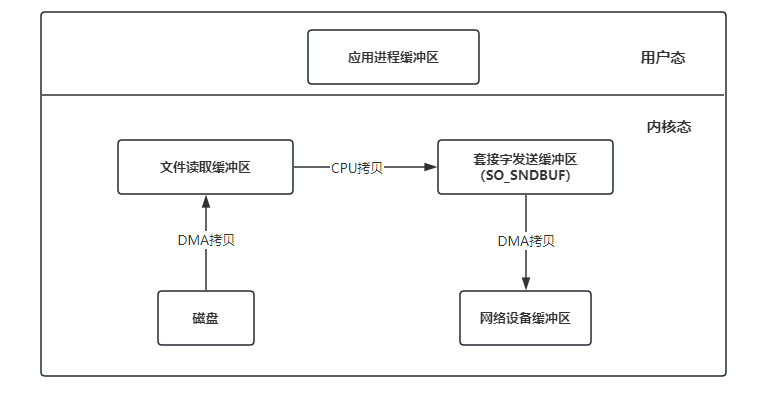


**什么是TCP 缓冲区？**

每个 TCP 的 Socket 的内核中都有一个发送缓冲区（SO_SNDBUF）和一个接收缓冲区（SO_RECVBUF）`（在通过 TCP 需要进行网络数据传输时，数据都是会写入 Socket 的缓冲区中的，之后再通过网络协议发送出去）` 


> 了解 Netty 中的 ByteBuf 类吗？

答：

在 Java NIO 编程中，Java 提供了 ByteBuffer 作为字节缓冲区类型（缓冲区可以理解为一段内存区域），来表示一个连续的字节序列。

Netty 中并没有使用 Java 的 ByteBuffer，而是使用了新的缓冲类型 ByteBuf，特性如下：

- 允许自定义缓冲类型

- 复合缓冲类型中内置的透明的零拷贝实现

- 开箱即用的动态缓冲类型，具有像 StringBuffer 一样的动态缓冲能力

- 不再需要调用 flip() 方法

  Java 的 ByteBuffer 类中，需要使用 flip() 来进行读写两种模式的切换

- 正常情况下具有比 ByteBuffer 更快的响应速度


**Java 中的 ByteBuffer：**

主要需要注意有 3 个属性：position、limit、capacity

- capacity：当前数组的容量大小
- position：写入模式的可写入数据的下标，读取模式的可读取数据下标
- limit：写入模式的可写入数组大小，读取模式的最多可以读取数据的下标

假如说数组容量是 10，那么三个值初始值为：

```
position = 0
limit = 10
capacity = 10
```

假如写入 4 个字节的数据，此时三个值如下：

```
position = 4
limit = 10
capacity = 10
```

如果切换到读取数据模式（使用 `flip()`），会改变上边的三个值，会从 position 的位置开始读取数据到 limit 的位置

```
position = 0
limit = 4
capacity = 10
```


**Netty 中的 ByteBuf：**

ByteBuf 主要使用两个指针来完成缓冲区的读写操作，分别是： `readIndex` 和 `writeIndex`

- 当写入数据时，writeIndex 会增加
- 当读取数据时，readIndex 会增加，但不会超过 writeIndex


ByteBuf 的使用：

```java
public static void main(String[] args) {
    ByteBuf buffer = Unpooled.buffer(10);
    System.out.println("----------初始化ByteBuf----------");
    printByteBuffer(buffer);

    System.out.println("----------ByteBuf写入数据----------");
    String str = "hello world!";
    buffer.writeBytes(str.getBytes());
    printByteBuffer(buffer);

    System.out.println("----------ByteBuf读取数据----------");
    while (buffer.isReadable()) {
        System.out.print((char)buffer.readByte());
    }
    System.out.println();
    printByteBuffer(buffer);


    System.out.println("----------ByteBuf释放无用空间----------");
    buffer.discardReadBytes();
    printByteBuffer(buffer);

    System.out.println("----------ByteBuf清空----------");
    buffer.clear();
    printByteBuffer(buffer);
}
private static void printByteBuffer(ByteBuf buffer) {
    System.out.println("readerIndex:" + buffer.readerIndex());
    System.out.println("writerIndex:" + buffer.writerIndex());
    System.out.println("capacity:" + buffer.capacity());
}
/**输出**/
----------初始化ByteBuf----------
readerIndex:0
writerIndex:0
capacity:10
----------ByteBuf写入数据----------
readerIndex:0
writerIndex:12
capacity:64
----------ByteBuf读取数据----------
hello world!
readerIndex:12
writerIndex:12
capacity:64
----------ByteBuf释放无用空间----------
readerIndex:0
writerIndex:0
capacity:64
----------ByteBuf清空----------
readerIndex:0
writerIndex:0
capacity:64
```


**ByteBuf 的 3 种使用模式：**

ByteBuf 共有 3 种使用模式：

- 堆缓冲区模式（Heap Buffer）

  堆缓冲区模式又称为 “支撑数据”，其数据存放在 JVM 的`堆空间`

  `优点：` 

  - 数据在 JVM 堆中存储，可以快速创建和释放，并且提供了数组直接快速访问的方法

  `缺点：` 

  - 每次数据与 IO 进行传输时，都需要将数据复制到直接缓冲区（这里为什么要将数据复制到直接缓冲区的原因在上边的 `直接内存比堆内存快在了哪里？` 问题中已经讲过） 

  `创建代码：` 

  ```java
  ByteBuf buffer = Unpooled.buffer(10);
  ```

- 直接缓冲区模式（Direct Buffer）

  直接缓冲区模式属于堆外分配的直接内存，不占用堆的容量

  `优点：` 

  - 使用 socket 传输数据时性能很好，避免了数据从 JVM 堆内存复制到直接缓冲区

  `缺点：`

  - 相比于堆缓冲区，直接缓冲区分配内存空间和释放更为昂贵

  `创建代码：`

  ```java
  ByteBuf buffer = Unpooled.directBuffer(10);
  ```

- 复合缓冲区模式（Composite Buffer）

  本质上类似于提供一个或多个 ByteBuf 的组合视图

  `优点：` 

  - 提供一种方式让使用者自由组合多个 ByteBuf，避免了复制和分配新的缓冲区

  `缺点：` 

  - 不支持访问其支撑数据，如果要访问，需要先将内容复制到堆内存，再进行访问

  `创建代码：`

  ```java
  public static void main(String[] args) {
  //        AnnotationConfigApplicationContext context = new AnnotationConfigApplicationContext(Test.class);
      // 创建一个堆缓冲区
      ByteBuf heapBuf = Unpooled.buffer(2);
      String str1 = "hi";
      heapBuf.writeBytes(str1.getBytes());
      // 创建一个直接缓冲区
      ByteBuf directBuf = Unpooled.directBuffer(5);
      String str2 = "nihao";
      directBuf.writeBytes(str2.getBytes());
      // 创建一个复合缓冲区
      CompositeByteBuf compositeByteBuf = Unpooled.compositeBuffer(10);
      compositeByteBuf.addComponents(heapBuf, directBuf);
      // 检查是否支持支撑数组，发现并不支持
      if (!compositeByteBuf.hasArray()) {
          for (ByteBuf buf : compositeByteBuf) {
              // 第一个字节偏移量
              int offset = buf.readerIndex();
              // 总共数据长度
              int length = buf.readableBytes();
              byte[] bytes = new byte[length];
              // 不支持访问支撑数组，需要将内容复制到堆内存中，即 bytes 数组中，才可以进行访问
              buf.getBytes(offset, bytes);
              printByteBuffer(bytes, offset, length);
          }
      }
  }

  private static void printByteBuffer(byte[] array, int offset, int length) {
      System.out.println("array:" + array);
      System.out.println("array->String:" + new String(array));
      System.out.println("offset:" + offset);
      System.out.println("len:" + length);
  }
  /**输出**/
  array:[B@4f8e5cde
  array->String:hi
  offset:0
  len:2
  array:[B@504bae78
  array->String:nihao
  offset:0
  len:5
  ```

  ​

> Netty 中 ByteBuf 如何分配？有池化的操作吗？

答：

ByteBuf 的分配接口定义在了 `ByteBufAllocator` 中，他的直接抽象类是 `AbstractByteBufAllocator`，而 `AbstractByteBufAllocator` 有两种实现：`PooledByteBufAllocator` 和 `UnpooledByteBufAllocator`

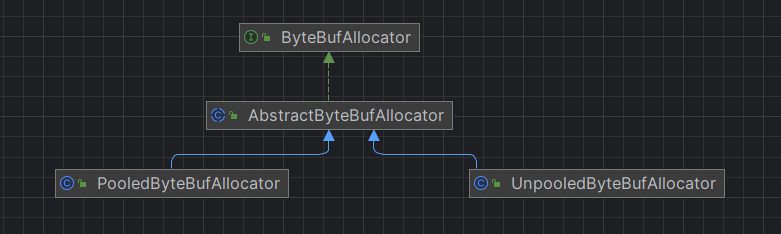

- PooledByteBufAllocator 提供了池化的操作，将 ByteBuf 实例放入池中，提升了性能，将内存碎片化减到了最小UnpooledByteBufAllocator。（这个实现采用了一种内存分配的高效策略，成为 jemalloc，已经被好几种现代操作系统所采用）
- UnpooledByteBufAllocator 在每次创建缓冲区时，都会返回一个新的 ByteBuf 实例，这些实例由 JVM 负责 gc 回收


> NioEventLoopGroup 默认启动了多少线程？

答：

NioEventLoopGroup 是一个多线程的事件循环器，默认启动了电脑可用线程数的两倍，在调用 NioEventLoopGroup 的构造方法之后，如果不传入线程数，最后启动的默认线程数的计算公式为：

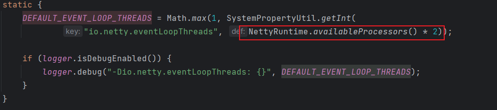


> Netty如何解决Selector空轮询BUG的策略


> 为什么没有使用 Netty 5？

答：

现在稳定推荐使用的主流版本还是Netty4，

Netty5 中使用了 ForkJoinPool，增加了代码的复杂度，但是对性能的改善却不明显，

所以Netty5 版本不推荐使用，官网也没有提供下载链接。

Netty 入门门槛相对较高，其实是因为这方面的资料较少，并不是因为他有多难，大家其实都可以像搞透 Spring 一样搞透 Netty。

在学习之前，建议先理解透整个框架原理结构，运行过程，可以少走很多弯路。
————————————————
版权声明：本文为CSDN博主「40岁资深老架构师尼恩」的原创文章，遵循CC 4.0 BY-SA版权协议，转载请附上原文出处链接及本声明。
原文链接：https://blog.csdn.net/crazymakercircle/article/details/124588880


> 了解 Netty 序列化吗？


> 如何设计一个内存池或者内存分配器？

答：

https://www.cnblogs.com/crazymakercircle/p/16181994.html


聊聊：如何设计一个Java对象池，减少GC和内存分配消耗
重要性：对对象池透彻理解，并且具备实操能力，也是编程高手的标志之一。

对象池顾名思义就是存放对象的池，与我们常听到的线程池、数据库连接池、http连接池等一样，都是典型的池化设计思想。

对象池的优点就是可以集中管理池中对象，减少频繁创建和销毁长期使用的对象，从而提升复用性，以节约资源的消耗，可以有效避免频繁为对象分配内存和释放堆中内存，进而减轻jvm垃圾收集器的负担，避免内存抖动。

Apache Common Pool2 是Apache提供的一个通用对象池技术实现，可以方便定制化自己需要的对象池，大名鼎鼎的 Redis 客户端 Jedis 内部连接池就是基于它来实现的。

说明：此题是一个实操性质的题目，后续尼恩带大家参考netty对象池，从0到1，架构、设计、实现一个高性能对象池组件

关于对象池的知识，请参见Netty内存池（史上最全 + 5W字长文）
————————————————
版权声明：本文为CSDN博主「40岁资深老架构师尼恩」的原创文章，遵循CC 4.0 BY-SA版权协议，转载请附上原文出处链接及本声明。
原文链接：https://blog.csdn.net/crazymakercircle/article/details/124588880


# JVM

> 1. 写代码时候有没有什么方式尽量减少Full GC的概率?

   答：

1. 避免一次性加载大量数据加载到内存，比如excel导入导出，jdbc数据库查询
2. 避免大对象的代码处理业务链流程过长，比如aop中获取到了对象参数，大对象捕获到了，导致对象生命周期变长了，没及时释放。
3. 禁止使用system.gc方法
4. 避免在使用threalocal后，未主动调用remove方法，尽量避免大对象的使用，以及频繁的创建和销毁。更要避免全局锁的竞争等。


> 2. 什么是gc，gc怎么排查，怎么手动让JAVA虚拟机OOM？ OOM的场景？


> 3. Full GC 耗时很长，怎么排查，怎么优化，具体到怎么写命令？


> 4. staic和final关键字结合jvm来讲


> 5. 讲讲垃圾回收和死亡对象判断方法，具体讲讲可达性分析


> 6. 发生频繁的fullgc可能由什么原因导致


> 7. CMS收集流程


> 8. 了解过 jvm 内存模型吗


> 9. 能不能说一下堆区具体怎么划分，为什么这样划分


> 10. JVM每个区具有什么功能？


> 11. GC底层算法，常见的垃圾回收器，双亲委派的类加载流程；


> 12. 标记整理法的缺点是什么？


> 13. 元空间是起到什么作用？


> 14. 自定义类加载的过程是什么？


> 15. 怎么释放一个用完的大对象的内存空间？


> 16. 对象的生命周期（new一个对象的过程）？


> 17. 什么时候会有内存泄漏，怎么排查？

答：

首先内存泄漏是堆中的一些对象不会再被使用了，但是无法被垃圾收集器回收，如果不进行处理，最终会导致抛出 `java.lang.OutOfMemoryError` 异常。

内存泄露：

- 不需要使用的对象被其他对象不正确的引用，导致无法回收。
- 对象生命周期过长


内存泄漏的8中情况：

1. 大量使用静态集合类（`HashMap、LinkedList`等），静态变量的生命周期和JVM程序一致，在程序结束之前，静态变量不会被释放，导致内存泄漏。（属于生命周期过长）

2. 单例模式的静态特性，也会导致生命周期过长，如果单例对象持有外部对象的引用，会导致外部对象不会被回收。

3. 内部类持有外部类：每个非静态内部类都会持有外部类的隐式引用，假如`a`为非静态内部类，`b`为`a`的外部类，如果`b`包含了大量对象的引用，非常占用内存空间，那么如果我们创建了非静态内部类`a`，此时即使`b`对象不再被使用了，也无法回收，占用内存空间，导致内存泄漏。

   解决办法：如果内部类不需要访问外部类的成员信息，可以考虑转换为静态内部类。

4. 各种连接（数据库连接、网络连接和IO连接）未及时关闭，导致大量对象无法回收，造成内存泄漏。

5. 变量不合理的作用域：一个变量的定义的作用范围大于其适用范围，很有可能造成内存泄露。

6. 改变哈希值：

   当一个对象被存储进HashSet集合中以后，就不能修改这个对象中的那些参与计算哈希值的字段了。

   否则，对象修改后的哈希值与最初存入HashSet集合时的哈希值就不同了，这种情况下，即使在contains方法使用该对象的当前引用作为参数去HashSet集合中检索对象，也将返回找不到对象的结果，这也会导致HashSet集合中无法单独删除当前对象，造成内存泄漏

   为什么改变哈希值之后找不到对象？因为根据存入时的哈希值去寻找放入的位置，而改变哈希值之后，再去查找就按照新的哈希值所对应的位置去查找，肯定找不到。

   这也是 String 为什么被设置成了不可变类型，我们可以放心的把 String 存入 HashSet，或者把String当作 HashMap 的 key 值。

   ```java
   public class ChangeHashCodeTest {
       public static void main(String[] args) {
           HashSet<Point> set = new HashSet<>();
           Point cc = new Point();
           cc.setX(10); // hashCode = 10
           set.add(cc);
           cc.setX(20); // hashCode = 20
           System.out.println("set remove = " + set.remove(cc));
           set.add(cc);
           System.out.println("set.size = " + set.size());
           /**
            * 输出：
            * set remove = false
            * set.size = 2
            */
       }
   }
   class Point {
       int x;
       public int getX() {
           return x;
       }
       public void setX(int x) {
           this.x = x;
       }
       @Override
       public boolean equals(Object o) {
           if (this == o) return true;
           if (o == null || getClass() != o.getClass()) return false;
           Point point = (Point) o;
           return x == point.x;
       }
       @Override 
       public int hashCode() {
           return x;
       }
   }
   ```

7. 缓存泄露：

   一旦把对象引用放入到缓存中，他就很容易遗忘。比如：之前项目在一次上线的时候，应用启动奇慢，就是因为代码会加载一个表的数据到缓存中，测试环境只有几百条数据，而生产环境有几百万的数据。

   对于这个问题，可以使用WeakHashMap代表缓存，此Map的特点是：当除了自身有key的引用外，此key没有其他引用，那么此map会自动丢弃此值。

8. ThreadLocal

   ThreadLocal的实现中，每个Thread维护一个ThreadLocalMap映射表，key是ThreadLocal实例本身，value是真正需要存储的Object。

   ThreadLocalMap使用ThreadLocal的弱引用作为key，如果一个ThreadLocal没有外部强引用来引用它，那么系统GC时，这个ThreadLocal势必会被回收，这样一来，ThreadLocalMap中就会出现key为null的Entry，就没有办法访问这些key为null的Entry的value。

   如果当前线程迟迟不结束的话，这些key为null的Entry的value就会一直存在一条强引用链：Thread Ref -> Thread -> ThreaLocalMap -> Entry -> value永远无法回收，造成内存泄漏。

   如何解决此问题？

   第一，使用ThreadLocal提供的remove方法，可对当前线程中的value值进行移除；

   第二，不要使用ThreadLocal.set(null) 的方式清除value，它实际上并没有清除值，而是查找与当前线程关联的Map并将键值对分别设置为当前线程和null。

   第三，最好将ThreadLocal视为需要在finally块中关闭的资源，以确保即使在发生异常的情况下也始终关闭该资源。

   ```java
   try {
       threadLocal.set(System.nanoTime());
   } finally {
       threadLocal.remove();
   }
   ```

   ​


**排查内存泄漏：**

可以查看`泄露对象`到`GC Roots`的引用链，找到泄露对象在哪里被引用导致无法被回收


> 18. JVM常见配置


堆设置

```yaml
-Xms3550m   初始堆大小 
-Xmx3550m   最大堆大小 
-XX:NewSize=1024     设置年轻代大小 
-XX:NewRatio=4       设置年轻代和年老代的比值.如:为3,表示年轻代与年老代比值为1:3,年轻代占整个年轻代年老代和的1/4 
-XX:SurvivorRatio=8  设置年轻代中Eden区与一个Survivor区的比值，默认为8
-XX:MaxPermSize=256m 设置持久代大小
```


收集器设置

```
-XX:+UseSerialGC:设置串行收集器 
-XX:+UseParallelGC:设置并行收集器 
-XX:+UseParalledlOldGC:设置并行年老代收集器 
-XX:+UseConcMarkSweepGC:设置并发收集器
```


垃圾回收统计信息

```
-XX:+PrintGC 
-XX:+PrintGCDetails 
-XX:+PrintGCTimeStamps 
-Xloggc:filename
```


并行收集器设置

```
-XX:ParallelGCThreads=n:设置并行收集器收集时使用的CPU数.并行收集线程数. 
-XX:MaxGCPauseMillis=n:设置并行收集最大暂停时间 
-XX:GCTimeRatio=n:设置垃圾回收时间占程序运行时间的百分比.公式为1/(1+n)
```


并发收集器设置

```
-XX:+CMSIncrementalMode:设置为增量模式.适用于单CPU情况. 
-XX:ParallelGCThreads=n:设置并发收集器年轻代收集方式为并行收集时,使用的CPU数.并行收集线程数.
```


> 19. JVM的堆配置过大的副作用有哪些?


答：JVM的堆内存配置过大，可能要面临的问题有：

- 回收大块堆内存而导致的长时间的时间停顿。
- 如果因为程序设计失误，将大对象从磁盘读取到内存中，可能会导致大对象在分配时直接进入老年代，没有在 Minor GC 中被清理掉。这样会导致频繁的发生 Full GC，给用户的体验是程序每个几分钟就停顿十几秒，非常卡顿。

**扩展：JVM的堆配置过小的副作用有哪些？**

- Minor GC 过于频繁


> 20. 如果出现堆内存溢出 `java.lang.OutOfMemoryError  Java heap space`，该如何解决？

答：解决思路如下：

- 首先需要拿到`堆转储快照`进行分析，查看导致 OOM 的对象是否有必要存在，并且分析清除是因为哪些对象导致了 OOM
- 如果是内存泄漏导致 OOM，可以查看`泄露对象`到`GC Roots`的引用链，找到泄露对象在哪里被引用导致无法被回收
- 如果不是内存泄漏，那么说明内存中的对象都是存活的，导致 OOM，这时应该检查虚拟机的堆内存设置是否有向上调整的空间。并且检查是否存在`对象生命周期过长`、`存储结构不合理`的情况，减少程序运行中的内存消耗。 


**扩展说明：因为存储结构不合理导致堆内存溢出（来自于《深入理解Java虚拟机第3版》）**

举例：使用 `HashMap<Long, Long>` 存储大量的数据，会导致浪费大量的空间，因为 HashMap 的空间效率使用太低。

对于一个 `HashMap<Long, Long>`来说，有效数据只有 Key、Value 的两个 long 型数据，占 16字节，long 数据被包装为 java.lang.Long 对象后，就分别具有 8 字节的 Mark Word、8字节的 Klass 指针、8字节的 long 型数值。两个 Long 对象组成 Map.Entry 之后，又多了 16 字节的对象头、8字节的 next 字段、4字节的 int 型的 hash 字段、4字节的空白填充（为了对齐）还有 HashMap 中对这个 Entry 的 8 字节的引用，这样实际占用的内存为：`(Long(24byte) * 2) + Entry(32byte) + HashMap Ref(8byte)=88byte`，空间效率仅仅为  16byte / 88byte = 18%。


# Redis

Redis 常见面试题：https://javaguide.cn/database/redis/redis-questions-02.html

https://blog.csdn.net/qq_53868937/article/details/130806921


> 1. Redisson 分布式锁？在项目中哪里使用？多久会进行释放？如何加强一个分布式锁？

答：

首先入门级别的分布式锁是通过 `setnx` 进行实现，使用 `setnx` 实现有四个注意点

1. 需要设置锁的超时时间（如果不设置，在释放锁时，如果机器宕机，会导致锁无法释放）

2. 需要设置一个唯一 ID，表示这个锁是哪个用户添加的，必须由添加锁的用户释放

   （如果不设置，线程1在执行任务时，可能锁的超时时间已经达到，被自动释放，此时线程2加锁，开始执行业务，但正好线程1执行完毕，释放锁，由于没有唯一ID表示，线程1将线程2加的锁给释放掉了）

3. 需要`锁续命` 

   有可能锁的过期时间设置的太短，导致业务没有执行完毕，锁就被自动释放，因此要使用锁续命来解决（大概逻辑是使用子线程执行定时任务，定时任务间隔时间要小于 key 的过期时间，子线程隔一段时间判断主线程是否在执行，如果在执行，就重新设置一下过期时间）

4. 可重入问题：setnx 实现的分布式锁不可重入，这样获取锁的线程在重复进入相同锁的代码块中会造成死锁


而在 Redission 中已经帮我们实现好了分布式锁，下来看一下 Redission 中的分布式锁：


**Redission 中获取锁逻辑：**

在 Redission 中加锁，通过一系列调用会到达下边这个方法

他的可重入锁的原理也就是使用 hash 结构来存储锁，key 表示锁是否存在，如果已经存在，表示需要重复访问同一把锁，会将 value + 1，即每次重入一次 value 就加 1，退出一次 value 就减 1

下列方法有三个参数分别为：

- KEYS[1] ： 锁名称
- ARGV[1]： 锁失效时间
- ARGV[2]： id + “:” + threadId; 锁的小key

```java
    <T> RFuture<T> tryLockInnerAsync(long leaseTime, TimeUnit unit, long threadId, RedisStrictCommand<T> command) {
        internalLockLeaseTime = unit.toMillis(leaseTime);

        return commandExecutor.evalWriteAsync(getName(), LongCodec.INSTANCE, command,
                  "if (redis.call('exists', KEYS[1]) == 0) then " +
                      "redis.call('hset', KEYS[1], ARGV[2], 1); " +
                      "redis.call('pexpire', KEYS[1], ARGV[1]); " +
                      "return nil; " +
                  "end; " +
                  "if (redis.call('hexists', KEYS[1], ARGV[2]) == 1) then " +
                      "redis.call('hincrby', KEYS[1], ARGV[2], 1); " +
                      "redis.call('pexpire', KEYS[1], ARGV[1]); " +
                      "return nil; " +
                  "end; " +
                  "return redis.call('pttl', KEYS[1]);",
                    Collections.<Object>singletonList(getName()), internalLockLeaseTime, getLockName(threadId));
    }
```


**Redission 中锁续命原理：**

Redission 底层有个看门狗机制，加锁成功后会有一个定时任务，默认锁的失效时间是 30s，该定时任务每隔锁失效时间的 1/3 就会去续约锁时间，也就是每隔 10s 进行锁续命


**如何加强一个分布式锁？**

也就是如何提升一个分布式锁的性能，分布式锁本质上是将并行操作改为串行，那么我们可以通过使用`分段锁`来提升性能，比如说有 1000 个库存的话，读入到缓存中将分为 10 份进行存储，即 `product_stock_1 = 100, product_stock_2 = 100, ...`，给每一份都加上所，那么多个线程来竞争这 10 把锁，比原来竞争 1 把锁的性能提高 10 倍


> 2. zset 的底层实现？为什么不用红黑树？

答：

zset 的底层实现是：`压缩列表 + 跳表`


**什么时候使用压缩列表？**

- 有序集合保存的元素个数要小于 128 个；
- 有序集合保存的所有元素成员的长度都必须小于 64 字节。

否则使用跳表


跳表中每个节点都有多个跳跃指针，因此每个节点的平均跳跃长度较长，可以一次跳过多个节点，当找到大于或等于目标元素的节点后，再使用普通指针开始移动（可以向后移动，也可以向前移动，跳表含有前边节点的指针）寻找目标元素，跳表可以在 `O(logn)` 的时间内遍历跳表


**跳表结构图：**

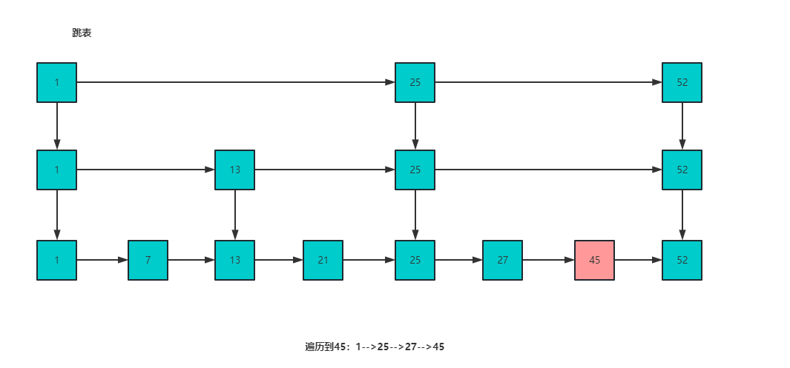


**为什么不用红黑树？**

- 跳表和红黑树的查找时间复杂度都是`O(logn)`，但是红黑树比跳表的插入/删除效率更低
  - 跳表在插入或删除时，只需考虑相邻节点，而红黑树需考虑节点的旋转问题，焦虑较低
- 跳表实现比红黑树更简单


> zset 几个命令的时间复杂度？ 

答：

- `zadd`：O(logn)，添加一个元素的时间复杂度是 O(logn)（因为插入元素的话，时间开销都在查找插入位置上，在 zset 中，查找时间复杂度是 O(logn)，因此插入复杂度同是）
- `zrange`：O(logn + m) ，n 是集合中元素数量，m 是指定范围内的用户数量


> 3. redis 里面的命令，比如 setnx 和 setex 还有 zset 中的命令？

答：

zset 中的常用命令为：

- `zadd <key> <score1> <value1> <score2> <value2> ...` 

  向集合 key 中添加元素

- `zrange <key> <start> <stop> [withscores]`

  查找下标在 start 和 stop 之间的元素，如果后边带上 `withscores` 参数，会将分数也查询出来

- `zrevrange <key> <start> <stop> [withscores]` 

  将分数从大到小进行查询，和 zrange 查询顺序相反

- `zrangebyscore <key> <min> <max> [withscores]`

  返回集合 key 中所有 score 介于 min 和 max 之间的成员，如果后边带上 `withscores` 参数，会将分数也查询出来

- `setex <key> <seconds> <value>`

  设置 key、value 并且设置过期时间

- `setnx <key> <value>`

  仅当 key 不存在时，才将 key 的值设置为 value，成功返回1，失败返回0

  ​


> 8. 缓存怎么保证数据的一致性？

答：

- `先删除缓存，再更新数据库`  （操作简单）

  这种情况造成的缓存不一致为：线程 A 先删除缓存，再去更新数据库，在线程 A 更新数据库之前，如果线程 B 去读取缓存，发现并不存在，去读取数据库，此时读取的是旧数据，再将旧数据写入缓存，此时缓存存储的就是脏数据了。

  使用`更新数据库 + 延时双删`可以解决此情况的数据不一致，在延时双删中，会删除两次缓存，分为以下几步：

  ```bash
  1. 删除缓存
  2. 更新数据库
  3. 睡眠  Thread.sleep()
  4. 再删除缓存
  ```

  即延时双删在线程 A 更新完数据库之后，休眠一段时间，再去删除缓存中可能存在的脏数据。

  这样第二次删除缓存可能导致线程 A 执行时间过长，第二次可以使用`异步`去删除缓存 


- `先更新数据库，再删除缓存` 

  这种情况可能因为线程 A 没有及时删除缓存或者删除缓存失败而导致线程 B 读取到旧数据

  可以使用消息队列来完成：

  1. 先将要删除的缓存值或者是要更新的数据库值暂存到消息队列中
  2. 当程序没有成功删除缓存值或者更新数据库值时，从消息队列中读取这些值，再次进行删除或更新
  3. 如果成功删除缓存或者更新数据库，要将这些值从消息队列中取出，以免重复操作

  ​

**高级扩展点**：`Canal 监听日志更新 + 定时任务缓存处理`，简单概括来说就是 Canal 可以监控 MySQL 的 binlog，当发现数据库的数据发生变化后，就去同步缓存，就可以达到最终的数据一致性了


> 9. 什么时候做缓存的清理？

   答：设置5~10分钟的过期时间


> 11. 了解 redis 中的大key吗？多大算是大key呢？如何解决？

答：

redis 的大 key 指的是 key 对应的 value 所占用的内存比较大。

对于 string 类型来说，一般情况下超过 10KB 则认为是大 key；对于set、zset、hash 等类型来说，一般数据超过5000条即认为是大 key

bigkey 除了会消耗更多的内存空间和带宽，还会对性能造成比较大的影响。应该避免系统中出现 bigkey。

**查找大key：**

1. 使用命令 `redis-cli -p 6379 --bigkeys -i 3` 在 redis 中查找大 key，通过 `-i` 控制扫描频率，表示扫描过程中每次扫描后休息的时间间隔为 3 秒。
2. 分析 RDB 文件来找出大 key。


**解决大key：**

1. 将大key切割为多个小key。（不推荐，这样需要修改业务代码）
2. 如果大key不是热点key，手动删除。redis4.0+ 使用 `unlink` 命令异步删除传入的key


> 了解 redis 中的热 key 吗？

答：

热 key 指的是在 redis 接收的读写请求中，某个 key 就占了一般甚至更多的请求，称为热 key。

处理热 key 会占用大量的 CPU 和带宽，如果在某一时间内大量访问热key，请求数量超过 redis 的处理能力或者热key正好在缓存中过期，就会导致线上服务崩溃。

需要对系统中的热 key 进行优化，确保系统的高可用和稳定性。


**查找热key：**

1. 使用 `redis-cli --hotkeys` 来查找热key，使用该命令时，需要设置 `maxmemory-policy` 为 LRU 算法，否则会报错。

2. 使用 `monitor` 命令来实时查看 redis 实例的操作情况，包括读写删除等操作。

   该命令对 redis 性能影响较大，谨慎使用。

   使用 `monitor` 命令并输出重定向至文件，在关闭 `monitor` 命令后对文件进行分析，即可找到这段时间内的热 key。


**解决热key：**

1. 使用二级缓存。将热 key 存储一份到 JVM 本地内存中（可以使用Caffeine）
2. 使用 redis 集群：在多个 redis 实例上都存储一份热 key，分散热 key 的访问请求
3. 读写分离：主节点处理写请求，从节点处理读请求


> 13. redis用的什么版本，6.0多线程体现在哪里？redis的性能瓶颈在哪里？

答：自己项目中的 redis 使用的 6.2.6版本。redis的性能瓶颈在于内存、网络IO处理速度。

redis6.0 引入了多线程，引入多线程的目的是为了提高`网络IO`的处理性能.

redis 的多线程只是用来处理网络请求，对于读写命令，还是使用单线程进行处理，因此并不存在线程安全的问题。


6.0多线程默认关闭，在 redis.conf 中设置 `io-threads-do-reads yes` 进行开启，并且设置线程个数`io-threads  6` 

**主线程与IO线程的协作流程：**

1. 服务端和客户端建立Socket连接，并分配处理线程

   主线程负责接收建立连接请求。当有客户端请求和实例建立Socket连接时，主线程会创建和客户端的连接，并把 Socket 放入全局等待队列中。 紧接着，主线程通过轮询方法把Socket连接分配给IO线程。

2. IO线程读取并解析请求

   主线程一旦把Socket分配给IO线程，就会进入阻塞状态，等待IO线程完成客户端请求读取和解析。因为有多个IO线程在并行处理，所以，这个过程很快就可以完成。

3. 主线程执行请求操作

   等到IO线程解析完请求，主线程还是会以单线程的方式执行这些命令操作

   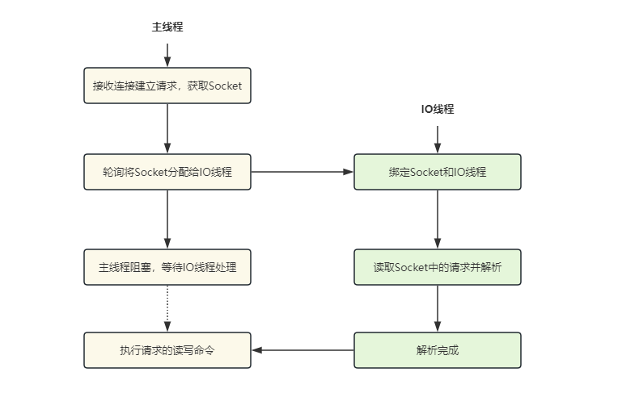


> 15. redis基本数据结构？

答：

有 5 中基本数据结构：字符串、list列表、hash字典、set集合、zset有序集合


**基本数据结构添加数据命令：**

- 字符串： `set key value [ex seconds | px milliseconds] [nx | xx]`

  nx：指定 key 不存在才会设置成功

  xx：指定的 key 必须存在才会设置成功，用于更新 key

- list：`lpush key value [value...]`  `rpush key value [value...]`

- hash： `hset key field value` 将 key 中的 field 的值设置为 value

- set： `sadd key value [value...]`

- zset：`zadd key score value` 向 key 中添加一个 value 和 score，根据 score 排序

**数据结构基本介绍：**

- list 列表是链表，不是数据
- set 集合内部的键值对是无序且唯一的


**基本数据结构应用场景：**

- 字符串

  - 限速器：防止 DoS 攻击，对 ip 进行访问次数限制，但是无法防止 DDoS 攻击，因为 DDoS 是分布式拒绝服务，使用了不同 ip 不断访问服务器

    ```java
    // 等价于 set 192.168.55.1 ex 60 nx
    // 如果该ip不存在，指定key为ip，value为1，过期时间为60秒
    Boolean exists = redis.set(ip, 1, "ex 60", "nx");
    if(exists != null || redis.incr(ip) <= 5) {
      // 通过访问
    } else {
      // 限流
    }
    ```

- list

  - 栈  `lpush + lpop` 实现
  - 列表  `rpush + lpop`  或 `lpush + rpop` 实现
  - 阻塞式消息队列 `lpush + brpop` 实现

- hash

  - 存储对象数据：key 为对象名称，value 为描述对象属性的 Map，对象属性的修改在 Redis 中就可直接完成

- set

  - 去重操作

- zset

  - 用户排行榜
  - 用户点赞统计


> 17. redis数据结构 sds优化


> 21. Redis如何保证原子性，Lua脚本


> 23. 什么情况使用 redis 反而降低性能


> 24. 谈谈Redis 的持久化策略？

`Redis`的确是将数据存储在内存的，但是也会有相关的持久化机制将内存持久化备份到磁盘，以便于重启时数据能够重新恢复到内存中，避免数据丢失的风险。而`Redis`持久化机制有三种：`AOF`、`RDB`、`混合型持久化（4.x版本后提供）`


- **RDB持久化**

  `关闭 RDB 持久化只需要将 save 保存策略注释掉即可`

  RDB持久化的方式有两种：

  - 手动save：阻塞当前 Redis，直到持久化完成，可能造成长时间阻塞，线上不建议使用。

    Redis 中 save 操作的配置：从右向左条件主键变弱，如果60s发生了10000次写操作，就进行持久化，如果没有达到，在300s时，如果有100次写操作就会持久化，如果没有达到在3600s，如果有一次写操作就会持久化

    

    ​

  - 手动bgsave：Redis 进程执行 `fork` 创建子进程进行持久化，阻塞事件很短。在执行`Redis-cli shutdown`关闭`Redis`服务时或执行`flushall`命令时，如果没有开启`AOF`持久化，自动执行`bgsave`

  ​

  `bgsave子进程工作原理：` 

  由子进程继承父进程所有资源，且父进程不能拒绝子进程继承，bgsave子进程先将内存中的全量数据copy到磁盘的一个`RDB临时文件`，持久化完成后将该临时文件替换原来的`dump.rdb`文件。

  如果持久化过程中出现了新的写请求，则系统会将内存中发生数据修改的物理块copy出一个副本，bgsave 子进程会把这个副本数据写入 RDB 文件，在这个过程中，主线程仍然可以直接修改原来的数据，`fork` 使用了 `写时复制技术（Copy-On-Write）`。

  ​

  `写时复制技术：` 

  目的是避免不必要的内存拷贝。

  在Linux系统中，调用 `fork` 系统调用创建子进程时，并不会把父进程所有占用的内存页复制一份，而是与父进程共用相同的**内存页**，而当子进程或者父进程对**内存页**进行修改时才会进行复制 —— 这就是著名的 `写时复制` 机制。

  那么bgsave中的写时复制技术即如果在持久化过程中，写入了新的数据，此时再去将元数据重新拷贝一份进行修改。

  ​

  `优点：` 

  - 使用单独子进程持久化，保证 redis 高性能。
  - RDB 持久化存储压缩的二进制文件，适用于备份、全量复制，可用于灾难备份，同时`RDB`文件的加载速度远超于`AOF`文件。

  `缺点：`

  - 没有实时持久化，可能造成数据丢失。
  - 备份时占用内存，因为`Redis` 在备份时会独立创建一个子进程，将数据写入到一个临时文件（需要的内存是原本的两倍）
  - `RDB`文件保存的二进制文件存在新老版本不兼容的问题。

- **AOF持久化**

  默认AOF没有开启，可在`redis.conf`中配置

  

  Redis7发生了重大变化，原来只有一个appendonly.aof文件，现在具有了三类多个文件：

  - 基本文件：RDB格式或AOF格式。存放RDB转为AOF当时内存的快照数据。该文件可以有多个。
  - 增量文件：以操作日志形式记录转为AOF后的写入操作。该文件可以有多个。
  - 清单文件：维护AOF文件的创建顺序，保证激活时的应用顺序。该文件只可以有1个。

  ​

  aof 文件中存储的 resp 协议数据格式，如果执行命令`set a hello`，aof文件内容如下：`（*3代表有3条命令，$5代表有5个字符）`

  ```bash
  *3
  $3
  set
  $1
  a
  $5
  hello
  ```

  AOF持久化时，其实是先写入缓存中，之后再同步到磁盘中，同步策略有三种：

  - `appendfsync always`：每次写入都同步到磁盘，最安全，但影响性能。
  - `appendfsync everysec`（推荐、默认配置）：每秒同步一次，最多丢失1秒的数据。
  - ``appendfsync no` ：`Redis`并不直接调用文件同步，而是交给操作系统来处理，操作系统可以根据`buffer`填充情况/通道空闲时间等择机触发同步；这是一种普通的文件操作方式。性能较好，在物理服务器故障时，数据丢失量会因`OS`配置有关。

  `优点：` 

  - 数据丢失风险较低，后台线程处理持久化，不影响客户端请求处理的线程。

  `缺点：`

  - 文件体积由于保存的是所有命令会比`RDB`大上很多，而且数据恢复时也需要重新执行指令，在重启时恢复数据的时间往往会慢很多。

  `AOF的重写（Rewrite）机制：`

  - 为了防止AOF文件太大占用大量磁盘空间，降低性能，Redis引入了Rewrite机制对AOF文件进行压缩

    Rewrite就是对AOF文件进行重写整理。当开启Rewrite，主进程redis-server创建出一个子进程bgrewriteaof，由该子进程完成rewrite过程。

    首先会对现有aof文件进行重写，将计算结果写到一个临时文件，写入完毕后，再重命名为原aof文件，进行覆盖。

  ​

    `配置AOF重写频率`

  ```bash
  # auto‐aof‐rewrite‐min‐size 64mb //aof文件至少要达到64M才会自动重写，文件太小恢复速度本来就很快，重写的意义不大
  # auto‐aof‐rewrite‐percentage 100 //aof文件自上一次重写后文件大小增长了100%则再次触发重写
  ```

  `AOF的持久化流程图：` 

  


  

​    


- **混合持久化开启**

  默认开启，即AOF持久化的基本文件时的基本文件是RDB格式的。（必须先开启aof）

  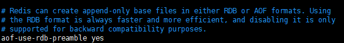

  **混合持久化重写aof文件流程**：aof 在重写时，不再将内存数据转为 resp 数据写入 aof 文件，而是将之前的内存数据做 RDB 快照处理，将 `RDB快照+AOF增量数据` 存在一起写入新的 AOF 文件，完成后覆盖原有的 AOF 文件。

  ​

  **Redis重启加载数据流程：**

  1. 先加载 RDB 数据到内存中
  2. 再重放增量 AOF 日志，加载 AOF 增量数据

  `优点：`

  - 结合了 RDB 和 AOF，既保证了重启 Redis 的性能，又降低数据丢失风险

  `缺点：`

  - AOF 文件中添加了 RDB 格式的内容，使得 AOF 文件的可读性变得很差； 


> Redis 的数据备份策略


1. 写crontab定时调度脚本，每小时都copy一份rdb或aof的备份到一个目录中去，仅仅保留最近48小时的备份


2. 每天都保留一份当日的数据备份到一个目录中去，可以保留最近1个月的备份
3. 每次copy备份的时候，都把太旧的备份给删了
4. 每天晚上将当前机器上的备份复制一份到其他机器上，以防机器损坏


> 25. 在缓存一致性过程中如果MQ宕机了怎么办？


> 26. redis批处理？


> 27. Redis内存过期策略

答：

Redis中提供了8种内存淘汰策略：

`volatile-lru：`针对设置了过期时间的key，使用LRU算法进行淘汰 
`allkeys-lru：`针对所有key使用LRU算法进行淘汰 
`volatile-lfu：`针对设置了过期时间的key，使用LFU算法进行淘汰 
`allkeys-lfu：`针对所有key使用LFU算法进行淘汰 
`volatile-random: `从设置了过期时间的key中随机删除  

`allkeys-random: `从所有key中随机删除 
`volatile-ttl：`删除生存时间最近的一个键 
`noeviction`（默认策略）：不删除键，返回错误OOM，只能读取不能写入 


总结一下：也就是从过期的key或者所有的key中使用 LRU或者LFU或者随机 删除策略进行淘汰


> 28. 缓存雪崩是什么？如何解决？

答：缓存雪崩造成的原因是：大量缓存数据在同一时间过期或者Redis宕机，此时如果有大量的请求无法在Redis中处理，会直接访问数据库，从而导致数据库的压力骤增，甚至数据库宕机


出现原因：缓存过期、Redis故障

`缓存过期解决：`

1. 给过期时间加上一个随机数
2. 互斥锁，当缓存失效时，加互斥锁，保证同一时间只有一个请求来构建缓存
3. 缓存预热，在系统启动前，提前将热点数据加载到缓存中，避免大量请求同时访问数据库

`Redis故障解决：`

1. 服务熔断或请求限流
2. 构建Redis缓存高可靠集群

> 29. 缓存穿透是什么？如何解决？

答：缓存穿透造成的原因是访问数据库中不存在的数据，即数据库和缓存都不命中

缓存穿透就是访问大量数据库中不存在的设备，每次都需要去数据库中查询，失去了缓存保护后端存储的意义。

`造成原因：`

- 自身代码问题
- 恶意攻击

`解决方案有两种：`

1. 如果访问数据库中不存在的数据，则将该数据设置为字符串`{}`并且放入缓存，避免访问不存在的数据而大量请求打到数据库，缓存 kv 格式为：`empty_cache_key: {}`

```java
// 设置key为空缓存
redisUtil.set(productCacheKey, "{}", 60 + new Random().nextInt(30), TimeUnit.SECONDS);
// 如果访问到空缓存，重新刷新空缓存的过期时间
redisUtil.expire(productCacheKey, 60 + new Random().nextInt(30), TimeUnit.SECONDS);
```

2. 布隆过滤器：在使用布隆过滤器时，先将所有数据hash到一个位图中，之后接收客户端请求时，先去布隆过滤器中判断数据是否存在，如果不存在，则直接返回空，不会请求数据库。

   在SpringBoot中，我们可以使用Guava提供的布隆过滤器实现缓存穿透的解决方案。


> 30. 缓存击穿是什么？如何解决？

答：缓存击穿造成的原因是：热点key失效

同一时间批量添加数据，并且数据的过期时间相同，大量数据同一时间缓存失效可能导致大量请求直达数据库，如果请求过多，数据库会挂掉。

`解决：`

批量添加数据的话，在设置的过期时间上再加上一个随机时间即可。

```java
// 过期时间 = cache_timeout + new Random().nextInt(5) * 60 * 60;
```

还可通过互斥锁解决


> 31. Redis 的 key 删除策略了解吗？

答：

- 惰性删除：`key`过期后任然留在内存中不做处理，当有请求操作这个`key`的时候，会检查这个`key`是否过期，如果过期则删除，否则返回`key`对应的数据信息。（惰性删除对CPU是友好的，因为只有在读取的时候检测到过期了才会将其删除。但对内存是不友好，如果过期键后续不被访问，那么这些过期键将积累在缓存中，对内存消耗是比较大的。）
- 定期删除：`Redis`数据库默认每隔`100ms`就会进行随机抽取一些设置过期时间的`key`进行检测，过期则删除。（定期删除是定时删除和惰性删除的一个折中方案。可以根据实际场景自定义这个间隔时间，在CPU资源和内存资源上作出权衡。）
- `Redis`默认采用定期+惰性删除策略。


> Redis 的主从机制有哪些好处？哪里存在问题？

答：

`主从机制好处：`

- 主从机制为后续的高可用机制打下了基础，可以将数据同步到多个从节点，做到灾备的效果
- 通过主写从读的形式实现读写分离，提高 Redis 吞吐量。

`主从机制同样存在一些问题：`

- 如果主节点宕机，需手动从 slave 选择一个新的 master，同时需修改应用方的主节点地址，还需要命令所有从节点去复制新的主节点。
- 写入性能受主节点限制
- 木桶效应：整个`Redis`节点群能够存储的数据容量受到所有节点中内存最小的那台限制，比如一主两从架构：`master=32GB、slave1=32GB、slave2=16GB`，那么整个`Redis`节点群能够存储的最大容量为`16GB`


> Redis Sentinel有什么作用？


答：

在主从集群基础上，使用 Sentinel（哨兵） 角色来帮我们监控 Redis 节点运行状态，并自动实现故障转移，当 master 节点出现故障时，Sentinel 根据规则选一个 slave 升级为 master，确保集群可用性，在这个过程中不需要人工介入。


Redis Sentinel的主要功能是：

- 监控 redis 节点状态是否正常
- 故障转移，确保 redis 系统的可用性


一般主从复制+哨兵一起使用，使用3台哨兵+1个主从集群（1master，2slave）


`Redis Sentinel + 主从模式 存在的问题：` 

- Redis Sentinel 在主节点挂了之后，选举主节点中断时间达几秒甚至十几秒，期间无法进行写入操作
- 只有一个主节点对外提供服务，无法提供很高的并发，并且单个节点内存不宜设置过大，导致持久化文件过大，影响数据恢复和主从同步效率


> Redis 切片集群了解吗？

答：

Redis 切片集群是目前使用比较多的方案，Redis 切面集群支持多个主从集群进行横向扩容，架构如下：

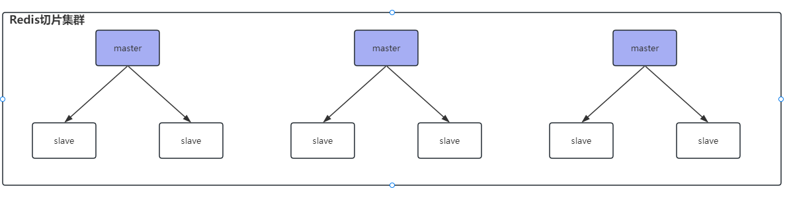

**使用切片集群有什么好处？**

- 提升 Redis 读写性能，之前的主从模式中，只有 1 个 master 可以进行写操作，在切片集群中，多个 master 承担写操作压力

- 多个主从集群进行存储数据，比单个主从集群存储数据更多

  比如10G数据，1个主从集群的话，1个master需要存储10G，对有3个主从集群的切片集群来说，只需要master1存储3G，master2存储3G，master3存储4G即可

- 具备主从复制、故障转移

  切片集群中的每一个主从集群中，slave 节点不支持读，只做数据备份，因为已经有其他master节点分担压力


**切片集群支持水平扩容，可以无限扩容吗？**

不可以，官方推荐不要超过1000个，因为各个小集群之间需要互相进行通信，如果水平节点过多，会影响通信效率。


**切片集群中插入数据时，数据被放在哪个master中？**

Redis 切片集群中，数据是通过 `哈希槽分区` 来存储的，Redis 切片集群中有 `16384` 个哈希槽，每一个 master 会拿到一些槽位，在向切片集群中插入数据时，会根据 key 计算对应的哈希槽，插入到对应的哈希槽中，那么计算出来的哈希槽在哪个master中，数据当然也就被存放在对应的master上。（在切片集群中，只有master节点才有插槽，slave节点没有插槽）


**切片集群中如果一个master挂了，如何选举主节点？**

当 master 挂了之后，该 master 下的所有 slave 会向所有节点广播 `FAILOVER_AUTH_REQUEST` 信息，其他节点收到后，只有 master 响应，master 会相应第一个收到的 `FAILOVER_AUTH_REQUEST` 信息，并返回一个 ack，尝试发送 failover 的 slave 会收集 master 返回的  `FAILOVER_AUTH_ACK`，当 slave 收到超过半数的 master 的 ack 后，就会变成新的 master。


**这样会导致 slave 一直没收到超过半数的 master 的 ack，难道要一直选举吗？**

其实不会导致 slave 一直选举的，因为在 slave 知道 master 挂了之后，会经过一个延时时间 `delay` 之后再去给所有节点发送选举消息

延迟时间计算：`delay = 500ms + random(0~500ms) + slave_rank * 1000ms` （版本不同可能不一样，原理大致相同）

slave_rank表示slave已经从master复制数据的总量的rank，rank越小，表示复制的数据越新，该slave节点也就越先发起选举。

因此数据量越多的 slave 就越早发送选举消息，也就越早得到 master 的 ack，成为新的 master。


**集群切片中的脑裂问题了解吗？如何解决？**

比如一个主从集群：master1 对应两个从节点 slave1、slave2，如果master1和两个从节点出现网络分区，两个slave会选举出来一个新的master节点，客户端是可以感知到两个master，但是两个master之间因为网络分区无法感知，客户端会向这两个master都写入数据，之后如果网络分区恢复，其中一个master变为slave，就会导致数据丢失问题。


如何解决？添加redis配置：

```bash
min-slave-to-write 1 
```

表示写数据时，写入master之后，不立即返回客户端写成功，而是去slave同步数据，取值为1表示最少同步1个slave之后，才算数据写成功，如果同步的slave节点数量没有达到我们配置的值，就算数据写失败，取值建议：集群总共3个节点，可以取1，这样集群中超过半数（1个master + 1个slave）都写入数据成功，才算写成功。

但是这个配置为了数据的一致性，牺牲了一定的集群可用性，如果一个master的所有slave都挂了，这个小集群就不可用了，master无法写入数据。

`一般不使用，redis丢一点数据也影响不大，所以主要还是保证redis的可用性` 


**集群是否完整才能对外提供服务？**

当redis.conf配置 `cluster-require-full-coverage no` 时，表示如果一个主从集群全部挂掉之后，集群仍然可用，如果为 yes，表示不可用

比如有3个主从集群，其中一个主从集群全部瘫痪，配置为no，则整个集群仍然可以正常工作


**Redis集群如何对批量操作命令的支持？**

对于 mset、mget 这样的多个 key 的原生批量操作命令，redis 集群只支持所有key落在同一个slot的情况，如果多个key一定要用mset在redis集群上操作，则可以在key之前加上{XX}，这样就会根据大括号中的内容计算分片hash，确保不同的key落在同一slot内，例如：

```
mset {user1}: name zhuge {user1}:age 18
```

虽然name和age计算出来的 hash slot 值不同，但是前边加上大括号{user1}，redis集群就会根据 user1 计算插槽值，最后name和age可以放入同一插槽。


# Spring 

> 1. Spring 循环依赖了解吗，怎么解决？

参考文章：https://juejin.cn/post/7146458376505917447

https://mp.weixin.qq.com/s/cqkZEvmmh7jnNt2K5r_lXg

https://juejin.cn/post/7218080360403615804

​

循环依赖是指 Bean 对象循环引用，是两个或多个 Bean 之间相互持有对方的引用，例如 `A -> B -> A`

单个对象的自我依赖也会出现循环依赖，但这种概率极低

- SpringBoot 2.6x 以前是默认允许循环依赖的，即使出现了循环依赖也不会报错。
- 解决办法：三级缓存机制，提前暴露的对象存放在三级缓存中，二级缓存存放半成品的 bean，一级缓存存放最终的 bean。但是三级缓存也存在一些缺点，比如增加了内存开销，需要维护3个map，降低了性能（需要进行多次检查和转换），并且少部分情况下不支持循环依赖，如非单例的 bean 和 @Async 注解的 bean 无法支持循环依赖


> 2. Spring框架用的什么版本，5和6相比有什么新特性，其他类似的框架，Spring除了ioc和aop还用过什么特性？


> 3. Spring Bean 的生命周期？AOP 在哪一步实现？aop 的实现原理，细说一下动态代理种类？


> 4. 为什么 ServiceImpl 里直接调用 this.xxx() 事务不生效？


> 5. 介绍下Spring中bean的创建和初始化过程 


> 6. bean的循坏依赖何时成功，何时失败？ 


> 7. 两个bean，A和B，A的构造函数有B，B注入A，循环依赖能初始化成功吗？ 


> 8. Spring 和 SpringBoot 区别？


> 9. @Aotuwired和@Resource区别？


> 10. aop ioc原理应用及相关注解


> 11. Spring源码用到的设计模式


> 12. 拦截器有几个方法，分别在什么时候执行，对比过滤器


> 13. Spring容器的启动过程


> Spring bean 线程安全吗


# MyBatis

> 1. 如果给你优化mybatis怎么优化？


> 2. ${字符串替换符}和#{占位符 预编译处理}的区别


> 3. 二级缓存


# Spring Boot

> 1. 使用的数据库连接池是什么？
> 2. Spring Boot 默认的数据库连接池是什么？
> 3. Spring Boot 如果需要增加 Redis 功能，需要在 pom 增加什么依赖？
> 4. 鉴权常用的办法？
> 5. Spring Boot 中哪里用到了反射机制？


> 6. 说一下 springboot 的自动配置


> 7. 导入一个 jar 包怎么让 springboot 知道哪些需要自动配置(不确定是不是这样表达)


# Spring Cloud

> 1. Spring Cloud 和 Dubbo 的区别


> 2. Sentinel 熔断机制


> 3. Spring Gateway 网关的作用


> 4. 注册中心是做什么的？


# Dubbo

> 1. dubbo 的请求处理流程


# 分布式

> 1. raft 算法选举流程？


> 2. 怎么理解 Rpc？


> 3. RPC的延展技术，就是gRPC,Dubbo了解吗？


> 4. RPC 、Http、Rset 使用场景有什么不同？


> 5. rpc有多少dubbo的功能？如何暴露服务？服务挂了怎么办？


> 6. rpc过程和用户态内核态的关系


# 多线程

项目推荐：京东的 asyncTool 并发框架，大量使用到了 `CompletableFuture`。


> 1. 如何设计一个能够根据优先级来执行的线程池？

首先对于阻塞队列，可以考虑使用 `PriorityBlockingQueue `作为任务队列。

`PriorityBlockingQueue` 是一个支持优先级的无解阻塞队列，要想对任务进行排序，需要让提交到线程池的任务实现 `Comparable` 接口，并重写 `compareTo` 方法来指定任务之间的优先级比较规则，还有一种方式就是创建 `PriorityBlockingQueue` 时传入一个 Comparator 对象来制定任务之间的排序规则（推荐第二种方式）。

但是还存在几个问题：

1. 在使用优先级任务队列时，当生产者速度快于消费者时，时间长之后会造成 OOM，因为该队列并不会阻塞生产者，只会阻塞消费者，当没有任务消费时，会阻塞消费者
2. 会导致饥饿问题，即优先级低的任务长时间不执行
3. 由于对队列中的元素进行排序以及保证线程安全（并发控制采用的可重入锁 ReentrantLock），因此会降低性能

对于 OOM 问题，可以继承 `PriorityBlockingQueue` 并且重写 `offer` 方法，即入队逻辑，当插入的元素数量超过指定值就返回 false

饥饿问题可以通过优化设计来解决，比如等待时间过长的任务会被移除，并重新添加到队列中，并且提升优先级


> 2. 线程池原理？线程池如何回收线程？（怎么知道任务处理完毕？）依据什么去设置核心线程数？(CPU密集型和IO密集型）


> 3. threadlocal 底层实现


> 4. 为什么threadlocal的key是弱引用


> 5. 怎么处理线程安全的问题？（我说了死锁和threadlocal)


> 6. thread内存泄漏


> 7. 怎么获取子线程的返回值？


> 8. 子线程抛异常，主线程try-catch 是否可以获取到异常 。


# Netty

> 1. Netty 为什么快？为什么用 Netty？有没有看过 Netty 源码？Netty 在系统的哪个层面使用？

零拷贝


> 2. netty的核心组件


> 3. netty的nio和bio


# Linux

> 1. linux命令问题，如何在一个文件里搜索一关键字（grep）如果想找第一个呢？找最后一个呢？（head和tail?)


> 2. linux 常用命令


# 工作流相关资源（未整理）

总结了一些工作流引擎相关的优质文章和开源项目，分享一下，最近有好几个球友问到。内容较多，建议收藏，后续如果看到比较优质的工作流学习资源会持续同步到这里来。

一些讲解工作流引擎的优质文章：

1. 老板要我开发一个简单的工作流引擎（ [老板要我开发一个简单的工作流引擎 - MCTW - 博客园](https://www.cnblogs.com/duck-and-duck/p/14436373.html) ）：比较有意思的一篇文章，通过过关的形式讲解工作流引擎的开发设计。
2. 一文读懂工作流（ [一文读懂工作流 - 知乎](https://zhuanlan.zhihu.com/p/113387814) ）：网上关于工作流引擎有比较多的简介，也有很多工作流的实际应用场景。本文结合笔者多年对工作流的经验来阐述一下对工作流的理解。
3. 工作流引擎原理-打造一款适合自己的工作流引擎（ [工作流引擎原理-打造一款适合自己的工作流引擎 - 掘金](https://juejin.cn/post/6844904167463485453) ）：作为开发人员或多或少都会接触过工作流引擎，如 activiti、 jbpm 等，这些工作流引擎都会比较重。在小项目中引入就会显得不是很优雅。本文主要简单介绍工作流引擎的原理并讲述如何慢慢打造一款适合自己的工作流引擎。
4. Flowable 开篇，流程引擎扫盲（ [Flowable 开篇，流程引擎扫盲 - 掘金](https://juejin.cn/post/7148248663762927653) ） ：介绍了为什么需要流程引擎，以及开发工作流时用到的一些工具。
5. SpringBoot+Vue+Flowable，模拟一个请假审批流程（ [SpringBoot Vue Flowable，模拟一个请假审批流程！ - 掘金](https://juejin.cn/post/7130150061257785351) ） ：一个很不错的基于 Flowable 的请假审批流程实战。

开源工作流引擎：

1. Flowable ：[Open Source](https://flowable.com/open-source/)
2. Activiti：<https://www.activiti.org/>

开源工作流实战项目：

1. [RuoYi-flowable: 🌟 基于RuoYi-vue    flowable 6.7.2 的工...](https://gitee.com/tony2y/RuoYi-flowable)：基于RuoYi-Vue +Flowable6.x的工作流管理平台。
2. [RuoYi-Flowable-Plus: 本项目基于 RuoYi-Vue-Plus 进行二次开发扩展...](https://gitee.com/KonBAI-Q/ruoyi-flowable-plus)：基于 RuoYi-Vue-Plus 进行二次开发扩展Flowable工作流功能，支持在线表单设计和丰富的工作流程设计能力。

国内用的比较多的还是 Flowable 和 Activiti 这两个，参考资料也蛮多的。Camunda 也不错，更轻量，功能也很完善，性能和稳定性也很不错。关于开源流程引擎的选择，可以参考这篇文章：[开源流程引擎哪个好，如何选型？ - 知乎](https://zhuanlan.zhihu.com/p/369761832) 。

多提一点，国内比较火的工作流引擎 LiteFlow（ [LiteFlow](https://liteflow.cc/) ） 只做基于逻辑的流转，而不做基于角色任务的流转。如果你想做基于角色任务的流转，推荐使用 Flowable 和 Activiti 这两个框架。也就是说，像审批流（A 审批完应该是 B 审批，然后再流转到 C 角色）这种 LiteFlow 就不适合了。LiteFlow 适用于拥有复杂逻辑的业务，比如说价格引擎，下单流程等，这些业务往往都拥有很多步骤，这些步骤完全可以按照业务粒度拆分成一个个独立的组件，进行装配复用变更。


# 算法题

> 1. 单例模式实现

**静态内部类（推荐）**

```java
public class Singleton {
    // 私有化构造方法
    private Singleton() {
    }

    // 对外提供获取实例的公共方法
    public static Singleton getInstance() {
        return SingletonInner.INSTANCE;
    }

    // 定义静态内部类
    private static class SingletonInner{
        private final static Singleton INSTANCE = new Singleton();
    }
}
```

优点：

1. INSTANCE 的唯一性、创建过程的线程安全性都由 JVM 保证。
2. 支持延时加载，当 Singleton 类加载时，不会创建静态内部类，调用 `getInstance()` 方法时，才会创建实例。


**双重校验锁**


```java
public class Singleton {

    private volatile static Singleton uniqueInstance;

    // 私有化构造方法
    private Singleton() {
    }

    public  static Singleton getUniqueInstance() {
       //先判断对象是否已经实例过，没有实例化过才进入加锁代码
        if (uniqueInstance == null) {
            //类对象加锁
            synchronized (Singleton.class) {
                if (uniqueInstance == null) {
                    uniqueInstance = new Singleton();
                }
            }
        }
        return uniqueInstance;
    }
}
```

`uniqueInstance` 采用 `volatile` 关键字修饰也是很有必要的， `uniqueInstance = new Singleton();` 这段代码其实是分为三步执行：

1. 为 `uniqueInstance` 分配内存空间
2. 初始化 `uniqueInstance`
3. 将 `uniqueInstance` 指向分配的内存地址

但是由于 JVM 具有指令重排的特性，执行顺序有可能变成 1->3->2。指令重排在单线程环境下不会出现问题，但是在多线程环境下会导致一个线程获得还没有初始化的实例。例如，线程 T1 执行了 1 和 3，此时 T2 调用 `getUniqueInstance`() 后发现 `uniqueInstance` 不为空，因此返回 `uniqueInstance`，但此时 `uniqueInstance` 还未被初始化。


> 2. 算法:手撕LRU


> 3. 用程序实现两个线程交替打印 0~100 的奇偶数。


# k8s


https://t.zsxq.com/13G5IiAbm


# DDD

1、阿里技术专家详解 DDD 系列 第一讲- Domain Primitive：[阿里技术专家详解DDD系列第一讲-DomainPrimitive-知乎](https://zhuanlan.zhihu.com/p/340911587)
2、阿里技术专家详解 DDD 系列 第二讲 - 应用架构：[阿里技术专家详解DDD系列第二讲-应用架构-知乎](https://zhuanlan.zhihu.com/p/343388831)
3、阿里技术专家详解 DDD 系列 第三讲 - Repository 模式：[阿里技术专家详解DDD系列第三讲-Repository模式-知乎](https://zhuanlan.zhihu.com/p/348706530)
4、阿里技术专家详解 DDD 系列 第四讲 - 领域层设计规范：[阿里技术专家详解DDD系列第四讲-领域层设计规范-知乎](https://zhuanlan.zhihu.com/p/356518017)
5、阿里技术专家详解 DDD 系列 第五讲：聊聊如何避免写流水账代码：[阿里技术专家详解DDD系列第五讲聊聊如何避免写流水账代码-知乎](https://zhuanlan.zhihu.com/p/366395817)
6、DDD 系列文章 - ThoughtWorks 洞见：[您正搜索DDD-Thoughtworks洞见](https://insights.thoughtworks.cn/?s=DDD)
7、手把手教你落地 DDD : [手把手教你落地DDD](https://mp.weixin.qq.com/s/TU5G2o_HOctjWvuyOEK_tA)
8、探秘微信业务优化：DDD 从入门到实践：[探秘微信业务优化DDD从入门到实践](https://mp.weixin.qq.com/s/kFjfzwTOdaKA2ym63VR3DQ)
9、领域驱动设计 DDD ｜从入门到代码实践：[领域驱动设计DDD从入门到代码实践](https://mp.weixin.qq.com/s/HMLpjcE0UENUTfMK0Z9n8A)


# 性能压测

> 1. 性能压测怎么做的，性能如何？


# CQRS


今天下午认真看了一篇很不错的文章：[从1到亿，如何玩好异步消息？CQRS架构下的异步事件治理实践](https://mp.weixin.qq.com/s/mwZQYk1vJu6rOGzxuNeGyg) （从 1 到亿，如何玩好异步消息？CQRS 架构下的异步事件治理实践 - 哔哩哔哩技术 - 2023），分享给球友们。

这篇文章循序渐进，一步一步地教你构建微服务+ CQRS 的高并发架构，以点赞功能作为例子（见图1）。

这篇文章提到了核心之一在于 CQRS 模式的运用。CQRS 是“命令和查询责任分离（Command Query Responsibility Segregation）”的英文缩写，它是一种将数据存储的读取操作和更新操作分离的模式。

要理解 CQRS 模式，我们可以把它分成两个部分：命令（Command）和查询（Query）。命令是指对数据进行修改的操作，比如用户点赞行为。查询是指对数据进行读取的操作，比如用户查看点赞数。在传统的模式中，命令和查询都是直接对同一个数据库进行操作，这样会导致一些问题，比如数据库锁竞争、性能瓶颈等。

在 CQRS 模式中，命令和查询被分离到不同的服务或数据库中，使用消息队列或事件流来同步数据。你可以将 Command 作为一个独立的微服务，它主要的任务是不断地创建新事件比如用户点赞行为。这些事件会被存储下来（比如消息队列存储），并经过一系列的处理。通常处理这些事件的服务是另外的微服务。Command 服务不需要等待数据库的结果，就可以直接返回给用户。并且，即使数据库出现故障，也不会影响用户的操作，等数据库恢复之后再进行消费即可。

关于 CQRS 模式的详细介绍，可以参考下面这几篇文章：

- [CQRS 模式 - Azure Architecture Center | Microsoft Le...](https://learn.microsoft.com/zh-cn/azure/architecture/patterns/cqrs) 
- [CQRS](https://martinfowler.com/bliki/CQRS.html)

高并发下，使用 CQRS 模式能规避锁竞争以及解决写流程直接依赖 DB 的问题。

以点赞服务为例，CQRS 模式下：

- 用户点赞时，点赞服务将消息投递给 Kafka 后就直接返回，用户体验很好。新增了一个 Job 服务负责消费异步事件，从 Kafka 中获取到消息后处理和写入至后续的 MySQL 和缓存中。即使数据库出现故障，也不会影响用户点赞，等数据库恢复之后再进行消费即可。
- 对于数据库锁竞争的问题，只要避免对同一条记录同时写入就可以规避 ，设置 Kafka 的生产者分区策略为 Key-Ordering，然后将视频 id 当做消息键，这样同一个视频的消息只会被一个单个 job 消费串行处理，竞争问题解决了。

既然引入了 Job 服务，那我们就要考虑如何去保证 Job 服务的高可用？Job 服务出现故障或者重启，会不会导致消息的丢失或者重复处理？消费能力不足怎么办？

在这篇文章中：

- 消息重复消费问题是通过行为表（记录点赞信息比如用户点赞了哪条视频）来规避的，用户点赞的时候会先从行为表中检查是否已经点赞过了。
- 消费能力不足的问题是通过增加消费节点和单节点消费能力来解决的。
- 消息丢失问题是将消息有序串联起来并对处理完的消息标记 ACK 解决的（某个消息前面所有的事件都被处理后，才将消息设置 ACK 状态）。并且，文中还提到了如何减少 ACK 来进一步优化性能。
- MQ 系统虽然是多副本高可用的，但是总有例外会导致失效。针对 MQ 故障问题，这篇文章介绍了一种新的降级方式：正常情况下生产方发送消息到 kafka，被 job 节点消费，当 kafka 故障时，发送方自动切换到降级模式，将消息直接推向消费方

在数据库中会有一张专门的表用来记录某个视频的点赞数量 count。为了减少对数据库的操作，可以将同一个视频的 N 个点赞聚合起来，一次性对 count（点赞数量） 加 N。

为了应对热点事件，还可以对热点问题做一下事件隔离，避免影响到其他的视频。

最后，附送一张处理流程图，如下图所示（图二）。

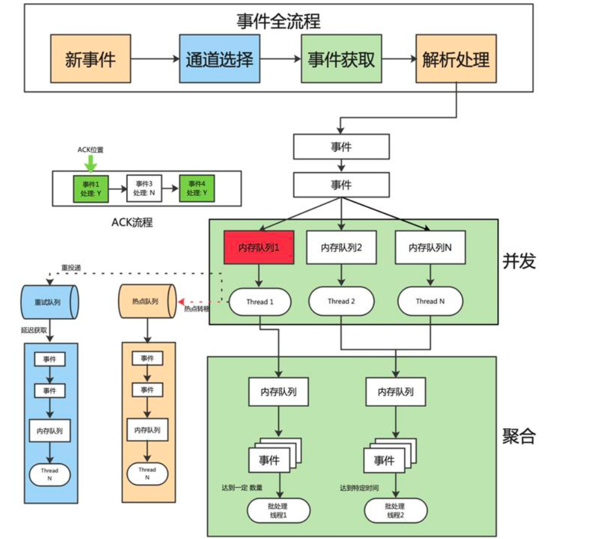


# 计算机网络

给 JavaGuide 的各位小伙伴推荐一下我的计算机网络学习计划。

这是一篇我认真总结出来的计算机网络学习方法 & 学习计划，我也在亲身实践。事实证明精华的学习路线起码 10 年为一个周期的话，不会过时。

我觉得最重要的就是**看书(博客) + 实践**。

首先是看书。

## **书籍推荐**

书也分为不同的层次，最基础的入门书籍有

### **网络是怎样连接的**

这是我推荐给你的第一本书。

这本书是日本人写的，它和《程序是怎样运行的》、《计算机是怎样跑起来的》统称为图解入门系列，最大的特点就是**风趣幽默，简单易懂**。这本书通过多图来解释浏览器中从输入网址开始，一路追踪了到显示出网页内容为止的整个过程，以图配文，讲解了网络的全貌，并重点介绍了实际的网络设备和软件是如何工作的。

本书图文并茂，通俗易懂，非常适合计算机、网络爱好者及相关从业人员阅读。

所以如果大家是新手的话，强烈推荐一下这本书。

日本人就爱图解，同样图解系列的入门书籍还有《图解 HTTP》、《图解 TCP/IP》。

### **图解 HTTP**

这是我推荐给你的第二本书。


《图解 HTTP》是 HTTP 协议的入门书籍，当然 HTTP 也是属于计算机网络的范畴，这本书适合于**想要对 HTTP 有基本认知的程序员，同样也适合查漏补缺**。

这类书看起来就毫无难度了，不得不说图解系列是给小白的圣经，它能增强你的自信，让你觉得计算机其实没那么难，这是非常重要的。初学者，最怕的就是劝退了。

### **图解 TCP/IP**

这是我推荐给你的第三本书


上面的图解 HTTP 是针对 HTTP 协议的，那么《图解 TCP/IP》就是针对 TCP/IP 协议簇中的协议了，这本书我已经看了 80% 了，还是比较系统的一本书，**基本上涵盖了 TCP/IP 协议簇中的所有协议知识了，这本书看完了完全就可以直接深入理解 TCP/IP 协议簇了**。

对于新手来说，最重要的一点就是帮助你理解，怎么简单怎么来，这样才能快速入门，对于快餐式的社会来说，快速理解当然是当仁不让的首选了。

如果上面这几本书你都搞定了的话，那你就可以读一下 《计算机网络：自顶向下方法》这本书了，这本书可以作为基础书籍也可以作为进阶书籍，这里我归为了进阶书籍，因为里面有一些章节不是那么好理解，比如介绍网络层的时候，会分为数据平面和控制平面，介绍 TCP 和 UDP 的时候，也会聊到一些原理性问题。

### **计算机网络：自顶向下方法**

这是我推荐给你的第四本书

这本书是一本计算机网络的圣经书籍，圣经就在于人人都应该读一下这本书，原著非常经典，翻译也很不错，我自己也马上就看完了，这本书会从顶层也就是网络层逐步下探到物理层，一层一层的带你入门，解释各层之间的协议，主要特征是什么，一个数据包的发送历程。这本书并不局限于某个具体的协议，而是从宏观的角度来看待计算机网络到底是什么，里面有一些专业名词，理解并掌握后会对深入学习计算机网络非常有用。

### **计算机网络：谢希仁版**

这是我推荐给你的第五本书籍

这本书是很多大学的教材，也是一本非常好的进阶书籍，这本书相对于自顶向下方法更多是对于通信网络的阐述。

这本书的特点是**突出基本原理和基本概念的阐述**，同时力图反映计算机网络的一些最新发展。本书可供电气信息类和计算机类专业的大学本科生和研究生使用，对从事计算机网络工作的工程技术人员也有参考价值

现在我们接着聊，如果上面这两本书随便一本看完了，那么恭喜你已经是一个老手了，你的网络基础能打败 90% 以上的人了，如果你还不满足的话，那你就需要继续深入，继续深入也是我推荐给你的提高书籍。

### **HTTP 权威指南**

这是我推荐给你的第六本书


HTTP 权威指南是深入 HTTP 非常值得一看的书，这本书写的非常全了。

此书第一部分是 HTTP 的概述，如果你没有时间，通读第一部分就能让你应付普通的日常开发工作。

第二部分主要讲现实世界中 HTTP 的架构，也可以看作 HTTP 的全景图，包括 Web Server/Cache/Proxy/Gateway，是全书中精华的部分。

第三部分主要是 HTTP 安全，其中 Basic 和 Digest 概略看下即可，现实世界中用的应该不多。看 HTTPS 最好有一些计算机安全基础，这样会顺畅很多。

第四部分主要是关于 HTTP Message Body 的部分，包括 Content Negotiation，MIME Type，chunked encoding等，概略看下即可。

第五部分的内容，Web Hosting 可以认真看下，了解下 Virtual Host(话说我上学的时候一直搞不懂 Virtual Host，一个 IP 怎么能同时 Host 两个不同域名的 Web 页面呢)。

剩下三章已经过时，基本可以忽略。最后的附录，可以用作边用边学的字典，如果你自己来写 Web Server，那么这一部分是极有价值的参考。

总而言之，无论你是前端还是后端，只要是 Web 相关的，那么此书就是必读的。

**TCP/IP 详解**

这是我推荐给你的第七本书

这是一本被翻译耽误的经典书，两个硬核作者 Kevin R. Fall 和 W. Richard Stevens 被南开大学的某计算机系的译者给毁了。我第一开始读这本书以为是自己智商不够，原来是翻译瞎TM翻啊。语句不通且不说，您好歹走点心，改点措辞也行啊，纯粹是生搬硬套谷歌翻译啊，哎。


来看看豆瓣读者们对这本书的评价吧，比我有力量多了。


这个回答给我看乐了，嗯，把这本书当作一本 Google 词典确实是一种不错的选择。

不过这本书确实是一本非常好的书，这本书的关注点在于 TCP/IP 协议栈上，可以说把 TCP/IP 讲透讲细了，比如讲 TCP 就会分别从连接管理、TCP 超时重传、TCP 拥塞控制、TCP 保活机制来讲起，不管你是从事哪个技术栈的研究，不管你是程序员还是网络工程师，这本书都是你值得一读的一本，不过要读最好还是读英文版。

TCP/IP 详解有三本，第二本是


这本黑皮书主要是介绍如何实现 TCP/IP 协议的，这本书很难入门。书中给出了约 500 个图例，15000 行实际操作的 C 代码，采用举例教学的方法帮助你掌握 TCP/IP 实现。

本书不仅说明了插口 API 和协议族的关系以及主机实现与路由器实现的差别。还介绍了 4.4BSD-Lite 版的新的特点。本书适用于希望理解 TCP/IP 协议如何实现的人，包括编写网络应用程序的程序员以及利用 TCP/IP 维护计算机网络的系统管理员。

第三卷是 tcp 事务协议、http、nntp 和 unix 域协议


这本书看的人就更少了。

第 3 卷详细介绍了当今 TCP/IP 程序员和网络管理员必须非常熟悉的四个基本主题：TCP 的扩展、Hyper 文本传输协议、网络新闻传输协议和 UNIX 域协议。与前两卷一样，本书介绍了 4.4BSD-Lite 网络代码中的示例和实现细节。

嗯。。。有一些沉重了，其实这些深入协议底层的书籍我们 99% 的人都接触不到，但是为了回答的完整性，我就都列出来了，这样的好处是让你能系统了解。

上面都是一些理论书籍，下面是稍微偏实战一些的书籍了。

计算机网络实战最有效的当然就属于抓包了，有很多抓包工具比如 **wireshark、sniffer、httpwatch、iptool、fiddle** 等，但是我用的和使用频率最高的应该就是 wireshark 了，关于 wireshark 还有几本实战方面的书你需要知道

### **wireshark 数据包分析实战**

这是我推荐给你的第八本书


初学者必备，介绍了 wireshark 安装，嗅探网络流量，wireshark 的基本使用，用 wireshark 分析了一圈常用的TCP，UDP 协议，也简要分析了 HTTP 等应用层协议，概要介绍了一些 TCP 重传的机制，最后是无线分析。

整个书定位应该是入门级别的，基本上每章都是简要介绍，并没有特别深入大张阔斧地进行描述。文章行文思路清晰，译者的翻译水平也不错。**总的来说，是初步认识和了解 wireshark 的好书**。

### **wireshark 网络分析就是这么简单**

这是我推荐给你的第九本书


读的时候你会忍不住笑的，区别于《Wireshark数据包分析实战》，本书就像一本侦探小说集，以幽默风趣的语言风格，借助wireshark以理性的思考来不断探险，根据蛛丝马迹来侦破案情。总结，读完数据包分析实战来读这本。

### **Wireshark网络分析实战**

这是我推荐给你的第十本书


其内容涵盖了 Wireshark 的基础知识，抓包过滤器的用法，显示过滤器的用法，基本/高级信息统计工具的用法，Expert Info 工具的用法，Wiresahrk 在 Ethernet、LAN 及无线 LAN 中的用法，ARP 和 IP 故障分析，TCP/UDP故障分析，HTTP 和 DNS 故障分析，企业网应用程序行为分析，SIP 多媒体和 IP电话，排除由低带宽或高延迟所引发的故障，认识网络安全等知识。

书籍推荐大概就是上面那些，除了书之外，还有一些视频、博客、官网网站可以学习

## **视频推荐**

很烦微信公众平台怎么不支持外链呢，这个体验就很差啊。

今天在 b 站看视频的时候，看到了一句话**众所周知，b 站是用来搞学习的**，对于我们学习编程的童鞋来说，b 站有着非常多的学习资源，但是有一些质量并不是很好，看了之后不容易理解，这也是写这一篇文章的原因，为大家分享一些质量超高的计算机基础的学习视频，往下看就完了。

### **1. 计算机网络微课堂（有字幕无背景音乐版）（陆续更新中......）_哔哩哔哩 (゜-゜)つロ 干杯~-bilibili**

学习计算机网络，我首先推荐的 UP 主湖科大教书匠，他讲的计算机网络十分通俗易懂，重点的地方讲的十分细致，并且还有一些实验，更好的是有考研 408 的难题的讲解，也是非常适合考研党，除了课程内容外还有很多习题讲解视频，特别赞的一点是每天动态里都会更新一道考研题，播放量也非常的多。


### **2. 2019 王道考研 计算机网络_哔哩哔哩 (゜-゜)つロ 干杯~-bilibili**

既然说到了考研，那我就不得不提一下王道考研了，恭喜你发现了宝藏。王道考研的计算机网络视频，播放量非常多，而且老师是一位小姐姐，声音十分动听，声音这么好听的老师给你讲课，妈妈再也不用担心我的学习了呢，总之，这个视频的质量也非常高，弹幕全是对小姐姐的高度评价。（王道考研其他的视频也不错哦，暗示一下：操作系统，数据结构等等）


### **3. 韩立刚计算机网络 谢希仁 第7版 2020年12月_哔哩哔哩 (゜-゜)つロ 干杯~-bilibili**

韩立刚老师所讲的计算机网络视频，内容比较多，但是讲解的通俗易懂，并且老师讲课的经验也十分的丰富。配套的教材是谢希仁老师的计算机网络教材，韩老师的最近的一个视频视频比较新，播放量还比较少，但是他讲的是真的不错，相比于王道考研所讲的计算机网络，韩老师更加细致一些。


### **4. 计算机网络（谢希仁第七版）-方老师_哔哩哔哩 (゜-゜)つロ 干杯~-bilibili**

在计算机网络方面，我还想推荐的一位老师就是方老师，也是一位小姐姐老师。她的视频配套的教材也是谢老师的网络教材，在线看的小伙伴也超多，弹幕都是对方老师的评价。


## **博客推荐**

推荐几个不错的学习博客。

互联网协议入门-阮一峰：<http://www.ruanyifeng.com/blog/2012/05/internet_protocol_suite_part_i....>

网络协议-兰亭风雨：<http://blog.csdn.net/ns_code/article/category/1805481>

HTTP协议：<http://www.cnblogs.com/TankXiao/category/415412.html>

Unix 网络编程：<http://blog.csdn.net/chenhanzhun/article/category/2767131/2>

TCP/IP详解：<http://blog.csdn.net/chenhanzhun/article/category/2734921/1>

计算机网络面试题：<http://blog.csdn.net/shadowkiss/article/details/6552144>

国外优秀计算机网络站点：<http://www.tcpipguide.com/free/t_TCPSlidingWindowAcknowledgmentSystemForDataTranspo-6.htm>

当然最硬核的就是 RFC 文档了 <https://tools.ietf.org/rfc/index>

学习 HTTP ，必须要看一下 MDN 官网 <https://developer.mozilla.org/zh-CN/docs/Web/HTTP>

学习计算机网络，Cloudflare 你必须要去看 [https://www.cloudflare.com/zh-cn/learning/](https://www.cloudflare.com/zh-cn/learning)

GeeksforGeeks 学习计算机网络也非常不错 [https://www.geeksforgeeks.org/basics-computer-networking/](https://www.geeksforgeeks.org/basics-computer-networking)

Tutorialspoint 系统学习计算机，不仅仅局限于计算机网络 <https://www.tutorialspoint.com/computer_fundamentals/computer_networking.htm>

国外优秀的学习网站不能少了 javapoint <https://www.javatpoint.com/types-of-computer-network>

------------------------分割线------------------------

原文链接：[计算机网络学习计划](https://mp.weixin.qq.com/s?__biz=MzI0ODk2NDIyMQ==&mid=2247488287&idx=1&sn=cb169ed027447d691923dba9ae83d887&chksm=e999e60ddeee6f1b0ff69018aa8e4eb826306a99d8279ea4f8aa834bb870803f35cb2b69590d&token=1010811083&lang=zh_CN#rd) ，这篇文章的作者也是我的个人公众号，有兴趣的小伙伴们可以点个关注呀。