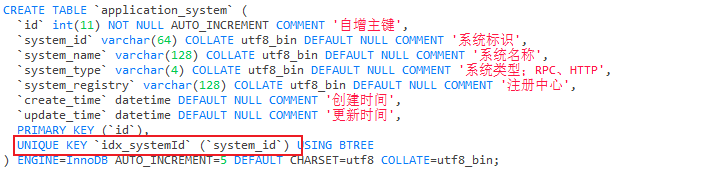

# 1、介绍


## 为什么不用SpringMVC?

在互联网分布式架构下，SpringMVC 有以下缺点：

- 无法实现服务发现和负载均衡
- 缺少统一认证和鉴权
- 无法处理大量的请求，即性能不如 API 网关


在分布式架构下，主要使用 `RPC`  进行通信，如 Dubbo、gRPC，但是在 Web、小程序、H5 中使用的是 `HTTP`  协议，因此需要 API 网关项目来对 http 请求解析做 rpc 接口的泛化调用。


## 为什么需要 API 网关？

在分布式架构下，每一个 web 应用都会有一些共性的需求，限流、监控、熔断、降级、切量，会导致维护成本增加，且都需要一套域名、工程、机器等资源，并且涉及到对文档的维护，那么如果使用 API 网关，就可以将这些共性的需求融入到 API 网关中，不需要在每一个 web 应用都做一套，极大提升研发效率。


# 2、实现


## api-core 模块实现


> api-core模块主要实现了使用 netty 服务对用户 http 请求进行鉴权，并且调用执行 rpc 的泛化调用服务


### 解析 http 请求参数

根据 request 的类型，是 post 还是 get 进行参数解析

- 如果是 get 请求，使用 netty 中的 QueryStringDecoder 来解析 get 中的参数
- 如果是 post 请求
  - 如果 contentType 是 multipart/form-data ，则使用 netty 中的 HttpPostRequestDecoder 来解析 post 中的参数
  - 如果 contentType 是 application/json ，则直接取出 request 的 content 中的数据即可

将解析好的数据传入 rpc 调用即可


### 封装数据源

我们将 Dubbo 的 rpc 远程调用服务抽象为数据源，将获取 Dubbo 连接抽象为数据源的连接方法，这样以后如果添加其他连接的话，可以很方便的扩展


### 封装执行器

将远程泛化调用的执行过程给提取出来，放入到执行器中

在执行其中就是在其中拿到 Dubbo 的数据源连接，获取 Dubbo 的数据源连接，获取远程的泛化调用接口，执行泛化调用接口这个操作


### shiro + jwt 认证

使用 jwt 生成 token，shiro 中进行认证，即将前端传入的 jwt token 使用 jwt 进行解码，如果解码成功，则认证成功，否则，认证失败


### shiro + jwt 认证整合进 netty

当 http 请求进入 netty 的第一个 handler时，即 `GatewayServerHandler`，在这里我们直接将 http 请求的一些属性给放到管道的属性中（`channel.attr`），并且释放 http 资源（`request.retain()`），在鉴权的 handler 中，取出请求里的 `token` 信息，并且使用 `shiro` 进行认证，如果通过，就放行，否则直接拦截即可

这里鉴权的时候，我们对 `get` 请求就不进行鉴权操作了


## api-gateway-center

该模块为网关中心，负责启动 springboot 服务，并且注册算例

网关中心维护网关算力节点的库表：gateway_server、gateway_server_detail

RPC 服务注册的库表：application_system、application_interfalce、application_interface_method


### 唯一索引

在注册 RPC 服务的时候，比如向 application_system 表中注册时，会传入 system_id 字段，为了防止 **重复注册** ，于是将 application_system 表中的 system_id 字段改为 `unique key` 即唯一索引，这样如果重复插入，就会抛出 `DuplicateKeyException` 异常，我们在 Controller 中捕捉到这个异常，提示`发生了重复注册` 即可。


#### 唯一索引




#### 重复插入抛出异常 DuplicatedKeyException


#### Controller 捕捉异常


## api-gateway-assist

该模块是一个 `SpringBoot-starter` 

通过 META-INF 文件夹下的 spring.factories 文件，配置加载AutoConfigure类。（SPI）

> 

通过启动 assist 组件，在容器刷新完成之后，会向 center 模块发送 HTTP 请求，注册网关服务，网关服务配置在 assist 模块配置文件中获取，示例如下：

```yaml
api-gateway:
  address: http://localhost:8001  # 注册中心；从这里获取接口信息以及完成注册网关操作
  groupId: 10001                  # 网关分组；每一个网关通信组件都分配一个对应的分组
  gatewayId: api-gateway-g4       # 网关标识；
  gatewayName: 电商配送网关         # 网关名称
  gatewayAddress: 127.0.0.1:7399  # 网关服务；网关的通信服务Netty启动时使用IP和端口
```


向 `center` 模块发送 HTTP 请求，拉取网关的配置（也就是根据 gatewayid 查询该网关下边有哪些服务）


在 assist 组件中，将网关的注册和拉取配置操作放在 ApplicationContextAware 接口对应的 setApplicationContext 方法中

并且监听容器关闭事件 `ContextClosedEvent`，在容器关闭时，也将 netty 服务关闭掉，避免一直占用端口。


## api-gateway-engine

在 api-gateway-engine 模块中引入了 assist 模块，engine 模块的作用就是引入 assist 模块并进行打包即可。

对 engine 模块打包后，放到 docker 中，在 docker 中 ip 自动分配，因此，需要修改 center 模块中启动 netty 时的代码，原本是

```java
channelFuture = b.bind(new InetSocketAddress(configuration.getHostName(), configuration.getPort())).syncUninterruptibly();
```

修改后为：

```java
channelFuture = b.bind(configuration.getPort()).syncUninterruptibly();
```

我们不需要自己再去指定 ip，这是绑定的 ip 为 `0.0.0.0`

Netty 通过 bind 绑定的 ip，是指服务端能够监听到目的地 IP 为所绑网卡地址的 IP 包。比如主机中有网卡A和网卡B，程序中 `bind(A)` ，那么操作系统会将发往网卡 A 地址的 IP 包数据，从内核态复制到用户态供用户使用。

我们使用上边修改后的写法，绑定的 IP 为 `0.0.0.0`，此时 Netty 服务端可以监听并收到外部发给主机任意一张网卡的数据。

在 Docker 容器内，感受不到宿主机的网卡 IP，只能感受到 Docker 自己的虚拟网卡（eth0），因此 ip 设置为 127.0.0.0 不能正常启动 netty 服务，


engine 中引入了 assist 模块，assist 模块引入了 core netty通信模块，将 engine 模块打包运行，即可运行 engine、assist、core 三个模块

center 注册中心另外再启动


## api-gateway-sdk

在 sdk 中定义注解，在 rpc 生产者的服务中引入 sdk，并且使用 sdk 定义的注解，在 sdk 中会扫描注解，并且将注解标注的接口方法信息注册到注册中心去


在 sdk 模块中，会去扫描方法上的注解，并将方法注册到注册中心（center 模块）去，那么在注册之后，需要去通知 assist 模块拉取最新的方法，因此这里使用 Redis 的发布和订阅


assist-04 + center-05 没有问题

assist-05 + center-06 有问题（拉取不到application-system）


### 测试 assist 自动拉取新注册的接口

首先启动 assist 服务，并启动zookeeper服务，再启动 center 模块，保证可以向数据库中注册

首先清空 application_interface, application_interface_method, application_system 3张表

访问接口http://localhost:7399/wg/activity/sayHi  （POST） 会失败

在 api-gateway-test-provider-interfaces 项目中引入 api-gateway-sdk-02，并启动，此时可以观察 assist 模块的日志，会自动拉去配置

访问接口http://localhost:7399/wg/activity/sayHi  （POST） 会成功


## Windows 网络调试工具

NetAssist3.8.2 用于调试 nginx 发送请求

## Mac网络调试工具

Socket Debugger

# 项目模块梳理

asssit 模块包含了 core 模块，core 模块用于 netty 通讯，作为网关的调用入口

engine 模块包含了 assist 模块，没有其他的功能，只是将 engine 模块打包，放入 docker 运行即可

sdk 模块是去扫描方法上的注解，将扫描到的方法远程调用 center 模块的注册方法，注册到数据库中去

center 模块作为网关的注册中心，提供了对数据库的操作


## 启动项目

对于最新的完整项目

由于我实在本地 windows 启动，因此需要先将刷新 nginx 配置的内容给注释掉，位于 center 模块的 GatewayConfigMange 的 registerGatewayServerNode 方法中，将刷新 nginx 网关配置的地方注释掉即可。


### 待办

1. 测试接口性能


### 问题

1. engine 模块一直报错  zk localhost:2181 连接不上，暂时没有找到哪里的问题
2. 如果新添加接口，不仅需要重启 test 模块，而且需要重新 engine 模块，刷新 Dubbo 缓存（Redis 订阅发布拉取的是最新的数据库接口）


# 业务逻辑

## engine 模块

- engine 模块启动时，首先会加载 assist 模块中的 GatewayApplication

> 在 GatewayApplication 的 setApplicationContext() 中，做两件事：
>
> 1. 向 center 模块注册网关算力服务，也就是将当前启动的 engine 算力模块（group_id, gateway_id, gateway_name, gateway_address） 注册到 gateway_server_detail 表中
> 2. 向 center 模块拉取网关配置（系统、接口、方法）
>    1. 将 system_id, system_registry, interface_id, interface_version 放入 configuration 中
>    2. 将 httpStatement 加入到 configuration 的 mapperRegistry 中去（即添加 uri -> 代理对象的映射）

- 在 assist 模块的 GatewayApplication 中还定义了 Redis 的订阅模块，当有新的接口方法注册到 center 模块中时，会通过 redis 发布事件，在 GatewayApplication 的 receiveMessage() 中进行接收

> 在 receiveMessage 中，topic 为 gatewayId， message 为 systemId，在该方法中调用 addMappers，将 systemId 传入，向 center 模块拉取该 systemId 下的网关配置（和上边的第二步一样）


- 解释一下 addMappers(String systemId) 这个方法：

> 该方法是向 center 模块拉取网关配置，拉取的过滤条件是 gatewayId 和 systemId，gatewayId 存储在 engine 模块的 yml 文件中，是网关的标识，systemId 在 test 模块中，也就是我们进行泛化调用的 rpc 模块的系统标识
>
> 一个网关 gateway_id 对应多个 system_id，这里拉取配置也就是根据当前 engine 模块的 gateway_id 去找到当前网关下的一个或多个 system_id，再去拉取这些 system_id 对应的接口、方法到当前的 engine 模块中


# 技术亮点


## 网关算力模块（engine、assist、core）

### 1、如何调用远程服务？

步骤1：首先启动一个服务模块（test模块），该模块作为被调用方，使用 Dubbo 将接口服务暴露给消费者进行使用。通过 `@Service` 注解将服务暴露出去

```java
package cn.bugstack.gateway.interfaces;

import cn.bugstack.gateway.rpc.IActivityBooth;
import cn.bugstack.gateway.rpc.dto.XReq;
import com.alibaba.fastjson.JSON;
import org.apache.dubbo.config.annotation.Service;

@Service(version = "1.0.0")
public class ActivityBooth implements IActivityBooth {

    @Override
    public String sayHi(String str) {
        System.out.println("invoke sayHi");
        return "hi " + str + " by api-gateway-test-provider";
    }

    @Override
    public String insert(XReq req) {
        return "hi " + JSON.toJSONString(req) + " by api-gateway-test-provider";
    }

    @Override
    public String test(String str, XReq req) {
        return "hi " + str + JSON.toJSONString(req) + " by api-gateway-test-provider";
    }

```


test 模块的 yaml 配置如下：（需要启动 zookeeper）

```yaml
dubbo:
  application:
    name: api-gateway-test
    version: 1.0.0
  registry:
    #address: N/A 泛化调用不能使用此方式
    address: zookeeper://127.0.0.1:2181
  protocol:
    name: dubbo
    port: 20881
  scan:
    base-packages: cn.bugstack.gateway.rpc
```


步骤2：新创建一个模块进行 rpc 调用

新创建一个 maven 项目，引入依赖：

```xml
<dependency>
    <groupId>junit</groupId>
    <artifactId>junit</artifactId>
    <version>4.13.2</version>
    <scope>test</scope>
</dependency>
<dependency>
    <groupId>org.apache.dubbo</groupId>
    <artifactId>dubbo</artifactId>
    <version>2.7.5</version>
</dependency>
<dependency>
    <groupId>org.apache.zookeeper</groupId>
    <artifactId>zookeeper</artifactId>
    <version>3.4.13</version>
</dependency>
<dependency>
    <groupId>org.apache.curator</groupId>
    <artifactId>curator-framework</artifactId>
    <version>4.0.1</version>
</dependency>
<dependency>
    <groupId>org.apache.curator</groupId>
    <artifactId>curator-recipes</artifactId>
    <version>4.0.1</version>
</dependency>
```


编写 junit 测试单元进行 rpc 调用：

```java
public class RPCTest {

    @Test
    public void test_rpc() {

        ApplicationConfig application = new ApplicationConfig();
        application.setName("api-gateway-test");
        application.setQosEnable(false);

        RegistryConfig registry = new RegistryConfig();
        registry.setAddress("zookeeper://127.0.0.1:2181");
        registry.setRegister(false);

        ReferenceConfig<GenericService> reference = new ReferenceConfig<>();
        reference.setInterface("cn.bugstack.gateway.rpc.IActivityBooth");
        reference.setVersion("1.0.0");
        reference.setGeneric("true");

        DubboBootstrap bootstrap = DubboBootstrap.getInstance();
        bootstrap.application(application)
                .registry(registry)
                .reference(reference)
                .start();

        ReferenceConfigCache cache = ReferenceConfigCache.getCache();
        GenericService genericService = cache.get(reference);

        Object result = genericService.$invoke("sayHi", new String[]{"java.lang.String"}, new Object[]{"world"});

        System.out.println(result);
    }

}
```


### 2、如何接受 http 请求并调用远程服务？

首先使用 Netty 接受 Http 请求，在 Netty 的 handler 中进行鉴权、解析参数、调用服务3个操作。

这里主要说一下调用服务是如何进行：

调用服务是通过 cglib 动态代理来实现的，在 cglib 动态代理的拦截方法中，进行 rpc 调用

```java
package com.example.nginxtest1;

import com.alibaba.fastjson.JSON;
import net.sf.cglib.core.Signature;
import net.sf.cglib.proxy.Enhancer;
import net.sf.cglib.proxy.InterfaceMaker;
import net.sf.cglib.proxy.MethodInterceptor;
import net.sf.cglib.proxy.MethodProxy;
import org.apache.dubbo.config.ApplicationConfig;
import org.apache.dubbo.config.ReferenceConfig;
import org.apache.dubbo.config.RegistryConfig;
import org.apache.dubbo.config.bootstrap.DubboBootstrap;
import org.apache.dubbo.config.utils.ReferenceConfigCache;
import org.apache.dubbo.rpc.service.GenericService;
import org.junit.Test;
import org.objectweb.asm.Type;
import org.slf4j.Logger;
import org.slf4j.LoggerFactory;

import java.lang.reflect.Method;
import java.util.HashMap;
import java.util.Map;
/**
 * @author 千祎来了
 * @date 2023/9/6 13:03
 */

public class CglibTest implements MethodInterceptor {

    private final Logger logger = LoggerFactory.getLogger(CglibTest.class);

    @Test
    public void test() throws Exception {
        // 定义接口
        InterfaceMaker interfaceMaker = new InterfaceMaker();
        interfaceMaker.add(new Signature("sayHi", Type.getType(String.class), new Type[]{Type.getType(String.class)}), null);
        Class<?> interfaceClass = interfaceMaker.create();

        // 创建代理
        Enhancer enhancer = new Enhancer();
        enhancer.setSuperclass(Object.class);

        // 将 IGenericReference 也设置为父接口，当调用 IGenericReference 的方法，cglib 会进行拦截
        enhancer.setInterfaces(new Class[]{IGenericReference.class, interfaceClass});
        enhancer.setCallback(this);

        // 创建代理对象
        IGenericReference obj = (IGenericReference) enhancer.create();
        
        HashMap<String, Object> args = new HashMap<>();
        args.put("str", "123");
        
        // 执行方法，args 是用于 rpc 调用的传参
        String res = obj.$invoke(args);
        logger.info("执行结果为:{}, {}", res);
    }

    @Override
    public Object intercept(Object o, Method method, Object[] args, MethodProxy methodProxy) throws Throwable {
        Map<String, Object> rpcArgs = (Map<String, Object>) args[0];
        logger.info("拦截方法:{}", method.getName());
        logger.info("拦截方法参数为:{}", rpcArgs.values().toArray());

        // 这里需要指定 rpc 调用的方法名，参数类型和参数值，这里硬编码，后续应该是从 Http 请求中解析出来，并且存储到变量中，在此处取出
        String result = rpcTest("sayHi", new String[]{"java.lang.String"}, rpcArgs.values().toArray());
        logger.info("rpc远程调用结果为:{}", result);
        return result;
    }

    public String rpcTest(String methodName, String[] parameterTypes, Object[] args) {
        ApplicationConfig application = new ApplicationConfig();
        application.setName("api-gateway-test");
        application.setQosEnable(false);

        RegistryConfig registry = new RegistryConfig();
        registry.setAddress("zookeeper://127.0.0.1:2181");
        registry.setRegister(false);

        ReferenceConfig<GenericService> reference = new ReferenceConfig<>();
        reference.setInterface("cn.bugstack.gateway.rpc.IActivityBooth");
        reference.setVersion("1.0.0");
        reference.setGeneric("true");

        DubboBootstrap bootstrap = DubboBootstrap.getInstance();
        bootstrap.application(application)
                .registry(registry)
                .reference(reference)
                .start();

        ReferenceConfigCache cache = ReferenceConfigCache.getCache();
        GenericService genericService = cache.get(reference);
        logger.info("远程调用执行方法:{}", methodName);
        Object result = genericService.$invoke(methodName, parameterTypes, args);
        return JSON.toJSONString(result);
    }
}
```


### 3、注解如何扫描rpc方法提供方的接口并加入数据库中？

定义注解 `@ApiProducerClazz、@ApiProducerMethod`，定义一个类实现 `BeanPostProcessor`，并且覆盖`postProcessAfterInitialization()` 方法，在这个方法中就可以扫描每个初始化的 Bean，通过解析我们自定义的注解，就可以扫描我们需要注册的 rpc 方法了。

```java
public class GatewaySDKApplication implements BeanPostProcessor {

    @Override
    public Object postProcessAfterInitialization(Object bean, String beanName) throws BeansException {
        ApiProducerClazz apiProducerClazz = bean.getClass().getAnnotation(ApiProducerClazz.class);
        if (null == apiProducerClazz) return bean;
        // 如果不是 null，则说明是我们需要扫描的 rpc 方法，可以将 rpc 方法注册进数据库中
        // ...
        return bean;
    }
}
```


### 4、如何动态上线 rpc 方法？

网关算力节点如果需要调用 rpc 方法，就需要去数据库中将需要调用的 rpc 方法名称、接口名、参数类型拉取下来，知道了 rpc 方法的这些信息，才可以进行调用，那么如果新添加了一个 rpc 提供方，如何实现网管算力节点去动态拉取新添加的 rpc 方法的信息呢？

实现方式：Redis订阅/发布


//  压测、上线服务自动拉取、设计模式


http