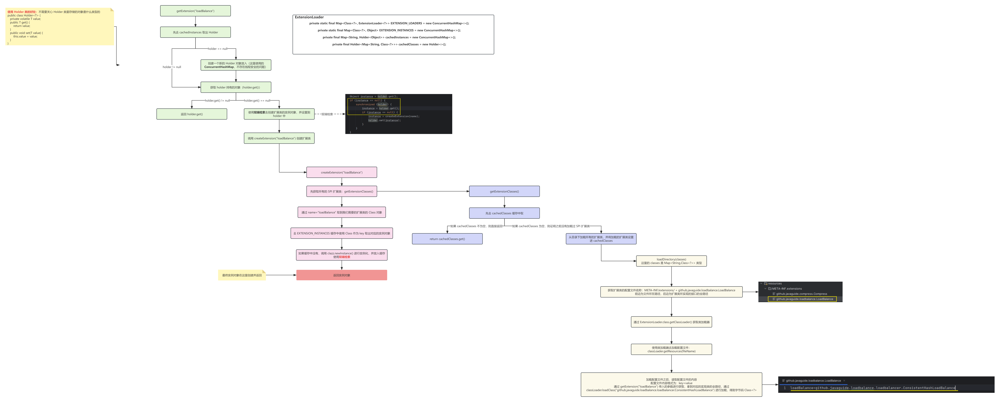
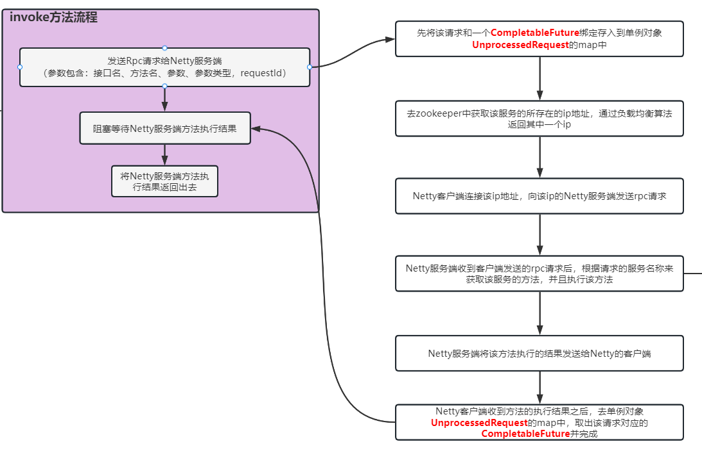

# Simple-Rpc 项目文档

## 1、如何结合 Spring 进行使用？

该项目提供了自定义注解：

- RpcReference：引用远程对象，并进行调用
- RpcScan：自定义扫描注解，用于
- RpcService


Spring 给我们提供了一个扩展点 `ImportBeanDefinitionRegistrar`，我们可以通过实现该接口来在 Spring 中注册额外的 Bean。


### 实现对 3 个注解的扫描

#### 1、定义注解


RpcScan

```java
@Target({ElementType.TYPE, ElementType.METHOD})
@Retention(RetentionPolicy.RUNTIME)
@Import(CustomScannerRegistrar.class) // 将 CustomScannerRegistrar 注册到 Bean 容器中
@Documented
public @interface RpcScan {
    String[] basePackage();
}
```


RpcReference

```java
@Documented
@Retention(RetentionPolicy.RUNTIME)
@Target({ElementType.FIELD})
@Inherited
public @interface RpcReference {
    String version() default "";
    String group() default "";
}
```


RpcService

```java
@Target({ElementType.TYPE})
@Retention(RetentionPolicy.RUNTIME)
/**
 * @Inherited 注解表示 RpcService 如果作用在类上，那么该类的子类是可以继承 RpcService 注解的
 */
@Inherited
@Documented
public @interface RpcService {
    /**
     * Service version, default value is empty string
     */
    String version() default "";

    /**
     * Service group, default value is empty string
     */
    String group() default "";
}
```


#### 2、定义 BeanDefinition 注册器：CustomScannerRegistrar

创建一个 `CustomScannerRegistrar` 实现 `ImportBeanDefinitionRegistrar` 接口，之后再通过 @Import 引入导入该类即可


CustomScannerRegistrar：

在 @RpcScan 注解中 @Import 了 CustomScannerRegistrar 这个类，之后会调用这个类的 registerBeanDefinitions() 方法，在这个方法中我们取出来 @RpcScan 注解的 basePackage 属性，此时 Spring 只拿到了 @RpcScan 的扫描路径，并不知道需要去扫描，之后我们再去定义自己的扫描器，指定扫描路径，就可以将扫描到的 Bean 添加到 Spring 容器中了

```java
/**
 * @author 千祎来了
 * @date 2023-01-05 13:42
 *
 * 在 RpcScan 注解中 Import 了该类，将该类加载到 Spring 的容器中，该类主要是去获取 RpcScan 注解的 basePackage 属性
 * 去 basePackage 下边扫描 RpcService、Component 注解，加入到 Spring 的容器
 */
@Slf4j
public class CustomScannerRegistrar implements ImportBeanDefinitionRegistrar, ResourceLoaderAware {

    private static final String BASE_PACKAGE_ATTRIBUTE_NAME = "basePackage";
    private static final String SPRING_BEAN_BASE_PACKAGE = "com.zqy";
    private ResourceLoader resourceLoader;

    @Override
    public void setResourceLoader(ResourceLoader resourceLoader) {
        this.resourceLoader = resourceLoader;
    }

    /**
     * 在该方法中注册自定义的bean，流程如下：
     * 1.先获取 RpcScan 注解的属性值 即获取包扫描路径basePackage
     * 2.创建扫描我们自定义注解的扫描器
     * 3.对basePackage扫描自定义的注解
     */
    @Override
    public void registerBeanDefinitions(AnnotationMetadata annotationMetadata, BeanDefinitionRegistry registry) {
        // 先获取RpcScan的属性
        Map<String, Object> attributes = annotationMetadata.getAnnotationAttributes(RpcScan.class.getName());
        // 将属性封装为 AnnotationAttributes 对象
        AnnotationAttributes annotationAttributes = AnnotationAttributes.fromMap(attributes);
        String[] rpcScanBasePackages = new String[0];
        if (annotationAttributes != null) {
            // 获取注解的 basePackage 属性值
            rpcScanBasePackages = annotationAttributes.getStringArray(BASE_PACKAGE_ATTRIBUTE_NAME);
        }
        if (rpcScanBasePackages.length == 0) {
            /**
             * getIntrospectedClass()也就获取了使用RpcScan注解的这个类，也就是com.zqy.ClientTest.Server.NettyServer
             * 再获取它的包名，即为com.zqy.ClientTest.Server
             * 这里的目的也就是设置默认的BasePackage为使用RpcScan注解的类所在的packageName
             */
            rpcScanBasePackages = new String[]{((StandardAnnotationMetadata) annotationMetadata).getIntrospectedClass().getPackage().getName()};
        }
        // 扫描 RpcService 的扫描器
        CustomScanner rpcServiceScanner = new CustomScanner(registry, RpcService.class);
        // 扫描 Component 的扫描器
        CustomScanner springBeanScanner = new CustomScanner(registry, Component.class);
        if (resourceLoader != null) {
            // todo 2.不清楚设置resourceLoader的作用，暂时没发现用处
            rpcServiceScanner.setResourceLoader(resourceLoader);
            springBeanScanner.setResourceLoader(resourceLoader);
        }
        int springBeanAmount = springBeanScanner.scan(SPRING_BEAN_BASE_PACKAGE);
        log.info("springBeanScanner扫描的数量 [{}]", springBeanAmount);
        int rpcServiceCount = rpcServiceScanner.scan(rpcScanBasePackages);
        log.info("rpcServiceScanner扫描的数量 [{}]", rpcServiceCount);
    }
}
```


#### 3、自定义扫描器：CustomScanner

```java
/**
 * @author 千祎来了
 * @date 2023-01-05 12:55
 *
 * 通过继承 ClassPathBeanDefinitionScanner 来自定义扫描器
 */
public class CustomScanner extends ClassPathBeanDefinitionScanner{

    public static void main(String[] args) {
        new AnnotationConfigApplicationContext(CustomScanner.class);
    }

    public CustomScanner(BeanDefinitionRegistry registry, Class<? extends Annotation> annoType) {
        super(registry);
        /**
         * 添加扫描规则
         * 使用示例：new CustomScanner(beanDefinitionRegistry, RpcService.class); // RpcService是我们自定义的注解
         */
        super.addIncludeFilter(new AnnotationTypeFilter(annoType));
    }

    @Override
    public int scan(String... basePackages) {
        return super.scan(basePackages);
    }
}
```


#### 4、自定义 Bean 的后置处理器：SpringBeanPostProcessor

SpringBeanPostProcessor 作为 Bean 的后置处理器，之前在 CustomScanner 定义去扫描带有 `@RpcService`、`@Component` 注解的 Bean：

- `@Component` 标注的类就作为一个普通的 Bean 存放即可

- `@RpcService` 标注的 Bean 表示这是一个需要对外提供远程服务的 Bean，我们在 Bean 初始化前（`postProcessBeforeInitialization`）判断该 Bean 是否带有 `@RpcService` 注解，如果有，则将该 Bean 作为一个远程服务发布出去。

  发布远程服务也就是将该 Bean 的`方法信息`以及 Netty 通信的 `ip+端口` 拼成一个字符串，在 zookeeper 中作为一个持久化节点

  `@RpcService` 使用：

  ```java
  @RpcService(version = "version1", group = "group1")
  public class HelloServiceImpl implements HelloService{
      static {
          System.out.println("HelloServiceImpl被创建了");
      }
      @Override
      public String say() {return "我是HelloServiceImpl";
      }
  }
  ```

  ​

- `@RpcReference` 标注的属性表示该属性是远程的服务，因此我们需要去在 Spring 扫描到该注解标注的属性时，要为该属性创建一个动态代理，执行该属性的方法时，由动态代理来进行增强（与远程服务的 Netty 进行通信，远程服务调用方法之后，将方法的返回结果通过 Netty 再返回过来），具体增强细节在后边动态代理时，进行介绍

  `@RpcReference` 使用：

  ```java
  @Component
  public class HelloController {
      @RpcReference(version = "version1", group = "group1")
      private HelloService helloService;

      public void say() {
          String say = helloService.say();
          System.out.println("成功调用，结果为：" + say);
      }
  }
  ```

SpringBeanPostProcessor

```java
/**
 * @author 千祎来了
 * @date 2023-01-05 23:02
 *
 * 自定义 Bean 的后置处理器
 */
@Slf4j
@Component
public class SpringBeanPostProcessor implements BeanPostProcessor {

    private final ServiceProvider serviceProvider;
    private final RpcRequestTransport rpcClient;

    public SpringBeanPostProcessor() {
        this.serviceProvider = SingletonFactory.getInstance(ZkServiceProviderImpl.class);
        this.rpcClient = ExtensionLoader.getExtensionLoader(RpcRequestTransport.class).getExtension("netty");
    }


    @Override
    @SneakyThrows
    public Object postProcessBeforeInitialization(Object bean, String beanName) throws BeansException {
        if (bean.getClass().isAnnotationPresent(RpcService.class)) {
            log.info("[{}] is annotated with  [{}]", bean.getClass().getName(), RpcService.class.getCanonicalName());
            RpcService rpcService = bean.getClass().getAnnotation(RpcService.class);
            RpcServiceConfig rpcServiceConfig = RpcServiceConfig.builder()
                    .version(rpcService.version())
                    .group(rpcService.group())
                    .service(bean)
                    .build();
            log.info("发布服务:[{}]", rpcServiceConfig.getRpcServiceName());
            serviceProvider.publishService(rpcServiceConfig);
        }
        return bean;
    }

    /**
     * 将使用的远程服务设置为代理对象
     */
    @Override
    public Object postProcessAfterInitialization(Object bean, String beanName) throws BeansException {
        Class<?> targetClass = bean.getClass();
        Field[] declaredFields = targetClass.getDeclaredFields();
        for (Field field : declaredFields) {
            RpcReference rpcReference = field.getAnnotation(RpcReference.class);
            if (rpcReference != null) {
                RpcServiceConfig rpcServiceConfig = RpcServiceConfig.builder()
                        .group(rpcReference.group())
                        .version(rpcReference.version())
                        .build();
                RpcClientProxy rpcClientProxy = new RpcClientProxy(rpcClient, rpcServiceConfig);
                Object clientProxy = rpcClientProxy.getProxy(field.getType());
                field.setAccessible(true);
                try {
                    field.set(bean, clientProxy);
                } catch (IllegalAccessException e) {
                    e.printStackTrace();
                }
            }
        }
        return bean;
    }
}
```


## 2、SPI机制

SPI 机制用来做服务的扩展发现，是一种动态替换发现的机制，这里的 SPI 机制的实现参考了 Dubbo 的 SPI

首先定义一个 `@SPI ` 注解，使用 `@SPI` 标注的接口表示可以被动态替换，并且提供一个 `ExtensionLoader` 类，用于去加载 @SPI 的服务，并且获取 @SPI 的服务，首先看使用如下：（通过 `ExtensionLoader` 获取我们的扩展类）

```java
@Slf4j
public class ZkServiceDiscoveryImpl implements ServiceDiscovery {
    private final LoadBalance loadBalance;

    public ZkServiceDiscoveryImpl() {
        this.loadBalance = ExtensionLoader.getExtensionLoader(LoadBalance.class).getExtension("loadBalance");
    }
}
```


那么 ExtensionLoader 去获取扩展类的流程为：

1. 首先根据扩展类的类型拿到扩展类加载器 `ExtensionLoader `
2. 再通过 `ExtensionLoader` 的 `getExtension()` 方法拿到扩展类的实例对象，流程如下：




### 完整代码

#### 1、使用

```java
public class ZkServiceDiscoveryImpl implements ServiceDiscovery {
    private final LoadBalance loadBalance;

    public ZkServiceDiscoveryImpl() {
        this.loadBalance = ExtensionLoader.getExtensionLoader(LoadBalance.class).getExtension(LoadBalanceEnum.LOADBALANCE.getName());
    }
}
```


#### 2、定义接口和实现类

```java
@SPI
public interface LoadBalance {
    String selectServiceAddress();
}
```


```java
@Slf4j
public class ConsistentHashLoadBalance implements AbstractLoadBalance {
    @Override
    public String selectServiceAddress(List<String> serviceAddresses, RpcRequest rpcRequest) {
      return "ConsistentHashLoadBalance";
    }

}
```


#### 3、定义配置文件

配置文件存放路径及内容：


```
loadBalance=github.javaguide.loadbalance.loadbalancer.ConsistentHashLoadBalance
```


#### 4、ExtensionLoader、Holder、SPI

##### ExtensionLoader

```java
package github.javaguide.extension;

import github.javaguide.utils.StringUtil;
import lombok.extern.slf4j.Slf4j;

import java.io.BufferedReader;
import java.io.IOException;
import java.io.InputStreamReader;
import java.net.URL;
import java.util.Enumeration;
import java.util.HashMap;
import java.util.Map;
import java.util.concurrent.ConcurrentHashMap;

import static java.nio.charset.StandardCharsets.UTF_8;

/**
 * refer to dubbo spi: https://dubbo.apache.org/zh-cn/docs/source_code_guide/dubbo-spi.html
 */
@Slf4j
public final class ExtensionLoader<T> {

    private static final String SERVICE_DIRECTORY = "META-INF/extensions/";
    private static final Map<Class<?>, ExtensionLoader<?>> EXTENSION_LOADERS = new ConcurrentHashMap<>();
    private static final Map<Class<?>, Object> EXTENSION_INSTANCES = new ConcurrentHashMap<>();

    private final Class<?> type;
    private final Map<String, Holder<Object>> cachedInstances = new ConcurrentHashMap<>();
    private final Holder<Map<String, Class<?>>> cachedClasses = new Holder<>();

    private ExtensionLoader(Class<?> type) {
        this.type = type;
    }

    public static <S> ExtensionLoader<S> getExtensionLoader(Class<S> type) {
        if (type == null) {
            throw new IllegalArgumentException("Extension type should not be null.");
        }
        if (!type.isInterface()) {
            throw new IllegalArgumentException("Extension type must be an interface.");
        }
        if (type.getAnnotation(SPI.class) == null) {
            throw new IllegalArgumentException("Extension type must be annotated by @SPI");
        }
        // firstly get from cache, if not hit, create one
        ExtensionLoader<S> extensionLoader = (ExtensionLoader<S>) EXTENSION_LOADERS.get(type);
        if (extensionLoader == null) {
            EXTENSION_LOADERS.putIfAbsent(type, new ExtensionLoader<S>(type));
            extensionLoader = (ExtensionLoader<S>) EXTENSION_LOADERS.get(type);
        }
        return extensionLoader;
    }

    public T getExtension(String name) {
        if (StringUtil.isBlank(name)) {
            throw new IllegalArgumentException("Extension name should not be null or empty.");
        }
        // firstly get from cache, if not hit, create one
        Holder<Object> holder = cachedInstances.get(name);
        if (holder == null) {
            cachedInstances.putIfAbsent(name, new Holder<>());
            holder = cachedInstances.get(name);
        }
        // create a singleton if no instance exists
        Object instance = holder.get();
        if (instance == null) {
            synchronized (holder) {
                instance = holder.get();
                if (instance == null) {
                    instance = createExtension(name);
                    holder.set(instance);
                }
            }
        }
        return (T) instance;
    }

    private T createExtension(String name) {
        // load all extension classes of type T from file and get specific one by name
        Class<?> clazz = getExtensionClasses().get(name);
        if (clazz == null) {
            throw new RuntimeException("No such extension of name " + name);
        }
        T instance = (T) EXTENSION_INSTANCES.get(clazz);
        if (instance == null) {
            try {
                EXTENSION_INSTANCES.putIfAbsent(clazz, clazz.newInstance());
                instance = (T) EXTENSION_INSTANCES.get(clazz);
            } catch (Exception e) {
                log.error(e.getMessage());
            }
        }
        return instance;
    }

    private Map<String, Class<?>> getExtensionClasses() {
        // get the loaded extension class from the cache
        Map<String, Class<?>> classes = cachedClasses.get();
        // double check
        if (classes == null) {
            synchronized (cachedClasses) {
                classes = cachedClasses.get();
                if (classes == null) {
                    classes = new HashMap<>();
                    // load all extensions from our extensions directory
                    loadDirectory(classes);
                    cachedClasses.set(classes);
                }
            }
        }
        return classes;
    }

    private void loadDirectory(Map<String, Class<?>> extensionClasses) {
        String fileName = ExtensionLoader.SERVICE_DIRECTORY + type.getName();
        try {
            Enumeration<URL> urls;
            ClassLoader classLoader = ExtensionLoader.class.getClassLoader();
            urls = classLoader.getResources(fileName);
            if (urls != null) {
                while (urls.hasMoreElements()) {
                    URL resourceUrl = urls.nextElement();
                    loadResource(extensionClasses, classLoader, resourceUrl);
                }
            }
        } catch (IOException e) {
            log.error(e.getMessage());
        }
    }

    private void loadResource(Map<String, Class<?>> extensionClasses, ClassLoader classLoader, URL resourceUrl) {
        try (BufferedReader reader = new BufferedReader(new InputStreamReader(resourceUrl.openStream(), UTF_8))) {
            String line;
            // read every line
            while ((line = reader.readLine()) != null) {
                // get index of comment
                final int ci = line.indexOf('#');
                if (ci >= 0) {
                    // string after # is comment so we ignore it
                    line = line.substring(0, ci);
                }
                line = line.trim();
                if (line.length() > 0) {
                    try {
                        final int ei = line.indexOf('=');
                        String name = line.substring(0, ei).trim();
                        String clazzName = line.substring(ei + 1).trim();
                        // our SPI use key-value pair so both of them must not be empty
                        if (name.length() > 0 && clazzName.length() > 0) {
                            Class<?> clazz = classLoader.loadClass(clazzName);
                            extensionClasses.put(name, clazz);
                        }
                    } catch (ClassNotFoundException e) {
                        log.error(e.getMessage());
                    }
                }

            }
        } catch (IOException e) {
            log.error(e.getMessage());
        }
    }
}

```


##### Holder

```java
package github.javaguide.extension;

public class Holder<T> {

    private volatile T value;

    public T get() {
        return value;
    }

    public void set(T value) {
        this.value = value;
    }
}
```


##### SPI注解

```java
package github.javaguide.extension;

import java.lang.annotation.Documented;
import java.lang.annotation.ElementType;
import java.lang.annotation.Retention;
import java.lang.annotation.RetentionPolicy;
import java.lang.annotation.Target;

@Documented
@Retention(RetentionPolicy.RUNTIME)
@Target(ElementType.TYPE)
public @interface SPI {
}
```


## 3、动态代理

我们可以来想一下如何进行远程服务调用，想要远程服务调用首先需要注入一个`远程服务`的属性，之后才可以调用这个远程服务中的方法，那么在代码中是通过 `@RpcReference` 注解进行实现的，如下：

```java
@Component
public class HelloController {
    @RpcReference(version = "version1", group = "group1")
    private HelloService helloService;

    public void say() {
        String say = helloService.say();
        System.out.println("成功调用，结果为：" + say);
    }
}
```

那么我们在加上了注解 @RpcReference 时，代码内部到底帮我们做了一些什么呢？这个注入的 HelloService 属性又是从哪里创建的呢？

首先我们自定义了 Bean 的扫描器，会去扫描两种带有两种注解的 Bean：`@Component`、`@RpcReference`，会将这两种 Bean 加入到 Spring 的 Bean 容器中，之后又定义了 Bean 的后置处理器，在后置处理器的 `postProcessAfterInitialization()` 方法中会去遍历 Bean 中的每个字段，如果字段上声明了 `@RpcReference` 注解，表明这个注解是远程服务对象，那么我们就在这里为这个字段创建一个代理对象，这里使用 JDK 动态代理。

动态代理对象创建完毕之后，我们再调用 `@RpcReference` 就会进入到代理的增强类，在这个增强类中我们就做一件事情：通过 Netty 向远程发送一个执行请求，等远程执行完毕，将结果封装返回到本地。


**下边来细说一下这个动态代理的增强方法：**


在增强方法中，会通过 Netty 向服务端发送执行请求，那么是怎么直到 Netty 服务端的地址了呢？

在服务端中，发布一个服务，会向 Zookeeper 中注册一个节点，节点路径为：`/com.zqy.ClientTest.Server.HelloServicegroup1version1/192.168.1.3:9999`

前边是 RpcServiceName + ip:port，这样设计路径的目的是为了负载均衡，如果 1 个 RpcServiceName 在多个服务端都部署了，那么 RpcServiceName 下边的 ip 节点就有多个，那么我们可以自定义负载均衡算法来选择一个合适的路径。


那么通过 RpcServiceName + 负载均衡 就可以找到拿到服务端的 ip:port，这也就是服务端 Netty 的地址，那么我们就启动 Netty 客户端去连接 Netty 服务端，在连接成功之后把 Channel 放入缓存中，之后把 Rpc 远程请求的方法的信息通过 Netty 发送给服务端即可

`这里有一个优化`：这里使用了 `CompletableFuture<RpcResponse<Object>>`  来接收 Netty 服务端的响应，即在发送消息`channal.writeAndFlux()`之前创建了一个 CompletableFuture，我们将他作为未处理完成（尚未收到服务端的响应）的请求通过 `static final Map<String, CompletableFuture<>>` 给存储下来，存储到了 `UnprocessedRequests` 类中，当 Netty 服务端收到我们客户端发过去的调用请求，Netty 服务端会做以下处理：

1. 拿到客户端需要请求的接口的参数信息
2. 根据请求的接口信息，去获取对应的服务的实例对象（这个实例对象在 Spring 的 Bean 后置处理器中扫描带有 `@RpcService` 注解的 Bean 时，就已经将该 Bean 以 KV 形式给存储起来了）
3. 拿到该实例对象后，根据请求的方法相关参数，调用该实例的对应方法（通过反射进行调用），拿到方法运行结果，之后再通过 Netty 将返回结果发送回 Netty 客户端`ctx.writeAndFlush()`

Netty 客户端在收到 Netty 服务端响应的方法执行结果后，会做以下处理：

1. 去 `UnprocessedRequests` 类中拿到我们之前存储的 CompletableFuture，并将方法执行结果放到 CompletableFuture 中（这里怎么保证拿到同一个 CompletableFuture 呢？在发送请求时设置一个 RequestId 即可，两次都根据 RequestId 作为 key 取出）

在 Netty 客户端向服务端发送请求之后，直接返回一个 CompletableFuture，那么通过 `completableFuture.get()` 方法，客户端就可以`阻塞`等待服务端发送回方法执行结果才继续向下执行。

**那么这里优化就是我们在客户端发送请求之后拿到一个 `CompletableFuture`，因此我们就可以自己决定阻塞获取结果的位置，想在哪里阻塞可以有客户端自己决定**


至此，动态代理的增强方法流程就已经说完了，这里其实顺带着将 Netty 客户端和 Netty 服务端的交互也一起说了，完整流程图如下（invoke 方法也就是代理对象的增强方法）：




### JDK 动态代理和 CGLIB 动态代理对比

1. JDK 动态代理只能代理实现了接口的类，而 CGLIB 可以代理未实现任何接口的类。另外CGLIB 动态代理是通过生成一个被代理类的子类来拦截被代理类的方法调用，因此不能代理声明为final 类型的类和方法
2. 就二者的效率来说，大部分情况都是JDK 动态代理更优秀，随着 JDK 版本的升级，这个优势更加明显。


