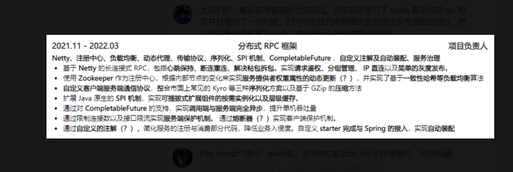

# 1、当服务器宕机后怎么办？

当服务器宕机之后，需要去zookeeper中删除自己注册的服务。

我们使用Netty的服务端来监听客户端发起的RPC请求，因此`删除服务端发布的服务`的代码需要写在Netty的服务端中。


核心代码如下：

```java
@Slf4j
public class CustomShutdownHook {
    private static final CustomShutdownHook CUSTOM_SHUTDOWN_HOOK = new CustomShutdownHook();

    public CustomShutdownHook getCustomShutdownHook() {
        return CUSTOM_SHUTDOWN_HOOK;
    }

    public void clearAll() {
        log.info("服务端关闭，开始删除当前服务端所提供服务");
        Runtime.getRuntime().addShutdownHook(new Thread(() -> {
            try {
                InetSocketAddress inetSocketAddress = new InetSocketAddress(InetAddress.getLocalHost().getHostAddress(), Constant.NETTY_PORT);
                // 在这一行进行删除操作
                // 我们向zookeeper中注册服务的地址为：/my-rpc/com.zqy.ClientTest.Server.HelloServicegroup1version1/192.168.1.3:9999 
                // 在注册的时候将已经注册服务的地址都保存到Set中，删除服务时，遍历已经注册的服务地址，如果是以当前虚拟机的Ip地址结尾的话，就进行删除
                CuratorUtils.clearRegistry(CuratorUtils.getZkClient(), inetSocketAddress);
            } catch (UnknownHostException ignored) {
            }
        }));
    }
}
```


# 2、什么是远程过程调用？

rpc即`远程过程调用协议`，rpc可以让程序能够像访问本地系统资源一样，去访问服务端的资源。


# 3、客户端如何监听Zookeeper服务的变化？

客户端使用`PathChildrenCache`来实时感知Zookeeper节点的变化。

客户端使用`Map<String, List<String>>`将服务名称与服务地址进行缓存，那么当`PathChildrenCache`感知到Zookeeper节点发生变化的时候，就会更新缓存，这样客户端就可以即使感知到 。


# 4、为什么使用远程过程调用？

在微服务项目中，服务提供者和服务消费者运行在不同的物理机上且不同进程时，如果需要服务消费的话，就需要使用到rpc

成熟的rpc框架相对于http来说，更多的封装了`服务注册、服务发现、负载均衡`等更高级的特性

**`rpc的出现就是为了让调用远程方法像调用本地方法一样方便`**


# 5、rpc框架主要包括哪几个部分？

- 客户端与服务端建立网络连接的模块（使用Netty）
- 服务端发布服务、处理请求模块
- 客户端发送消费请求模块
- 协议模块
- 序列化和反序列化模块
  - 序列化使用的Hessian协议，是跨语言的，不过速度比较慢
  - 为什么要进行序列化？
    - 在发送请求的时候传输的是对象，但是网络中并不能直接传输对象，需要将对象转换为字节流进行传输
    - 压缩数据，加快网络传输


1、自我介绍 2、为什么做这两个项目？ 3、介绍一下什么是远程过程调用 4、zookeeper怎么知道是健康的节点 5、健康的节点如果挂掉了怎么办 6、挂掉的节点又好了怎么处理 7、zookeeper作为注册中心的作用 8、为什么要进行远程过程调用 9、为什么要使用微服务，不用单体架构
想问下4，5，6点怎么回答
被打爆了




